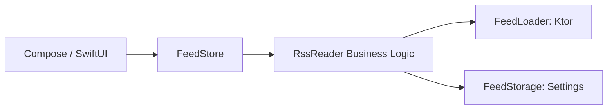
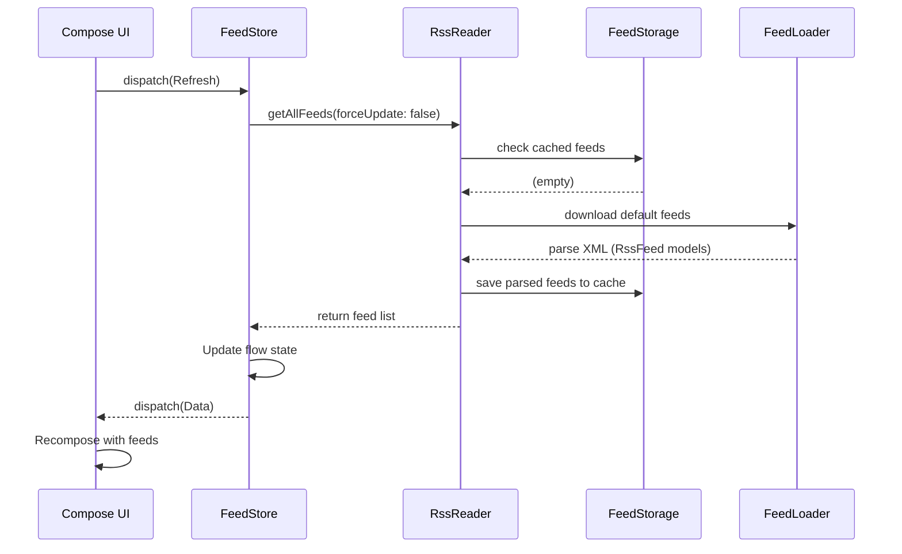

# Kotlin Multiplatform Study Book

## Learning KMP Through `kmp-production-sample`

This book is a dedicated study guide for the repository:

- `kmp-production-sample`

The goal of this book is simple:

- help you understand the repository from zero to hero
- explain how the folder structure works
- explain how the app lifecycle works
- explain why each file exists
- help you reuse the same ideas for your history application

This is not generic documentation. This is a guided textbook built around the actual repository you gave me.

---

# Chapter 1: What This Repository Really Is

## 1.1 The identity of this project

This repository is a Kotlin Multiplatform project. In older materials you may see the name KMM, which meant Kotlin Multiplatform Mobile. Today, people more commonly say KMP, Kotlin Multiplatform.

This sample is an RSS Reader app, but the real educational value is not the RSS part. The educational value is:

- how shared Kotlin code is structured
- how Android uses that shared code
- how iOS uses that shared code
- how state is shared
- how native UI can sit on top of shared business logic

So even though the visible app is an RSS reader, the real lesson is architecture.

## 1.2 Why this repository matters for your first KMP app

This is a very good first-study repository because it teaches:

- shared domain models
- shared networking
- shared storage
- shared state management
- platform-specific dependency wiring
- Android entry points
- iOS bridging
- desktop support

That means this repo is not only “how to write shared functions.” It is closer to “how to structure a real app.”

## 1.3 The core architectural idea

The project’s big idea is:

- keep app logic in shared Kotlin
- keep UI native for each platform

In this repository:

- shared Kotlin handles feed loading, caching, and app state
- Android/Desktop UI is written with Compose
- iOS UI is written with SwiftUI

So the UI is not fully shared here. The state and business logic are shared.

That is a very important KMP lesson:

- KMP does not force you to share everything
- KMP lets you choose what is best to share

## 1.4 The mental model you should keep

Think of the app like this:

`UI -> Store -> Shared business logic -> Network/Storage`

More specifically in this repo:

`Compose/SwiftUI -> FeedStore -> RssReader -> FeedLoader + FeedStorage`

> [!IMPORTANT]
> This single flow diagram is the backbone of the whole project. Memorizing this structure will help you debug and extend the app effectively.

---

# Chapter 2: The Top-Level Folder Structure

## 2.1 The important top-level folders

At the root of the repository, the most important folders are:

- `shared`
- `composeApp`
- `iosApp`
- `gradle`
- `.github`
- `media`

Each one has a very different purpose.

## 2.2 `shared`

This is the heart of the project.

It contains:

- shared business logic
- shared models
- shared storage logic
- shared networking logic
- shared state management
- iOS-specific helpers for bridging Kotlin to Swift

If you are learning KMP architecture, this is the most important module in the whole repo.

## 2.3 `composeApp`

This is the app-side Kotlin UI module for:

- Android
- Desktop JVM

It depends on `shared`.

This module contains:

- Android app entry point
- Android application class
- Android manifest
- Android resources
- Compose UI
- Desktop main function

Important thought:

- `shared` is the reusable engine
- `composeApp` is one consumer of that engine

## 2.4 `iosApp`

This is the native iOS Xcode project.

It is not a Gradle module in the same way as `shared` and `composeApp`.

It contains:

- SwiftUI app entry point
- SwiftUI views
- iOS assets
- iOS plist files
- iOS tests
- Xcode project files

This is how the iPhone app consumes the Kotlin framework produced from the shared module.

## 2.5 `gradle`

This folder contains Gradle infrastructure, especially:

- wrapper files
- version catalog

This is the build system support layer.

## 2.6 `.github`

This contains GitHub Actions CI workflows.

It helps answer:

- what does the repo test
- what does the repo build automatically

## 2.7 `media`

This contains images used in the README.

These are not runtime code files. They are documentation support files.

## 2.8 Generated and tool folders

You will also see folders like:

- `build`
- `.gradle`
- `.idea`
- `.kotlin`

These are not the main learning targets.

They are generated or tool-specific support folders.

As a beginner, do not study these first.

---

# Chapter 3: The Build System and Project Wiring

## 3.1 Why the build system matters

Many beginners focus only on source files. But in KMP, the build files are part of the architecture.

They define:

- which platforms are supported
- which source sets exist
- which dependencies go to which platform
- how modules connect

If you do not understand the Gradle setup, you will struggle later while creating your own app.

## 3.2 `settings.gradle.kts`

This file does several important things:

- names the root project
- configures plugin repositories
- configures dependency repositories
- includes Gradle modules

Most importantly, it includes:

- `:composeApp`
- `:shared`

Notice what it does not include:

- `iosApp`

This teaches an important KMP concept:

- Android/Desktop Kotlin modules are managed by Gradle
- the iOS app itself is managed by Xcode
- Gradle produces a Kotlin framework that Xcode consumes

## 3.3 `build.gradle.kts` at root

This root build file mainly sets up plugins at the top level without applying them everywhere.

Why do that?

- to centralize plugin versions
- to avoid loading the same plugin repeatedly in each child classloader

It also applies the dependency updates plugin to all projects.

That is a maintenance convenience feature.

## 3.4 `gradle/libs.versions.toml`

This is the version catalog.

This file is extremely important because it centralizes:

- Kotlin version
- Android Gradle Plugin version
- Ktor version
- Compose version
- Koin version
- Coroutines version
- serialization version
- platform library versions

This is cleaner than hardcoding versions in multiple files.

As your own app grows, this pattern becomes very valuable.

## 3.5 `gradle.properties`

This file contains project-level Gradle settings, including:

- JVM memory
- configuration cache
- build cache
- Kotlin code style
- AndroidX flags

These are not app features, but they influence build behavior and performance.

## 3.6 `shared/build.gradle.kts`

This file defines `shared` as a multiplatform library.

Key ideas inside it:

- Android target exists
- iOS targets exist
- JVM target exists
- iOS framework binary is built
- dependencies are split by source set

This file is your “how shared code is built for many platforms” textbook.

## 3.7 `composeApp/build.gradle.kts`

This file defines the UI app module for Android and Desktop.

Key ideas:

- it is multiplatform too
- it has Android and JVM targets
- common Compose UI lives in `commonMain`
- Android-specific dependencies go to `androidMain`
- Desktop-specific dependencies go to `jvmMain`
- this module depends on `projects.shared`

This is how the app UI layer sits on top of the shared engine.

## 3.8 KMP source sets: the most important build concept

The source set model is the KMP learning foundation.

Typical source sets in this repo are:

- `commonMain`
- `androidMain`
- `iosMain`
- `jvmMain`

Meaning:

- `commonMain`: code shared by all targets in that module
- `androidMain`: Android-only code
- `iosMain`: iOS-only code
- `jvmMain`: JVM-only code, here used for desktop

When you see a class in `commonMain`, ask:

- can every target use this?

When you see a class in `androidMain`, ask:

- what platform-specific dependency or API forced this to live here?

This question will help you understand KMP file placement correctly.

---

# Chapter 4: The Module Architecture

## 4.1 How the modules depend on each other

The dependency direction is:

- `composeApp -> shared`
- `iosApp -> shared framework`

The `shared` module does not depend on the UI modules.

That is good architecture.

Why?

- business logic should not know about screens
- storage should not know about navigation
- network code should not know about buttons

This separation keeps the app maintainable.

## 4.2 The architectural layers inside `shared`

The shared module can be understood as these layers:

- domain models
- data sources
- business/use-case layer
- app state layer
- settings/config layer

These are not separate Gradle modules, but they are separated by packages and responsibilities.

## 4.3 Domain layer

This is represented mainly by the RSS model classes.

Its job:

- describe the shape of app data
- remain mostly UI-independent

Examples:

- `RssFeed`
- `Channel`
- `Item`
- `Image`
- `MediaContent`

## 4.4 Data layer

This layer includes:

- network loading
- local persistence

In this repo:

- `FeedLoader` is the network data source
- `FeedStorage` is the local storage data source

## 4.5 Business layer

This is centered around `RssReader`.

Its job:

- orchestrate storage and network
- decide when to refresh
- decide default feed behavior
- expose app-friendly functions like `getAllFeeds`, `addFeed`, `deleteFeed`

## 4.6 State layer

This is centered around `FeedStore`.

Its job:

- hold the current app state
- accept actions
- run async work
- update state
- emit side effects

This is the part that lets both Android and iOS use the same state logic.

## 4.7 Platform bridge layer

For iOS, there are helper classes in `iosMain` to make Kotlin flows easier to consume from Swift.

This layer exists because:

- Kotlin and Swift interop is powerful
- but some Kotlin patterns need wrapping for a nice Swift experience

This is why `CFlow` and Koin helper files exist.

---

# Chapter 5: The Shared Module in Detail

## 5.1 Why `shared` is the most important module

If you only study one module deeply, study `shared`.

It contains the real reusable logic of the app.

The UI modules mostly consume what `shared` exposes.

## 5.2 The package layout inside `shared`

Main packages include:

- `com.github.jetbrains.rssreader`
- `com.github.jetbrains.rssreader.app`
- `com.github.jetbrains.rssreader.core`
- `com.github.jetbrains.rssreader.datasource.network`
- `com.github.jetbrains.rssreader.datasource.storage`
- `com.github.jetbrains.rssreader.domain`

Each package has a fairly clean responsibility.

## 5.3 `Settings.kt`

This file is tiny but conceptually important.

It wraps:

- default feed URLs

and exposes:

- `isDefault(feedUrl)`

This is simple configuration, not persistent settings.

It is used to know whether a feed is one of the built-in feeds.

Why does that matter?

- default feeds may be treated differently in the UI
- for example, deletion may be restricted

## 5.4 `NanoRedux.kt`

This is a minimal interface layer defining:

- `State`
- `Action`
- `Effect`
- `Store`

This is not a full Redux framework. It is a tiny architecture contract.

This teaches a very nice KMP lesson:

- you do not always need a big framework
- sometimes a small shared abstraction is enough

The `Store` interface says a store must:

- expose a `StateFlow` of state
- expose a flow of side effects
- accept dispatched actions

That is the state contract for the whole app.

---

# Chapter 6: `FeedStore` and Shared State Management

## 6.1 Why `FeedStore` is one of the most important files

If `RssReader` is the business engine, `FeedStore` is the app brain.

This file contains:

- the state model
- the actions
- the side effects
- the reducer-like logic
- the async orchestration

If you master this file, you will understand the app’s runtime behavior.

## 6.2 `FeedState`

`FeedState` contains:

- `progress: Boolean`
- `feeds: List<RssFeed>`
- `selectedFeed: RssFeed?`

Meaning:

- `progress` tells whether work is in progress
- `feeds` is the loaded feed list
- `selectedFeed` tells which feed filter is active

`selectedFeed = null` means:

- all feeds are selected

That is a small but important state convention.

## 6.3 `mainFeedPosts()`

This helper function converts app state into the actual post list shown on the main screen.

If a feed is selected:

- use only that feed’s items

If no feed is selected:

- flatten all feed items into one list

Then:

- sort by `pubDate` descending

This is a good example of derived state.

The store keeps raw state, and helper functions derive UI-ready data from it.

## 6.4 `FeedAction`

Actions describe things that happen in the app.

The actions are:

- `Refresh(forceLoad)`
- `Add(url)`
- `Delete(url)`
- `SelectFeed(feed)`
- `Data(feeds)`
- `Error(error)`

You can divide them into two groups.

User-initiated or intent actions:

- `Refresh`
- `Add`
- `Delete`
- `SelectFeed`

Result actions:

- `Data`
- `Error`

This is a classic state-management pattern:

- user or system triggers an action
- async work happens
- result comes back as success or failure action

## 6.5 `FeedSideEffect`

The side effect type currently contains:

- `Error(error)`

Why have side effects when state already exists?

Because some events should not become long-lived state.

Example:

- show an error toast/snackbar once

That is not persistent screen state. It is a one-time event.

This is exactly what side effects are for.

## 6.6 Internal state containers

Inside `FeedStore`, two flow-based containers are used:

- `MutableStateFlow` for state
- `MutableSharedFlow` for side effects

Why this split is nice:

- state is current, persistent, replayable
- side effects are event-like, transient

This is a very good practical pattern.

## 6.7 The dispatch function

`dispatch(action)` is the center of the store.

It:

- logs the action
- reads the old state
- decides the new state
- may launch async work
- may emit side effects
- updates the `StateFlow`

This is basically the reducer plus coordinator combined together.

## 6.8 Refresh behavior

When `Refresh` is dispatched:

- if work is already in progress, emit `In progress` error side effect
- otherwise launch `loadAllFeeds(forceLoad)`
- set `progress = true`

This prevents overlapping refresh operations.

## 6.9 Add behavior

When `Add(url)` is dispatched:

- if already busy, emit `In progress`
- otherwise launch `addFeed(url)`
- set progress state to true

Then the async function:

- calls `rssReader.addFeed(url)`
- reloads all feeds from storage
- dispatches `Data`

Important design point:

- after mutation, the store reloads the source of truth
- it does not manually try to patch state in many places

That often leads to cleaner state handling.

## 6.10 Delete behavior

This mirrors add:

- prevent overlapping operations
- launch delete async work
- set progress
- reload all feeds
- dispatch `Data`

## 6.11 Select behavior

`SelectFeed(feed)` is synchronous.

It checks:

- if the feed is `null`, allow it
- if the feed exists in the current feed list, allow it
- otherwise emit `Unknown feed`

This is defensive programming.

## 6.12 Data behavior

`Data(feeds)` means async work finished successfully.

If the old state was in progress:

- set `progress = false`
- replace `feeds`
- preserve selected feed only if that feed still exists

That last part is a subtle but excellent detail.

If the user had selected a feed that no longer exists, the store safely resets selection.

## 6.13 Error behavior

`Error(error)` means async work failed.

If the old state was in progress:

- emit error side effect
- set `progress = false`
- keep old feeds

This is good UX:

- the user sees the old content
- the app stops showing loading
- the error is surfaced

## 6.14 Coroutine scope choice

`FeedStore` delegates to:

- `CoroutineScope(Dispatchers.Main)`

This means store-triggered async work is launched on the main dispatcher context.

That is okay here because:

- Ktor client work is suspend-based
- storage work is light
- this is a sample project

In a larger production app, you may want more explicit dispatcher control and lifecycle-aware cleanup.

## 6.15 Why `FeedStore` is a strong learning file

This file teaches:

- shared app state
- action-driven architecture
- side effects
- defensive state transitions
- async orchestration in KMP

For your future history app, this file is one of the best templates in the repo.

---

# Chapter 7: `RssReader` as the Shared Business Layer

## 7.1 What `RssReader` does

`RssReader` is the main shared service/use-case class.

It combines:

- `FeedLoader`
- `FeedStorage`
- `Settings`

It decides:

- when to use cached data
- when to load from network
- what the default feeds are

This means `RssReader` is not just a loader. It is a coordinator.

## 7.2 Constructor dependencies

It receives:

- `feedLoader`
- `feedStorage`
- `settings`

This is dependency injection by constructor.

That gives it these strengths:

- testability
- platform flexibility
- clear separation of concerns

## 7.3 `getAllFeeds(forceUpdate)`

This is the most important function in the file.

Its behavior is:

1. read all feeds from storage
2. if storage is empty or force update is true, fetch from network
3. save newly fetched feeds to storage
4. return the feed list

This is a simple cache-first strategy.

## 7.4 Default-feed logic

If storage is empty:

- use `settings.defaultFeedUrls`

If storage already has feeds:

- use the `sourceUrl` values from stored feeds

This means first launch behavior is different from later launches.

That is a key app lifecycle detail.

First launch:

- app knows only built-in default feeds

Later launches:

- app reloads whatever feeds are already stored

## 7.5 Parallel loading

The method uses `mapAsync` with coroutines.

This means multiple feed URLs can be fetched concurrently.

This is a nice touch because it improves load performance when several feeds exist.

It also shows a great KMP lesson:

- common Kotlin coroutines can coordinate concurrency across platforms

## 7.6 `addFeed(url)`

This:

- loads one feed from network
- marks whether it is default
- stores it

There is no extra business complication here.

It is intentionally simple.

## 7.7 `deleteFeed(url)`

This:

- removes the feed from storage

Also simple by design.

## 7.8 Why `RssReader` is useful for your future app

For your history app, this class suggests a pattern like:

- `HistoryReader`
- `HistoryRepository`
- `HistoryStore`

Where shared business logic can orchestrate:

- network source
- local source
- app rules

without caring about Android and iOS screens.

---

# Chapter 8: Networking with `FeedLoader` and `HttpClient`

## 8.1 `FeedLoader`

`FeedLoader` is the network data source.

It is intentionally very small.

Its main job:

- request an RSS URL
- decode the response body into `RssFeed`
- attach metadata like `isDefault` and `sourceUrl`

This is a clean single-responsibility design.

## 8.2 Why `FeedLoader` is in `commonMain`

Because the logic is platform-independent at this level.

It uses Ktor’s multiplatform client API, so the same code can live in shared common code.

The actual engine backend differs by platform, but the call site does not need to care.

## 8.3 `HttpClient.kt`

This file creates the Ktor client.

It installs:

- logging plugin
- content negotiation plugin
- XML serialization support

Important point:

- this app consumes RSS XML, not JSON APIs

That is why XML configuration matters here.

## 8.4 Logging

If logging is enabled:

- Ktor request logs are sent through Napier

This is mostly useful on Android debug builds in this repo.

## 8.5 XML handling

The app configures XML content negotiation for:

- `ContentType.Application.Rss`

and uses XML serializer settings that ignore unknown child elements.

This is important because real RSS feeds are often messy and inconsistent.

This is a real-world detail, not just tutorial decoration.

## 8.6 Platform HTTP engines

The `shared` build file provides platform-specific Ktor engines:

- Android uses OkHttp
- iOS uses Darwin
- JVM desktop uses OkHttp

This is a classic KMP pattern:

- common API
- platform-specific engine implementation

That is one of KMP’s strongest practical benefits.

---

# Chapter 9: Local Storage with `FeedStorage`

## 9.1 What `FeedStorage` is

`FeedStorage` is the local persistence layer.

It stores feeds in:

- key-value settings storage

The feeds are serialized as:

- JSON string containing a list of `RssFeed`

This is a lightweight cache strategy.

## 9.2 Why this design is educational

This sample does not use:

- SQLDelight
- Room
- Core Data
- Realm

Instead it uses a much simpler persistence model.

That is good for a learning sample because it lets you focus on architecture first.

## 9.3 Disk cache and memory cache

`FeedStorage` has:

- `diskCache`
- `memCache`

`diskCache` reads/writes the serialized JSON from settings.

`memCache` is a lazy in-memory mutable map initialized from disk.

This means:

- reads after startup can be fast
- writes update both memory and persistent storage

## 9.4 The key used for storage

The key is:

- `key_feed_cache`

This is the settings key under which the serialized feed list lives.

## 9.5 Methods

The file exposes:

- `getFeed(url)`
- `saveFeed(feed)`
- `deleteFeed(url)`
- `getAllFeeds()`

These are simple CRUD-style cache operations.

## 9.6 How storage differs by platform

The API in `FeedStorage` is shared.

But the actual settings backend differs:

- Android uses `SharedPreferencesSettings`
- iOS uses `NSUserDefaultsSettings`
- Desktop uses `PropertiesSettings`

This is a beautiful KMP lesson:

- the storage service logic stays shared
- the platform storage provider is injected

That is exactly the kind of architecture you want to learn.

---

# Chapter 10: The Domain Model and RSS XML Mapping

## 10.1 Why the domain model matters

The domain model is the language of the app.

If the network is the outside world and the UI is the visible world, the domain model is the internal truth.

In this repo, the domain model lives mainly in:

- `RssFeed.kt`

## 10.2 Main classes

This file contains:

- `RssFeed`
- `Channel`
- `Image`
- `Item`
- `MediaContent`
- `MediaDescription`
- `MediaCredit`

These mirror the shape of RSS XML content.

## 10.3 Serialization annotations

The file uses:

- `@Serializable`
- XML-related annotations such as `@XmlSerialName`, `@XmlElement`, `@XmlValue`

This tells the serializer how to map XML elements and namespaces to Kotlin data classes.

This is a very important detail:

- the app is not manually parsing XML strings
- it is mapping XML structure into Kotlin data classes

## 10.4 RSS and media namespaces

Some fields come from namespaced XML entries, especially media-related ones.

That is why fields like `contentEncoded` and `mediaContent` use XML namespace annotations.

This is not random complexity. It is required because RSS feeds often include:

- standard RSS fields
- content module fields
- media module fields

## 10.5 `Item.getImageUrl()`

This helper function tries to determine an image URL for a post.

It checks:

1. `mediaContent?.url`
2. fallback regex extraction from HTML in `contentEncoded`

This is a very practical detail.

Real feeds are inconsistent, so robust apps often need fallback extraction logic.

## 10.6 Mutable properties in `RssFeed`

Notice that `sourceUrl` and `isDefault` are mutable.

Why?

Because the network response itself may not contain those app-specific values.

After loading from the feed URL, the app enriches the model with:

- where this feed came from
- whether it is one of the default feeds

That is application metadata added on top of feed data.

---

# Chapter 11: Dependency Injection in This Project

## 11.1 Which DI library is used

The app uses:

- Koin

Koin is a lightweight DI library and fits well for samples and many real apps.

## 11.2 Android DI setup

On Android, DI is started in the custom `Application` class.

That class provides:

- `RssReader`
- `FeedStore`

`RssReader` is built using the Android-specific helper `buildRssReader`.

## 11.3 iOS DI setup

On iOS, DI is started in the Kotlin `initKoin()` helper exposed to Swift.

The iOS Koin module provides:

- `RssReader`
- `FeedStorage`
- `FeedStore`
- `FeedLoader`
- `HttpClient`

This is needed because the iOS app still wants to consume the same shared dependencies, just through Swift.

## 11.4 Desktop DI setup

On desktop, DI is started in `Main.kt`.

This mirrors the same idea:

- create the dependency graph
- then start the UI

## 11.5 Why DI matters here

DI enables:

- platform-specific construction
- shared usage
- clean architecture
- easier future testing

KMP apps often need this because some parts are shared but some concrete implementations are platform-specific.

---

# Chapter 12: Android App Lifecycle in This Repository

## 12.1 Android manifest

The Android manifest declares:

- internet permission
- custom application class
- launcher activity
- app icons and theme

This is the Android system registration layer.

## 12.2 `App.kt`

This is the Android `Application` subclass.

It is the first app-level Kotlin class Android creates.

Its `onCreate()` does two important things:

- starts Koin
- launches background sync scheduling

This is a major lifecycle point.

Before the activity screen exists, app-wide dependencies are already prepared.

## 12.3 `AppActivity.kt`

This is the Android activity entry point.

Its `onCreate()`:

- enables edge-to-edge
- installs splash screen
- calls `setContent { RssReaderApp() }`

This is the moment where the Android view world becomes the Compose world.

## 12.4 `RssReaderApp()`

This is the root Compose app container.

It creates:

- theme
- scaffold
- top app bar
- snackbar host
- navigation host

This is the UI shell.

## 12.5 First visible loading flow on Android

When `MainScreen()` first appears:

- it gets the shared `FeedStore` from Koin
- it starts collecting state
- it dispatches `FeedAction.Refresh(false)` inside `LaunchedEffect(Unit)`

That causes the first feed load.

This is the real Android runtime flow:

`Application -> Activity -> Compose root -> MainScreen -> Store refresh -> Shared load -> State update -> Recompose`

## 12.6 Pull-to-refresh

The main screen uses pull-to-refresh.

When the user refreshes:

- `FeedAction.Refresh(true)` is dispatched

The difference is:

- `true` forces network refresh
- `false` allows cache-first logic

This is a simple but important bit of app behavior.

## 12.7 Android background sync

`RefreshWorker` schedules periodic refresh through WorkManager.

Its job:

- call `rssReader.getAllFeeds(true)`

This keeps feeds refreshed in the background on Android.

This feature is Android-specific and does not exist in the same way for iOS in this sample.

## 12.8 Android-specific `buildRssReader`

This helper constructs the shared `RssReader` with Android-specific dependencies:

- `SharedPreferences`
- Android context access
- Napier debug logging

This is a perfect example of how shared logic is created using platform-specific building blocks.

---

# Chapter 13: Compose UI Architecture in `composeApp`

## 13.1 Why Compose code lives in `commonMain`

The Compose UI for Android and Desktop is shared between those platforms.

That is why many UI files live in:

- `composeApp/src/commonMain`

This means:

- same Compose UI can run on Android and desktop
- Android-specific host code still lives in `androidMain`
- Desktop-specific host code still lives in `jvmMain`

## 13.2 `RssReaderApp.kt`

This is the root UI container.

Responsibilities:

- apply theme
- create nav controller
- show app bar
- host snackbar
- define navigation graph
- collect error side effects and show snackbar messages

This file is both layout shell and app-level UI coordinator.

## 13.3 Navigation

The app uses a very simple screen enum:

- `Main`
- `FeedList`

And `NavHost` connects them.

That keeps navigation beginner-friendly.

## 13.4 Why `Screen.kt` contains more than screen constants

This file contains:

- screen enum
- top app bar
- `MainScreen()`
- `FeedListScreen()`

This is a somewhat compact sample structure rather than a heavily separated production structure.

As a learner, do not assume every project will organize screens exactly like this.

Instead learn the intent:

- root navigation wiring
- screen-level state subscription
- event dispatching

## 13.5 Error handling in Compose

The root app collects `FeedSideEffect.Error` and shows it in a snackbar.

That is a great example of one-time event handling in Compose.

The UI does not keep an error message permanently in state just to show a toast.

Instead:

- side effect flow emits event
- UI consumes event
- snackbar shows once

That is a clean pattern.

---

# Chapter 14: The Main Feed Screen

## 14.1 `MainScreen()`

This function:

- injects `FeedStore`
- observes state
- opens URLs through `LocalUriHandler`
- triggers initial refresh
- hosts pull-to-refresh
- delegates actual content rendering to `MainFeed`

This is screen-controller style Compose code.

## 14.2 `MainFeed()`

This function builds the main content area:

- post list
- bottom feed selector bar
- edit button access

It also calculates the current posts list from state.

Important note:

This derived posts calculation is UI-side, even though there is also a helper in the store file.

In a production refactor you might centralize that more, but for learning this is still readable.

## 14.3 Feed selection bottom bar

The bottom bar includes:

- All
- one icon per feed
- Edit icon

This gives the user quick filtering and feed management access.

## 14.4 Scroll reset behavior

When a different feed is selected:

- the post list scrolls back to the top

This is a subtle UX improvement.

It shows attention to user experience.

## 14.5 Post opening

When a post is clicked:

- its `link` is opened via `LocalUriHandler`

This keeps the app simple. The app does not build an internal article reader screen.

---

# Chapter 15: Feed Management Screen

## 15.1 `FeedListScreen()`

This is a thin function that:

- injects `FeedStore`
- passes it to `FeedList`

This is a simple screen entry wrapper.

## 15.2 `FeedList`

Responsibilities:

- show current feeds
- show add dialog
- show delete dialog
- dispatch add/delete actions

This is the feed-management UI.

## 15.3 Add feed flow

When the floating action button is pressed:

- add dialog opens

When the user confirms:

- URL is normalized from `http://` to `https://`
- `FeedAction.Add(url)` is dispatched

That normalization is a tiny but useful implementation detail.

## 15.4 Delete feed flow

When a feed is tapped in the list:

- delete dialog opens

Important behavior:

- default feeds are not clickable for deletion

This respects the built-in/default feed rule.

## 15.5 `FeedItem`

Each feed item shows:

- feed icon
- title
- description

This is simple but enough for a management screen.

---

# Chapter 16: Compose UI Components and Utility Files

## 16.1 `Dialogs.kt`

Contains:

- `AddFeedDialog`
- `DeleteFeedDialog`

Both are Compose `Dialog` wrappers with lightweight content.

These are straightforward examples of modal UI.

## 16.2 `PostList.kt`

Contains:

- `PostList`
- `PostItem`

This handles:

- lazy scrolling
- draggable interaction
- card layout for articles
- optional image loading with Coil
- text truncation
- pubDate display

## 16.3 `FeedIcon.kt`

Contains:

- circular feed icon UI
- selected-state styling
- text fallback initials
- edit icon component

This file teaches reusable UI component design.

## 16.4 `AppTheme.kt`

This defines a light and dark Material 3 color scheme.

This sample keeps theme logic minimal.

It is enough to show:

- theme wrapper
- color scheme selection
- material surface root

## 16.5 `Previews.kt`

This contains Compose preview data and preview composables.

Its job:

- let developers preview components without running the full app

This is a developer productivity file, not app runtime logic.

Still, it is valuable:

- preview files teach how to make UI work independently of live backend state

---

# Chapter 17: Desktop Support

## 17.1 Why desktop exists here

This sample is not only Android+iOS. It also includes a JVM desktop target in the Compose app module.

That means the shared logic and Compose UI can also run as a desktop app.

## 17.2 `Main.kt`

Desktop startup does:

- start Koin
- construct dependencies
- open a Compose window
- render `RssReaderApp()`

So the same Compose root used by Android is reused for desktop.

That is a powerful demonstration of shared UI inside the Kotlin ecosystem.

## 17.3 Desktop storage

Desktop uses:

- `PropertiesSettings(Properties())`

This is a simple settings backend.

It keeps the sample easy to run without introducing a bigger desktop persistence system.

## 17.4 What this teaches you

KMP plus Compose Multiplatform can let you share:

- app logic
- possibly some UI

across more than mobile platforms.

Even if your current target is Android+iOS, this repo quietly teaches extensibility.

---

# Chapter 18: iOS App Architecture

## 18.1 Why the iOS app is special in KMP

Android stays in the Kotlin/Gradle world.

iOS is different:

- app shell is native Swift/SwiftUI
- shared Kotlin is compiled into a framework
- Swift calls into that framework

This is the fundamental KMP iOS integration story.

## 18.2 `RSSApp.swift`

This is the iOS app entry point.

It does several critical things:

- initializes Kotlin DI
- gets shared dependencies from Kotlin
- wraps `FeedStore` into a SwiftUI-friendly `ObservableObject`
- injects that object into the environment

This file is the bridge between SwiftUI world and Kotlin shared world.

## 18.3 `ObservableFeedStore`

This class is extremely important for iOS learning.

It:

- owns the shared `FeedStore`
- subscribes to shared state flow
- subscribes to side-effect flow
- publishes updates with `@Published`
- exposes `dispatch(_ action:)`

This turns a Kotlin store into something SwiftUI can naturally consume.

That is one of the most important interop lessons in the repo.

## 18.4 Why `watchState()` and `watchSideEffect()` exist

Swift does not directly consume Kotlin `Flow` as nicely as Compose does.

So the repo adds helper wrappers:

- Kotlin flow is wrapped in `CFlow`
- Swift gets callback-style watch functions

This reduces friction on the iOS side.

## 18.5 `RootView.swift`

This root view:

- hosts the main navigation view
- listens to side effects
- shows temporary error message UI

This is the iOS equivalent of the Compose snackbar strategy.

## 18.6 `MainFeedView.swift`

This is the main iOS content screen.

It uses the `ConnectedView` pattern to:

- map global shared state into view props
- keep view rendering separate from store wiring

This is conceptually similar to container/presentation separation.

## 18.7 `FeedsList.swift`

This is the iOS feed management screen.

It splits feeds into:

- default feeds
- user feeds

and allows:

- adding
- deleting user feeds

## 18.8 Supporting SwiftUI files

Other files serve focused roles:

- `FeedRow.swift`: one feed row
- `PostRow.swift`: one post row
- `StringExtensions.swift`: HTML decoding helper
- `AlertView.swift`: text input alert bridge
- `NavigationLazyView.swift`: lazy navigation helper

These are important for the iOS app, but the main KMP lessons stay centered on:

- `RSSApp.swift`
- the observable store bridge
- the state mapping pattern

---

# Chapter 19: The iOS Bridge Files in `shared/src/iosMain`

## 19.1 Why `iosMain` exists inside `shared`

Even though the iOS app UI is written in Swift, the shared Kotlin module still needs some iOS-specific helper code.

That code lives in:

- `shared/src/iosMain`

This is a very useful KMP pattern.

## 19.2 `KoinHelper.kt`

This file:

- defines the Koin module for iOS shared services
- starts Koin
- exposes injected objects via a helper class

This is what lets Swift call into Kotlin and ask for:

- `RssReader`
- `FeedStore`

without manually constructing everything in Swift.

## 19.3 `IosReduxUtils.kt`

This file adds:

- `watchState()`
- `watchSideEffect()`

to `FeedStore`.

It is tiny, but it makes Swift integration cleaner.

## 19.4 `CFlow.kt`

This file wraps Kotlin `Flow` and exposes:

- `watch(block)`

This creates a cancelable subscription from Swift-friendly code.

Conceptually:

- Kotlin emits values
- Swift callback receives values
- returned `Closeable` lets Swift stop watching

This is a beautiful example of interop adaptation.

---

# Chapter 20: Resources, Assets, and UI Metadata

## 20.1 Compose shared resources

In `composeApp/src/commonMain/composeResources/values/strings.xml`, the project defines shared UI strings such as:

- app name
- feed list title
- add/remove text
- all
- back button

This allows Compose resource access in shared UI code.

## 20.2 Android resources

Android-specific resources include:

- manifest strings
- themes
- launcher icons
- vector drawables
- splash resources

These live in:

- `composeApp/src/androidMain/res`

These are Android platform app resources, not shared KMP resources.

## 20.3 iOS assets

iOS assets include:

- app icons
- color assets
- launch screen

These live under the Xcode app directory and are managed the iOS way.

## 20.4 Why resource handling differs

This difference is normal in KMP:

- some resources can be shared
- some platform app metadata must remain native

For example:

- Android manifest and themes are Android-specific
- iOS plist and asset catalogs are iOS-specific

---

# Chapter 21: Continuous Integration and Testing Reality

## 21.1 CI workflow

The GitHub workflow runs builds/tests for:

- iOS simulator target
- JVM target
- Android unit test targets

This tells you the repo is set up for multi-target validation.

## 21.2 Current testing depth

When I ran Gradle verification, the build succeeded, but many test tasks were `NO-SOURCE`.

That means:

- the project builds successfully
- test infrastructure exists
- actual tests are minimal

This is common in architecture samples.

## 21.3 What you should learn from this

The repo is strong as an architecture reference.

It is not strong as a testing reference.

So when you build your own app, keep the architecture lessons, but add much stronger tests than this sample provides.

---

# Chapter 22: End-to-End Runtime Data Flow

## 22.1 First app launch flow

Let us walk through the first app launch carefully.

Android example:

1. Android creates `App`
2. Koin starts
3. `FeedStore` and `RssReader` become available
4. Activity starts
5. Compose root loads
6. `MainScreen()` dispatches `Refresh(false)`
7. `FeedStore` enters loading state
8. `RssReader.getAllFeeds(false)` checks storage
9. Storage is empty on first launch
10. `Settings.defaultFeedUrls` is used
11. `FeedLoader` downloads feed XML
12. Loaded feeds are saved in storage
13. `FeedStore` dispatches `Data`
14. UI recomposes with loaded feeds and posts

> [!NOTE]
> This is the first-launch lifecycle in practical terms. It highlights the caching priority where the network is primarily accessed as a fallback when storage is empty.

## 22.2 Later app launch flow

On later launches:

1. app starts
2. refresh action happens
3. `RssReader` asks storage for feeds
4. storage already has feeds
5. if `forceUpdate` is false, cached feeds are returned
6. UI shows content quickly

This is why caching matters.

## 22.3 Forced refresh flow

When user pulls to refresh:

1. `Refresh(true)` is dispatched
2. store enters progress mode
3. `RssReader.getAllFeeds(true)` ignores cache freshness and reloads feed URLs
4. results are saved again
5. state is updated

## 22.4 Add feed flow

1. user opens add dialog
2. enters URL
3. `FeedAction.Add(url)` dispatched
4. store starts async add
5. `RssReader.addFeed(url)` loads one new feed
6. storage saves it
7. store reloads all feeds
8. `Data` updates UI

## 22.5 Delete feed flow

1. user requests deletion
2. `FeedAction.Delete(url)` dispatched
3. store starts async delete
4. storage removes feed
5. store reloads all feeds
6. UI updates

## 22.6 Error flow

If network or parsing fails:

1. async function catches exception
2. `FeedAction.Error` is dispatched
3. store stops progress
4. side effect emits error
5. UI displays snackbar/toast style message

This is the app’s failure path.

---

# Chapter 23: Why This Repository Is Good and Where It Is Simple

## 23.1 Strengths of the repository

This sample does many things very well:

- clear module separation
- shared state management
- clean shared business layer
- multiplatform storage pattern
- iOS interop example
- Android background worker example
- easy-to-follow app flow

## 23.2 Simplifications in the repository

This is still a sample, so some things are intentionally simple:

- minimal test coverage
- very small state model
- no database
- limited navigation complexity
- limited error typing
- no authentication/user accounts
- no advanced offline sync model

This is good to know so you do not copy every detail blindly.

## 23.3 Production lessons vs sample shortcuts

Keep:

- shared use-case architecture
- injected platform dependencies
- store pattern
- clear source set placement

Be ready to improve:

- testing
- error modeling
- persistence strategy
- dependency graph organization
- lifecycle cleanup
- feature modularization

---

# Chapter 24: How to Adapt This Repo for Your History App

## 24.1 The idea transfer

Your app is different in domain, but many architecture ideas can be reused almost directly.

Possible translation:

- `RssReader` becomes `HistoryRepository` or `HistoryEngine`
- `FeedStore` becomes `HistoryStore`
- `RssFeed` becomes your domain models like `HistoricalPeriod`, `Event`, `Figure`, `TimelineEntry`
- `FeedLoader` becomes API/network loader for history content
- `FeedStorage` becomes local storage for cached history content

## 24.2 What should stay shared

For your history app, the following are excellent candidates for shared code:

- API models
- domain models
- repository/use-case layer
- local storage layer
- state store
- filtering/sorting logic
- bookmarks/favorites/history logic

## 24.3 What can remain native

Depending on your choice, native layers can still handle:

- navigation shells
- platform-specific widgets
- notifications
- background tasks
- sharing intents
- platform-specific polish

## 24.4 A likely package structure for your app

A future shared package structure could look like:

- `domain`
- `datasource/network`
- `datasource/storage`
- `repository`
- `app/store`
- `model`
- `settings`

This repo gives you a solid starting point for that.

## 24.5 Biggest caution while adapting

Do not rename RSS classes and stop there.

Instead, carry over the architectural ideas:

- state flow
- side effects
- repository orchestration
- platform-specific dependency assembly
- shared logic, native shell

That is the real value.

---

# Chapter 25: A Practical Reading Order for Learning

## 25.1 Best reading order if you are a beginner

Read in this order:

1. `README.md`
2. `settings.gradle.kts`
3. `shared/build.gradle.kts`
4. `composeApp/build.gradle.kts`
5. `shared/.../app/NanoRedux.kt`
6. `shared/.../app/FeedStore.kt`
7. `shared/.../core/RssReader.kt`
8. `shared/.../datasource/network/FeedLoader.kt`
9. `shared/.../datasource/storage/FeedStorage.kt`
10. `shared/.../domain/RssFeed.kt`
11. `composeApp/.../App.kt`
12. `composeApp/.../AppActivity.kt`
13. `composeApp/.../RssReaderApp.kt`
14. `composeApp/.../ui/Screen.kt`
15. `composeApp/.../ui/MainFeed.kt`
16. `composeApp/.../ui/FeedList.kt`
17. `iosApp/iosApp/RSSApp.swift`
18. `shared/src/iosMain/.../KoinHelper.kt`
19. `shared/src/iosMain/.../CFlow.kt`
20. remaining SwiftUI files

## 25.2 Why this order works

Because it follows the natural stack:

- project setup
- build setup
- shared architecture
- shared runtime logic
- Android consumption
- iOS consumption

This is a much better order than randomly opening files.

---

# Chapter 26: Frequently Confusing Points for Beginners

## 26.1 “Why is iOS not in `settings.gradle.kts`?”

Because the iOS app itself is an Xcode project, not a regular Gradle application module.

Gradle builds the shared framework for iOS.
Xcode builds the final iOS app shell.

## 26.2 “Why do Android and iOS both use the same `FeedStore`?”

Because `FeedStore` is pure shared Kotlin state logic. Both UIs can dispatch actions and observe state from it.

## 26.3 “Why is Compose code in `commonMain`?”

Because that UI is shared across Android and desktop, both of which can run Compose Multiplatform.

## 26.4 “Why is SwiftUI not shared?”

Because this sample chose native iOS UI. That is a deliberate architecture choice, not a limitation of shared logic.

## 26.5 “Why is storage shared if actual backends differ?”

Because the storage service API and behavior are shared, while the settings implementation is platform-specific and injected.

## 26.6 “Why do we need `CFlow`?”

Because Kotlin flows need a friendlier bridge for Swift consumption.

## 26.7 “Why is there a store at all?”

Because once apps have async loading, selection, refreshing, add/delete, and error reporting, a central state manager becomes very valuable.

---

# Chapter 27: Important Design Lessons You Should Carry Forward

## 27.1 Share logic, not confusion

Only share code that actually benefits from being shared.

This repo shares:

- business logic
- app state
- models
- data layer

That is usually high-value sharing.

## 27.2 Keep platform-specific construction out of core business logic

The repo does this well.

Example:

- `RssReader` is shared
- `buildRssReader(context, withLog)` is Android-specific

This is a pattern worth copying.

## 27.3 Separate long-lived state from one-time events

The split between:

- `FeedState`
- `FeedSideEffect`

is very important.

This prevents many UI bugs.

## 27.4 Prefer small, understandable architecture over over-engineering

This sample is not huge, but it is teachable.

That is a strength.

As a beginner, clarity beats complexity.

## 27.5 Let source sets communicate architecture

File placement itself should tell a story:

- `commonMain` if reusable across all architectures
- `androidMain` if relying on Android specifically (OkHttp, SharedPreferences, Intents, etc.)
- `iosMain` if relying on Darwin or Swift interoperability
- `jvmMain` if desktop-specific JVM logic

> [!TIP]
> This repo enforces a clean rule: never put UI dependencies inside `shared`. Keep `shared` entirely oblivious of whether it will be painted by Compose or SwiftUI. Let `composeApp` and `iosApp` handle all of the visual rendering.

---

# Chapter 28: Final Summary

This repository is a study-worthy first KMP app because it demonstrates a real multiplatform architecture without drowning you in unnecessary complexity.

The most important things to remember are:

- `shared` is the true heart of the project
- `FeedStore` is the shared state brain
- `RssReader` is the shared business coordinator
- `FeedLoader` and `FeedStorage` are the data layer
- Android and iOS are consumers of the shared engine
- Android uses Compose and app-level Kotlin wiring
- iOS uses SwiftUI plus a Kotlin bridge layer
- source sets explain what code is shared and what is platform-specific

If you understand those ideas deeply, you are not just learning this sample. You are learning the foundation of how to structure your own KMP application.

---

# Appendix A: Fast File Map

## Root

- `README.md`: project explanation
- `settings.gradle.kts`: module inclusion
- `build.gradle.kts`: root plugin setup
- `gradle/libs.versions.toml`: dependency versions
- `gradle.properties`: build flags

## Shared module

- `shared/build.gradle.kts`: multiplatform library definition
- `shared/src/commonMain/.../Settings.kt`: default feed config
- `shared/src/commonMain/.../app/NanoRedux.kt`: store contracts
- `shared/src/commonMain/.../app/FeedStore.kt`: shared app state logic
- `shared/src/commonMain/.../core/HttpClient.kt`: Ktor XML client
- `shared/src/commonMain/.../core/RssReader.kt`: shared business/service logic
- `shared/src/commonMain/.../datasource/network/FeedLoader.kt`: network fetcher
- `shared/src/commonMain/.../datasource/storage/FeedStorage.kt`: storage layer
- `shared/src/commonMain/.../domain/RssFeed.kt`: RSS models
- `shared/src/iosMain/.../KoinHelper.kt`: iOS DI bridge
- `shared/src/iosMain/.../IosReduxUtils.kt`: iOS flow helpers
- `shared/src/iosMain/.../core/CFlow.kt`: flow-to-Swift wrapper

## Compose app

- `composeApp/build.gradle.kts`: Android/Desktop app module
- `composeApp/src/commonMain/.../RssReaderApp.kt`: root Compose app shell
- `composeApp/src/commonMain/.../ui/Screen.kt`: screens and app bar
- `composeApp/src/commonMain/.../ui/MainFeed.kt`: main feed content
- `composeApp/src/commonMain/.../ui/FeedList.kt`: feed management UI
- `composeApp/src/commonMain/.../ui/PostList.kt`: post list UI
- `composeApp/src/commonMain/.../ui/Dialogs.kt`: add/delete dialogs
- `composeApp/src/commonMain/.../ui/FeedIcon.kt`: feed icon components
- `composeApp/src/commonMain/.../ui/AppTheme.kt`: theme
- `composeApp/src/commonMain/.../ui/Previews.kt`: preview data
- `composeApp/src/androidMain/.../App.kt`: Android application class
- `composeApp/src/androidMain/.../AppActivity.kt`: Android entry activity
- `composeApp/src/androidMain/.../core/RssReader.kt`: Android-specific builder
- `composeApp/src/androidMain/.../sync/RefreshWorker.kt`: Android background sync
- `composeApp/src/jvmMain/.../Main.kt`: desktop entry point

## iOS app

- `iosApp/iosApp/RSSApp.swift`: SwiftUI app entry point
- `iosApp/iosApp/View/RootView.swift`: root view and side-effect toast
- `iosApp/iosApp/View/MainFeedView.swift`: main content view
- `iosApp/iosApp/View/FeedsList.swift`: feed list management
- `iosApp/iosApp/View/FeedRow.swift`: feed row UI
- `iosApp/iosApp/View/PostRow.swift`: article row UI
- `iosApp/iosApp/View/StringExtensions.swift`: HTML decode helper
- `iosApp/iosApp/View/Basic/AlertView.swift`: text alert bridge
- `iosApp/iosApp/View/Basic/NavigationLazyView.swift`: lazy navigation helper

---

# Appendix B: Suggested Next Learning Exercise

After reading this book, do this practical exercise:

1. Trace the `Refresh(false)` flow from UI to store to business layer to network/storage and back.
2. Trace the `Add(url)` flow the same way.
3. Rename the conceptual pieces on paper for your future history app.
4. Design your own `HistoryState`, `HistoryAction`, and `HistoryStore`.
5. Decide which parts of your history app belong in `commonMain` and which belong in platform source sets.

If you can do that confidently, then this repository has already started teaching you KMP the right way.
