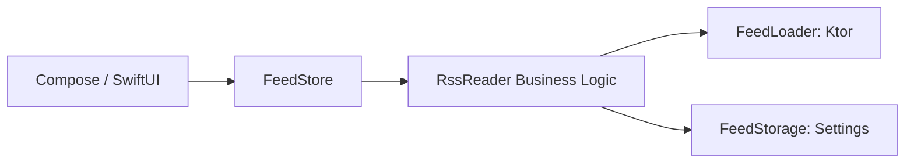

		# Chapter 1: What This Repository Really Is

## Code Files To Open

- `README.md`
- `shared/src/commonMain/kotlin/com/github/jetbrains/rssreader/app/FeedStore.kt`
- `shared/src/commonMain/kotlin/com/github/jetbrains/rssreader/core/RssReader.kt`
- `composeApp/src/androidMain/kotlin/com/github/jetbrains/rssreader/App.kt`
- `iosApp/iosApp/RSSApp.swift`

## 1.1 The identity of this project

This repository is a Kotlin Multiplatform project. In older materials you may see the name KMM, which meant Kotlin Multiplatform Mobile. Today, people more commonly say KMP, Kotlin Multiplatform.

This sample is an RSS Reader app, but the real educational value is not the RSS part. The educational value is:

- how shared Kotlin code is structured
- how Android uses that shared code
- how iOS uses that shared code
- how state is shared
- how native UI can sit on top of shared business logic

So even though the visible app is an RSS reader, the real lesson is architecture.

## 1.2 Why this repository matters for your first KMP app

This is a very good first-study repository because it teaches:

- shared domain models
- shared networking
- shared storage
- shared state management
- platform-specific dependency wiring
- Android entry points
- iOS bridging
- desktop support

That means this repo is not only “how to write shared functions.” It is closer to “how to structure a real app.”

## 1.3 The core architectural idea

The project’s big idea is:

- keep app logic in shared Kotlin
- keep UI native for each platform

In this repository:

- shared Kotlin handles feed loading, caching, and app state
- Android/Desktop UI is written with Compose
- iOS UI is written with SwiftUI

So the UI is not fully shared here. The state and business logic are shared.

That is a very important KMP lesson:

- KMP does not force you to share everything
- KMP lets you choose what is best to share

## 1.4 The mental model you should keep

Think of the app like this:

`UI -> Store -> Shared business logic -> Network/Storage`

More specifically in this repo:

`Compose/SwiftUI -> FeedStore -> RssReader -> FeedLoader + FeedStorage`

> [!IMPORTANT]
> This single flow diagram is the backbone of the whole project. Memorizing this structure will help you debug and extend the app effectively.

---

