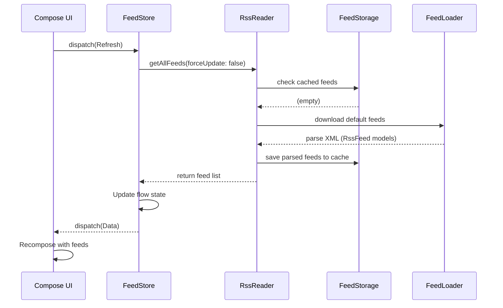

# Chapter 22: End-to-End Runtime Data Flow

## Code Files To Open

- `composeApp/src/commonMain/kotlin/com/github/jetbrains/rssreader/ui/Screen.kt`
- `shared/src/commonMain/kotlin/com/github/jetbrains/rssreader/app/FeedStore.kt`
- `shared/src/commonMain/kotlin/com/github/jetbrains/rssreader/core/RssReader.kt`
- `shared/src/commonMain/kotlin/com/github/jetbrains/rssreader/datasource/network/FeedLoader.kt`
- `shared/src/commonMain/kotlin/com/github/jetbrains/rssreader/datasource/storage/FeedStorage.kt`

## 22.1 First app launch flow

Let us walk through the first app launch carefully.

Android example:

1. Android creates `App`
2. Koin starts
3. `FeedStore` and `RssReader` become available
4. Activity starts
5. Compose root loads
6. `MainScreen()` dispatches `Refresh(false)`
7. `FeedStore` enters loading state
8. `RssReader.getAllFeeds(false)` checks storage
9. Storage is empty on first launch
10. `Settings.defaultFeedUrls` is used
11. `FeedLoader` downloads feed XML
12. Loaded feeds are saved in storage
13. `FeedStore` dispatches `Data`
14. UI recomposes with loaded feeds and posts

> [!NOTE]
> This is the first-launch lifecycle in practical terms. It highlights the caching priority where the network is primarily accessed as a fallback when storage is empty.

## 22.2 Later app launch flow

On later launches:

1. app starts
2. refresh action happens
3. `RssReader` asks storage for feeds
4. storage already has feeds
5. if `forceUpdate` is false, cached feeds are returned
6. UI shows content quickly

This is why caching matters.

## 22.3 Forced refresh flow

When user pulls to refresh:

1. `Refresh(true)` is dispatched
2. store enters progress mode
3. `RssReader.getAllFeeds(true)` ignores cache freshness and reloads feed URLs
4. results are saved again
5. state is updated

## 22.4 Add feed flow

1. user opens add dialog
2. enters URL
3. `FeedAction.Add(url)` dispatched
4. store starts async add
5. `RssReader.addFeed(url)` loads one new feed
6. storage saves it
7. store reloads all feeds
8. `Data` updates UI

## 22.5 Delete feed flow

1. user requests deletion
2. `FeedAction.Delete(url)` dispatched
3. store starts async delete
4. storage removes feed
5. store reloads all feeds
6. UI updates

## 22.6 Error flow

If network or parsing fails:

1. async function catches exception
2. `FeedAction.Error` is dispatched
3. store stops progress
4. side effect emits error
5. UI displays snackbar/toast style message

This is the app’s failure path.

---

