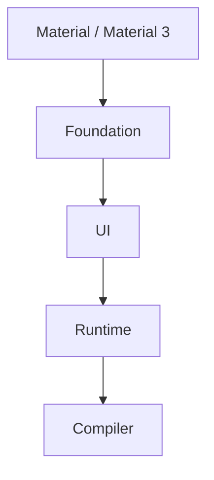

# 🥞 Compose Layered Architecture

## 📌 Purpose
Jetpack Compose is not a monolithic library; it is designed as a stack of modular, unbundled libraries. This layered architecture allows developers to choose the level of abstraction they need, customize components, or even build entirely new UI systems on top of the lower layers.

## 🏗️ The 4 Main Layers of Compose

Compose is built as a stack. Each layer builds upon the one below it.



### 1. Compose Compiler & Runtime (The Core)
This layer knows **nothing about Android or UI**. It is a general-purpose tree management and state-tracking system.
*   **Compiler Plugin:** Transforms `@Composable` functions, injects the `Composer`, and enables positional memoization.
*   **Runtime:** Manages the Slot Table, state objects (`State<T>`), `remember`, and handles the core mechanism of Composition and Recomposition.
*   **Use case:** You can use this layer to build a tree of anything, not just UI! (e.g., managing a tree of API requests or a DOM tree for Compose for Web).

### 2. Compose UI (The Canvas)
This layer introduces the concept of a UI tree. It bridges the gap between the Compose Runtime and the host platform (Android).
*   **Modules:** `ui`, `ui-text`, `ui-graphics`, `ui-tooling`.
*   **Concepts:** `LayoutNode`, `Modifier`, Input handling (pointers, touches), Measurement and Layout phases, Drawing on a `Canvas`.
*   **Use case:** If you want to build a completely custom design system from scratch, avoiding standard Android concepts like rows and columns, you build on top of Compose UI.

### 3. Compose Foundation (The Building Blocks)
This layer provides the basic building blocks for creating user interfaces, but it is **design-system agnostic** (it doesn't look like Material).
*   **Modules:** `foundation`, `foundation-layout`.
*   **Components:** `Row`, `Column`, `Box`, `LazyColumn`, `Image`, `BasicText`, `BasicTextField`.
*   **Concepts:** Scrolling, drag-and-drop, focus management, basic interactions.
*   **Use case:** If you are building a custom design system that doesn't follow Material Design but still needs lists, rows, and text, you use Foundation.

### 4. Compose Material / Material 3 (The Design System)
This is the highest layer, providing an implementation of Google's Material Design guidelines.
*   **Modules:** `material`, `material3`, `material-icons`.
*   **Components:** `Button`, `Card`, `Scaffold`, `TopAppBar`, `FloatingActionButton`.
*   **Concepts:** Theming (Colors, Typography, Shapes), Ripples, Material-specific interactions.
*   **Use case:** Used in 90% of apps. You use this when you want standard, beautiful UI components out of the box.

## ✅ Layer Interoperability Example

You can seamlessly mix layers. If Material doesn't have what you want, drop down to Foundation. If Foundation doesn't have it, drop down to UI.

```kotlin
@Composable
fun LayerMixingExample() {
    // Material Layer
    Card(
        colors = CardDefaults.cardColors(containerColor = MaterialTheme.colorScheme.surface)
    ) {
        // Foundation Layer
        Row(
            modifier = Modifier.padding(16.dp)
        ) {
            // UI Layer (Custom drawing)
            Canvas(modifier = Modifier.size(50.dp)) {
                drawCircle(color = Color.Red)
            }
            
            // Material Layer
            Text(text = "Mixed Layers!")
        }
    }
}
```

## ⚠️ Common Gotchas
*   **Import Confusion:** Beginners often accidentally import `androidx.compose.foundation.text.BasicText` instead of `androidx.compose.material3.Text` and wonder why their text doesn't inherit the Material theme. Always check your imports!
*   **Overriding Material:** If you find yourself fighting a Material component (e.g., trying to completely remove the padding of a `Button`), you are probably using the wrong layer. Drop down to Foundation (e.g., use a `Box` with `.clickable()`) instead of hacking the Material component.

## 💡 Interview Q&A

**Q: Is Jetpack Compose tied to Android?**
A: No! The Compose Compiler and Runtime are pure Kotlin and platform-agnostic. The UI layer introduces platform specific implementations, which is why we have Compose Multiplatform for iOS, Desktop, and Web.

**Q: Why is Compose split into multiple layers instead of one big library?**
A: To provide flexibility. It allows developers to build custom design systems (by using Foundation/UI) without being forced to bundle Material Design code. It also enforces clear boundaries and separation of concerns.

**Q: What is the difference between `Text` and `BasicText`?**
A: `Text` is in the Material layer; it automatically reads from `MaterialTheme` (colors, typography) and supports Material features. `BasicText` is in the Foundation layer; it simply draws text on the screen without any built-in styling or theming.
