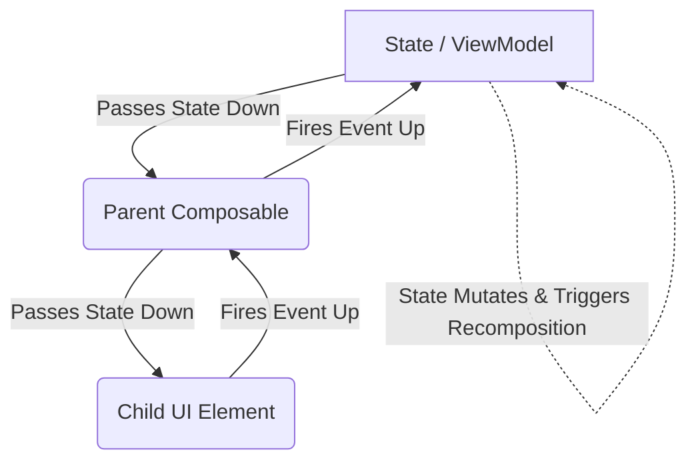

# 💭 Thinking in Compose: The Mental Model

## 📌 Purpose
Transitioning to Jetpack Compose isn't just about learning new APIs; it requires a fundamental shift in how you think about building screens. You must adopt the mental model of **Unidirectional Data Flow**, **State Hoisting**, and **Composable Independence**.

## 🔄 Unidirectional Data Flow (UDF)
UDF is the golden rule of Jetpack Compose architecture. It dictates how data and events move through your app.

*   **State flows down:** Data originates at a higher level (like a `ViewModel` or a parent Composable) and is passed *down* to child Composables as parameters.
*   **Events flow up:** When a user interacts with the UI (e.g., clicking a button), the child Composable doesn't change the state itself. Instead, it fires an event *up* to the parent via a lambda callback. The parent updates the state.



## 🏗️ State Hoisting
State hoisting is the pattern of moving state to a Composable's caller to make the Composable stateless.

### Why Hoist State?
1.  **Single Source of Truth:** Prevents multiple copies of the same state getting out of sync.
2.  **Shareability:** You can pass the hoisted state to multiple different Composables.
3.  **Testability:** A stateless Composable is much easier to test because it only depends on its inputs.

### Example: Hoisting State
```kotlin
// ❌ BAD: Stateful Composable (Hard to test, hard to reuse)
@Composable
fun CounterBad() {
    var count by remember { mutableStateOf(0) } // Internal state
    Button(onClick = { count++ }) {
        Text("Count: $count")
    }
}

// ✅ GOOD: Stateless Composable (State is hoisted)
@Composable
fun CounterGood(count: Int, onIncrement: () -> Unit) {
    Button(onClick = onIncrement) {
        Text("Count: $count")
    }
}

// The Parent manages the state (Single Source of Truth)
@Composable
fun CounterScreen() {
    var count by remember { mutableStateOf(0) }
    
    Column {
        CounterGood(count = count, onIncrement = { count++ })
        CounterGood(count = count, onIncrement = { count++ }) // Shared state!
    }
}
```

## 🧩 Independence of Composables
Composables should be written to execute independently.

1.  **Order Independence:** You cannot guarantee the order in which sibling Composables are executed. The compiler might run them in parallel or reorder them for optimization.
    ```kotlin
    @Composable
    fun Header() { /* ... */ }
    @Composable
    fun Body() { /* ... */ }
    
    // Compose might execute Body() before Header()!
    ```
2.  **Parallel Execution:** Compose can run Composable functions on a background pool of threads. You must never read from or write to global variables or non-thread-safe data structures inside a Composable.
3.  **Recomposition Skipping:** Compose is smart. If it determines that the inputs (parameters) to a Composable haven't changed, it will completely skip executing that Composable and use the cached UI.

## ⚠️ Common Gotchas
*   **Side Effects in Composables:** Modifying global variables, writing to files, or making network requests directly inside a Composable function. Since Composables can be executed in any order, multiple times, or even skipped, side effects will behave unpredictably. Always use Effect Handlers (like `LaunchedEffect`).
*   **Depending on Execution Order:** Assuming that `Log.d("A", "...")` will print before `Log.d("B", "...")` if Composable A is called before Composable B.

## 💡 Interview Q&A

**Q: What is Unidirectional Data Flow?**
A: An architectural pattern where state flows downwards through UI components via parameters, and events flow upwards via callbacks to mutate that state at a central location.

**Q: Why shouldn't you mutate global state inside a Composable?**
A: Composables can be executed multiple times (recomposition), skipped, or executed concurrently on different threads. Mutating global state leads to race conditions, unpredictable behavior, and breaks the declarative paradigm.

**Q: What is State Hoisting?**
A: The process of moving internal state out of a Composable function and into its caller. This is done by replacing the internal state with a parameter (for the state) and a lambda event (to request changes to the state), making the component stateless and reusable.
