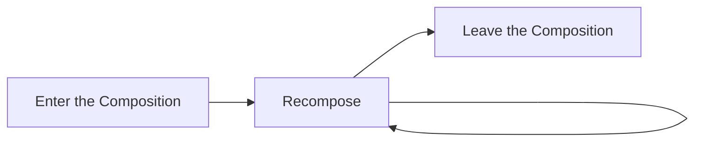

# ♻️ The Composable Lifecycle

## 📌 Purpose
Unlike Android Views or Fragments, Composables do not have explicit lifecycle methods like `onCreate`, `onResume`, or `onDestroy`. Instead, the lifecycle of a Composable is purely defined by its presence in the **Composition Tree**.

## 🌳 The Three Stages of a Composable Lifecycle

A Composable function goes through three distinct stages:



### 1. Enter the Composition
This happens the **first time** a Composable function is called.
*   Compose creates a node for it in the UI tree.
*   Any state defined with `remember` is initialized and stored in the Slot Table.
*   `LaunchedEffect` and `DisposableEffect` blocks begin executing.

### 2. Recompose (0 or more times)
This happens when the **state or parameters** read by the Composable change.
*   Compose re-executes the Composable function with the new inputs.
*   It updates the existing node in the tree (it does *not* destroy and recreate it).
*   If inputs haven't changed, Compose can **skip** recomposition.
*   State stored via `remember` is retained across recompositions.

### 3. Leave the Composition
This happens when the Composable is **no longer called** because the UI logic branched away from it.
*   The node is removed from the UI tree.
*   State stored in the Slot Table via `remember` is discarded.
*   `DisposableEffect` triggers its `onDispose` block.
*   `LaunchedEffect` coroutines are automatically canceled.

## ✅ Lifecycle Examples in Action

### Tying Lifecycle to UI Logic
```kotlin
@Composable
fun AppScreen(isUserLoggedIn: Boolean) {
    if (isUserLoggedIn) {
        // When true: Dashboard enters the composition.
        DashboardScreen() 
    } else {
        // When false: Login enters the composition.
        // If it was true before, Dashboard leaves the composition.
        LoginScreen() 
    }
}
```

### Hooking into the Lifecycle (`DisposableEffect`)
If you need to do setup when a Composable enters, and cleanup when it leaves, use `DisposableEffect`.

```kotlin
@Composable
fun LocationTracker(locationManager: LocationManager) {
    
    DisposableEffect(locationManager) {
        // Called when LocationTracker enters the composition
        val listener = LocationListener { /* update location */ }
        locationManager.requestLocationUpdates(listener)
        
        onDispose {
            // Called when LocationTracker leaves the composition
            // or if locationManager changes.
            locationManager.removeUpdates(listener)
        }
    }
    
    Text("Tracking Location...")
}
```

## ⚠️ Common Gotchas
*   **State Loss:** Developers are often surprised when a Composable's `remember`ed state resets. This happens because the Composable left the composition and re-entered it. For state that must survive configuration changes or leaving the composition, use `rememberSaveable` or a `ViewModel`.
*   **Memory Leaks:** Forgetting to clean up listeners (like BroadcastReceivers or custom callback interfaces) when a Composable leaves the composition. Always use `DisposableEffect` and `onDispose` for cleanup.

## 💡 Interview Q&A

**Q: Does a Composable have an `onDestroy` method?**
A: No. Composables simply "leave the composition". You handle cleanup operations by using `DisposableEffect` and placing logic inside the `onDispose` lambda.

**Q: What causes a Composable to enter the composition?**
A: A Composable enters the composition the first time it is invoked by its parent in the Compose tree.

**Q: If a parent Composable recomposes, does it mean all its children leave and re-enter the composition?**
A: No! This is crucial. If the tree structure remains the same, the children simply **recompose** (or skip recomposition). They do not leave and re-enter. They only leave if they are explicitly removed from the tree (e.g., via an `if` statement evaluating to false).
