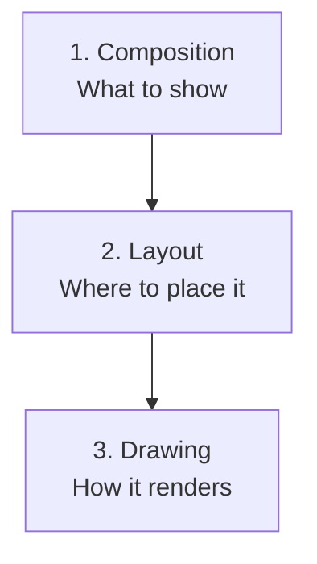

# 🛤️ The 3 Phases of Compose

## 📌 Purpose
Jetpack Compose transforms data into UI through a highly optimized, three-step pipeline. Understanding these phases is crucial for writing performant Compose code and avoiding unnecessary recompositions.

## 🔄 The Three Phases

Compose processes every frame in the following order:



### 1. Composition Phase ("What to show")
*   **Action:** Compose runs your `@Composable` functions and builds a tree of UI nodes.
*   **State Reads:** If a `State` object is read during this phase (e.g., passed as a direct parameter to a Composable or used in an `if` statement), any change to that state will trigger **Recomposition**.
*   **Output:** A tree of `LayoutNode`s.

### 2. Layout Phase ("Where to place it")
*   **Action:** Compose traverses the `LayoutNode` tree. Each node measures its children, determines its own size, and places its children in 2D space (x, y coordinates).
*   **State Reads:** If a state is only read inside a layout block or layout modifier (e.g., `Modifier.offset { ... }`), changes to that state will **skip the Composition phase** and only trigger the Layout and Drawing phases.
*   **Output:** Size and coordinates for every node.

### 3. Drawing Phase ("How it renders")
*   **Action:** Compose draws the pixels onto the screen using an Android `Canvas`.
*   **State Reads:** If a state is only read inside a drawing block (e.g., `Canvas`, `Modifier.drawBehind { ... }`, or color parameters mapped to draw), changes to that state will **skip Composition and Layout** and only trigger the Drawing phase.
*   **Output:** Pixels on the screen.

## 🚀 Optimizing with Deferred State Reads

The rule of thumb for Compose performance is: **Push state reads to the lowest possible phase.**

If a value changes frequently (like scroll position or animation frames), you do NOT want to trigger Composition. You want to trigger Layout or Drawing.

### ❌ Bad: Triggering Composition (Slow)
```kotlin
@Composable
fun MovingBox(scrollOffset: Int) { // State read in Composition phase!
    Box(
        modifier = Modifier
            // Every time scrollOffset changes, the Box recomposes.
            .offset(y = scrollOffset.dp) 
            .size(50.dp)
            .background(Color.Red)
    )
}
```

### ✅ Good: Deferring to Layout Phase (Fast)
```kotlin
@Composable
fun MovingBox(scrollOffsetProvider: () -> Int) { 
    Box(
        modifier = Modifier
            // State is read INSIDE the lambda. 
            // The lambda is called during the Layout phase.
            // Composition is skipped entirely!
            .offset { IntOffset(0, scrollOffsetProvider()) } 
            .size(50.dp)
            .background(Color.Red)
    )
}
```

## ⚠️ Common Gotchas
*   **Reading Scroll State in Composition:** Using `lazyListState.firstVisibleItemScrollOffset` directly in a Composable's body means the UI will recompose on every single pixel the user scrolls. Use `derivedStateOf` or pass the state into a layout/draw modifier lambda.
*   **Animating Colors:** Using `animatedColor.value` directly triggers recomposition. Use `Modifier.drawBehind { drawRect(color = animatedColor.value) }` to skip to the Drawing phase.

## 💡 Interview Q&A

**Q: What are the three phases of Compose in order?**
A: Composition, Layout, and Drawing.

**Q: Why is it bad to trigger Composition on every frame of an animation?**
A: Composition involves executing Kotlin functions and updating the slot table, which is relatively expensive. Layout and Drawing are much cheaper. Doing expensive work 60 times a second leads to UI jank.

**Q: How do you skip the Composition phase for a frequently changing state?**
A: By deferring the state read. Instead of reading the `State.value` directly in the Composable body, read it inside a lambda provided to a Modifier that executes in the Layout phase (like `offset { ... }`) or Drawing phase (like `drawBehind { ... }`).
