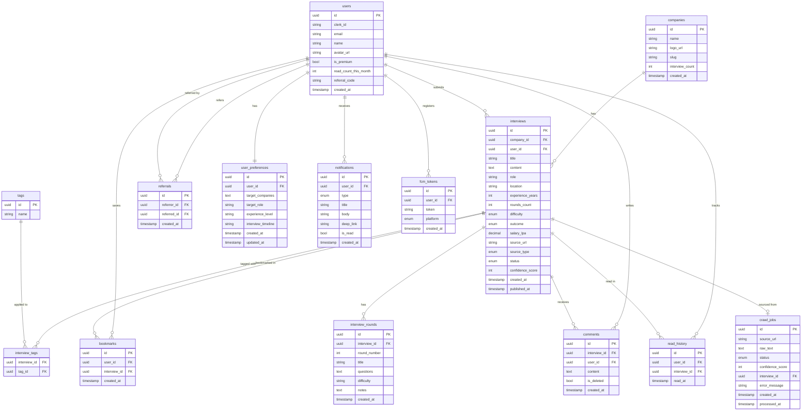

# HireStory — Project Implementation Phases

> What to build. In what order. Step by step. No theory dumps.

---


# THE RULE

**Never move to next phase until current phase works end to end.** One working thing is better than five half-built things.

---

# PHASE 0 — Setup Everything First

> Before writing a single feature line

## Backend Setup

- [ ] Install Java 21 (LTS) on your machine
- [ ] Install IntelliJ IDEA (not Android Studio — different tool for backend)
- [ ] Go to start.spring.io → create project with: Kotlin, Gradle, Spring Web, Spring Data JPA, Spring Security, PostgreSQL Driver, Spring Data Redis, Validation, Actuator
- [ ] Download and open in IntelliJ
- [ ] Install PostgreSQL locally
- [ ] Install Redis locally
- [ ] Create local database named `hirestory_dev`
- [ ] Configure `application.properties` — database URL, username, password
- [ ] Run the app — see it start on port 8080 without crashing
- [ ] Hit `GET localhost:8080/actuator/health` in browser — see `{"status":"UP"}`
- [ ] Create GitHub repo — push initial project
- [ ] Set up `.gitignore` — never commit `application.properties` with real credentials

## KMP Setup

- [ ] Install KDoctor tool — validates your KMP environment is correct
- [ ] Run KDoctor — fix every error it reports before continuing
`- [ ] Go to kmp.jetbrains.com → create new project: Android + iOS, no shared UI
- [ ] Open in Android Studio
- [ ] Run Android app on emulator — see default screen
- [ ] Run iOS app on simulator (Mac only) — see default screen
- [ ] Understand the folder structure — `shared/`, `androidApp/`, `iosApp/`
- [ ] Push to GitHub

## Checkpoint

Backend starts. KMP project runs on both platforms. Two repos on GitHub.

---

# PHASE 1 — Database Schema

> Design the database before writing any API. Everything depends on this.

## What to learn first

Before touching Spring Boot code, study:

- What is JPA and why it exists (maps Kotlin classes to database tables)
- What an Entity is (a Kotlin class that becomes a database table)
- What a relationship is in a database — `@OneToMany`, `@ManyToOne`
- What Flyway is — a tool that manages database schema changes with versioned SQL files
- Why you never use `spring.jpa.hibernate.ddl-auto=create` in real projects — it wipes your data

## Tables to create (in this order — respects foreign key dependencies)

### Table 1 — users

Fields: id (UUID), clerk_id (String unique), email, name, avatar_url, is_premium, read_count_this_month, referral_code (unique), created_at

### Table 2 — companies

Fields: id (UUID), name (unique), logo_url, slug (unique — for URLs), interview_count, created_at

### Table 3 — interviews

Fields: id (UUID), company_id (FK → companies), user_id (FK → users, nullable — null = crawled), title, content (TEXT), role, location, experience_years, rounds_count, difficulty (ENUM: EASY/MEDIUM/HARD), outcome (ENUM: OFFER/REJECTED/GHOSTED), salary_lpa (nullable), source_url (unique, nullable), source_type (ENUM: USER_SUBMITTED/CRAWLED), status (ENUM: PENDING/PUBLISHED/REJECTED), confidence_score, created_at, published_at

### Table 4 — interview_rounds

Fields: id (UUID), interview_id (FK → interviews), round_number, title, questions (TEXT), difficulty, notes, created_at

### Table 5 — tags

Fields: id (UUID), name (unique — DSA/System Design/HR etc)

### Table 6 — interview_tags (junction table)

Fields: interview_id (FK → interviews), tag_id (FK → tags) — composite primary key

### Table 7 — bookmarks

Fields: id (UUID), user_id (FK → users), interview_id (FK → interviews), created_at — unique constraint on (user_id, interview_id)

### Table 8 — comments

Fields: id (UUID), interview_id (FK → interviews), user_id (FK → users), content (TEXT), is_deleted, created_at

### Table 9 — referrals

Fields: id (UUID), referrer_id (FK → users), referred_id (FK → users), created_at

### Table 10 — user_preferences

Fields: id (UUID), user_id (FK → users unique), target_companies (TEXT — JSON array), target_role, experience_level, interview_timeline, created_at, updated_at

### Table 11 — read_history

Fields: id (UUID), user_id (FK → users), interview_id (FK → interviews), read_at — unique on (user_id, interview_id)

### Table 12 — notifications

Fields: id (UUID), user_id (FK → users), type (ENUM), title, body, deep_link, is_read, created_at

### Table 13 — fcm_tokens

Fields: id (UUID), user_id (FK → users), token (unique), platform (ANDROID/IOS), created_at

### Table 14 — crawl_jobs

Fields: id (UUID), source_url (unique), raw_text (TEXT), status (ENUM: PENDING/PROCESSING/DONE/FAILED), confidence_score, interview_id (FK → interviews, nullable), error_message, created_at, processed_at

### Indexes to create

- `interviews.company_id` — every feed query filters by company
- `interviews.difficulty` — filter by difficulty
- `interviews.outcome` — filter by outcome
- `interviews.status` — every query filters published only
- `interviews.source_url` — unique, deduplication
- `interviews.created_at` — feed sorted by date
- `bookmarks.user_id` — fetch user's bookmarks
- `read_history.user_id` — fetch what user has read
- `crawl_jobs.status` — crawler picks up PENDING jobs

## Implementation steps

- [ ] Study JPA Entity annotations — `@Entity`, `@Table`, `@Column`, `@Id`, `@GeneratedValue`
- [ ] Study JPA relationships — `@OneToMany`, `@ManyToOne`, `@ManyToMany`, `@JoinColumn`
- [ ] Study Flyway — how migration files are named, how they run automatically on startup
- [ ] Create all entities as Kotlin data classes in Spring Boot
- [ ] Create first Flyway migration file `V1__create_initial_schema.sql`
- [ ] Run Spring Boot — Flyway creates all tables automatically
- [ ] Open database browser (IntelliJ has one built in) — verify all tables created correctly
- [ ] Insert 5 fake interviews manually via SQL — verify data looks right

## Checkpoint

All tables exist. Flyway ran V1 migration. You can insert and read data manually. No API yet.

---

# PHASE 2 — Core REST API (No Auth Yet)

> Build the API. Test with Postman. No security yet — add that next phase.

## What to learn first

- What `@RestController` is — a class that handles HTTP requests
- What `@GetMapping`, `@PostMapping`, `@PutMapping`, `@DeleteMapping` are
- What `@PathVariable` is — extracts `/interviews/{id}` from URL
- What `@RequestParam` is — extracts `?company=Google` from URL
- What `@RequestBody` is — parses JSON body into Kotlin object
- What `ResponseEntity<T>` is — lets you control HTTP status code in response
- What a DTO is — Data Transfer Object — the JSON shape your API sends/receives (different from your database Entity)
- What a Mapper is — converts Entity → DTO and DTO → Entity
- What `@ControllerAdvice` is — catches exceptions globally, returns clean error responses
- What `@Transactional` is — wraps a database operation in a transaction
- What `JpaRepository` is — gives you free CRUD methods without writing SQL
- What pagination is — `Pageable`, `Page<T>`, `PageRequest`
- What cursor-based pagination is — better than page number for feeds

## Endpoints to build (in this exact order)

### Step 1 — Companies (simplest, no relationships)

- `GET /api/companies` — returns list of all companies with interview count
- `GET /api/companies/{id}` — returns one company
- Seed 10 real companies into database
- Test both endpoints in Postman — see real data

### Step 2 — Interviews feed (core of the app)

- `GET /api/interviews` — paginated list, status=PUBLISHED only
    - Query params: `?page=0&size=20&company=Google&difficulty=MEDIUM&outcome=OFFER`
    - Returns: list of interview summaries (NOT full content — just enough for card)
- `GET /api/interviews/{id}` — returns full interview with all rounds
- Seed 50 real interviews (manually copy from Reddit/GFG — this is your initial data)
- Test feed with different filter combinations in Postman

### Step 3 — Search

- `GET /api/search?q=google+graph+algorithm` — full text search
- Learn PostgreSQL full-text search — `tsvector`, `to_tsvector`, `tsquery`, `@@` operator
- Add search vector column to interviews table — new Flyway migration
- Add GIN index on search vector column
- Test search in Postman — relevant results appear

### Step 4 — Shorts feed

- `GET /api/shorts` — returns optimised list for swipe format (smaller payload than full feed)
- `GET /api/shorts/next?after={id}` — next interview after current one
- This endpoint returns only: company, role, outcome, difficulty, rounds count, first 200 chars of content, tags
- Test in Postman

### Step 5 — Submit interview (no auth yet — any request accepted)

- `POST /api/interviews` — accepts interview JSON, saves as PENDING status
- `GET /api/interviews/pending` — list of pending interviews (for admin)
- `PUT /api/interviews/{id}/approve` — change status to PUBLISHED
- `PUT /api/interviews/{id}/reject` — change status to REJECTED
- Test submit → approve flow in Postman

### Step 6 — Error handling

- Create `GlobalExceptionHandler` with `@ControllerAdvice`
- Handle: resource not found → 404 with clear message
- Handle: validation error → 400 with field-level errors
- Handle: any unexpected error → 500 with generic message, log full stack trace
- Never return raw Java exception to client
- Test: request non-existent interview — get clean 404 JSON

## Checkpoint

All endpoints work. Tested in Postman. Real data returns. Errors handled cleanly. No auth yet.

---

# PHASE 3 — Authentication

> Lock down the API. Only valid users can access protected endpoints.

## What to learn first

- What Spring Security is — a filter chain that intercepts every HTTP request
- What JWT is — a token the client sends with every request to prove who they are
- What a filter chain is — every request passes through a sequence of filters before reaching your controller
- What Clerk is — the auth service you chose. It issues JWTs. Your Spring Boot validates them.
- What a Clerk webhook is — when a user signs up on the client, Clerk calls your backend to tell you. This is how you create the user in your database.
- What CORS is — browsers block requests from different domains. You must configure which domains can call your API.
- What `@PreAuthorize` is — method-level security. Mark a method as admin-only.

## Implementation steps

### Step 1 — Understand JWT validation

- Clerk issues a JWT token when user logs in on the app
- Every API request from the app includes this token in the header: `Authorization: Bearer <token>`
- Your Spring Boot must validate: is this token real? is it expired? who does it belong to?
- Clerk provides a public key (JWKS endpoint). You use it to verify the token signature.
- You never store passwords. Clerk handles all of that.

### Step 2 — Configure Spring Security

- Study `SecurityFilterChain` bean — this is where you define which endpoints are public and which require auth
- Public endpoints (no token needed):
    - `GET /api/interviews` — feed is public (but read count tracked if logged in)
    - `GET /api/interviews/{id}` — detail is public (read count enforced)
    - `GET /api/companies/**` — companies are public
    - `GET /api/search` — search is public
    - `POST /api/webhooks/clerk` — Clerk must call this without a user token
- Protected endpoints (token required):
    - `POST /api/interviews` — submit interview
    - `POST /api/bookmarks/**` — bookmark requires login
    - `GET /api/profile/**` — profile requires login
    - `GET /api/notifications` — notifications require login
- Admin-only endpoints:
    - Everything under `/api/admin/**`

### Step 3 — JWT filter

- Create a filter that runs before every request
- Extracts the token from the Authorization header
- Validates it against Clerk's public key
- Extracts the user's Clerk ID from the token claims
- Sets the authenticated user in Spring Security's context
- If token is invalid or missing on a protected endpoint → return 401

### Step 4 — Clerk webhook

- Create `POST /api/webhooks/clerk` endpoint
- When user signs up in your app, Clerk calls this endpoint
- You receive user data: clerk_id, email, name, avatar_url
- Create the user in your `users` table
- Generate a unique referral code for the user
- This must be secured — validate the webhook signature from Clerk

### Step 5 — CORS configuration

- Allow requests from your Next.js web domain
- Allow requests from Android app (no CORS needed for mobile — only for web)
- Set allowed methods, headers

### Step 6 — Read count enforcement

- When `GET /api/interviews/{id}` is called with a valid token:
    - Check `read_history` table — has user read this before?
    - If no: increment Redis counter `reads:{userId}:{year-month}`
    - If Redis count >= 25 AND user is not premium → return 402 Payment Required with paywall info
    - If new read: insert into `read_history` table
- When called without token: just return the interview (anonymous reading)

## Checkpoint

Protected endpoints reject requests without valid token. Clerk webhook creates users. Read counting works. CORS allows web requests.

---

# PHASE 4 — User Features

> Everything a logged-in user can do.

## Implementation steps

### Step 1 — Profile

- `GET /api/profile` — returns logged-in user's profile with stats
- Stats include: total interviews submitted, total bookmarks, total referrals, read count this month, reads remaining
- `PUT /api/profile` — update name, avatar URL

### Step 2 — Bookmarks

- `POST /api/bookmarks/{interviewId}` — save bookmark
- `DELETE /api/bookmarks/{interviewId}` — remove bookmark
- `GET /api/bookmarks` — get all user's bookmarks (paginated)
- Unique constraint on (user_id, interview_id) — cannot bookmark same interview twice
- Return 409 Conflict if already bookmarked

### Step 3 — User preferences (powers personalisation)

- `PUT /api/preferences` — save onboarding selections: target companies, role, experience level, timeline
- `GET /api/preferences` — get current preferences
- Once preferences are saved, the feed endpoint uses them to personalise results

### Step 4 — Feed personalisation

- Update `GET /api/interviews` to use preferences
- If user has preferences: boost interviews matching their target companies and role
- Exclude interviews in user's `read_history`
- Sort: personalised score first, then recency
- If no preferences: return standard recency-sorted feed

### Step 5 — Comments

- `GET /api/interviews/{id}/comments` — list comments (paginated)
- `POST /api/interviews/{id}/comments` — add comment (auth required)
- `DELETE /api/comments/{id}` — delete own comment (auth required)
- `POST /api/comments/{id}/report` — report a comment

### Step 6 — Referrals

- `GET /api/referrals/my-code` — returns user's unique referral code
- `POST /api/referrals/apply/{code}` — apply someone else's referral code
    - Validate: code exists, user hasn't already applied a code, cannot apply own code
    - Add +10 to both users' Redis read allowance for this month
    - Insert into `referrals` table
- `GET /api/referrals/stats` — how many people used your code, total unlocks earned

## Checkpoint

Full user journey works: sign up → set preferences → read interviews → bookmark → submit → refer friend.

---

# PHASE 5 — Redis Caching

> Make the API fast. Reduce database load.

## What to learn first

- What Redis is — an in-memory key-value store. Millisecond reads vs millisecond database reads.
- What caching means — store the result of an expensive operation. Return the stored result next time instead of recomputing.
- What TTL (Time To Live) is — how long before cached data expires and is re-fetched
- What cache invalidation is — when data changes, remove the cached version so stale data is not returned
- What Spring Cache abstraction is — `@Cacheable`, `@CacheEvict` annotations

## What to cache in HireStory

### Feed cache

- Cache `GET /api/interviews` response per filter combination
- Key: `feed:{company}:{difficulty}:{outcome}:{page}`
- TTL: 5 minutes
- Invalidate when: new interview published
- Why: feed is read thousands of times, database query is expensive

### Company list cache

- Cache `GET /api/companies` response
- TTL: 1 hour
- Invalidate when: new company added or interview count changes

### Read counter

- `reads:{userId}:{year-month}` → integer
- Increment on every new read
- No TTL — expires manually on month reset
- Check this on every interview detail request — free tier enforcement

### Trending searches

- `trending:searches` → sorted set of search terms
- Recalculate every hour
- Used by `GET /api/search/suggestions`

### URL deduplication for crawler

- `crawled:{sha256_of_url}` → "1"
- TTL: 30 days
- Check before crawling any URL — skip if already crawled

### Shorts sequence

- `shorts:{userId}` → list of interview IDs in swipe order
- Regenerated when user exhausts the list
- Pre-load 20 interviews at a time

## Implementation steps

- [ ] Study Spring Cache — `@Cacheable`, `@CacheEvict`, `@CachePut`
- [ ] Study `RedisTemplate` — for manual cache operations (counter increment, list operations)
- [ ] Configure Redis connection in `application.properties`
- [ ] Add feed caching to interviews controller
- [ ] Add read counter logic to interview detail endpoint
- [ ] Add URL dedup check (used in crawler phase — set it up now)
- [ ] Add trending search tracking
- [ ] Test: call feed endpoint twice — second call must be faster (check logs, Redis hit vs DB hit)

## Checkpoint

Feed responses cached. Read counter working in Redis. URL dedup keys being set.

---

# PHASE 6 — Notifications

> Tell users what is happening in the app.

## What to learn first

- What Firebase Cloud Messaging (FCM) is — Google's service to send push notifications to Android devices
- What a device token is — a unique string that represents one specific app installation on one device
- How FCM works: your backend sends a message to Google's servers with the device token → Google delivers it to the device
- What RabbitMQ is — a message queue. Your API publishes a notification task to the queue. A separate consumer picks it up and sends via FCM. This way sending notifications never slows down your API.

## Notification types to implement (V1 only)

### Activity notifications

- Someone comments on your interview → notify interview author
- Your submitted interview was published → notify submitter
- Someone used your referral code → notify referrer

### Content notifications

- New interview added for a company you follow → notify all followers of that company
- Onboarding day 1: "Here are top interviews for [your target company]"
- Onboarding day 3: "Your feed is getting more personalised"
- Onboarding day 7: "You have read N interviews this week"

## Implementation steps

### Step 1 — FCM token storage

- When Android/iOS app starts, it gets a device token from Firebase SDK
- App calls `POST /api/notifications/token` with the token
- Store in `fcm_tokens` table — one user can have multiple tokens (multiple devices)

### Step 2 — Notification service

- Create `NotificationService` in Spring Boot
- Method: `sendToUser(userId, title, body, deepLink)`
- Looks up all FCM tokens for that user
- Calls Firebase Admin SDK to send the notification
- Log success or failure per token

### Step 3 — RabbitMQ integration

- Add RabbitMQ dependency
- Create `notification_queue`
- Instead of calling `NotificationService` directly, publish a message to the queue
- Create a consumer that reads from the queue and calls `NotificationService`
- Why: if FCM is slow or down, your API stays fast. The queue absorbs the work.

### Step 4 — Trigger points

- In comment creation → publish notification event to queue
- In interview approval → publish notification event to queue
- In referral application → publish notification event to queue
- Create a scheduled job for onboarding sequence — runs daily, finds users at day 1/3/7, sends appropriate notification

### Step 5 — Notification list API

- `GET /api/notifications` — user's notification list, newest first
- `PUT /api/notifications/{id}/read` — mark as read
- `PUT /api/notifications/read-all` — mark all as read
- Store all sent notifications in `notifications` table

## Checkpoint

Push notifications received on Android device. Notification list API works. Queue decouples sending from API response.

---

# PHASE 7 — Web Crawler

> The engine that fills HireStory with content automatically.

## What to learn first

- What Jsoup is — a Java library that downloads a webpage and lets you extract data from its HTML using CSS selectors
- What CSS selectors are — `div.content`, `h1`, `a[href]`, `.post-title` — ways to find elements in HTML
- What HTML structure is — every webpage is a tree of elements. You navigate the tree to find the content you want.
- What Spring Scheduler is — lets you run a method automatically on a schedule using a cron expression
- What a cron expression is — a string that defines when a job runs: `"0 0 */6 * * *"` means every 6 hours
- What rate limiting is — waiting between requests so you don't hammer a website and get your IP banned
- What `robots.txt` is — a file on every website that says which pages can be crawled. You must respect it.

## Sources to crawl (legally safe)

### Reddit — r/cscareerquestions, r/india, r/developersIndia

- Use Reddit's official JSON API — add `.json` to any Reddit URL
- Example: `https://reddit.com/r/cscareerquestions/search.json?q=interview+experience&sort=new`
- No scraping needed — Reddit provides JSON directly
- Rate limit: 60 requests per minute on their free API

### GeeksForGeeks — Interview Experiences section

- Public pages, no ToS restriction on crawling
- Use Jsoup to extract article title, content, company name from HTML
- Study their HTML structure — find the right CSS selectors for each field

### Medium and dev.to — Public developer blog posts

- Search for "interview experience" on both platforms
- Both have public APIs for searching posts
- Medium: `https://medium.com/search?q=interview+experience`
- dev.to has a full REST API — `https://dev.to/api/articles?tag=interview`

### Glassdoor — Link out only, DO NOT store content

- Their ToS bans scraping. Legal risk.
- Only store the URL and show "sourced from Glassdoor" badge
- User taps → opens in web view → reads on Glassdoor's site
- This was your original plan — stick to it.

## Crawler pipeline flow

```
Spring Scheduler triggers every 6 hours
        ↓
For each source: fetch new posts since last crawl
        ↓
For each post URL: check Redis `crawled:{hash}` — skip if exists
        ↓
If new: download full content
        ↓
Insert into `crawl_jobs` table with status=PENDING
Set Redis `crawled:{hash}` key with 30 day TTL
        ↓
Publish crawl job ID to RabbitMQ `crawl_queue`
        ↓
AI consumer picks up job → processes → next phase
```

## Implementation steps

### Step 1 — Jsoup basics

- Study CSS selectors — how to find elements in HTML
- Practice: take a GeeksForGeeks interview experience page, write Jsoup code to extract: title, company name, full content
- Study how to handle errors — page not found, network timeout, unexpected HTML structure

### Step 2 — Reddit crawler

- Reddit JSON API requires a User-Agent header identifying your crawler
- Study Reddit's API — search endpoint, pagination, rate limits
- Extract: post title, post content, post URL, subreddit, created date
- Filter: only posts mentioning "interview experience", "interview questions", "got offer"

### Step 3 — GeeksForGeeks crawler

- Study the GFG interview experiences page structure
- Find CSS selectors for: article title, company name, role, content
- Handle pagination — GFG has multiple pages of experiences

### Step 4 — Deduplication

- Before inserting any crawl job, check `crawl_jobs` table for same `source_url`
- Also check Redis dedup key
- Two layers of protection — Redis is fast, database is the backup

### Step 5 — Scheduler

- Study Spring `@Scheduled` annotation and cron expressions
- Create `CrawlerScheduler` class with `@Scheduled(cron = "0 0 */6 * * *")`
- Study how to prevent a scheduled job from running twice if previous run is still in progress — `@Scheduled` with `fixedDelay` vs `fixedRate` vs `cron`

### Step 6 — Manual trigger (for testing)

- `POST /api/admin/crawler/trigger` — runs crawler immediately without waiting for schedule
- Protected by admin role
- Returns: how many new crawl jobs were queued

### Step 7 — Crawler health monitoring

- `GET /api/admin/crawler/stats` — returns: pending jobs, processed today, failed today, total in database
- Log every crawl run — start time, end time, new jobs found, errors

## Checkpoint

Crawler runs on schedule. New posts from Reddit and GFG appear in `crawl_jobs` table. Deduplication works — running crawler twice does not create duplicate jobs.

---

# PHASE 8 — AI Extraction Agent

> Turn raw crawled text into structured interview data.

## What to learn first

- What Spring AI is — Spring's official library for integrating AI models into Spring Boot applications
- What GPT-4o Mini is — OpenAI's fastest and cheapest model. Good enough for structured data extraction.
- What structured output is — instead of asking AI for a paragraph, you ask for a specific JSON shape. Spring AI handles the conversion.
- What a prompt is — the instruction you send to the AI. Quality of extraction depends entirely on quality of your prompt.
- What the Batch API is — instead of sending one request at a time, you send a file of 100 requests. OpenAI processes them within 24 hours at 50% discount. Perfect for crawled content.
- What a confidence score is — after extraction, you ask the AI: "on a scale of 0-100, how confident are you that this is actually an interview experience?" Low scores go to manual review.

## What the AI extracts from raw text

From a raw blog post or Reddit thread, the AI should extract:

- Company name
- Role / position title
- Location (city)
- Years of experience the candidate had
- Number of interview rounds
- Description of each round — what was asked, difficulty
- Overall difficulty: EASY, MEDIUM, or HARD
- Final outcome: OFFER, REJECTED, or GHOSTED
- Salary offered (if mentioned)
- Tags: which topics were covered — DSA, System Design, HR, Behavioral, SQL, etc.
- Confidence score: 0-100 — how confident is AI that this is a real interview experience

## Implementation steps

### Step 1 — Spring AI setup

- Add Spring AI OpenAI starter dependency
- Configure OpenAI API key in `application.properties`
- Study `ChatClient` — the main object you use to talk to the AI
- Study structured output — how to tell Spring AI to return a specific Kotlin data class

### Step 2 — Extraction prompt engineering

This is the most important step. The quality of your data depends on this prompt.

Your prompt must tell the AI:

- What task it is doing: extracting interview experience data
- What JSON structure to return: list every field with its type and valid values
- What to do when a field is not found: return null, not a guess
- How to calculate confidence score: 90+ if clearly an interview experience, 50-70 if possibly, under 50 if probably not
- Edge cases: posts that mention interviews but are not experiences (asking for advice, meme posts)

Test your prompt with 20 different raw texts before finalising it. Iterate until extraction accuracy is above 85%.

### Step 3 — RabbitMQ consumer

- Create consumer that listens on `crawl_queue`
- For each message: fetch the crawl job from database by ID
- Send raw text to AI extraction
- Parse the structured response
- Update `crawl_jobs` table with extracted data and confidence score

### Step 4 — Auto-publish logic

- If confidence_score >= 80: set interview status to PUBLISHED automatically
- If confidence_score between 50-79: set to PENDING — goes to admin review queue
- If confidence_score < 50: set crawl_job status to FAILED — likely not an interview post
- For auto-published interviews: find or create the company record, create interview record with all rounds

### Step 5 — Deduplication after extraction

- After extraction, check: does an interview from this company + role + approximate date already exist?
- If yes: skip insertion, mark crawl_job as duplicate
- This catches same interview posted on Reddit AND GeeksForGeeks

### Step 6 — Error handling

- AI call fails → retry 3 times with exponential backoff
- After 3 failures → move to dead letter queue → alert you via notification
- Never lose a crawl job — always update status even on failure

## Checkpoint

Crawled Reddit posts are automatically extracted into structured interviews. High confidence posts appear in the feed. Low confidence posts appear in admin queue. Extraction cost under $1 for first 1000 interviews.

---

# PHASE 9 — Admin Panel

> You need to manage content. Build it fast, not pretty.

## What to use

Retool (free for solo developers). Connect it to your PostgreSQL. Drag and drop to build the interface. Do not build a custom admin UI — it is a waste of time at this stage.

## What you need to manage

### Content moderation queue

- Table showing all interviews with status=PENDING
- Columns: company, role, confidence score, source URL, created at
- Buttons: Approve, Reject, Open source URL
- When approved: status changes to PUBLISHED, notification sent to user if user-submitted

### Crawl job monitor

- Table showing recent crawl jobs
- Columns: source URL, status, confidence score, error message, created at
- Filter by status: PENDING, DONE, FAILED
- Button to manually trigger a new crawl run (calls your admin API endpoint)

### User management

- Search users by email
- See user stats: read count, subscription status, referral count
- Button to manually reset read count
- Button to ban user (set is_active = false)

### Company management

- Add new companies manually (for seeding before crawler fills them)
- Upload company logo URL
- See interview count per company

### Analytics overview

- Total interviews in database
- Interviews by status (published/pending/rejected)
- New users today / this week
- Most read interviews this week
- Crawler jobs today

## Implementation steps

- [ ] Sign up for Retool (free tier)
- [ ] Connect Retool to Railway PostgreSQL — provide connection string
- [ ] Build moderation queue table in Retool — 30 minutes
- [ ] Build crawl job monitor — 30 minutes
- [ ] Build user management table — 30 minutes
- [ ] Connect approve/reject buttons to your Spring Boot admin API endpoints
- [ ] Done. Total time: 2-3 hours.

## Checkpoint

You can review and approve submitted interviews. You can monitor crawler health. You can manage users.

---

# PHASE 10 — Deploy Backend

> Get it running on the internet.

## Services to provision on Railway

- [ ] Create Railway account
- [ ] Create new project
- [ ] Add PostgreSQL service — copy connection string
- [ ] Add Redis service — copy connection string
- [ ] Add RabbitMQ service — copy connection string
- [ ] Add Spring Boot service — connect to GitHub repo, auto-deploy on push

## Environment variables to set on Railway

- `DATABASE_URL` — PostgreSQL connection string
- `REDIS_URL` — Redis connection string
- `RABBITMQ_URL` — RabbitMQ connection string
- `CLERK_SECRET_KEY` — for JWT validation
- `CLERK_WEBHOOK_SECRET` — for validating Clerk webhooks
- `OPENAI_API_KEY` — for AI extraction
- `FIREBASE_SERVICE_ACCOUNT_KEY` — for FCM notifications
- `CLOUDINARY_URL` — for image uploads
- `JWT_SECRET` — for signing any internal tokens
- `ALLOWED_ORIGINS` — your Next.js domain for CORS

## What to verify after deploy

- [ ] `GET https://your-app.railway.app/actuator/health` returns UP
- [ ] `GET https://your-app.railway.app/api/interviews` returns data
- [ ] Flyway ran all migrations — check Railway logs
- [ ] Update Android app base URL to production URL
- [ ] Update Next.js environment variable to production URL

## Checkpoint

Backend live on Railway. Android app hitting production API. Real data returning.

---

# PART 2 — KMP FRONTEND (ANDROID + iOS)

## Chapter overview

KMP frontend is lighter to plan because you know Android well. The new concepts are:

1. KMP shared module setup — what goes in shared vs platform
2. Room KMP — using Room in commonMain (new since Room 2.7)
3. Ktor instead of Retrofit — networking in shared module
4. Koin instead of Hilt — DI that works on both platforms
5. Shared ViewModel — written once, used by Compose and SwiftUI
6. New Compose components you haven't built — Shorts swipe, radial FAB animation

---

# PHASE 11 — KMP Shared Module

## What goes in the shared module

- All domain models — `Interview`, `Company`, `User`, `Bookmark` etc
- All repository interfaces and implementations
- Ktor HTTP client — all API calls
- Room database — entities, DAOs, database class (KMP-ready since 2.7)
- All ViewModels — shared between Android and iOS
- Koin modules — all DI definitions
- All use cases

## What stays in platform modules

- Android: Jetpack Compose screens, navigation, Koin Android setup
- iOS: SwiftUI views, SwiftUI navigation, Koin iOS startup
- Platform-specific Room database builder (file path differs per platform)

## Implementation steps

### Step 1 — Project setup

- Create KMP project using kmp.jetbrains.com wizard
- Select Android + iOS, no shared UI
- Run KDoctor — fix all issues
- Understand the build.gradle.kts structure in shared module

### Step 2 — Domain models

- Create all domain model data classes in `commonMain`
- Create sealed classes for enums: `Difficulty`, `Outcome`, `SourceType`
- Create `Result<T>` sealed class: `Success`, `Error`, `Loading`
- No dependencies needed — pure Kotlin

### Step 3 — Ktor HTTP client setup

- Study why Retrofit cannot work in KMP (uses Java reflection)
- Study Ktor — same concept as Retrofit but KMP-compatible
- Configure HttpClient in commonMain with: JSON serialization, logging, auth header
- Android engine setup in androidMain
- iOS Darwin engine setup in iosMain
- Create API interface classes for each feature

### Step 4 — Room KMP setup

- Study Room 2.7+ KMP support — what changed
- Create all Room entities in commonMain
- Create all DAOs in commonMain
- Create database class in commonMain
- Platform-specific database builder:
    - Android: uses Android context for file path
    - iOS: uses NSDocumentDirectory for file path
- This is the one `expect`/`actual` you write

### Step 5 — Repository implementations

- Create repository implementations in commonMain
- Each repository uses both Ktor (remote) and Room (local)
- Offline-first pattern: emit cached data immediately, fetch from network, update cache, emit again
- All return `Flow<Result<T>>`

### Step 6 — Koin setup

- Study Koin — why it works in KMP when Hilt does not
- Create Koin modules in commonMain: network, database, repository, usecase, viewmodel
- Create platform module (expect/actual) for Room driver
- Android: start Koin in Application class
- iOS: start Koin in Swift entry point

### Step 7 — Shared ViewModels

- Create ViewModel for each screen in commonMain
- Use `StateFlow<UiState>` for screen state
- Use `SharedFlow` for one-time events (navigation, snackbar)
- Test that ViewModels work by writing unit tests in commonMain

## Checkpoint

Shared module compiles. Android app builds. iOS app builds. ViewModel fetches real data from Spring Boot API.

---

# PHASE 12 — Android Compose UI

## Screens to build (in this order)

### Step 1 — Auth screens

- Login screen — email/password fields, Google sign-in button
- Sign up screen
- Integrate Clerk Android SDK
- On successful login: store token, navigate to home

### Step 2 — Home feed

- `InterviewCard` composable — the most reused component in the app
- Filter chips row — horizontal scrollable
- `LazyColumn` with Paging 3 for infinite scroll
- Pull to refresh
- Loading skeleton (shimmer effect while loading)
- Empty state — no interviews match filter
- Error state — network error with retry button

### Step 3 — Interview Detail

- Company header card
- Meta info (rounds, difficulty, outcome, salary)
- Accordion rounds — each round expandable/collapsible
- Tips from author card
- Comments section
- Comment input bar at bottom
- Bookmark + share action buttons
- External source banner (if crawled)

### Step 4 — Radial FAB (Navigation)

- This is the most complex animation in the app
- Study `AnimatedVisibility`, `animateFloatAsState`, `graphicsLayer`
- Study staggered animations — each option appears 50ms after the previous
- FAB rotates ☰ → ✕ when opened
- Background overlay dims to 0.72 opacity
- 5 options arc toward top-left from bottom-right corner
- Tap anywhere on dim overlay → closes fan
- Each option navigates to its destination

### Step 5 — Shorts screen

- Study `VerticalPager` from Compose Foundation
- Full screen card — no nav bar visible
- Pre-load next 2 interviews — `beyondBoundsPageCount = 2`
- Progress dots at bottom sync with pager state
- Company banner section (top ~42% of screen)
- Content preview section
- Action row — save, share, comment count, Full Story button
- View tracking — call API when user stays on card > 2 seconds
- Back arrow to exit to Home

### Step 6 — Companies, Search, Saved, Profile

- Companies grid screen
- Search with full-text, filter chips, recent searches
- Saved screen with company tabs and swipe to remove
- Profile screen with stats, add interview button, referral card, settings

### Step 7 — Add Interview form

- Multi-section form
- Company name, role, experience level selector
- Rounds stepper — large tappable + and - buttons (40×40dp minimum)
- Difficulty selector chips
- Outcome selector chips
- Large text area for content
- Topics multi-select chips
- Optional salary field
- Anonymous toggle
- Submit button — sticky at bottom

### Step 8 — Offline mode

- Room as single source of truth
- Show "Offline" banner when no network detected
- Feed shows cached data with banner
- Bookmarks fully work offline
- Actions while offline queued in Room, synced by WorkManager when back online

### Step 9 — Firebase integration

- Add google-services.json
- Initialize Crashlytics — set user ID after login
- Log all key events (see events list in master plan)
- FCM service — receive and display push notifications
- Remote Config — check min version on app start

### Step 10 — Deep links

- Configure Android App Links — `hirestory.com/interview/{id}` opens app
- Configure referral deep link — `hirestory.com/referral/{code}`
- Handle incoming deep links in navigation

## Checkpoint

Full Android app works end to end. All screens complete. Offline mode works. Push notifications received.

---

# PHASE 13 — iOS SwiftUI UI

> Build after Android is complete. You know Android better — validate everything on Android first.

## Screens to build (same as Android — different UI framework)

- All screens mirror Android functionality
- SwiftUI is declarative like Compose but different syntax
- Shared ViewModels from KMP consumed directly in SwiftUI

## Key iOS-specific things to learn

- How to observe Kotlin `StateFlow` from Swift — `StateFlowObserver` pattern or using `@Published` wrapper
- SwiftUI `List` and `LazyVStack` — equivalent to LazyColumn
- SwiftUI `TabView` with `PageTabViewStyle` — equivalent to VerticalPager for Shorts
- SwiftUI navigation — `NavigationStack`, `NavigationLink`
- APNs — Apple Push Notification service — how it differs from FCM
- App Store submission requirements — different from Play Store

## Checkpoint

iOS app matches Android functionality. Both apps consuming same shared ViewModels and same backend.

---

# PHASE 14 — Next.js Web

> Lightest phase — you know React. Next.js adds routing and SSR.

## What Next.js adds over React you already know

- File-based routing — `app/interview/[id]/page.tsx` automatically becomes a route
- Server-side rendering (SSR) — page HTML generated on server → Google indexes it → free organic traffic
- Server components vs client components — server components fetch data directly, no API call needed from browser
- `generateMetadata()` — set page title and OG image per interview for social sharing
- `next/image` — automatic image optimisation
- `next/link` — client-side navigation between pages

## Pages to build

### Public SEO pages (Server components — Google indexes these)

- `/` — homepage with featured interviews
- `/interview/[id]` — full interview page (most important SEO page)
- `/company/[slug]` — all interviews for one company
- `/role/[role]` — all interviews for one role

### App pages (Client components — require login)

- `/feed` — personalised feed (same as Android home)
- `/profile` — user profile
- `/submit` — add interview form

### SEO value

Every interview gets a URL: `hirestory.com/interview/google-sde-bangalore-2024`. Someone Googles "Google SDE 1 interview experience India 2024" — they land on your page. This is free users forever. More important than the app at launch.

## Implementation steps

- [ ] Create Next.js 14 project with App Router
- [ ] Set up Tailwind CSS with HireStory dark theme colors
- [ ] Build interview detail page — most important page first
- [ ] Add `generateMetadata()` for each interview — title, description, OG image
- [ ] Build company page
- [ ] Build homepage
- [ ] Configure Clerk for web authentication
- [ ] Build feed page (logged in users)
- [ ] Build submit interview form
- [ ] Set up sitemap generation — auto-generate URLs for all published interviews
- [ ] Deploy to Vercel — one click from GitHub

## Checkpoint

`hirestory.com/interview/[any-id]` loads real interview data. Google can index it. Social share shows correct OG image.

---

# PHASE 15 — Play Store + App Store Submission

## Play Store checklist

- [ ] Privacy policy live at hirestory.com/privacy (generate free at privacypolicygenerator.info)
- [ ] Terms of service live at hirestory.com/terms
- [ ] Pay $25 Google developer account fee (one time)
- [ ] App icon — 512×512px, no alpha channel, no rounded corners (Google adds them)
- [ ] Feature graphic — 1024×500px — shows in Play Store listing
- [ ] Screenshots — minimum 2, maximum 8 per form factor
    - Phone screenshots: 1080×1920px
    - Include: home feed, interview detail, shorts, profile
- [ ] Short description — max 80 characters
- [ ] Full description — max 4000 characters — include keywords: interview experience, tech interview, Google interview, Amazon interview
- [ ] Data safety form — declare what data you collect, how you use it
- [ ] Content rating questionnaire
- [ ] Set up internal testing track first — test with 5 people before public release
- [ ] Release to production

## App Store checklist (iOS)

- [ ] Apple Developer account — $99/year
- [ ] App icon set — multiple sizes required (use AppIconGenerator.com)
- [ ] Screenshots for iPhone and iPad
- [ ] App description with keywords
- [ ] Privacy policy URL
- [ ] Review guidelines — ensure content moderation is in place before submission
- [ ] TestFlight internal testing first

## Checkpoint

App live on Play Store. Real users can download and use it.

---

# THE FULL BUILD ORDER SUMMARY

```
Phase 0  → Setup (IntelliJ, PostgreSQL, Redis, KMP project)
Phase 1  → Database schema (all tables, Flyway migration)
Phase 2  → Core REST API (feed, companies, search, shorts)
Phase 3  → Authentication (Spring Security, JWT, Clerk)
Phase 4  → User features (bookmarks, preferences, comments, referrals)
Phase 5  → Redis caching (feed cache, read counter, dedup)
Phase 6  → Notifications (FCM, RabbitMQ, onboarding sequence)
Phase 7  → Web crawler (Reddit, GFG, Jsoup, scheduler)
Phase 8  → AI extraction (Spring AI, GPT-4o Mini, auto-publish)
Phase 9  → Admin panel (Retool — 2-3 hours total)
Phase 10 → Deploy backend (Railway, environment variables)
Phase 11 → KMP shared module (domain, Ktor, Room, Koin, ViewModels)
Phase 12 → Android Compose UI (all screens)
Phase 13 → iOS SwiftUI UI (all screens)
Phase 14 → Next.js web (SEO pages, app pages)
Phase 15 → Play Store + App Store submission
```

---

# WHAT TO DO WHEN STUCK

1. Read the Spring Boot official documentation — spring.io/guides — it is the best documentation in any framework
2. Baeldung.com — has detailed Spring Boot tutorials for every concept
3. For KMP questions — kotlinlang.org/docs/multiplatform
4. For Compose questions — developer.android.com/jetpack/compose
5. Search the exact error message on Stack Overflow
6. Come back to this document and re-read the phase you are on
7. Never skip a phase. If Phase 3 is broken, Phase 4 will not work.

---

> This is your map. Every checkbox is a step forward. Every phase completed is a version of HireStory that works. The world gets beaten one checkbox at a time.