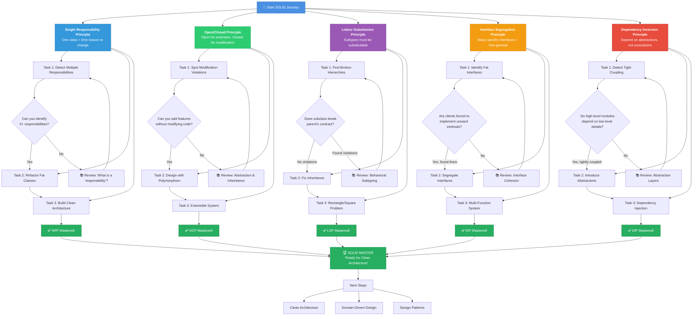
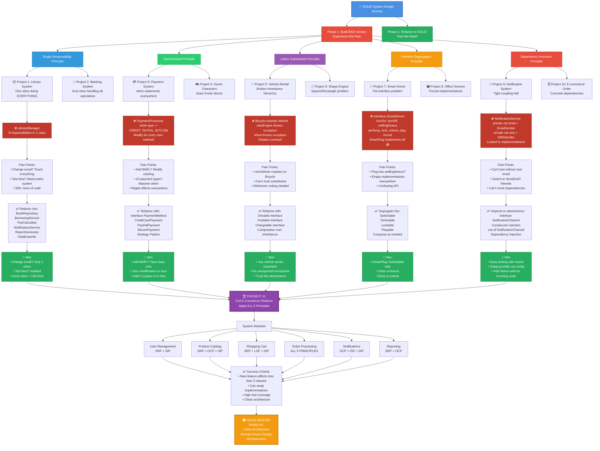

# 🎯 SOLID Principles - System Design Projects (Pure Kotlin)

## 🧠 Learning Strategy
Each project has 2 phases:
1. **BAD VERSION** - Build it violating the principle (understand the pain)
2. **REFACTOR** - Fix it following SOLID (feel the relief)

---

## 1️⃣ Single Responsibility Principle (SRP)
**"A class should have only ONE reason to change"**

### 📦 PROJECT 1: Library Management System
**Difficulty:** Medium

**Requirements:**
Build a library system with these features:
- Add/Remove books from catalog
- Search books by title/author/ISBN
- Borrow/Return books
- Calculate late fees
- Send overdue notifications (email/SMS)
- Generate reports (borrowed books, overdue books)
- Export data to CSV/JSON
- Validate book data (ISBN format, etc.)

**Phase 1 - BAD VERSION:**
Create a single `LibraryManager` class that does EVERYTHING above.

**Phase 2 - REFACTOR:**
Split into separate classes, each with ONE responsibility:
- `BookRepository` - Storage operations
- `BookSearchService` - Search logic
- `BorrowingService` - Borrow/return logic
- `FeeCalculator` - Late fee calculation
- `NotificationService` - Sending notifications
- `ReportGenerator` - Generate reports
- `DataExporter` - Export functionality
- `BookValidator` - Validation logic

**Critical Thinking Questions:**
1. If email provider changes, how many classes need modification?
2. If you add a new report type, what changes?
3. Can you test fee calculation independently?

---

### 🏦 PROJECT 2: Banking Transaction System
**Difficulty:** Hard

**Requirements:**
Build a banking system that handles:
- Account creation/deletion
- Deposits/Withdrawals
- Transfer between accounts
- Transaction history logging
- Fraud detection (simple rules: amount > 10000, multiple rapid transactions)
- Interest calculation for savings accounts
- Account statement generation (PDF/Email)
- Audit trail for compliance
- Currency conversion for international transfers

**Phase 1:** Create `BankingSystem` class doing everything.

**Phase 2:** Refactor following SRP. Design your own class structure!

**Challenge:** Add a new feature "Recurring payments" - should require changes to only 1-2 classes, not the entire system.

---

## 2️⃣ Open/Closed Principle (OCP)
**"Open for extension, Closed for modification"**

### 💳 PROJECT 3: Payment Processing System
**Difficulty:** Medium

**Requirements:**
Build a payment gateway supporting:
- Credit Card (Visa, Mastercard - different validation)
- Debit Card
- PayPal
- Bitcoin
- Bank Transfer
- UPI (India)
- Apple Pay / Google Pay

Each payment method has:
- Different validation rules
- Different processing fees
- Different settlement times
- Different refund policies

**Phase 1 - BAD VERSION:**
```kotlin
class PaymentProcessor {
    fun processPayment(type: String, amount: Double) {
        when (type) {
            "CREDIT_CARD" -> { /* logic */ }
            "PAYPAL" -> { /* logic */ }
            "BITCOIN" -> { /* logic */ }
            // Adding new method requires modifying this class!
        }
    }
}
```

**Phase 2 - REFACTOR:**
Design using:
- Interface: `PaymentMethod`
- Sealed class for payment types
- Strategy pattern
- Each payment method in separate class

**Challenge:** 
1. Add "Buy Now Pay Later" (BNPL) payment WITHOUT modifying existing code
2. Add "Cryptocurrency" category with 5 new coins - should take < 5 minutes

**Critical Questions:**
- Can you add a payment method without recompiling `PaymentProcessor`?
- How do you handle payment method-specific features?

---

### 🎮 PROJECT 4: Game Character System
**Difficulty:** Hard

**Requirements:**
Design RPG character system with:
- Character types: Warrior, Mage, Archer, Rogue, Paladin
- Each has different:
  - Attack calculations (melee, ranged, magic)
  - Defense mechanisms (armor, dodge, shields, magic resist)
  - Special abilities (rage, teleport, stealth, heal)
  - Equipment requirements
  - Level-up bonuses

**Phase 1:** Single `Character` class with giant when/if statements.

**Phase 2:** Design with OCP in mind using:
- Abstract base classes
- Interfaces for behaviors
- Composition over inheritance

**Advanced Challenge:**
1. Add "Dual-class" system (Warrior-Mage hybrid)
2. Add equipment that modifies abilities
3. Add status effects (poison, burn, freeze)

All without modifying existing character classes!

---

## 3️⃣ Liskov Substitution Principle (LSP)
**"Subtypes must be substitutable for their base types"**

### 🚗 PROJECT 5: Vehicle Rental System
**Difficulty:** Medium

**Requirements:**
Build a rental system for:
- Cars (start, stop, accelerate, brake, refuel)
- Electric Cars (start, stop, accelerate, brake, charge - NO refuel!)
- Motorcycles (start, stop, accelerate, brake, refuel)
- Bicycles (start, stop, pedal - NO engine, NO fuel!)
- Scooters (Electric) (start, stop, accelerate, charge)

**Phase 1 - BAD VERSION:**
```kotlin
open class Vehicle {
    open fun startEngine() { }
    open fun refuel() { }
    open fun charge() { }
}

class Bicycle : Vehicle() {
    override fun startEngine() {
        throw UnsupportedOperationException("No engine!")
    }
    override fun refuel() {
        throw UnsupportedOperationException("No fuel!")
    }
}
```

**Phase 2 - REFACTOR:**
Design proper hierarchy where:
- Any `Vehicle` can be used interchangeably
- No methods throw "not supported" exceptions
- Subtypes don't weaken parent contracts

**Hint:** Consider interfaces like `Drivable`, `Fuelable`, `Chargeable`, `Pedaled`

**Critical Test:**
```kotlin
fun rentVehicle(vehicle: Vehicle) {
    vehicle.start()
    vehicle.move()
    vehicle.stop()
    // Should work for ALL vehicles without crashes!
}
```

---

### 📐 PROJECT 6: Shape Rendering Engine
**Difficulty:** Hard

**Requirements:**
Build a geometric engine supporting:
- 2D Shapes: Circle, Rectangle, Triangle, Square
- 3D Shapes: Sphere, Cube, Cylinder, Cone
- Operations: Calculate Area, Perimeter, Volume, Surface Area

**The Trap:**
```kotlin
open class Shape2D(open var width: Double, open var height: Double)

class Square(side: Double) : Shape2D(side, side) {
    override var width: Double
        set(value) {
            field = value
            height = value // 🚨 Breaks expectations!
        }
}
```

**Challenge:** Design hierarchy where Square and Rectangle coexist without LSP violations.

**Critical Questions:**
1. Is Square a subtype of Rectangle in programming?
2. Should 3D shapes inherit from 2D shapes?
3. How to handle shapes with different property requirements?

---

## 4️⃣ Interface Segregation Principle (ISP)
**"Clients shouldn't depend on interfaces they don't use"**

### 🤖 PROJECT 7: Smart Home Automation
**Difficulty:** Medium

**Requirements:**
Design smart device system for:
- Smart Lights (on/off, brightness, color)
- Smart Thermostat (on/off, temperature, mode)
- Smart Lock (lock/unlock, status)
- Smart Speaker (on/off, volume, play/pause, voice commands)
- Security Camera (on/off, record, live stream)
- Smart Plug (on/off only)

**Phase 1 - BAD VERSION:**
```kotlin
interface SmartDevice {
    fun turnOn()
    fun turnOff()
    fun setBrightness(level: Int) // ❌ Not all devices have brightness
    fun setTemperature(temp: Int) // ❌ Only thermostat
    fun lock() // ❌ Only locks
    fun unlock() // ❌ Only locks
    fun play() // ❌ Only speaker
    fun record() // ❌ Only camera
}

class SmartPlug : SmartDevice {
    override fun turnOn() { /* OK */ }
    override fun turnOff() { /* OK */ }
    override fun setBrightness(level: Int) { /* ??? */ }
    override fun setTemperature(temp: Int) { /* ??? */ }
    // ... forced to implement irrelevant methods!
}
```

**Phase 2 - REFACTOR:**
Create small, cohesive interfaces:
- `Switchable`, `Dimmable`, `ColorChangeable`, `Lockable`, `Playable`, `Recordable`, etc.

**Challenge:** Add new device "Smart TV" that is Switchable + Playable + VolumeControlled. Should compose existing interfaces!

---

### 🖨️ PROJECT 8: Document Processing System
**Difficulty:** Hard

**Requirements:**
Build document processor for:
- Scanners (scan only)
- Printers (print only)
- Fax Machines (fax only)
- Photocopiers (print + scan)
- All-in-One (print + scan + fax)
- Network Printers (print + network settings)
- 3D Printers (print 3D models - different from paper)

Features to handle:
- Paper size configuration
- Color/BW mode
- Duplex printing
- Scan resolution
- Network configuration
- Cloud connectivity

**Phase 1:** Fat interface `IOfficeDevice` with ALL methods.

**Phase 2:** Segregate into focused interfaces.

**Advanced:** Add "Mobile Printer" that prints + has battery status. Should reuse existing interfaces!

---

## 5️⃣ Dependency Inversion Principle (DIP)
**"Depend on abstractions, not concretions"**

### 📱 PROJECT 9: Notification System
**Difficulty:** Medium

**Requirements:**
Build notification service supporting:
- Email (SMTP)
- SMS (Twilio API)
- Push Notifications (Firebase)
- Slack
- Discord
- WhatsApp
- Telegram

Features:
- Send to single recipient
- Send to multiple recipients
- Schedule notifications
- Retry on failure
- Notification templates
- Priority levels (urgent, normal, low)

**Phase 1 - BAD VERSION:**
```kotlin
class NotificationService {
    private val emailSender = EmailSender() // 🚨 Tight coupling!
    private val smsSender = SMSSender() // 🚨 Concrete dependency!
    
    fun sendNotification(type: String, message: String) {
        when (type) {
            "EMAIL" -> emailSender.send(message)
            "SMS" -> smsSender.send(message)
        }
    }
}
```

**Phase 2 - REFACTOR:**
- Create `NotificationChannel` interface
- Inject dependencies via constructor
- Use dependency injection principles

```kotlin
interface NotificationChannel {
    fun send(message: Message)
}

class NotificationService(
    private val channels: List<NotificationChannel>
) {
    // Implementation
}
```

**Challenge:** 
1. Add "Microsoft Teams" channel without modifying NotificationService
2. Create multi-channel notification (send via Email AND SMS)
3. Add fallback mechanism (if Email fails, try SMS)

---

### 🗄️ PROJECT 10: E-commerce Order System
**Difficulty:** Hard

**Requirements:**
Build order processing system with:
- Multiple databases (MySQL, PostgreSQL, MongoDB)
- Multiple payment gateways
- Multiple shipping providers (FedEx, UPS, DHL)
- Multiple notification channels
- Multiple inventory systems

**Architecture layers:**
1. **Controller Layer** - Receives orders
2. **Service Layer** - Business logic
3. **Repository Layer** - Data access
4. **External Services** - Payment, Shipping, Notifications

**Phase 1 - BAD VERSION:**
```kotlin
class OrderService {
    private val database = MySQLDatabase() // 🚨 Tight coupling
    private val payment = StripePayment() // 🚨 Can't switch
    private val shipping = FedExAPI() // 🚨 Locked in
}
```

**Phase 2 - REFACTOR:**
Design with dependency inversion:
- Abstract all external dependencies
- Use constructor injection
- Allow swapping implementations at runtime

**Advanced Challenge:**
Build a configuration system where you can switch:
- Database provider via config
- Payment gateway per customer
- Shipping provider per region
- All without code changes!

---

## 🎯 COMPLETE INTEGRATION PROJECT

### 🏪 PROJECT 11: Full E-Commerce Platform (ALL SOLID Principles)
**Difficulty:** Expert

**Apply ALL 5 SOLID principles to build:**

**Modules:**
1. **User Management** (SRP, DIP)
   - Authentication, Registration, Profile
   
2. **Product Catalog** (SRP, OCP, ISP)
   - Products, Categories, Search, Filters
   
3. **Shopping Cart** (SRP, LSP, DIP)
   - Add/Remove items, Calculate totals
   
4. **Order Processing** (ALL 5 principles!)
   - Place order, Payment, Inventory, Shipping
   
5. **Notification System** (OCP, ISP, DIP)
   - Multi-channel notifications
   
6. **Reporting** (SRP, OCP)
   - Sales reports, Inventory reports, Analytics

**Requirements:**
- Must be able to add new product types without modifying core
- Must support multiple payment/shipping providers
- Must be testable (dependency injection)
- Each class has single responsibility
- All interfaces are focused

**Success Criteria:**
1. Adding new feature affects < 3 classes
2. Can swap implementations without recompilation
3. Unit tests cover > 80% code
4. No class > 200 lines
5. No interface > 5 methods

---

## 📊 EVALUATION CHECKLIST

For each project, verify:

### SRP ✅
- [ ] Each class has only ONE reason to change
- [ ] Class names clearly indicate single responsibility
- [ ] Can describe class purpose in one sentence

### OCP ✅
- [ ] Can add features without modifying existing code
- [ ] Uses abstraction (interfaces/abstract classes)
- [ ] New subtypes don't require changing base code

### LSP ✅
- [ ] Subtypes can replace parent without breaking
- [ ] No "not supported" exceptions
- [ ] Preconditions not strengthened, Postconditions not weakened

### ISP ✅
- [ ] No fat interfaces forcing unused implementations
- [ ] Interfaces are focused and cohesive
- [ ] Clients depend only on methods they use

### DIP ✅
- [ ] High-level modules don't depend on low-level modules
- [ ] Both depend on abstractions
- [ ] Dependencies are injected, not instantiated

---

## 🧠 CRITICAL THINKING QUESTIONS

After each project, answer:

1. **What happens when...**
   - A new requirement comes in?
   - You need to change external service?
   - You want to test in isolation?

2. **Design decisions:**
   - Why did you choose interface over abstract class?
   - Why composition over inheritance?
   - Why this class hierarchy?

3. **Trade-offs:**
   - Is your design over-engineered?
   - Is it flexible enough?
   - What's the cognitive load?

---

## 🎓 LEARNING PATH

**Beginner:** Projects 1, 3, 7, 9
**Intermediate:** Projects 2, 4, 6, 8, 10  
**Advanced:** Project 11 (Integration)

**Recommended Order:**
1. Start with SRP (Projects 1-2)
2. Move to OCP (Projects 3-4)
3. Tackle LSP (Projects 5-6)
4. Learn ISP (Projects 7-8)
5. Master DIP (Projects 9-10)
6. Integrate ALL (Project 11)

---

## 💪 CHALLENGE MODE

For each project:
1. ✍️ Draw class diagram BEFORE coding
2. 🧪 Write unit tests for each class
3. 📝 Document WHY design follows principle
4. 🔄 Refactor at least twice
5. 🎯 Add new feature to test extensibility

**Success = Adding new feature takes < 10 minutes and modifies < 2 classes!**





