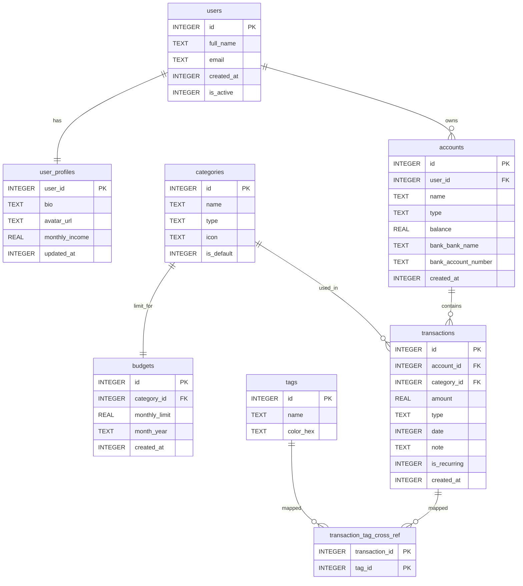
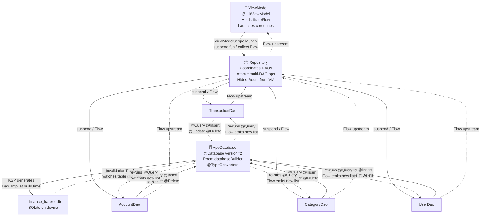
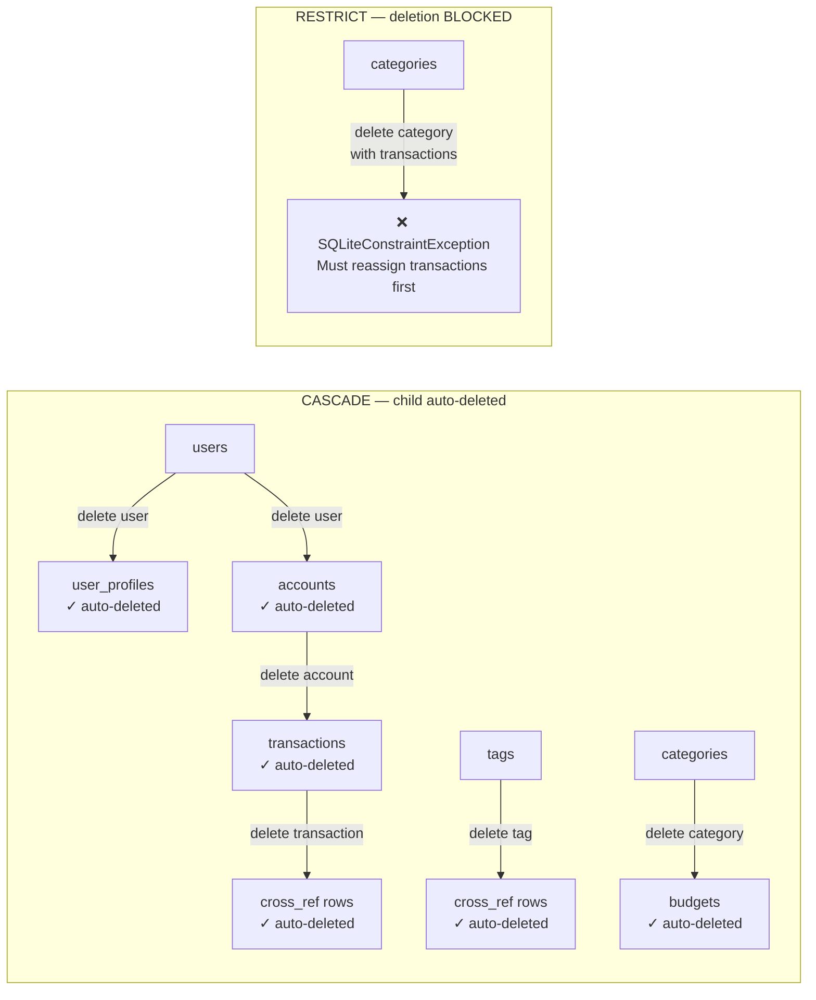
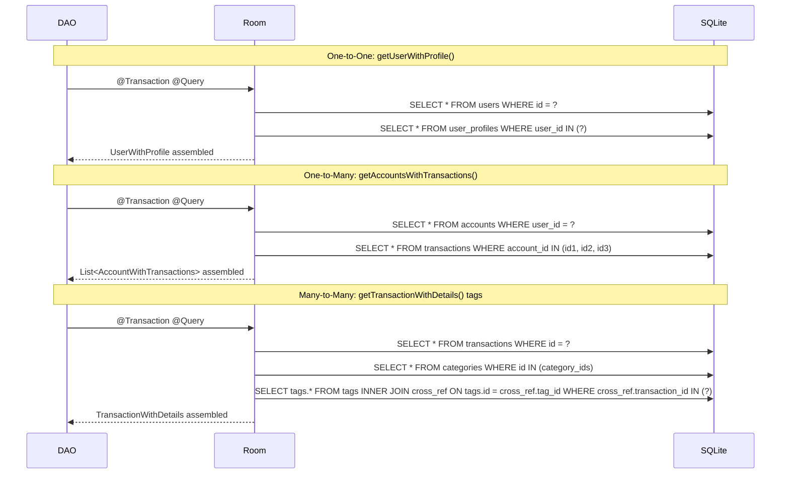

# Finance Tracker — Room Database Project

> **Purpose:** A standalone project file. Every file is production-ready and Hilt-wired. No Composables — you write those. Focus is entirely on the data layer. Every comment explains **WHY**, not just what.

---

## How to Read This File

```
1. Read all 4 diagrams first — understand the system before writing any code
2. Read entities top to bottom — each one explains its own design decisions
3. Read DAOs — every SQL concept from the notes appears here in real context
4. Read Migrations — understand how schema changes survive on real devices
5. Use the Reference Map at the end to find any concept in under 10 seconds
```

---

## ──────────────────────────────────────────

## DIAGRAMS

## ──────────────────────────────────────────

### Diagram 1 — Entity Relationship Diagram (What tables exist and how they link)

> Obsidian renders this natively with the Mermaid plugin (included by default).



---

### Diagram 2 — Architecture / Data Flow (How layers communicate)



---

### Diagram 3 — Delete Cascade Map (What gets deleted when)



---

### Diagram 4 — Room Internal Query Plan (@Relation)

> This shows what Room actually runs behind the scenes for each @Relation type.



---

## ──────────────────────────────────────────

## SECTION 1 — Gradle

## ──────────────────────────────────────────

```kotlin
// build.gradle.kts (app module)
// ─────────────────────────────────────────────────────────────────────────────
// PLUGIN ORDER MATTERS: ksp must come before hilt in the plugins block.
// androidx.room plugin is what enables the schemaDirectory configuration below.

plugins {
    id("com.android.application")
    id("org.jetbrains.kotlin.android")
    id("com.google.devtools.ksp") version "2.0.0-1.0.21"  // KSP, NOT kapt
    id("com.google.dagger.hilt.android")
    id("androidx.room")
}

android {
    // schemaDirectory: after every build, Room writes a JSON file describing
    // the ENTIRE current database schema (all tables, columns, indices, FKs).
    // These files are YOUR migration source of truth.
    // Room reads schemas/1.json and schemas/2.json to auto-generate migration SQL.
    // → ALWAYS commit these JSON files to git. Losing them means losing AutoMigration.
    room {
        schemaDirectory("$projectDir/schemas")
    }
}

dependencies {
    val room_version = "2.8.4"
    val hilt_version = "2.52"

    // room-runtime  → core: @Entity, @Dao, @Database, RoomDatabase
    // room-ktx      → coroutines support: suspend functions, Flow return types
    //                 WITHOUT this, your @Dao can only return LiveData or call-back style
    // room-compiler → KSP annotation processor: reads your @Dao interface at BUILD TIME
    //                 and generates UserDao_Impl.kt, AccountDao_Impl.kt, etc.
    //                 You never write these — Room generates them. They contain all the SQL.
    implementation("androidx.room:room-runtime:$room_version")
    implementation("androidx.room:room-ktx:$room_version")
    ksp("androidx.room:room-compiler:$room_version")       // ksp(), NOT kapt()

    implementation("com.google.dagger:hilt-android:$hilt_version")
    ksp("com.google.dagger:hilt-compiler:$hilt_version")

    implementation("com.google.code.gson:gson:2.10.1")     // for List<T> TypeConverter

    // Testing dependencies
    testImplementation("androidx.room:room-testing:$room_version")
    testImplementation("org.jetbrains.kotlinx:kotlinx-coroutines-test:1.7.3")
    androidTestImplementation("com.google.truth:truth:1.1.5")
}
```

---

## ──────────────────────────────────────────

## SECTION 2 — Enums

## ──────────────────────────────────────────

```kotlin
// data/local/entity/Enums.kt
// ─────────────────────────────────────────────────────────────────────────────
// WHY store enums as String, not as Int ordinal:
//
// Int ordinal approach (BAD):
//   INCOME = 0, EXPENSE = 1  stored as 0, 1
//   If you later add TRANSFER between them → INCOME=0, TRANSFER=1, EXPENSE=2
//   Every existing EXPENSE row in the DB now reads as TRANSFER. Silent data corruption.
//
// String name approach (GOOD):
//   Stored as "INCOME", "EXPENSE" — adding TRANSFER doesn't affect existing rows.
//   Also readable in Android Studio's Database Inspector without a decoder ring.
//
// Conversion is done by TypeConverter (see Converters.kt).

enum class TransactionType { INCOME, EXPENSE }

enum class AccountType { BANK, CASH, CREDIT_CARD }

enum class CategoryType { INCOME, EXPENSE }
```

---

## ──────────────────────────────────────────

## SECTION 3 — Type Converters

## ──────────────────────────────────────────

```kotlin
// data/local/converter/Converters.kt
// ─────────────────────────────────────────────────────────────────────────────
// WHY this class is needed:
// SQLite natively stores only 5 types: INTEGER, REAL, TEXT, BLOB, NULL.
// Kotlin types like Date, Enum<*>, List<T> have no direct SQLite equivalent.
// @TypeConverter tells Room how to convert between your Kotlin type and a
// SQLite-storable type. Room calls these automatically on every read and write.
//
// Registration: @TypeConverters(Converters::class) on @Database applies these
// globally to ALL entities — you register once, Room uses everywhere.

class Converters {

    // ── Date ↔ Long ────────────────────────────────────────────────────────────
    // Date is stored as milliseconds since Unix epoch (Jan 1, 1970 UTC).
    //
    // WHY Long and not a formatted String like "2024-01-15"?
    //   • Long is perfectly sortable: ORDER BY date DESC works correctly
    //   • Long is perfectly filterable: WHERE date BETWEEN 1700000000000 AND 1710000000000
    //   • String "2024-01-15" sorts alphabetically — correct here but fragile
    //   • Long comparison is a CPU integer compare — far faster than string compare
    //   • strftime() in SQLite can convert Long → "YYYY-MM" for GROUP BY (see TransactionDao)
    //
    // The ? (nullable) handles NULL in the database — a row with no date stores NULL,
    // not a crash.
    @TypeConverter
    fun longToDate(value: Long?): Date? = value?.let { Date(it) }

    @TypeConverter
    fun dateToLong(date: Date?): Long? = date?.time


    // ── TransactionType Enum ↔ String ──────────────────────────────────────────
    // runCatching around valueOf() is defensive future-proofing:
    //   Scenario: App v1 has INCOME, EXPENSE.
    //   App v2 removes EXPENSE (bad idea, but happens).
    //   Devices running v1 still have rows with type = "EXPENSE" in the DB.
    //   Without runCatching: valueOf("EXPENSE") throws IllegalArgumentException → app crash.
    //   With runCatching: returns null → you handle null in UI (show "Unknown" etc.)
    //   This prevents a schema mistake from crashing user's app on upgrade.
    @TypeConverter
    fun transactionTypeToString(type: TransactionType?): String? = type?.name

    @TypeConverter
    fun stringToTransactionType(value: String?): TransactionType? =
        value?.let { runCatching { TransactionType.valueOf(it) }.getOrNull() }

    // ── AccountType Enum ↔ String ──────────────────────────────────────────────
    @TypeConverter
    fun accountTypeToString(type: AccountType?): String? = type?.name

    @TypeConverter
    fun stringToAccountType(value: String?): AccountType? =
        value?.let { runCatching { AccountType.valueOf(it) }.getOrNull() }

    // ── CategoryType Enum ↔ String ─────────────────────────────────────────────
    @TypeConverter
    fun categoryTypeToString(type: CategoryType?): String? = type?.name

    @TypeConverter
    fun stringToCategoryType(value: String?): CategoryType? =
        value?.let { runCatching { CategoryType.valueOf(it) }.getOrNull() }
}
```

---

## ──────────────────────────────────────────

## SECTION 4 — Entities

## ──────────────────────────────────────────

### 4.1 UserEntity

```kotlin
// data/local/entity/UserEntity.kt
// ─────────────────────────────────────────────────────────────────────────────
// DESIGN DECISIONS:
//
// tableName = "users" (explicit):
//   If you rename the Kotlin class from UserEntity → AppUser, the DB table stays "users".
//   Without explicit tableName, Room uses the class name → "AppUser" → migration needed.
//   Always name your tables explicitly. It costs nothing and prevents accidental migrations.
//
// email has index = true:
//   Imagine 100,000 users. Finding one by email without an index = scan all 100k rows.
//   With an index = SQLite jumps directly to the matching row. O(n) → O(log n).
//   Index every column you frequently use in WHERE clauses.
//
// is_active has defaultValue = "1":
//   This is required for AutoMigration when you ADD this column to an existing database.
//   SQLite's ALTER TABLE ADD COLUMN cannot add a NOT NULL column without a default.
//   Without defaultValue = "1", Room cannot auto-generate the migration SQL.

@Entity(tableName = "users")
data class UserEntity(

    @PrimaryKey(autoGenerate = true)
    val id: Int = 0,
    // id = 0 is the "unassigned" sentinel value.
    // When you call insertUser(user.copy(id = 0)), Room ignores the 0 and lets SQLite
    // assign the next auto-incremented ID. If id is any non-zero value, Room uses it as-is.
    // This is why all new entities are created with id = 0 as the default.

    @ColumnInfo(name = "full_name")
    val name: String,
    // Kotlin field: name | SQL column: full_name
    // You can freely rename the Kotlin field (just a refactor, no DB change).
    // Renaming the @ColumnInfo name changes the actual column → migration required.

    @ColumnInfo(name = "email", index = true)
    val email: String,

    @ColumnInfo(name = "created_at")
    val createdAt: Long = System.currentTimeMillis(),
    // System.currentTimeMillis() = milliseconds since epoch.
    // Default is set at object creation — Room stores this value as-is.

    @ColumnInfo(name = "is_active", defaultValue = "1")
    val isActive: Boolean = true
    // SQLite stores as INTEGER: true → 1, false → 0.
    // In @Query SQL: WHERE is_active = 1   (NOT WHERE is_active = true)
)
```

---

### 4.2 UserProfileEntity

```kotlin
// data/local/entity/UserProfileEntity.kt
// ─────────────────────────────────────────────────────────────────────────────
// DESIGN DECISIONS:
//
// @PrimaryKey WITHOUT autoGenerate, userId is the PK:
//   This enforces One-to-One at the DATABASE level, not just in Kotlin code.
//   The PK constraint in SQLite guarantees only ONE profile row per userId.
//   If you used autoGenerate = true + a separate profileId, you could accidentally
//   insert two profiles for user 1 — no DB-level protection would stop you.
//   Making userId the PK makes duplication physically impossible in SQLite.
//
// onDelete = CASCADE:
//   Delete users row → user_profiles row is automatically deleted by SQLite.
//   Without CASCADE: you'd need to delete profile manually before user, or
//   you'd get a foreign key violation exception (or worse, an orphan row if FK
//   enforcement is off — which it is by default in SQLite!).
//   Room enables FK enforcement in RoomDatabase.Builder, but always be explicit.
//
// No Index needed on user_id here:
//   user_id IS the primary key. SQLite automatically creates an index for PKs.
//   Adding a second index would be redundant and waste space.

@Entity(
    tableName = "user_profiles",
    foreignKeys = [
        ForeignKey(
            entity      = UserEntity::class,
            parentColumns = ["id"],
            childColumns  = ["user_id"],
            onDelete    = ForeignKey.CASCADE
        )
    ]
)
data class UserProfileEntity(

    @PrimaryKey
    @ColumnInfo(name = "user_id")
    val userId: Int,
    // This field holds the SAME value as UserEntity.id.
    // There is no separate auto-generated ID here.
    // The profile IS the user — one-to-one by design.

    val bio: String = "",

    @ColumnInfo(name = "avatar_url")
    val avatarUrl: String? = null,
    // Nullable String → stored as SQL NULL if not set.
    // In queries: WHERE avatar_url IS NOT NULL (to find users who uploaded a photo)
    // Do NOT use WHERE avatar_url = '' — that would miss NULL rows entirely.

    @ColumnInfo(name = "monthly_income")
    val monthlyIncome: Double = 0.0,

    @ColumnInfo(name = "updated_at")
    val updatedAt: Long = System.currentTimeMillis()
)
```

---

### 4.3 AccountEntity

```kotlin
// data/local/entity/AccountEntity.kt
// ─────────────────────────────────────────────────────────────────────────────
// DESIGN DECISIONS:
//
// @Embedded for BankDetails:
//   BankDetails (bankName, accountNumber) are not a separate entity — they don't
//   need their own table. They are just extra fields on an account.
//   @Embedded flattens them into the same "accounts" table row.
//   prefix = "bank_" prevents column name collision. If BankDetails had a field
//   called "name" without a prefix, it would clash with AccountEntity.name.
//   With prefix: bankDetails.bankName → column "bank_bankName"... actually:
//     the column becomes prefix + fieldName = "bank_" + "bankName" = "bank_bankName"
//   You can inspect this in Database Inspector — you'll see the prefixed columns.
//
// Composite unique Index [user_id, name]:
//   Unique per user — prevents user 1 from having two "HDFC Savings" accounts.
//   User 2 can ALSO have "HDFC Savings" — the uniqueness is scoped per user_id.
//   A global unique index on just [name] would wrongly prevent two different users
//   from having an account with the same name.
//
// Index on user_id alone:
//   Needed for the common query: getAccountsByUser(userId).
//   Without this standalone index, even though [user_id, name] exists as composite,
//   SQLite may not use it efficiently for a simple WHERE user_id = ? query.
//   Rule: always add a standalone index on FK columns.

data class BankDetails(
    val bankName: String = "",
    val accountNumber: String = ""   // store only last 4 digits — never full number
)

@Entity(
    tableName = "accounts",
    foreignKeys = [
        ForeignKey(
            entity        = UserEntity::class,
            parentColumns = ["id"],
            childColumns  = ["user_id"],
            onDelete      = ForeignKey.CASCADE
        )
    ],
    indices = [
        Index("user_id"),                                            // standalone FK index
        Index(value = ["user_id", "name"], unique = true)           // composite unique
    ]
)
data class AccountEntity(

    @PrimaryKey(autoGenerate = true)
    val id: Int = 0,

    @ColumnInfo(name = "user_id")
    val userId: Int,

    val name: String,                   // "HDFC Savings", "Wallet", "SBI Credit"

    val type: AccountType,
    // AccountType enum → stored as "BANK" / "CASH" / "CREDIT_CARD" via TypeConverter.
    // In @Query: WHERE type = 'BANK' (String comparison, not enum comparison).

    val balance: Double = 0.0,
    // Represents CURRENT balance. You update this on every transaction insert.
    // Balance is denormalized here for fast dashboard queries — avoids SUM every time.

    @Embedded(prefix = "bank_")
    val bankDetails: BankDetails = BankDetails(),
    // For CASH or CREDIT_CARD accounts: bankDetails fields will be empty strings.
    // No null needed — empty string default is fine. The prefix columns still exist in the row.

    @ColumnInfo(name = "created_at")
    val createdAt: Long = System.currentTimeMillis()
)
```

---

### 4.4 CategoryEntity

```kotlin
// data/local/entity/CategoryEntity.kt
// ─────────────────────────────────────────────────────────────────────────────
// DESIGN DECISIONS:
//
// WHY categories have no user_id FK (they are global, not per-user):
//   In a personal finance app for one user, categories are shared system-wide.
//   This simplifies the schema. If you need per-user categories in a multi-user
//   scenario, add user_id FK and change Index to: [user_id, name] unique.
//
// is_default flag:
//   The app seeds built-in categories (Food, Rent, Salary, etc.) on first launch.
//   is_default = true → system category → delete button disabled in UI.
//   is_default = false → user-created → user can delete it.
//   This separation means seeding is idempotent: running it again just hits
//   onConflict = IGNORE and does nothing.
//
// unique Index on [name]:
//   Prevents "Food" from existing twice. CategoryDao.insertCategory uses
//   onConflict = IGNORE — so re-seeding default categories silently skips duplicates.

@Entity(
    tableName = "categories",
    indices = [
        Index(value = ["name"], unique = true)
    ]
)
data class CategoryEntity(

    @PrimaryKey(autoGenerate = true)
    val id: Int = 0,

    val name: String,               // "Food", "Rent", "Salary", "Transport", "EMI"

    val type: CategoryType,         // INCOME or EXPENSE → stored as String

    val icon: String = "💰",        // emoji or icon name — TEXT in SQLite

    @ColumnInfo(name = "is_default", defaultValue = "0")
    val isDefault: Boolean = false
    // defaultValue = "0" enables AutoMigration if we add this column to an older schema.
)
```

---

### 4.5 BudgetEntity

```kotlin
// data/local/entity/BudgetEntity.kt
// ─────────────────────────────────────────────────────────────────────────────
// DESIGN DECISIONS:
//
// month_year as String "YYYY-MM" NOT as a timestamp range:
//   Option A (timestamp range): startOfMonth + endOfMonth as two Long columns
//     → GROUP BY becomes: strftime('%Y-%m', start/1000, 'unixepoch') — verbose every query
//     → Comparing months requires date math
//   Option B (String "YYYY-MM"): ← this is what we use
//     → GROUP BY month_year — trivial
//     → ORDER BY month_year DESC — works correctly because YYYY-MM is lexicographically
//       chronological: "2024-12" > "2024-01" → newest first ✓
//     → WHERE month_year = '2024-01' — simple string equality, no date math
//
// One budget per category per month (composite unique index):
//   [category_id, month_year] unique means:
//     Food + 2024-01 can exist ✓
//     Food + 2024-02 can exist ✓  (different month)
//     Food + 2024-01 TWICE → SQLiteConstraintException ✗ (prevented by index)
//
// CASCADE (not RESTRICT) on category deletion:
//   Budget without its category is meaningless data. Auto-delete it.
//   RESTRICT would force the user to manually delete budgets before categories — bad UX.

@Entity(
    tableName = "budgets",
    foreignKeys = [
        ForeignKey(
            entity        = CategoryEntity::class,
            parentColumns = ["id"],
            childColumns  = ["category_id"],
            onDelete      = ForeignKey.CASCADE
        )
    ],
    indices = [
        Index("category_id"),
        Index(value = ["category_id", "month_year"], unique = true)
    ]
)
data class BudgetEntity(

    @PrimaryKey(autoGenerate = true)
    val id: Int = 0,

    @ColumnInfo(name = "category_id")
    val categoryId: Int,

    @ColumnInfo(name = "monthly_limit")
    val monthlyLimit: Double,               // e.g. 5000.0 for a ₹5,000 food budget

    @ColumnInfo(name = "month_year")
    val monthYear: String,                  // "2024-01", "2024-12"

    @ColumnInfo(name = "created_at")
    val createdAt: Long = System.currentTimeMillis()
)
```

---

### 4.6 TransactionEntity

```kotlin
// data/local/entity/TransactionEntity.kt
// ─────────────────────────────────────────────────────────────────────────────
// DESIGN DECISIONS — read this carefully, it has the most depth:
//
// TWO ForeignKeys, TWO different onDelete behaviors:
//
//   account_id → CASCADE:
//     If an account is deleted, every transaction in it is also deleted.
//     A transaction without an account is an orphan — it belongs nowhere and
//     breaks every financial calculation. Cascade is correct and clean here.
//
//   category_id → RESTRICT:
//     If you try to DELETE a category that still has transactions,
//     SQLite throws SQLiteConstraintException and the delete is BLOCKED.
//     WHY? Imagine "Food" has 3 years of transactions.
//     Allowing silent delete would leave those transactions with a dangling
//     category_id pointing to nothing — corrupt financial reports.
//     RESTRICT forces the caller to handle this: reassign transactions to another
//     category first, or show the user an error. This is intentional data protection.
//     → In CategoryDao.deleteCategory(), always wrap in try/catch and show UI error.
//
// FOUR indices (account_id, category_id, date, type):
//   The transactions table will grow to thousands of rows over time.
//   These 4 columns appear in almost every WHERE and ORDER BY we write.
//   Without indices: each query scans every row (O(n)).
//   With indices: SQLite uses a B-tree to find matching rows (O(log n)).
//   At 10,000 transactions, the difference is milliseconds vs seconds.
//   The trade-off: indices slow down INSERTs slightly. For a finance app where
//   reads >> writes, this trade-off strongly favors indexing.
//
// is_recurring has defaultValue = "0":
//   This column was added in version 2 (AutoMigration from v1 → v2).
//   SQLite's ALTER TABLE ADD COLUMN requires a DEFAULT for NOT NULL columns.
//   Without defaultValue, Room cannot generate: ALTER TABLE transactions ADD COLUMN is_recurring INTEGER NOT NULL DEFAULT 0
//   Room would refuse to generate the migration and you'd be stuck.

@Entity(
    tableName = "transactions",
    foreignKeys = [
        ForeignKey(
            entity        = AccountEntity::class,
            parentColumns = ["id"],
            childColumns  = ["account_id"],
            onDelete      = ForeignKey.CASCADE      // delete account → all txns gone
        ),
        ForeignKey(
            entity        = CategoryEntity::class,
            parentColumns = ["id"],
            childColumns  = ["category_id"],
            onDelete      = ForeignKey.RESTRICT     // block category delete if txns exist
        )
    ],
    indices = [
        Index("account_id"),        // WHERE account_id = ?     — very frequent
        Index("category_id"),       // WHERE category_id = ?    — frequent for reports
        Index("date"),              // ORDER BY date DESC        — every list screen
        Index("type")               // WHERE type = 'EXPENSE'   — every filter
    ]
)
data class TransactionEntity(

    @PrimaryKey(autoGenerate = true)
    val id: Int = 0,

    @ColumnInfo(name = "account_id")
    val accountId: Int,

    @ColumnInfo(name = "category_id")
    val categoryId: Int,

    val amount: Double,
    // Always positive. Whether it's income or expense is determined by `type`.
    // Simplifies all SUM and AVG queries — no negative numbers to handle.

    val type: TransactionType,              // "INCOME" or "EXPENSE" — String via TypeConverter

    val date: Long = System.currentTimeMillis(),
    // Epoch milliseconds. Three SQL uses:
    //   ORDER BY date DESC                                     → newest first
    //   WHERE date BETWEEN startMs AND endMs                  → date range filter
    //   strftime('%Y-%m', date/1000, 'unixepoch')             → group by month

    val note: String = "",
    // Free-text note. Searched with LIKE in TransactionDao.searchTransactionsByNote.

    @ColumnInfo(name = "is_recurring", defaultValue = "0")
    val isRecurring: Boolean = false,

    @ColumnInfo(name = "created_at")
    val createdAt: Long = System.currentTimeMillis()
)
```

---

### 4.7 TagEntity

```kotlin
// data/local/entity/TagEntity.kt
// ─────────────────────────────────────────────────────────────────────────────
// Tags are global — not owned by any user or account.
// The Many-to-Many link lives in TransactionTagCrossRef, not here.
// Adding or removing a tag from a transaction only touches the junction table.

@Entity(
    tableName = "tags",
    indices = [Index(value = ["name"], unique = true)]
)
data class TagEntity(

    @PrimaryKey(autoGenerate = true)
    val id: Int = 0,

    val name: String,               // "recurring", "tax-deductible", "urgent", "refund"

    @ColumnInfo(name = "color_hex")
    val colorHex: String = "#6200EE"
)
```

---

### 4.8 TransactionTagCrossRef (Junction Table)

```kotlin
// data/local/entity/TransactionTagCrossRef.kt
// ─────────────────────────────────────────────────────────────────────────────
// This file enables the Many-to-Many relationship between transactions and tags.
//
// WHY this is its own @Entity (not just a helper class):
//   Room's @Entity = "create a real SQLite TABLE for this".
//   Without @Entity, this class is just a Kotlin data class — no table is created.
//   No table = no junction rows = @Relation Many-to-Many crashes at runtime.
//
// WHY primaryKeys = ["transaction_id", "tag_id"] (composite, no autoGenerate):
//   The pair (transactionId=1, tagId=3) should exist AT MOST once.
//   "Tag 3 is applied to Transaction 1" is either true or false — not multiplied.
//   Composite PK is the ONLY way to enforce this at the DB level.
//   An auto-generated id would allow inserting the same pair 100 times — logically wrong.
//
// WHY BOTH FKs use CASCADE:
//   If Transaction #5 is deleted → remove all cross_ref rows where transaction_id = 5.
//     A tag link pointing to a deleted transaction is garbage. Auto-clean it.
//   If Tag "urgent" is deleted → remove all cross_ref rows where tag_id = urgent.
//     A tag link pointing to a deleted tag is garbage. Auto-clean it.
//   In both cases, the junction row without one side is meaningless — cascade is correct.
//
// WHY indices on both FK columns:
//   Cross_ref is queried two ways:
//     WHERE transaction_id = ?  (get all tags for a transaction)
//     WHERE tag_id = ?          (get all transactions for a tag)
//   Both need separate indices for fast lookup.

@Entity(
    tableName = "transaction_tag_cross_ref",
    primaryKeys = ["transaction_id", "tag_id"],
    foreignKeys = [
        ForeignKey(
            entity        = TransactionEntity::class,
            parentColumns = ["id"],
            childColumns  = ["transaction_id"],
            onDelete      = ForeignKey.CASCADE
        ),
        ForeignKey(
            entity        = TagEntity::class,
            parentColumns = ["id"],
            childColumns  = ["tag_id"],
            onDelete      = ForeignKey.CASCADE
        )
    ],
    indices = [
        Index("transaction_id"),
        Index("tag_id")
    ]
)
data class TransactionTagCrossRef(
    @ColumnInfo(name = "transaction_id") val transactionId: Int,
    @ColumnInfo(name = "tag_id") val tagId: Int
)
```

---

## ──────────────────────────────────────────

## SECTION 5 — Relation Classes

## ──────────────────────────────────────────

> **CRITICAL:** None of these are `@Entity`. Room does NOT create tables for them. They are plain Kotlin data classes used ONLY as containers for query results. Room fills them automatically based on `@Embedded` + `@Relation` instructions. Keep them in a separate `/relations` folder to avoid confusion with real entities.

---

### 5.1 UserWithProfile — One-to-One

```kotlin
// data/local/relations/UserWithProfile.kt

// Room generates TWO queries for any DAO method returning this type:
//   Q1 (your @Query): SELECT * FROM users WHERE ...
//   Q2 (auto):        SELECT * FROM user_profiles WHERE user_id IN (ids from Q1)
// Then Room matches rows: user.id ↔ profile.userId
// @Transaction on the DAO method ensures Q1 and Q2 read the same snapshot.
// Without @Transaction: user could be updated between Q1 and Q2 → inconsistent result.

data class UserWithProfile(

    @Embedded
    val user: UserEntity,
    // @Embedded = "all UserEntity columns are in the same result row, map them directly".
    // Room maps column "full_name" → user.name, "is_active" → user.isActive, etc.

    @Relation(
        parentColumn = "id",         // column on UserEntity (the parent/owner)
        entityColumn = "user_id"     // column on UserProfileEntity (the child)
        // Room reads: "for each loaded user, find profile rows where user_profiles.user_id = users.id"
    )
    val profile: UserProfileEntity?
    // Nullable — a user might exist before they complete their profile.
)
```

---

### 5.2 CategoryWithBudget — One-to-One

```kotlin
// data/local/relations/CategoryWithBudget.kt

data class CategoryWithBudget(
    @Embedded val category: CategoryEntity,
    @Relation(
        parentColumn = "id",
        entityColumn = "category_id"
    )
    val budget: BudgetEntity?
    // Nullable — category might not have a budget set for the current month.
    // Call site: if (cwb.budget == null) → show "No budget set" in UI.
)
```

---

### 5.3 AccountWithTransactions — One-to-Many

```kotlin
// data/local/relations/AccountWithTransactions.kt

// HOW Room avoids N+1 problem:
//   WRONG (N+1): accounts.forEach { dao.getTransactions(it.id) }
//     → 1 query for accounts + N queries for N accounts = N+1 queries total.
//     → With 20 accounts: 21 queries. With 100 accounts: 101 queries. Scales badly.
//
//   CORRECT (@Relation): Room does this internally:
//     Q1: SELECT * FROM accounts WHERE user_id = ?
//     Q2: SELECT * FROM transactions WHERE account_id IN (id1, id2, id3, ...)
//     → Always exactly 2 queries regardless of account count.

data class AccountWithTransactions(
    @Embedded val account: AccountEntity,
    @Relation(
        parentColumn = "id",
        entityColumn = "account_id"
    )
    val transactions: List<TransactionEntity>
    // Non-nullable List — empty list if account has zero transactions.
)
```

---

### 5.4 TransactionWithDetails — Mixed Relationships

```kotlin
// data/local/relations/TransactionWithDetails.kt

// This class combines TWO different relationship types in one result:
//   1. Many-to-One with CategoryEntity (treated as One-to-One @Relation here)
//   2. Many-to-Many with TagEntity via TransactionTagCrossRef junction
//
// Room generates THREE queries total for a DAO method returning this type:
//   Q1: your @Query on transactions
//   Q2: SELECT * FROM categories WHERE id IN (category_ids from Q1)
//   Q3: SELECT tags.* FROM tags
//       INNER JOIN transaction_tag_cross_ref ON tags.id = cross_ref.tag_id
//       WHERE cross_ref.transaction_id IN (transaction_ids from Q1)
// All 3 queries run inside @Transaction — consistent snapshot guaranteed.

data class TransactionWithDetails(

    @Embedded
    val transaction: TransactionEntity,

    // One category per transaction.
    // parentColumn = "category_id": the FK column ON the transaction (not its PK "id").
    // entityColumn = "id": the PK column on CategoryEntity.
    // Room: "find categories where category.id = transaction.category_id"
    @Relation(
        parentColumn = "category_id",
        entityColumn = "id"
    )
    val category: CategoryEntity?,
    // Nullable — should never be null in practice (RESTRICT prevents orphaning),
    // but defensive nullable is safer than a non-null crash.

    // Many tags per transaction, via junction table.
    // Junction tells Room: "go through transaction_tag_cross_ref to find tags".
    // parentColumn in Junction = which cross_ref column holds the transaction id.
    // entityColumn in Junction = which cross_ref column holds the tag id.
    @Relation(
        parentColumn = "id",
        entityColumn = "id",
        associateBy = Junction(
            value         = TransactionTagCrossRef::class,
            parentColumn  = "transaction_id",
            entityColumn  = "tag_id"
        )
    )
    val tags: List<TagEntity>
    // Empty list if transaction has no tags. Never null.
)
```

---

### 5.5 UserWithAccountsAndTransactions — 3-Level Nested

```kotlin
// data/local/relations/UserWithAccountsAndTransactions.kt

// 3 levels: User → List<Account> → each Account has List<Transaction>
//
// Room runs EXACTLY 3 queries (not N+1, not N*M):
//   Q1: SELECT * FROM users WHERE ...
//   Q2: SELECT * FROM accounts WHERE user_id IN (user_ids from Q1)
//   Q3: SELECT * FROM transactions WHERE account_id IN (account_ids from Q2)
// Then Room assembles the full nested structure in memory. Efficient.
//
// entity = AccountEntity::class is MANDATORY for nested @Relation.
// Without it: Room sees List<AccountWithTransactions> and cannot determine
// which @Entity table to query for the outer list. It needs the hint.

data class UserWithAccountsAndTransactions(
    @Embedded val user: UserEntity,
    @Relation(
        parentColumn = "id",
        entityColumn = "user_id",
        entity       = AccountEntity::class     // required for nested @Relation
    )
    val accounts: List<AccountWithTransactions>
)
```

---

## ──────────────────────────────────────────

## SECTION 6 — DAOs

## ──────────────────────────────────────────

### 6.1 UserDao

```kotlin
// data/local/dao/UserDao.kt

@Dao
interface UserDao {

    // ── INSERT ─────────────────────────────────────────────────────────────────

    @Insert(onConflict = OnConflictStrategy.REPLACE)
    suspend fun insertUser(user: UserEntity): Long
    // REPLACE strategy: if a row with the same PK already exists,
    // SQLite deletes the old row and inserts the new one.
    // Safe here because UserEntity has no FK children IN this DAO context.
    // Returns: the newly assigned row ID (Long). Cast to Int for further use.

    @Insert(onConflict = OnConflictStrategy.REPLACE)
    suspend fun insertUsers(users: List<UserEntity>): List<Long>
    // Room wraps batch insert in a SINGLE SQLite transaction automatically.
    // 100 inserts = 1 transaction instead of 100. Orders of magnitude faster.
    // Always prefer batch insert over calling insertUser in a loop.

    @Insert(onConflict = OnConflictStrategy.IGNORE)
    suspend fun insertProfile(profile: UserProfileEntity): Long
    // IGNORE: if a profile for this userId already exists, skip silently.
    // Returns -1 if ignored (row already existed), positive Long if inserted.
    // WHY not REPLACE here: REPLACE = DELETE + INSERT.
    // Replacing a profile would wipe the existing bio/avatar. Ignore is safer on first insert.

    // ── UPSERT ─────────────────────────────────────────────────────────────────

    @Upsert
    suspend fun upsertProfile(profile: UserProfileEntity)
    // @Upsert (Room 2.5+) = try INSERT, if PK conflict then UPDATE in-place.
    // WHY not @Insert(REPLACE) here: REPLACE does DELETE + INSERT (two operations).
    // DELETE triggers CASCADE → if anything cascades from profile, it's wiped.
    // @Upsert does UPDATE → no delete, no cascade risk, existing data preserved.
    // Rule: use @Upsert whenever the entity has FK children or you want safe update.

    // ── UPDATE ─────────────────────────────────────────────────────────────────

    @Update
    suspend fun updateUser(user: UserEntity): Int
    // Uses PK to find the row. Updates ALL non-PK columns.
    // Generated SQL: UPDATE users SET full_name=?, email=?, created_at=?, is_active=? WHERE id=?
    // Returns: rows affected. 0 = user not found. 1 = updated successfully.
    // Use when you have the FULL entity and want to save all field changes.

    @Query("UPDATE users SET is_active = :isActive WHERE id = :userId")
    suspend fun setUserActive(userId: Int, isActive: Boolean)
    // Partial update — only is_active changes. Does NOT load the entity first.
    // More efficient than @Update when you're only changing one column.
    // Generated SQL: UPDATE users SET is_active = ? WHERE id = ?

    // ── DELETE ─────────────────────────────────────────────────────────────────

    @Delete
    suspend fun deleteUser(user: UserEntity): Int
    // Room uses ONLY the primary key (id) from the passed object. Other fields ignored.
    // Generated SQL: DELETE FROM users WHERE id = ?
    // Cascades automatically: user_profiles and accounts rows are auto-deleted by SQLite.

    // ── SELECT — SINGLE RECORD ─────────────────────────────────────────────────

    @Query("SELECT * FROM users WHERE id = :userId")
    suspend fun getUserById(userId: Int): UserEntity?
    // suspend (not Flow) → one-shot read. Good for: "load user on profile screen open".
    // Returns null if no user with this ID exists. Always handle the null case.

    // ── SELECT — COLLECTIONS ───────────────────────────────────────────────────

    @Query("SELECT * FROM users ORDER BY full_name ASC")
    fun getAllUsers(): Flow<List<UserEntity>>
    // Flow (not suspend) → reactive stream. Room re-emits whenever the users table changes.
    // WHY WhileSubscribed(5000): in ViewModel, use stateIn(WhileSubscribed(5000L)).
    // The 5000ms keeps the upstream query alive for 5 seconds after the last subscriber
    // disappears — handles screen rotation without restarting the query.

    @Query("SELECT * FROM users WHERE is_active = 1 ORDER BY full_name ASC")
    fun getActiveUsers(): Flow<List<UserEntity>>
    // Boolean stored as INTEGER. In SQL: compare to 1 (true) or 0 (false).
    // is_active = 1 → true. is_active = 0 → false.
    // Never write WHERE is_active = true — SQLite doesn't have a boolean type keyword.

    @Query("SELECT COUNT(*) FROM users")
    suspend fun getUserCount(): Int
    // COUNT(*) = count all rows. COUNT(column) = count non-NULL values in that column.
    // For total row count, always use COUNT(*).

    @Query("SELECT * FROM users WHERE full_name LIKE :query OR email LIKE :query")
    fun searchUsers(query: String): Flow<List<UserEntity>>
    // LIKE with wildcards: '%term%' matches "term" appearing anywhere in the string.
    // Usage: userDao.searchUsers("%${searchInput.trim()}%")
    // WHY reactive Flow: search results update as the user table changes.
    // Case: another coroutine adds a new user while search is active → results auto-update.

    // ── SELECT — RELATIONSHIPS ─────────────────────────────────────────────────

    @Transaction
    @Query("SELECT * FROM users WHERE id = :userId")
    suspend fun getUserWithProfile(userId: Int): UserWithProfile?
    // @Transaction is NON-NEGOTIABLE with @Relation. Here's why:
    // Without @Transaction, Room runs Q1 and Q2 as independent queries.
    // Between Q1 and Q2, another thread could INSERT/UPDATE/DELETE users or profiles.
    // Result: UserEntity from state A, UserProfileEntity from state B → inconsistent.
    // @Transaction wraps both in a single SQLite transaction → consistent snapshot.

    @Transaction
    @Query("SELECT * FROM users WHERE is_active = 1 ORDER BY full_name ASC")
    fun getAllActiveUsersWithProfiles(): Flow<List<UserWithProfile>>

    @Transaction
    @Query("SELECT * FROM users WHERE id = :userId")
    suspend fun getUserWithAccountsAndTransactions(userId: Int): UserWithAccountsAndTransactions?
    // Room runs 3 batched queries. Never N+1. See UserWithAccountsAndTransactions.kt.
}
```

---

### 6.2 AccountDao

```kotlin
// data/local/dao/AccountDao.kt

@Dao
interface AccountDao {

    @Insert(onConflict = OnConflictStrategy.REPLACE)
    suspend fun insertAccount(account: AccountEntity): Long

    @Insert(onConflict = OnConflictStrategy.REPLACE)
    suspend fun insertAccounts(accounts: List<AccountEntity>): List<Long>

    @Update
    suspend fun updateAccount(account: AccountEntity): Int

    @Delete
    suspend fun deleteAccount(account: AccountEntity): Int
    // Cascade: SQLite auto-deletes all transactions for this account.

    @Query("SELECT * FROM accounts WHERE user_id = :userId ORDER BY name ASC")
    fun getAccountsByUser(userId: Int): Flow<List<AccountEntity>>

    @Query("SELECT * FROM accounts WHERE user_id = :userId AND type = :type ORDER BY name ASC")
    fun getAccountsByType(userId: Int, type: String): Flow<List<AccountEntity>>
    // Usage: getAccountsByType(userId, AccountType.BANK.name)
    // type is stored as String → compare to String, NOT to enum directly.

    @Query("SELECT * FROM accounts WHERE id = :accountId")
    suspend fun getAccountById(accountId: Int): AccountEntity?

    @Query("SELECT * FROM accounts WHERE id IN (:accountIds)")
    suspend fun getAccountsByIds(accountIds: List<Int>): List<AccountEntity>
    // Room expands List<Int> into SQL: WHERE id IN (?, ?, ?)
    // Each ? is bound separately. Prevents SQL injection. One query for N ids.

    @Query("SELECT COUNT(*) FROM accounts WHERE user_id = :userId")
    suspend fun getAccountCount(userId: Int): Int

    @Query("SELECT SUM(balance) FROM accounts WHERE user_id = :userId")
    suspend fun getTotalBalance(userId: Int): Double?
    // SUM() returns NULL (not 0) when no rows match. Return type is Double? (nullable).
    // Handle in repository: val total = accountDao.getTotalBalance(userId) ?: 0.0

    @Query("UPDATE accounts SET balance = :newBalance WHERE id = :accountId")
    suspend fun updateBalance(accountId: Int, newBalance: Double)
    // Partial update — only balance. More efficient than @Update on the full entity.
    // Call this every time a transaction is inserted or deleted for this account.

    // GROUP BY — one row per account type, with summed balance.
    // SQL execution order: FROM → WHERE → GROUP BY → SELECT → ORDER BY
    // Result: [TypeBalance("BANK", 85000.0), TypeBalance("CREDIT_CARD", -12000.0)]
    @Query("""
        SELECT type, SUM(balance) AS total
        FROM accounts
        WHERE user_id = :userId
        GROUP BY type
        ORDER BY total DESC
    """)
    suspend fun getBalanceSummaryByType(userId: Int): List<TypeBalance>

    @Transaction
    @Query("SELECT * FROM accounts WHERE user_id = :userId ORDER BY name ASC")
    fun getAccountsWithTransactions(userId: Int): Flow<List<AccountWithTransactions>>
}

// Result holder for getBalanceSummaryByType.
// SQL alias "AS total" MUST match the field name "total" exactly.
// Field name mismatch = Room returns 0.0 for that field silently — no crash, wrong data.
data class TypeBalance(
    val type: String,   // "BANK", "CASH", "CREDIT_CARD"
    val total: Double
)
```

---

### 6.3 CategoryDao

```kotlin
// data/local/dao/CategoryDao.kt

@Dao
interface CategoryDao {

    @Insert(onConflict = OnConflictStrategy.IGNORE)
    suspend fun insertCategory(category: CategoryEntity): Long
    // IGNORE: used for seeding default categories on first app launch.
    // On subsequent launches, the same insert silently skips (returns -1).
    // This makes seeding idempotent — safe to call on every app start.

    @Insert(onConflict = OnConflictStrategy.IGNORE)
    suspend fun insertCategories(categories: List<CategoryEntity>): List<Long>

    @Upsert
    suspend fun upsertCategory(category: CategoryEntity): Long
    // For user-created category editing. @Upsert safely inserts new or updates existing.

    @Delete
    suspend fun deleteCategory(category: CategoryEntity): Int
    // ⚠️ WARNING: This THROWS SQLiteConstraintException if any transaction
    // references this category (onDelete = RESTRICT on TransactionEntity.category_id).
    // ALWAYS wrap in try/catch at the call site. Show the user a helpful error:
    // "Cannot delete 'Food' — it has 47 transactions. Reassign them first."

    @Query("SELECT * FROM categories ORDER BY name ASC")
    fun getAllCategories(): Flow<List<CategoryEntity>>

    @Query("SELECT * FROM categories WHERE type = :type ORDER BY name ASC")
    fun getCategoriesByType(type: String): Flow<List<CategoryEntity>>
    // Usage: getCategoriesByType(CategoryType.EXPENSE.name)

    @Query("SELECT * FROM categories WHERE is_default = 1 ORDER BY name ASC")
    suspend fun getDefaultCategories(): List<CategoryEntity>
    // One-shot (suspend, not Flow) — default categories are seeded once, never change.

    @Query("SELECT * FROM categories WHERE id = :id")
    suspend fun getCategoryById(id: Int): CategoryEntity?

    @Transaction
    @Query("SELECT * FROM categories ORDER BY name ASC")
    fun getAllCategoriesWithBudgets(): Flow<List<CategoryWithBudget>>

    @Transaction
    @Query("SELECT * FROM categories WHERE id = :categoryId")
    suspend fun getCategoryWithBudget(categoryId: Int): CategoryWithBudget?

    // NOT IN with subquery — find categories that have NO budget set for a given month.
    // Inner SELECT returns: [3, 5, 7] — category_ids that DO have a budget for monthYear.
    // Outer WHERE: id NOT IN (3, 5, 7) — categories that DON'T have a budget yet.
    // Use case: show the user which categories still need a budget set for this month.
    // SQL execution: inner SELECT runs first (once), outer WHERE filters using its result.
    @Query("""
        SELECT * FROM categories
        WHERE type = 'EXPENSE'
        AND id NOT IN (
            SELECT category_id FROM budgets WHERE month_year = :monthYear
        )
        ORDER BY name ASC
    """)
    suspend fun getCategoriesWithoutBudgetForMonth(monthYear: String): List<CategoryEntity>
}
```

---

### 6.4 TransactionDao — The Core DAO

```kotlin
// data/local/dao/TransactionDao.kt
// ─────────────────────────────────────────────────────────────────────────────
// This is the most important DAO — every SQL concept from the notes is used here.
// Read this file top to bottom. Every function has a comment explaining:
//   • What SQL concept it demonstrates
//   • WHY the query is written this specific way
//   • What the generated SQL looks like

@Dao
interface TransactionDao {

    // ── WRITE OPERATIONS ───────────────────────────────────────────────────────

    @Insert(onConflict = OnConflictStrategy.REPLACE)
    suspend fun insertTransaction(transaction: TransactionEntity): Long

    @Insert(onConflict = OnConflictStrategy.REPLACE)
    suspend fun insertTransactions(transactions: List<TransactionEntity>): List<Long>
    // Batch insert in ONE transaction. Use for import/restore features.
    // 1000 imports = 1 transaction = fast. Never loop insertTransaction 1000 times.

    @Upsert
    suspend fun upsertTransaction(transaction: TransactionEntity): Long
    // Safe for sync from a backend — insert if new, update if already exists locally.

    @Update
    suspend fun updateTransaction(transaction: TransactionEntity): Int

    @Delete
    suspend fun deleteTransaction(transaction: TransactionEntity): Int

    @Query("DELETE FROM transactions WHERE account_id = :accountId")
    suspend fun deleteAllForAccount(accountId: Int)
    // Direct SQL delete — more efficient than loading all entities then calling @Delete.
    // Generated SQL: DELETE FROM transactions WHERE account_id = ?

    // Junction table write operations for Many-to-Many tag assignment.
    @Insert(onConflict = OnConflictStrategy.IGNORE)
    suspend fun addTagToTransaction(crossRef: TransactionTagCrossRef)
    // IGNORE: if this tag is already applied, do nothing. Idempotent.
    // Used in repository's addTransactionWithTags() inside db.withTransaction().

    @Delete
    suspend fun removeTagFromTransaction(crossRef: TransactionTagCrossRef)
    // Removes one specific tag from one specific transaction (uses composite PK).

    @Query("DELETE FROM transaction_tag_cross_ref WHERE transaction_id = :transactionId")
    suspend fun removeAllTagsFromTransaction(transactionId: Int)
    // Clears all tags from a transaction. Use before re-applying a new tag set on edit.

    // ── SELECT — BASIC FILTERS ─────────────────────────────────────────────────

    @Query("SELECT * FROM transactions WHERE id = :id")
    suspend fun getTransactionById(id: Int): TransactionEntity?

    // WHERE account_id + ORDER BY date DESC
    // date column is indexed → ORDER BY on an indexed column is very fast.
    // Flow → reactive: screen updates automatically when any transaction is added/changed.
    @Query("""
        SELECT * FROM transactions
        WHERE account_id = :accountId
        ORDER BY date DESC
    """)
    fun getTransactionsForAccount(accountId: Int): Flow<List<TransactionEntity>>

    // WHERE with AND — multiple conditions.
    // Both account_id and type are indexed → SQLite uses index intersection.
    // Generated SQL: WHERE account_id = ? AND type = ?
    @Query("""
        SELECT * FROM transactions
        WHERE account_id = :accountId
          AND type = :type
        ORDER BY date DESC
    """)
    fun getTransactionsByType(accountId: Int, type: String): Flow<List<TransactionEntity>>
    // Usage: getTransactionsByType(accountId, TransactionType.EXPENSE.name)

    // WHERE with BETWEEN for date range filtering.
    // BETWEEN is inclusive: date >= startDate AND date <= endDate.
    // date is indexed → range scan on index, not full table scan.
    // Usage: getTransactionsByDateRange(accountId, startOfMonth, endOfMonth)
    //   where startOfMonth/endOfMonth are epoch milliseconds.
    @Query("""
        SELECT * FROM transactions
        WHERE account_id = :accountId
          AND date BETWEEN :startDate AND :endDate
        ORDER BY date DESC
    """)
    fun getTransactionsByDateRange(
        accountId: Int,
        startDate: Long,
        endDate: Long
    ): Flow<List<TransactionEntity>>

    // WHERE with LIKE — substring search on the note column.
    // '%term%' matches "term" anywhere inside the note string.
    // note is NOT indexed → full table scan on note values.
    // For large tables: consider FTS (Full-Text Search) extension for better performance.
    // Usage: searchTransactionsByNote(accountId, "%${input.trim()}%")
    @Query("""
        SELECT * FROM transactions
        WHERE account_id = :accountId
          AND note LIKE :query
        ORDER BY date DESC
    """)
    fun searchTransactionsByNote(accountId: Int, query: String): Flow<List<TransactionEntity>>

    // WHERE with boolean column comparison.
    // is_recurring stored as INTEGER. SQL comparison: = 1 for true, = 0 for false.
    // Do NOT write: WHERE is_recurring = true ← not valid SQLite syntax.
    @Query("""
        SELECT * FROM transactions
        WHERE is_recurring = 1
        ORDER BY date DESC
    """)
    fun getRecurringTransactions(): Flow<List<TransactionEntity>>

    // LIMIT + OFFSET — manual pagination.
    // Page N: offset = (N - 1) * pageSize
    //   Page 1: LIMIT 20 OFFSET 0   → rows 1–20
    //   Page 2: LIMIT 20 OFFSET 20  → rows 21–40
    //   Page 3: LIMIT 20 OFFSET 40  → rows 41–60
    // Note: OFFSET becomes slower as it grows — SQLite still reads and discards skipped rows.
    // For better performance on large datasets: use keyset pagination (WHERE date < lastSeenDate).
    @Query("""
        SELECT * FROM transactions
        WHERE account_id = :accountId
        ORDER BY date DESC
        LIMIT :pageSize OFFSET :offset
    """)
    suspend fun getTransactionsPaged(
        accountId: Int,
        pageSize: Int,
        offset: Int
    ): List<TransactionEntity>

    // ── SELECT — AGGREGATE QUERIES ─────────────────────────────────────────────

    // SUM with COALESCE for null safety.
    // SUM() returns SQL NULL (not 0) when zero rows match the WHERE condition.
    // Example: account with no INCOME transactions → SUM = NULL, not 0.0.
    // COALESCE(x, fallback) = returns x if x is not null, otherwise returns fallback.
    // → COALESCE(SUM(amount), 0.0) always returns a Double, never null.
    // The return type is Double (not Double?), so callers don't need null handling.
    @Query("""
        SELECT COALESCE(SUM(amount), 0.0)
        FROM transactions
        WHERE account_id = :accountId AND type = 'INCOME'
    """)
    suspend fun getTotalIncome(accountId: Int): Double

    @Query("""
        SELECT COALESCE(SUM(amount), 0.0)
        FROM transactions
        WHERE account_id = :accountId AND type = 'EXPENSE'
    """)
    suspend fun getTotalExpense(accountId: Int): Double

    // Multiple aggregates + CASE WHEN in ONE query — most efficient approach.
    //
    // CASE WHEN type = 'INCOME' THEN amount ELSE 0 END:
    //   For each row: if this row is INCOME, use its amount; otherwise use 0.
    //   SUM of these values = sum of only INCOME amounts. Effectively a conditional sum.
    //   Same trick for EXPENSE → two totals from one table scan.
    //
    // Without CASE WHEN: you'd need 2 separate queries (getTotalIncome + getTotalExpense).
    // With CASE WHEN: 1 query, 1 table scan, both totals in one round trip.
    //
    // SQL alias rule: "AS totalCount" → field name in data class MUST be "totalCount".
    // Mismatch = Room maps 0 silently. No error. Wrong data. Always double-check aliases.
    @Query("""
        SELECT
            COUNT(*)                                                                  AS totalCount,
            COALESCE(SUM(CASE WHEN type = 'INCOME'  THEN amount ELSE 0 END), 0.0)   AS totalIncome,
            COALESCE(SUM(CASE WHEN type = 'EXPENSE' THEN amount ELSE 0 END), 0.0)   AS totalExpense,
            COALESCE(AVG(amount), 0.0)                                               AS avgAmount,
            COALESCE(MAX(amount), 0.0)                                               AS maxAmount,
            COALESCE(MIN(amount), 0.0)                                               AS minAmount
        FROM transactions
        WHERE account_id = :accountId
    """)
    suspend fun getAccountStats(accountId: Int): AccountStats

    // GROUP BY with strftime date function — monthly spending summary.
    //
    // date is stored as epoch milliseconds. SQLite's date functions expect seconds.
    // date / 1000 → converts milliseconds to seconds (integer division, truncates).
    // strftime('%Y-%m', secondsValue, 'unixepoch') → formats as "2024-01".
    //
    // GROUP BY month → all transactions in January 2024 grouped together.
    // SUM(amount) per group → total spending for that month.
    // ORDER BY month DESC → most recent months first.
    //
    // Result example: [MonthlyTotal("2024-03", 8200.0, 34), MonthlyTotal("2024-02", 5100.0, 22)]
    @Query("""
        SELECT
            strftime('%Y-%m', date / 1000, 'unixepoch') AS month,
            COALESCE(SUM(amount), 0.0)                  AS total,
            COUNT(*)                                     AS count
        FROM transactions
        WHERE account_id = :accountId AND type = 'EXPENSE'
        GROUP BY month
        ORDER BY month DESC
    """)
    suspend fun getMonthlyExpenseSummary(accountId: Int): List<MonthlyTotal>

    // GROUP BY category — spending breakdown per category in a date range.
    // ORDER BY total DESC → highest spending category first (for pie chart / report).
    // Result: [(Food, 6500.0, 45), (Transport, 2200.0, 12), (Rent, 15000.0, 1)]
    @Query("""
        SELECT
            category_id                AS categoryId,
            COALESCE(SUM(amount), 0.0) AS total,
            COUNT(*)                   AS transactionCount
        FROM transactions
        WHERE type = 'EXPENSE'
          AND date BETWEEN :startDate AND :endDate
        GROUP BY category_id
        ORDER BY total DESC
    """)
    suspend fun getExpensesByCategory(startDate: Long, endDate: Long): List<CategorySpending>

    // GROUP BY + HAVING — filter groups, not rows.
    //
    // KEY DISTINCTION (common interview question):
    //   WHERE  → filters INDIVIDUAL ROWS before grouping (runs on raw data)
    //   HAVING → filters GROUPS after grouping    (runs on aggregated data)
    //
    // SQL execution order for this query:
    //   1. FROM transactions               → access table
    //   2. WHERE type = 'EXPENSE'          → keep only expense rows
    //   3. GROUP BY category_id            → bundle rows by category
    //   4. HAVING total >= :minAmount      → discard groups with total < minAmount
    //   5. SELECT category_id, SUM, COUNT  → compute output columns
    //   6. ORDER BY total DESC             → sort remaining groups
    //
    // You CANNOT use WHERE total >= :minAmount because `total` (the alias for SUM)
    // doesn't exist until AFTER the GROUP BY step. HAVING runs after GROUP BY → it can see it.
    @Query("""
        SELECT
            category_id                AS categoryId,
            COALESCE(SUM(amount), 0.0) AS total,
            COUNT(*)                   AS transactionCount
        FROM transactions
        WHERE type = 'EXPENSE'
        GROUP BY category_id
        HAVING total >= :minAmount
        ORDER BY total DESC
    """)
    suspend fun getTopSpendingCategories(minAmount: Double): List<CategorySpending>

    // ── SELECT — JOIN QUERIES ──────────────────────────────────────────────────

    // INNER JOIN — transactions enriched with category name/icon in one query.
    //
    // WHY use INNER JOIN here instead of @Relation?
    //   @Relation loads the FULL CategoryEntity for every transaction.
    //   This query selects only 3 category fields we actually need for display.
    //   On a list of 500 transactions: @Relation loads 500 * (all category columns).
    //   This JOIN loads 500 * (3 category columns). Less data = faster.
    //
    // INNER JOIN vs LEFT JOIN:
    //   INNER JOIN = only rows where both sides match. Transactions with no category → excluded.
    //   LEFT JOIN  = all rows from left (transactions) even if no match on right.
    //   Here: every transaction SHOULD have a category (RESTRICT ensures this).
    //   INNER JOIN is correct and slightly faster. If data is corrupt (no category), the
    //   transaction is excluded from results — better than showing broken data.
    //
    // Table alias: "t" for transactions, "c" for categories → avoids ambiguous column names.
    // Without aliases, "id" is ambiguous — SQLite doesn't know t.id or c.id.
    @Query("""
        SELECT
            t.id,
            t.account_id    AS accountId,
            t.amount,
            t.type,
            t.date,
            t.note,
            t.is_recurring  AS isRecurring,
            c.name          AS categoryName,
            c.icon          AS categoryIcon,
            c.type          AS categoryType
        FROM transactions t
        INNER JOIN categories c ON t.category_id = c.id
        WHERE t.account_id = :accountId
        ORDER BY t.date DESC
    """)
    suspend fun getTransactionsWithCategoryInfo(accountId: Int): List<TransactionWithCategoryInfo>

    // LEFT JOIN with GROUP BY — account summary including accounts with ZERO transactions.
    //
    // LEFT JOIN vs INNER JOIN difference shown clearly:
    //   accounts table:     [id=1 HDFC] [id=2 Wallet] [id=3 SBI Credit]
    //   transactions table: [account_id=1, ...] [account_id=1, ...]   (no rows for id=2, id=3)
    //
    //   INNER JOIN result: only account 1 (HDFC) appears. Wallet and SBI Credit are excluded.
    //   LEFT JOIN result:  all 3 accounts appear. Wallet and SBI Credit have NULL for t.* columns.
    //
    // COUNT(t.id) vs COUNT(*):
    //   For accounts with no transactions: t.id is NULL (LEFT JOIN).
    //   COUNT(t.id) = counts non-null t.id values → gives 0 for accounts with no transactions ✓
    //   COUNT(*) = counts all rows including the NULL row → gives 1 even for empty accounts ✗
    //   Always use COUNT(specific_nullable_column) after a LEFT JOIN.
    @Query("""
        SELECT
            a.id                         AS accountId,
            a.name                       AS accountName,
            a.type                       AS accountType,
            COUNT(t.id)                  AS transactionCount,
            COALESCE(SUM(t.amount), 0.0) AS totalTransacted
        FROM accounts a
        LEFT JOIN transactions t ON t.account_id = a.id
        WHERE a.user_id = :userId
        GROUP BY a.id
        ORDER BY transactionCount DESC
    """)
    suspend fun getAccountSummaries(userId: Int): List<AccountSummary>

    // Scalar subquery — transactions above the account's own average amount.
    //
    // How this works:
    //   Inner query: SELECT AVG(amount) FROM transactions WHERE account_id = :accountId
    //     → runs once, returns a single scalar value, e.g. 1250.50
    //   Outer query: WHERE amount > 1250.50
    //     → filters transactions using that scalar
    //
    // SQLite optimizer evaluates the inner SELECT once (not per row).
    // Use case: "flag unusually large transactions that might need review".
    @Query("""
        SELECT * FROM transactions
        WHERE account_id = :accountId
          AND amount > (
              SELECT AVG(amount)
              FROM transactions
              WHERE account_id = :accountId
          )
        ORDER BY amount DESC
    """)
    suspend fun getAboveAverageTransactions(accountId: Int): List<TransactionEntity>

    // IN with subquery — transactions in categories that HAVE a budget this month.
    //
    // Inner query returns: [3, 7, 12]  ← category_ids with budgets in monthYear
    // Outer query: WHERE category_id IN (3, 7, 12)
    //
    // Use case: calculate how much of each category's budget has been consumed.
    // You'd join this result with the budgets table to compute: spent / monthlyLimit.
    @Query("""
        SELECT * FROM transactions
        WHERE category_id IN (
            SELECT category_id FROM budgets WHERE month_year = :monthYear
        )
          AND date BETWEEN :startDate AND :endDate
        ORDER BY date DESC
    """)
    suspend fun getTransactionsInBudgetedCategories(
        monthYear: String,
        startDate: Long,
        endDate: Long
    ): List<TransactionEntity>

    // NOT IN with subquery — transactions in categories with NO budget.
    //
    // The inverse of getTransactionsInBudgetedCategories.
    // Inner query returns category_ids that DO have budgets.
    // NOT IN excludes those → only unbudgeted categories remain.
    // Use case: "You spent ₹3,200 in unplanned categories this month."
    //
    // ⚠️ NOT IN with NULLs: if the subquery returns any NULL,
    // NOT IN returns no rows (counterintuitive SQLite behavior).
    // Our subquery returns category_id (a non-null FK), so this is safe here.
    @Query("""
        SELECT * FROM transactions
        WHERE category_id NOT IN (
            SELECT category_id FROM budgets WHERE month_year = :monthYear
        )
          AND type = 'EXPENSE'
          AND date BETWEEN :startDate AND :endDate
        ORDER BY amount DESC
    """)
    suspend fun getUnbudgetedTransactions(
        monthYear: String,
        startDate: Long,
        endDate: Long
    ): List<TransactionEntity>

    // IN with subquery on junction table — all transactions with a specific tag.
    //
    // Inner query: SELECT transaction_id FROM cross_ref WHERE tag_id = :tagId
    //   → returns [5, 18, 33, 99]  (transaction ids that have this tag)
    // Outer query: WHERE id IN (5, 18, 33, 99)
    //   → fetches those transactions
    //
    // Alternative: @Relation on Tag entity returning transactions.
    // @Query + IN subquery is used here to return Flow for reactivity.
    @Query("""
        SELECT * FROM transactions
        WHERE id IN (
            SELECT transaction_id
            FROM transaction_tag_cross_ref
            WHERE tag_id = :tagId
        )
        ORDER BY date DESC
    """)
    fun getTransactionsByTag(tagId: Int): Flow<List<TransactionEntity>>

    // ── SELECT — @RELATION QUERIES ─────────────────────────────────────────────

    // Full transaction details: entity + category + tags.
    // Room runs 3 batched queries, assembles TransactionWithDetails in memory.
    // See TransactionWithDetails.kt for how the @Relation fields are defined.
    @Transaction
    @Query("SELECT * FROM transactions WHERE id = :transactionId")
    suspend fun getTransactionWithDetails(transactionId: Int): TransactionWithDetails?

    // Reactive stream of full transaction details for a given account.
    // @Transaction ensures all sub-queries run in the same snapshot.
    // Flow re-emits whenever transactions, categories, or the cross_ref table changes.
    @Transaction
    @Query("""
        SELECT * FROM transactions
        WHERE account_id = :accountId
        ORDER BY date DESC
    """)
    fun getTransactionsWithDetailsForAccount(accountId: Int): Flow<List<TransactionWithDetails>>

    // Full details for a date range — used for monthly report screen.
    @Transaction
    @Query("""
        SELECT * FROM transactions
        WHERE date BETWEEN :startDate AND :endDate
        ORDER BY date DESC
    """)
    fun getTransactionsWithDetailsByDateRange(
        startDate: Long,
        endDate: Long
    ): Flow<List<TransactionWithDetails>>
}

// ── Result holder data classes ─────────────────────────────────────────────────────
// NOT @Entity. Room never creates tables for these.
// The field names here MUST exactly match the SQL column aliases (AS fieldName).
// One mismatch = that field silently returns 0 or null. Room does not warn you.

data class AccountStats(
    val totalCount    : Int,
    val totalIncome   : Double,
    val totalExpense  : Double,
    val avgAmount     : Double,
    val maxAmount     : Double,
    val minAmount     : Double
)

data class MonthlyTotal(
    val month : String,     // "2024-01"
    val total : Double,
    val count : Int
)

data class CategorySpending(
    val categoryId       : Int,
    val total            : Double,
    val transactionCount : Int
)

data class TransactionWithCategoryInfo(
    val id           : Int,
    val accountId    : Int,
    val amount       : Double,
    val type         : String,
    val date         : Long,
    val note         : String,
    val isRecurring  : Boolean,
    val categoryName : String,
    val categoryIcon : String,
    val categoryType : String
)

data class AccountSummary(
    val accountId          : Int,
    val accountName        : String,
    val accountType        : String,
    val transactionCount   : Int,
    val totalTransacted    : Double
)
```

---

## ──────────────────────────────────────────

## SECTION 7 — AppDatabase

## ──────────────────────────────────────────

```kotlin
// data/local/AppDatabase.kt
// ─────────────────────────────────────────────────────────────────────────────
// RULES for this class — violating any of these causes crashes or data loss:
//
// Rule 1 — EVERY @Entity MUST be listed in entities=[]:
//   Room reads this list at compile time to know which tables to CREATE.
//   Forget to list an entity → its table never exists → crash when DAO queries it.
//   TransactionTagCrossRef is a junction table AND an @Entity → list it too.
//
// Rule 2 — INCREMENT version EVERY time any @Entity changes:
//   Add/remove/rename a column, add/remove an @Entity, add/remove an index →
//   version must go up. Keeping version the same with a schema change =
//   Room doesn't know a migration is needed = crash on existing devices.
//
// Rule 3 — exportSchema = true ALWAYS (never false):
//   Generates schemas/N.json after every build.
//   Room READS these JSON files to generate AutoMigration SQL.
//   Without them: AutoMigration cannot work. Manual migrations get harder.
//   Commit these JSON files to git — they are source of truth.
//
// Rule 4 — @TypeConverters at @Database level applies globally:
//   All entities in this database automatically use Converters.kt.
//   You don't need to annotate individual @Entity or @Dao classes.

@Database(
    entities = [
        UserEntity::class,
        UserProfileEntity::class,
        AccountEntity::class,
        CategoryEntity::class,
        BudgetEntity::class,
        TransactionEntity::class,
        TagEntity::class,
        TransactionTagCrossRef::class   // ← junction table — MUST be listed
    ],
    version = 2,
    exportSchema = true,
    autoMigrations = [
        // Version 1 → 2: TransactionEntity gained is_recurring column.
        // AutoMigration works because:
        //   ✓ schemas/1.json exists (saved when version was 1, committed to git)
        //   ✓ is_recurring has @ColumnInfo(defaultValue = "0")
        //   ✓ Change is a simple column addition — Room can handle it automatically
        // Room generates: ALTER TABLE transactions ADD COLUMN is_recurring INTEGER NOT NULL DEFAULT 0
        AutoMigration(from = 1, to = 2)
    ]
)
@TypeConverters(Converters::class)
abstract class AppDatabase : RoomDatabase() {

    abstract fun userDao(): UserDao
    abstract fun accountDao(): AccountDao
    abstract fun categoryDao(): CategoryDao
    abstract fun transactionDao(): TransactionDao
    // Room generates the concrete implementations of all these at build time (KSP).
    // You never implement these abstract functions — Room generates *Dao_Impl classes.
}
```

---

## ──────────────────────────────────────────

## SECTION 8 — Hilt DI

## ──────────────────────────────────────────

```kotlin
// di/DatabaseModule.kt
// ─────────────────────────────────────────────────────────────────────────────
// WHY @Singleton on the database:
//   AppDatabase opens a file on disk and initializes a connection pool.
//   It is a heavyweight, stateful object. Creating two = two writers on the same file.
//   Two writers = race conditions, potential data corruption, double memory usage.
//   @Singleton ensures ONE instance lives for the entire app process lifetime.
//   Hilt/Dagger creates it on first injection and reuses it forever after.
//
// WHY inject individual DAOs (not just AppDatabase):
//   TransactionRepositoryImpl needs TransactionDao — not the whole AppDatabase.
//   By injecting TransactionDao directly:
//     • The class has a minimal API surface (only what it needs)
//     • Tests mock TransactionDao — not the entire database
//     • Clear intent: "this class works with transaction queries"
//   This is the Dependency Inversion Principle applied to database access.

@Module
@InstallIn(SingletonComponent::class)
object DatabaseModule {

    @Provides
    @Singleton
    fun provideDatabase(@ApplicationContext context: Context): AppDatabase =
        Room.databaseBuilder(
            context.applicationContext,
            AppDatabase::class.java,
            "finance_tracker.db"        // file name on device: /data/data/com.yourapp/databases/finance_tracker.db
        )
        // AutoMigration handles v1→v2. For manual migrations, add:
        // .addMigrations(MIGRATION_2_3, MIGRATION_3_4)
        // Order matters: Room applies them in sequence.
        .build()

    @Provides @Singleton
    fun provideUserDao(db: AppDatabase): UserDao = db.userDao()

    @Provides @Singleton
    fun provideAccountDao(db: AppDatabase): AccountDao = db.accountDao()

    @Provides @Singleton
    fun provideCategoryDao(db: AppDatabase): CategoryDao = db.categoryDao()

    @Provides @Singleton
    fun provideTransactionDao(db: AppDatabase): TransactionDao = db.transactionDao()
}
```

```kotlin
// di/RepositoryModule.kt
// ─────────────────────────────────────────────────────────────────────────────
// WHY @Binds instead of @Provides:
//
//   @Provides → you manually construct the object:
//     @Provides fun provideSomething(): Something = Something(dependency1, dependency2)
//     Use when you need custom construction logic (like Room.databaseBuilder).
//
//   @Binds → you tell Hilt which implementation satisfies an interface:
//     @Binds abstract fun bind(impl: Impl): Interface
//     Hilt injects the constructor of Impl automatically (it has @Inject constructor).
//     Less boilerplate. More efficient (Dagger doesn't wrap in a provider factory).
//     No body needed — abstract method is the right pattern here.
//
// WHY abstract class (not object) for RepositoryModule:
//   @Binds requires the module to be abstract — it can't be an object/companion.
//   The module itself is never instantiated; Dagger reads it at compile time.

@Module
@InstallIn(SingletonComponent::class)
abstract class RepositoryModule {

    @Binds @Singleton
    abstract fun bindTransactionRepository(
        impl: TransactionRepositoryImpl
    ): TransactionRepository

    @Binds @Singleton
    abstract fun bindAccountRepository(
        impl: AccountRepositoryImpl
    ): AccountRepository
}
```

---

## ──────────────────────────────────────────

## SECTION 9 — Repositories

## ──────────────────────────────────────────

```kotlin
// data/repository/TransactionRepositoryImpl.kt
// ─────────────────────────────────────────────────────────────────────────────
// WHY Repository exists (not DAO directly in ViewModel):
//
//   1. Multi-DAO coordination:
//      "Add a transaction AND attach its tags" needs TransactionDao for two separate operations.
//      The ViewModel should not know which DAO to call or in what order.
//      Repository owns this coordination logic.
//
//   2. Atomicity:
//      db.withTransaction { ... } wraps multiple DAO calls in ONE SQLite transaction.
//      If insertTransaction succeeds but addTagToTransaction fails:
//      → the ENTIRE block rolls back → no orphan transaction with missing tags.
//      This is not achievable from the ViewModel without leaking DB knowledge upward.
//
//   3. Testability:
//      ViewModel unit tests mock TransactionRepository — not the DAO or DB.
//      The repository is the test boundary. Beyond it: Room integration tests.
//
//   4. Single responsibility:
//      ViewModel = UI state + user events.
//      Repository = data access coordination.
//      These concerns should not live in the same class.

class TransactionRepositoryImpl @Inject constructor(
    private val transactionDao: TransactionDao,
    private val db: AppDatabase             // AppDatabase needed for withTransaction
) : TransactionRepository {

    // WHY db.withTransaction() and not @Transaction on the DAO:
    //   @Transaction on a DAO method = wraps that ONE method's SQL in a transaction.
    //   It does NOT extend across multiple DAO calls in separate methods.
    //   db.withTransaction { } extends across any code inside the lambda, including
    //   calls to multiple different DAO functions. This is the correct tool here.
    override suspend fun addTransactionWithTags(
        transaction: TransactionEntity,
        tagIds: List<Int>
    ): Long = db.withTransaction {
        // Step 1: insert the transaction, get its new auto-generated ID
        val newId = transactionDao.insertTransaction(transaction)

        // Step 2: for each tag, insert a cross_ref row linking them
        // If ANY of these insertions fail (e.g. tag doesn't exist) →
        // the entire block rolls back including the insertTransaction above.
        tagIds.forEach { tagId ->
            transactionDao.addTagToTransaction(
                TransactionTagCrossRef(
                    transactionId = newId.toInt(),
                    tagId         = tagId
                )
            )
        }
        newId   // return the new transaction's ID to the caller
    }

    override fun getTransactionsWithDetails(accountId: Int): Flow<List<TransactionWithDetails>> =
        transactionDao.getTransactionsWithDetailsForAccount(accountId)
    // The repository passes the Flow through unchanged.
    // The ViewModel collects it and converts to StateFlow.

    override suspend fun getMonthlyReport(accountId: Int): List<MonthlyTotal> =
        transactionDao.getMonthlyExpenseSummary(accountId)

    override suspend fun getStats(accountId: Int): AccountStats =
        transactionDao.getAccountStats(accountId)

    override suspend fun getCategoryBreakdown(
        startDate: Long,
        endDate: Long
    ): List<CategorySpending> =
        transactionDao.getExpensesByCategory(startDate, endDate)

    override suspend fun getBudgetedTransactions(
        monthYear: String,
        startDate: Long,
        endDate: Long
    ): List<TransactionEntity> =
        transactionDao.getTransactionsInBudgetedCategories(monthYear, startDate, endDate)
}
```

---

## ──────────────────────────────────────────

## SECTION 10 — Migrations

## ──────────────────────────────────────────

```kotlin
// ─────────────────────────────────────────────────────────────────────────────
// MIGRATION HISTORY
//
// Version 1 → Initial release
//   All entities. TransactionEntity does NOT have is_recurring yet.
//   schemas/1.json is saved at this point.
//
// Version 2 → Added is_recurring (AutoMigration handles this)
//   TransactionEntity gains: is_recurring BOOLEAN NOT NULL DEFAULT 0
//   AutoMigration(from = 1, to = 2) in @Database annotation.
//   Room reads schemas/1.json and schemas/2.json, computes the diff,
//   and generates this SQL automatically:
//     ALTER TABLE transactions ADD COLUMN is_recurring INTEGER NOT NULL DEFAULT 0
//   You never write this SQL yourself. Room generates it.
//   Verify it in schemas/2.json → autoMigrations section after building.
//
// ─────────────────────────────────────────────────────────────────────────────
// Version 3 → Example: rename column 'note' to 'description' (Manual Migration)
//
// WHY AutoMigration cannot handle this by default:
//   SQLite prior to version 3.25.0 (Android API < 30) has no RENAME COLUMN command.
//   Even on newer SQLite, Room's AutoMigration needs a spec class for column rename.
//   The safest cross-version approach: recreate the table manually.
//
// STEPS for manual table migration (the "12-step" SQLite migration pattern):
//   1. CREATE new table with corrected schema (new name for the column)
//   2. INSERT INTO new_table SELECT ... FROM old_table (copy data, map old→new column)
//   3. DROP old table
//   4. RENAME new table to original name
//   5. Recreate all indices (they are dropped when the table is dropped)
// ─────────────────────────────────────────────────────────────────────────────

val MIGRATION_2_3 = object : Migration(2, 3) {
    override fun migrate(database: SupportSQLiteDatabase) {

        // Step 1: Create new table with 'description' instead of 'note'
        // Copy the EXACT schema from your @Entity — must match Room's expected schema.
        // If it doesn't match: Room validates schema after migration and crashes.
        database.execSQL("""
            CREATE TABLE transactions_new (
                id           INTEGER PRIMARY KEY AUTOINCREMENT NOT NULL,
                account_id   INTEGER NOT NULL,
                category_id  INTEGER NOT NULL,
                amount       REAL    NOT NULL,
                type         TEXT    NOT NULL,
                date         INTEGER NOT NULL,
                description  TEXT    NOT NULL DEFAULT '',
                is_recurring INTEGER NOT NULL DEFAULT 0,
                created_at   INTEGER NOT NULL,
                FOREIGN KEY (account_id)  REFERENCES accounts(id)   ON DELETE CASCADE,
                FOREIGN KEY (category_id) REFERENCES categories(id)  ON DELETE RESTRICT
            )
        """)

        // Step 2: Copy data — map the old column name (note) to the new one (description)
        database.execSQL("""
            INSERT INTO transactions_new
                (id, account_id, category_id, amount, type, date, description, is_recurring, created_at)
            SELECT
                id, account_id, category_id, amount, type, date, note,        is_recurring, created_at
            FROM transactions
        """)

        // Step 3: Drop the old table
        database.execSQL("DROP TABLE transactions")

        // Step 4: Rename new table
        database.execSQL("ALTER TABLE transactions_new RENAME TO transactions")

        // Step 5: Recreate ALL indices — they are lost when the table is dropped.
        // Every index that existed on the old table must be recreated on the new one.
        // Room validates indices after migration — missing = crash.
        database.execSQL("CREATE INDEX IF NOT EXISTS idx_transactions_account_id  ON transactions(account_id)")
        database.execSQL("CREATE INDEX IF NOT EXISTS idx_transactions_category_id ON transactions(category_id)")
        database.execSQL("CREATE INDEX IF NOT EXISTS idx_transactions_date        ON transactions(date)")
        database.execSQL("CREATE INDEX IF NOT EXISTS idx_transactions_type        ON transactions(type)")
    }
}

// To activate MIGRATION_2_3:
//   1. Change @Database version = 3
//   2. Update TransactionEntity: rename 'note' → 'description' with @ColumnInfo(name="description")
//   3. Add .addMigrations(MIGRATION_2_3) in Room.databaseBuilder (in DatabaseModule.kt)
//   4. Build → schemas/3.json is generated → commit to git
//   5. DO NOT add AutoMigration(2, 3) — manual migration takes priority
```

---

## ──────────────────────────────────────────

## SECTION 11 — Query Reference Map

## ──────────────────────────────────────────

> Find any concept instantly. Left = concept. Right = exact DAO method name.

|Concept|DAO Method|
|---|---|
|`@Insert` single row|`UserDao.insertUser`|
|`@Insert` batch list|`AccountDao.insertAccounts`|
|`@Insert` REPLACE strategy|`TransactionDao.insertTransaction`|
|`@Insert` IGNORE strategy|`CategoryDao.insertCategory`|
|`@Update` full entity|`AccountDao.updateAccount`|
|`@Update` partial via `@Query`|`UserDao.setUserActive`|
|`@Delete` by entity object|`TransactionDao.deleteTransaction`|
|`@Delete` by `@Query` condition|`TransactionDao.deleteAllForAccount`|
|`@Upsert` safe insert-or-update|`UserDao.upsertProfile`|
|`SELECT` basic `WHERE`|`UserDao.getUserById`|
|`SELECT` with `Flow` reactive|`UserDao.getAllUsers`|
|`SELECT` `ORDER BY DESC`|`TransactionDao.getTransactionsForAccount`|
|`SELECT` `WHERE AND` multiple|`TransactionDao.getTransactionsByType`|
|`SELECT` `WHERE BETWEEN`|`TransactionDao.getTransactionsByDateRange`|
|`SELECT` `WHERE LIKE` search|`UserDao.searchUsers`|
|`SELECT` `WHERE` boolean `= 1`|`TransactionDao.getRecurringTransactions`|
|`SELECT` `WHERE IN (:list)`|`AccountDao.getAccountsByIds`|
|`SELECT` `WHERE IN (subquery)`|`TransactionDao.getTransactionsInBudgetedCategories`|
|`SELECT` `WHERE NOT IN (subquery)`|`TransactionDao.getUnbudgetedTransactions`|
|`SELECT` junction IN subquery|`TransactionDao.getTransactionsByTag`|
|`LIMIT OFFSET` pagination|`TransactionDao.getTransactionsPaged`|
|`COUNT(*)` aggregate|`UserDao.getUserCount`|
|`SUM` aggregate nullable|`AccountDao.getTotalBalance`|
|`SUM` with `COALESCE` null-safe|`TransactionDao.getTotalIncome`|
|`AVG` aggregate|`TransactionDao.getAccountStats`|
|`MAX` and `MIN`|`TransactionDao.getAccountStats`|
|`CASE WHEN THEN ELSE` conditional|`TransactionDao.getAccountStats`|
|Multiple aggregates in one query|`TransactionDao.getAccountStats`|
|`GROUP BY` single column|`AccountDao.getBalanceSummaryByType`|
|`GROUP BY` with date `strftime`|`TransactionDao.getMonthlyExpenseSummary`|
|`GROUP BY ORDER BY`|`TransactionDao.getExpensesByCategory`|
|`GROUP BY HAVING`|`TransactionDao.getTopSpendingCategories`|
|`INNER JOIN`|`TransactionDao.getTransactionsWithCategoryInfo`|
|`LEFT JOIN`|`TransactionDao.getAccountSummaries`|
|`LEFT JOIN GROUP BY COUNT(col)`|`TransactionDao.getAccountSummaries`|
|Scalar subquery with `AVG`|`TransactionDao.getAboveAverageTransactions`|
|`NOT IN` with subquery|`CategoryDao.getCategoriesWithoutBudgetForMonth`|
|`@Relation` One-to-One|`UserWithProfile`, `CategoryWithBudget`|
|`@Relation` One-to-Many|`AccountWithTransactions`|
|`@Relation` Many-to-Many `Junction`|`TransactionWithDetails.tags`|
|`@Relation` nested 3 levels|`UserWithAccountsAndTransactions`|
|`@Transaction` with `@Relation`|All `@Transaction @Query` methods|
|`@Transaction` multi-DAO atomic|`TransactionRepositoryImpl.addTransactionWithTags`|
|`db.withTransaction {}` cross-DAO|`TransactionRepositoryImpl.addTransactionWithTags`|
|`@Embedded` flatten nested object|`AccountEntity` — `BankDetails`|
|`@Embedded` with `prefix`|`AccountEntity` — `prefix = "bank_"`|
|`@ForeignKey` CASCADE|`AccountEntity`, `UserProfileEntity`, `BudgetEntity`|
|`@ForeignKey` RESTRICT + catch|`TransactionEntity → categories`, `CategoryDao.deleteCategory`|
|Composite `primaryKeys`|`TransactionTagCrossRef`|
|Composite unique `Index`|`AccountEntity [user_id, name]`, `BudgetEntity [category_id, month_year]`|
|Standalone `Index` on FK column|All entities with `foreignKeys`|
|`unique` Index single column|`UserEntity (email)`, `CategoryEntity (name)`|
|`TypeConverter` Enum ↔ String|`Converters.kt` — all 3 enum types|
|`TypeConverter` Date ↔ Long|`Converters.kt` — `longToDate / dateToLong`|
|`runCatching` enum safety|`Converters.kt` — all `stringToXxx` methods|
|`AutoMigration` add column|`AppDatabase` version `1 → 2`|
|Manual Migration rename column|Section 10 — `MIGRATION_2_3`|
|`@Binds` vs `@Provides` in Hilt|`RepositoryModule` vs `DatabaseModule`|
|`@Singleton` scope|`DatabaseModule` — all `@Provides`|
|`defaultValue` for AutoMigration|`is_active`, `is_default`, `is_recurring` in entities|
|`exportSchema = true` purpose|`AppDatabase` — schemas JSON files|
