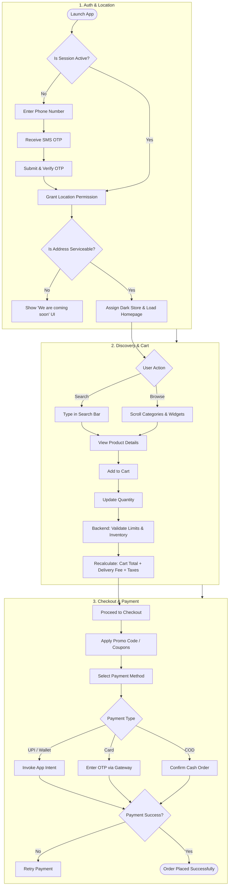
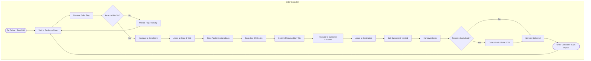
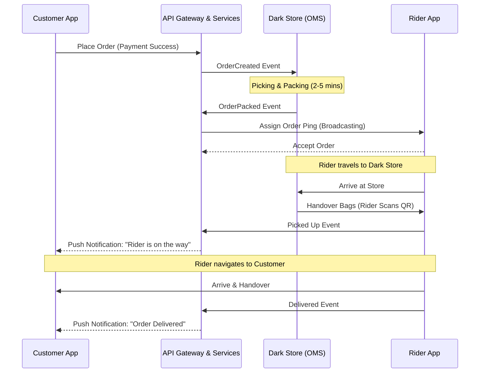

# Blinkit Detailed Workflow Diagrams

This document contains comprehensive workflow diagrams and business process flows for the Blinkit application. It details both the Customer and Rider apps, including authentication, KYC onboarding, and real-time order execution.

## 1. Customer App Flow (Detailed)

This flowchart illustrates the complete customer journey: Authentication, Location resolution, Product Discovery, and Checkout.

## 2. Rider Registration & KYC Flow

The flow a delivery partner takes to join the platform. It involves document verification (KYC), vehicle registration, and background checks.

```mermaid
flowchart TD
    %% Registration and Document Upload
    subgraph Onboarding [Rider Onboarding & KYC]
        R1([Download Rider App]) --> R2[Enter Phone Number & OTP]
        R2 --> R3[Basic Details: Name, City]
        R3 --> R4[Select Vehicle Type: Bike, Cycle, EV]
        
        R4 --> R5[KYC Document Upload]
        R5 --> R6[Aadhaar Card Front/Back]
        R6 --> R7[PAN Card]
        R7 --> R8[Driving License]
        R8 --> R9[Take Selfie]
        
        R9 --> R10[Bank Account Details]
        R10 --> R11[Backend: Verification API / Manual QA]
        R11 --> R12{Status}
        
        R12 -- Rejected --> R13[Re-upload Invalid Documents]
        R13 --> R11
        R12 -- Approved --> R14[Watch Safety/Training Videos]
        R14 --> R15([Account Activated])
    end
```

## 3. Rider Delivery Flow (Active Shift)

The lifecycle of an active delivery partner fulfilling an order.

## 4. End-to-End System Integration Sequence

A unified sequence diagram showing how the Customer App, Backend Services, Dark Store (Order Management), and Rider App communicate synchronously and asynchronously.

