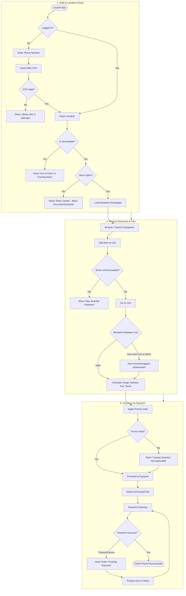
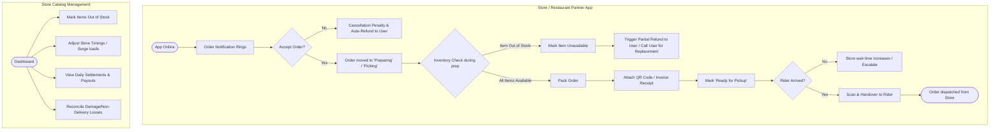
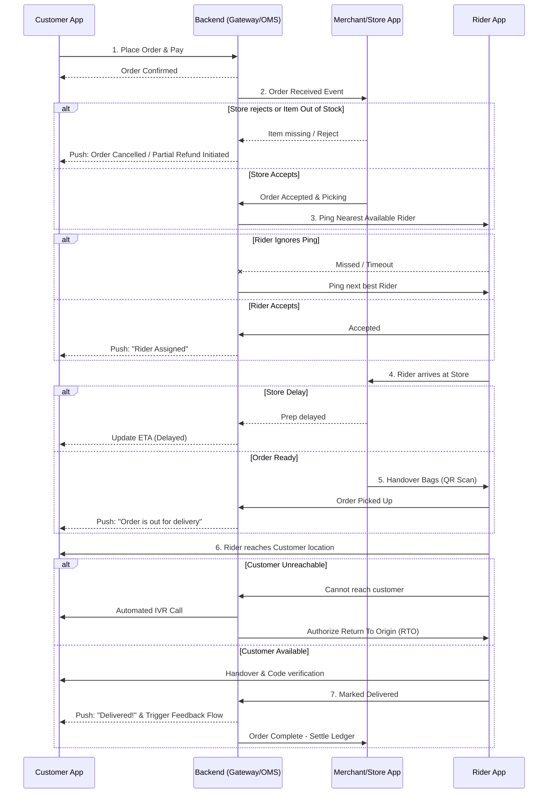

# Comprehensive Zomato & Blinkit Workflow Diagrams

This document outlines the detailed workflows for the Customer App, Rider App, Merchant/Shopkeeper App, and the complete End-to-End Order Lifecycle. It incorporates all edge cases across food delivery (Zomato) and quick commerce (Blinkit) paradigms.

---

## 1. Customer App Flow (Detailed with Edge Cases)

This flowchart tracks the user's journey from app launch to checkout, including failure states and edge cases like inventory loss, out-of-zone locations, and payment gateway failures.



---

## 2. Rider App Flow (Detailed with KYC & Edge Cases)

This diagram outlines the complete lifecycle of a Delivery Partner, from onboarding (with KYC edge cases) to the active delivery shift handling exceptions on the road.

```mermaid
flowchart TD
    %% Onboarding & KYC
    subgraph Onboarding [1. Onboarding & KYC]
        R1([Sign Up via Phone]) --> R2[Select Vehicle & City]
        R2 --> R3[Upload KYC: Aadhaar, PAN, DL, Selfie]
        R3 --> R4[Backend API Verification (OCR + DB Check)]
        R4 --> R5{Verification Status?}
        
        R5 -- "Blurry / Mismatch" --> R6[Reject & Prompt Re-upload]
        R6 --> R3
        R5 -- "Blacklisted" --> R7[Permanent Ban]
        R5 -- "Approved" --> R8[Bank Details & Bag/T-shirt issuance]
        R8 --> R9[Training Modules] --> R10([Account Active])
    end

    %% Active Shift
    subgraph ActiveShift [2. Active Shift & Delivery Execution]
        D1([Go Online]) --> D2[Wait in High-Demand Geofence]
        D2 --> D3[Receive Order Ping]
        
        D3 --> D4{Accept within timeout?}
        D4 -- No --> D5[Missed Ping -> Affects Acceptance Rate / Penalty]
        D5 --> D2
        
        D4 -- Yes --> D6[Navigate to Dark Store / Restaurant]
        D6 --> D7{Arrived at Store?}
        D7 -- Yes --> D8[Wait for Order Prep/Packing]
        D7 -- "GPS Mismatch" --> D9[Block Arrival marking until in radius]
        
        D8 --> D10{Order Ready?}
        D10 -- No --> D11[Wait / Request Merchant Expedite]
        D10 -- Yes --> D12[Scan Bags QR / Confirm Pickup]
        
        D12 --> D13[Navigate to Customer Location]
        D13 --> D14{Customer Available?}
        
        D14 -- No --> D15[Call Customer -> Trigger Support IVR]
        D15 -- "Unreachable after 5 mins" --> D16[Mark as RTO / Cancelled by Support]
        D14 -- Yes --> D17[Handover Order]
        
        D17 --> D18{Payment Type}
        D18 -- COD --> D19[Collect Cash / UPI QR]
        D18 -- Prepaid --> D20[Verify Delivery Code/OTP]
        
        D19 --> D21{Exact Change/Valid Cash?}
        D21 -- No --> D22[Rider Wallet Deduction / Support Escalation]
        D21 -- Yes --> D20
        
        D20 --> D23([Mark Delivered -> Earn Payout])
        D16 --> D23
        D23 --> D2
    end
```

---

## 3. Merchant / Shop Keeper App Flow

The dark store (Blinkit) or restaurant partner (Zomato) workflow for accepting orders, managing inventory, and handing over to riders.



---

## 4. End-to-End Order Lifecycle & Edge Cases (Macro Flow)

A holistic system-level sequence diagram showing how all apps and backend services interact, including cancellation handling and delays.


