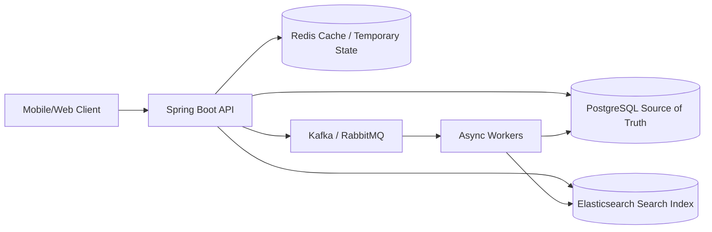

# Chapter 1 — PostgreSQL vs SQL and Why It Is the Default Backend Database

### _The database choice for serious Spring Boot backends_

---

## 1.1 PostgreSQL vs SQL

This is the first correction:

```text
SQL is a language.
PostgreSQL is a database.
```

SQL means Structured Query Language. You use it to create tables, insert data, update data, query data and manage relational databases.

PostgreSQL is an actual database system that understands SQL.

So the real comparison is not:

```text
PostgreSQL vs SQL
```

The real comparison is:

```text
PostgreSQL vs MySQL vs MongoDB vs Cassandra vs DynamoDB
```

For most backend projects, especially Spring Boot projects, choose PostgreSQL first.

---

## 1.2 Why PostgreSQL Should Be Your Default

PostgreSQL is excellent for backend systems because it gives you:

- strong transactions,
- foreign keys,
- unique constraints,
- indexes,
- joins,
- JSONB,
- full-text search,
- geospatial support with PostGIS,
- migrations with Flyway/Liquibase,
- strong Spring Boot support,
- mature production tooling.

Use PostgreSQL for data where correctness matters:

- users,
- restaurants,
- menus,
- orders,
- bookings,
- payments,
- invoices,
- driver assignments,
- hotel rooms,
- seats,
- carts if they must be durable,
- wallet/ledger records,
- permissions,
- audit records.

---

## 1.3 How PostgreSQL Fits in a Production Backend



PostgreSQL is the source of truth.

Redis is for speed.

Elasticsearch is for search.

Kafka/RabbitMQ is for async workflows.

Cassandra is only for very high-scale predictable data like GPS history or event streams.

---

## 1.4 Examples by App Type

### Food Delivery App

Use PostgreSQL for:

- users,
- restaurants,
- menus,
- orders,
- order items,
- payment attempts,
- refunds,
- delivery assignments.

Use Redis for:

- cart cache,
- rate limits,
- OTP,
- live delivery partner location.

Use Elasticsearch for:

- restaurant search,
- dish search,
- filters and autocomplete.

### Taxi / Uber-Like App

Use PostgreSQL for:

- riders,
- drivers,
- trips,
- payments,
- driver payouts,
- active trip correctness.

Use Redis GEO for:

- current available driver location.

Use Cassandra for:

- high-volume GPS history.

### Booking App

Use PostgreSQL for:

- inventory,
- rooms,
- seats,
- shows,
- bookings,
- holds,
- payments,
- cancellation policy.

Reason: booking systems need strong consistency. You cannot sell the same seat or room twice.

---

## 1.5 What PostgreSQL Is Best At

### Transactions

Transactions let multiple operations succeed or fail together.

```sql
BEGIN;

UPDATE show_seats
SET status = 'HELD'
WHERE id = '...'
AND status = 'AVAILABLE';

INSERT INTO seat_holds (id, user_id, show_id, expires_at)
VALUES ('...', '...', '...', now() + interval '5 minutes');

COMMIT;
```

If anything fails, the database rolls back and avoids half-written data.

### Constraints

Constraints protect data even if application code has a bug.

```sql
ALTER TABLE users
ADD CONSTRAINT uk_users_email UNIQUE (email);
```

Example: one driver should have only one active trip.

```sql
CREATE UNIQUE INDEX uk_driver_one_active_trip
ON trips(driver_id)
WHERE status IN ('DRIVER_ASSIGNED', 'ARRIVING', 'IN_PROGRESS');
```

This is system design at the database level.

### Indexes

Indexes make important queries fast.

```sql
CREATE INDEX idx_orders_user_created
ON orders(user_id, created_at DESC);
```

Use this for:

```sql
SELECT *
FROM orders
WHERE user_id = '...'
ORDER BY created_at DESC
LIMIT 20;
```

### Relationships

PostgreSQL is excellent for one-to-one, one-to-many and many-to-many relationships.

```sql
CREATE TABLE orders (
    id UUID PRIMARY KEY,
    user_id UUID NOT NULL REFERENCES users(id)
);

CREATE TABLE order_items (
    id UUID PRIMARY KEY,
    order_id UUID NOT NULL REFERENCES orders(id),
    menu_item_id UUID NOT NULL REFERENCES menu_items(id),
    quantity INT NOT NULL CHECK (quantity > 0)
);
```

---

## 1.6 Spring Boot Setup

Gradle:

```kotlin
dependencies {
    implementation("org.springframework.boot:spring-boot-starter-data-jpa")
    implementation("org.flywaydb:flyway-core")
    runtimeOnly("org.flywaydb:flyway-database-postgresql")
    runtimeOnly("org.postgresql:postgresql")
}
```

`application.yml`:

```yaml
spring:
  datasource:
    url: jdbc:postgresql://${DB_HOST:localhost}:${DB_PORT:5432}/${DB_NAME:app}
    username: ${DB_USERNAME:postgres}
    password: ${DB_PASSWORD:postgres}
    hikari:
      maximum-pool-size: 20
      minimum-idle: 5
      connection-timeout: 2000

  jpa:
    hibernate:
      ddl-auto: validate
    open-in-view: false

  flyway:
    enabled: true
```

Important:

- `ddl-auto: validate`: Hibernate checks schema but does not mutate it.
- Flyway owns schema changes.
- `open-in-view: false`: prevents hidden database queries during response serialization.

---

## 1.7 When Not to Use PostgreSQL Alone

PostgreSQL is powerful, but not every job belongs only in PostgreSQL.

| Need | Better supporting tool |
|---|---|
| Cache hot API responses | Redis |
| OTP/session/rate limit | Redis |
| Full-text product search | Elasticsearch |
| Autocomplete and filters | Elasticsearch |
| Millions of GPS writes | Cassandra/Kafka |
| Event streaming | Kafka |
| Background jobs | RabbitMQ/Kafka |
| Images/PDF/files | Object storage |
| Semantic search | Vector database / pgvector |

The key phrase is "supporting tool". PostgreSQL still usually remains the durable source of truth.

---

## 1.8 Decision Rule

Choose PostgreSQL when:

- data has relationships,
- correctness matters,
- transactions matter,
- you need constraints,
- you need joins,
- you are building orders/bookings/payments,
- you are using Spring Boot and JPA,
- you want an industry-standard backend database.

Do not start with MongoDB/Cassandra just because the app sounds large. Most large products still use relational databases for their core business data.

---

## 1.9 Final Recommendation

For your backend learning path:

```text
1. Learn Spring Boot for API and business logic.
2. Learn PostgreSQL deeply for source-of-truth data.
3. Add Redis for speed.
4. Add Elasticsearch for search.
5. Add Kafka/RabbitMQ for async workflows.
6. Add Cassandra only for massive event/location history.
```

For your production-grade delivery, Uber-like and booking app ideas:

```text
Primary database: PostgreSQL
Language: SQL
Spring integration: Spring Data JPA + Flyway
Cache: Redis
Search: Elasticsearch
Async: Kafka/RabbitMQ
```

