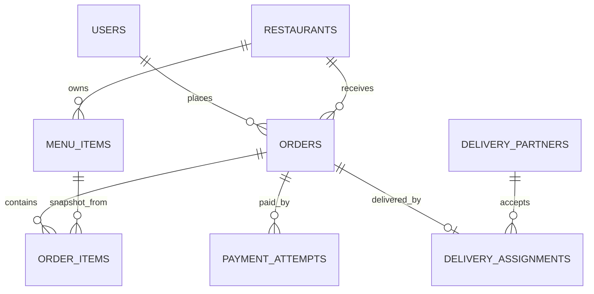
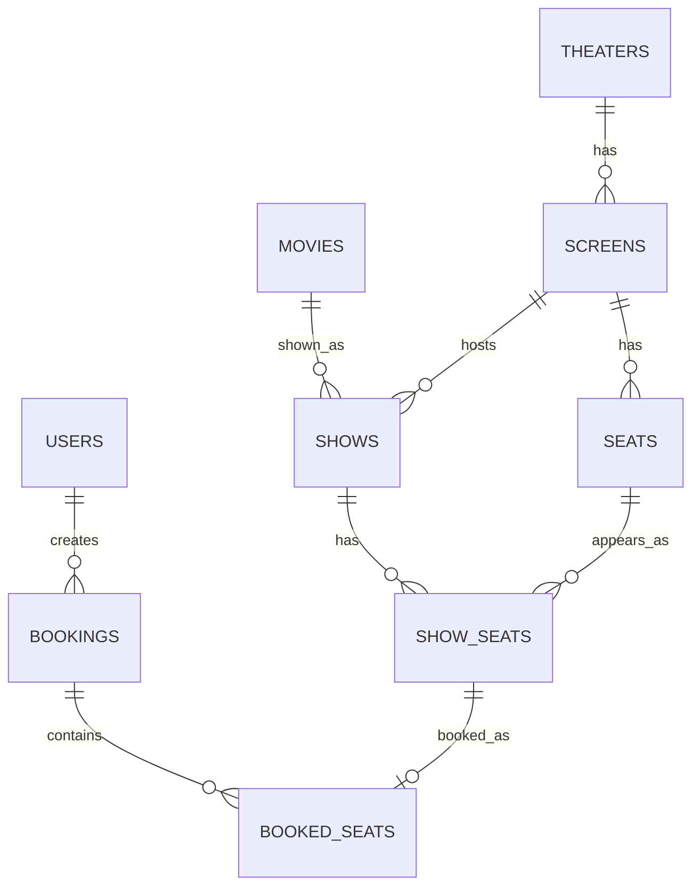

# Chapter 3 — Relationships and ERD Modeling

### _One-to-one, one-to-many, many-to-many and real app data modeling_

---

## 3.1 Relationship Types

| Type | Example |
|---|---|
| One-to-one | user -> profile |
| One-to-many | restaurant -> menu items |
| Many-to-one | many orders -> one user |
| Many-to-many | products <-> categories |
| Self-reference | category -> parent category |
| Join entity | booking -> booked seats |

System design needs relationship clarity because database shape controls correctness and query performance.

---

## 3.2 One-to-One

```sql
CREATE TABLE users (
    id UUID PRIMARY KEY,
    email VARCHAR(180) NOT NULL UNIQUE
);

CREATE TABLE user_profiles (
    id UUID PRIMARY KEY,
    user_id UUID NOT NULL UNIQUE REFERENCES users(id),
    full_name VARCHAR(180) NOT NULL
);
```

`UNIQUE (user_id)` makes it one-to-one.

---

## 3.3 One-to-Many

```sql
CREATE TABLE restaurants (
    id UUID PRIMARY KEY,
    name VARCHAR(160) NOT NULL
);

CREATE TABLE menu_items (
    id UUID PRIMARY KEY,
    restaurant_id UUID NOT NULL REFERENCES restaurants(id),
    name VARCHAR(160) NOT NULL,
    price_cents BIGINT NOT NULL
);
```

One restaurant has many menu items. Each menu item belongs to one restaurant.

---

## 3.4 Many-to-Many

Use a join table.

```sql
CREATE TABLE products (
    id UUID PRIMARY KEY,
    name VARCHAR(160) NOT NULL
);

CREATE TABLE categories (
    id UUID PRIMARY KEY,
    name VARCHAR(160) NOT NULL
);

CREATE TABLE product_categories (
    product_id UUID NOT NULL REFERENCES products(id),
    category_id UUID NOT NULL REFERENCES categories(id),
    PRIMARY KEY (product_id, category_id)
);
```

If the relationship has extra fields, use a join entity:

```sql
CREATE TABLE user_roles (
    id UUID PRIMARY KEY,
    user_id UUID NOT NULL REFERENCES users(id),
    role_id UUID NOT NULL REFERENCES roles(id),
    assigned_at TIMESTAMPTZ NOT NULL,
    assigned_by UUID,
    CONSTRAINT uk_user_role UNIQUE (user_id, role_id)
);
```

Rule:

```text
If the relationship has data, it is an entity.
```

---

## 3.5 Food Delivery ERD



Important: `ORDER_ITEMS` stores name/price snapshot because menu price can change later.

---

## 3.6 Booking ERD



Key lesson: seat availability is per show, so use `show_seats`.

