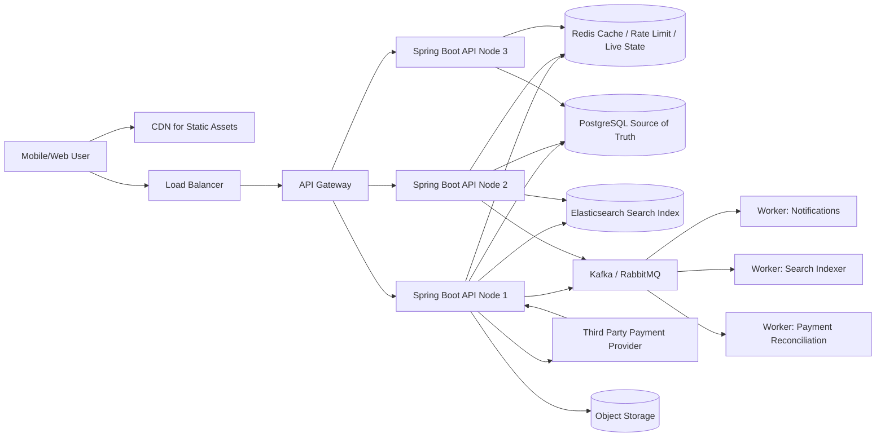
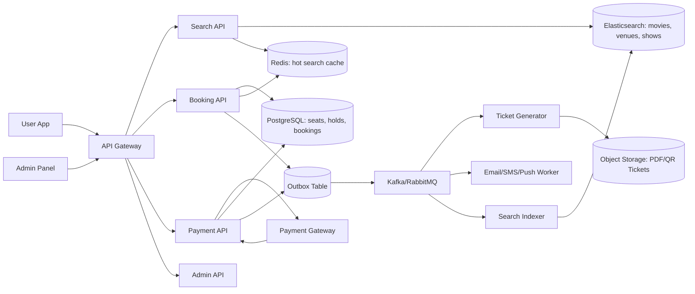
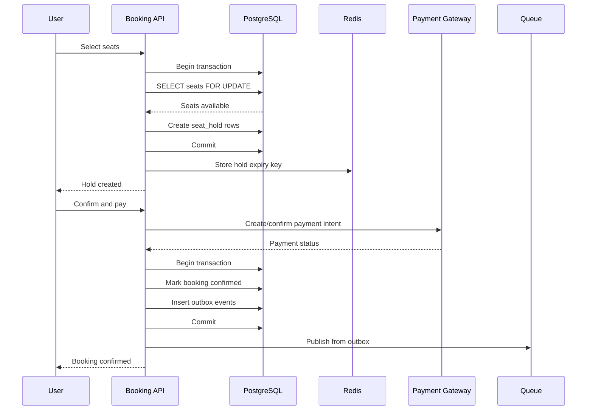

# Chapter 20 — Industry Scale System Design Reference

### _Reference architectures for real production apps: delivery, Uber-like, booking, marketplace, chat, payments, search and AI_

---

## 20.1 How to Think in System Design

System design is not drawing many boxes. It is answering these questions clearly:

1. What is the core user flow?
2. What data must be strongly correct?
3. What data can be eventually consistent?
4. What must be fast?
5. What must be durable?
6. What happens when a dependency is down?
7. How do we observe, recover and scale it?

A good backend design separates:

- Source of truth: PostgreSQL for business facts.
- Fast state: Redis for temporary state, counters, rate limits and matching.
- Search/read index: Elasticsearch for full-text and filtered discovery.
- High-scale event/history store: Cassandra for huge append/read workloads.
- Async workflow: Kafka/RabbitMQ for reliable background processing.
- Object storage: S3-style storage for images, files, invoices and exports.
- AI retrieval: vector store plus Spring AI for semantic search/RAG.

---

## 20.2 Universal Production Design Template

Use this template before designing any app.

```text
Client Apps
    |
API Gateway / Load Balancer
    |
Spring Boot API
    |
    |-- Auth module
    |-- Domain modules
    |-- Payment/notification/search/AI gateways
    |
PostgreSQL  <--- source of truth
Redis       <--- cache, locks, rate limits, sessions, live state
Elasticsearch <--- search/read model
Kafka/RabbitMQ <--- async events/jobs
Object Storage <--- files/images/documents
Observability <--- logs, metrics, traces, alerts
```

Golden rule:

```text
Correctness first in PostgreSQL.
Speed second with Redis.
Discovery third with Elasticsearch.
Scale-out event/history data with Cassandra only when PostgreSQL is no longer the right fit.
```

---

## 20.3 Delivery App System Design

Examples: Swiggy, Zomato, DoorDash, Uber Eats style systems.

### Core flows

- User searches restaurants.
- User builds cart.
- User places order.
- Payment is authorized.
- Restaurant accepts/rejects.
- Driver is assigned.
- Driver location updates.
- User receives notifications.
- Order is delivered and settlement happens.

### Architecture

```text
Mobile App
    |
API Gateway
    |
Spring Boot Backend
    |
    |-- Identity Service
    |-- Restaurant/Catalog Service
    |-- Cart Service
    |-- Order Service
    |-- Payment Service
    |-- Dispatch Service
    |-- Notification Service
    |-- Search Service
    |
PostgreSQL: users, restaurants, menus, orders, payments, settlements
Redis: cart, rate limits, OTP, nearby drivers, order tracking cache
Elasticsearch: restaurant/dish search, filters, autocomplete
Cassandra: driver location history, order event timeline at huge scale
Kafka/RabbitMQ: order events, payment events, notification jobs
Object Storage: restaurant images, invoices, support attachments
```

### Important design decisions

Cart:

- Redis if cart is temporary and can expire.
- PostgreSQL if abandoned cart recovery, audit or multi-device persistence matters.

Order:

- PostgreSQL transaction creates order.
- Use idempotency key so retry does not create duplicate order.
- Publish `OrderCreatedEvent` through outbox.

Payment:

- Never trust only frontend payment status.
- Confirm through payment provider webhook.
- Webhook handler must be idempotent.

Dispatch:

- Current driver location in Redis GEO.
- Long-term location history in Cassandra.
- Assignment result stored in PostgreSQL.

Search:

- Menu/restaurant facts live in PostgreSQL.
- Elasticsearch receives denormalized restaurant documents.
- Rebuild index job must exist.

---

## 20.4 Uber-Like Ride App System Design

### Core flows

- Rider requests ride.
- Backend finds nearby available drivers.
- Driver accepts.
- Trip starts.
- Driver location streams.
- Trip completes.
- Fare is calculated.
- Payment and driver payout are recorded.

### Architecture

```text
Rider App / Driver App
    |
API Gateway
    |
Spring Boot Services
    |
    |-- Rider Service
    |-- Driver Service
    |-- Location Service
    |-- Matching Service
    |-- Trip Service
    |-- Pricing Service
    |-- Payment Service
    |
PostgreSQL: riders, drivers, trips, fares, payments, payouts
Redis GEO: current available driver locations
Redis sorted sets: driver availability/priority
Cassandra: location pings and trip telemetry
Kafka: location events, trip events, pricing events
Elasticsearch: admin/support trip search
```

### Matching flow

```text
1. Rider requests ride.
2. Matching service queries Redis GEO for nearby drivers.
3. Apply filters: vehicle type, rating, availability, distance.
4. Send offer to candidate drivers.
5. First valid accept wins.
6. Store trip assignment in PostgreSQL.
7. Publish DriverAssignedEvent.
```

Race condition protection:

- Use PostgreSQL transaction or Redis lock around trip assignment.
- Store final trip state in PostgreSQL.
- Driver accept endpoint must be idempotent.

---

## 20.5 Booking App System Design

Examples: hotels, events, doctor appointments, movie tickets, travel inventory.

### Core problem

Booking systems are hard because overselling is unacceptable.

### Architecture

```text
Client
    |
Search API
    |
Elasticsearch: searchable availability/read model
    |
Booking API
    |
PostgreSQL: inventory, holds, bookings, payments
Redis: temporary hold expiry, rate limits
Kafka/RabbitMQ: confirmation emails, invoice generation, calendar sync
```

### Booking flow

```text
1. User searches availability.
2. User selects slot/room/seat.
3. Backend creates temporary hold.
4. User pays.
5. Payment webhook confirms.
6. Hold becomes confirmed booking.
7. Confirmation notification is sent.
```

### Inventory correctness

Use PostgreSQL locking:

```text
SELECT inventory row FOR UPDATE
check remaining > 0
decrement remaining
create hold/booking
commit
```

Use Redis only for expiry acceleration. The real booking state must be in PostgreSQL.

---

## 20.6 Marketplace System Design

Examples: Amazon-style products, service marketplace, rental marketplace.

### Main modules

- Identity.
- Seller onboarding.
- Catalog.
- Inventory.
- Search.
- Cart.
- Order.
- Payment.
- Shipment.
- Review.
- Dispute/support.

### Storage choices

| Capability | Storage |
|---|---|
| Product catalog source | PostgreSQL |
| Product search | Elasticsearch |
| Cart | Redis or PostgreSQL |
| Orders/payments | PostgreSQL |
| Product images | Object storage |
| Inventory reservation | PostgreSQL transaction |
| Recommendation features | Events + vector/feature store |
| Review moderation | AI/NLP service |

### Important patterns

- Product page reads from cache/search/read model.
- Checkout reads source-of-truth inventory from PostgreSQL.
- Inventory change publishes event to search indexer.
- Payment and shipment flows use sagas.

---

## 20.7 Chat and Notification System Design

### Chat architecture

```text
Client
    |
WebSocket/SSE Gateway
    |
Message Service
    |
PostgreSQL or Cassandra: messages
Redis Pub/Sub: fanout between app nodes
Kafka: message events, push notifications, moderation
Object Storage: attachments
```

For small/medium scale, PostgreSQL can store messages. For very large append-heavy chat, Cassandra is a better fit if queries are predictable:

```text
Get last 50 messages in conversation C.
Get messages before timestamp T.
```

Notification design:

```text
Domain event -> Notification preference check -> Template render -> Provider send -> Delivery status
```

Good practice:

- Store notification attempts.
- Retry with backoff.
- Use dead-letter queue.
- Do not send notifications directly inside the user's HTTP request.

---

## 20.8 Payment System Design

Payments require boring, strict correctness.

### Rules

- Use idempotency keys.
- Store payment attempts.
- Trust provider webhooks, not only frontend callback.
- Use ledger entries for financial movement.
- Never store raw card data.
- Webhook processing must be idempotent.
- Reconcile with provider reports.

### Flow

```text
Create order
    |
Create payment intent
    |
User pays through provider
    |
Provider webhook
    |
Verify signature
    |
Mark payment authorized/captured
    |
Confirm order/booking
    |
Publish PaymentConfirmedEvent
```

Tables:

- `payment_attempts`
- `payment_events`
- `ledger_entries`
- `refunds`
- `processed_webhooks`

---

## 20.9 Search System Design

Search is usually a separate read model.

```text
PostgreSQL write
    |
Outbox event
    |
Kafka/RabbitMQ
    |
Indexer worker
    |
Elasticsearch index
    |
Search API
```

Important:

- Elasticsearch can lag behind PostgreSQL.
- Product/order correctness must not depend on Elasticsearch.
- Build full reindex command.
- Log zero-result queries.
- Store search analytics for ranking improvements.

---

## 20.10 AI/RAG System Design

```text
Documents / DB rows / Support tickets
    |
Ingestion pipeline
    |
Chunking
    |
Embedding model
    |
Vector store
    |
Retriever with metadata filters
    |
LLM answer
    |
Audit/evaluation
```

Production requirements:

- Tenant filtering before retrieval.
- Permission metadata on every chunk.
- Prompt injection defense.
- Citation/source return.
- Cost limits.
- Rate limits.
- Evaluation dataset.
- Human review for high-impact actions.

Good AI architecture separates:

- Ingestion.
- Retrieval.
- Prompt orchestration.
- Model gateway.
- Evaluation.
- Audit logging.

---

## 20.11 Scaling Reference

Scale vertically first when possible:

```text
better indexes
query optimization
connection pool tuning
caching
read replicas
async processing
horizontal app scaling
partitioning/sharding
specialized stores
```

Do not jump to microservices to solve a query that needs an index.

---

## 20.12 Failure Design

Ask this for every dependency:

| Dependency down | Expected behavior |
|---|---|
| Redis down | App still works, slower, maybe no cache/rate-limit fallback |
| Elasticsearch down | Checkout still works, search degraded/unavailable |
| Kafka/RabbitMQ down | Core writes continue if outbox table works; publishing catches up later |
| Payment provider down | Order remains payment-pending, user can retry |
| AI provider down | AI feature unavailable; core app continues |
| PostgreSQL down | Most write flows unavailable; fail fast and alert |

Production systems are designed for partial failure.

---

## 20.13 Interview and Real-World Checklist

For any system design, explain:

- Functional requirements.
- Non-functional requirements.
- Core APIs.
- Data model.
- Storage choices.
- High-level architecture.
- Critical flows.
- Consistency model.
- Scaling strategy.
- Failure handling.
- Observability.
- Security.
- Trade-offs.

If you can explain the trade-offs, your design sounds senior.

---

## 20.14 Deep HLD Template You Can Reuse

When someone asks "design Uber", "design BookMyShow", "design food delivery", or "design a booking app", do not start from databases. Start from the product and traffic shape.

### Step 1: Clarify requirements

Functional requirements:

- What can users do?
- What can admins/operators do?
- What are the top 3 write flows?
- What are the top 3 read flows?
- What external systems are involved?

Non-functional requirements:

- Scale: daily active users, requests per second, writes per second.
- Latency: search under 300 ms, checkout under 2 seconds, live tracking under 1 second.
- Availability: can search be down? can checkout be down?
- Consistency: which operations must be strongly correct?
- Durability: which data must never be lost?
- Security: authentication, authorization, tenant boundaries, payment safety.

### Step 2: Draw the HLD



How to explain this diagram:

- CDN serves static assets and reduces backend load.
- Load balancer spreads traffic across API nodes.
- API gateway handles routing, auth policies, rate limits and API versioning.
- Spring Boot nodes are stateless so they can scale horizontally.
- PostgreSQL stores source-of-truth business data.
- Redis stores fast temporary data.
- Elasticsearch stores read-optimized search documents.
- Queue decouples slow work from the user request.
- Workers process email, SMS, indexing, invoices and retries.
- Third-party payments are integrated with idempotent APIs and webhooks.

### Step 3: Separate reads and writes

Example for a booking app:

```text
Read path:
User search -> API -> Elasticsearch -> Redis cache -> response

Write path:
User checkout -> API -> PostgreSQL transaction -> outbox event -> queue -> async workers
```

This is important because search can be eventually consistent, but booking confirmation must be strongly consistent.

### Step 4: Define failure behavior

```text
If Redis fails: serve from database, slower.
If Elasticsearch fails: search unavailable, checkout still works.
If queue fails: outbox stores events and retries later.
If payment provider fails: order remains pending.
If PostgreSQL fails: writes stop; alert immediately.
```

---

## 20.15 Deep Example: Movie / Event Ticket Booking HLD

This maps directly to booking apps, event apps, hotel room booking and appointment booking.

### Requirements

Functional:

- User searches movies/events.
- User selects city, venue, showtime.
- User selects seats.
- System locks seats temporarily.
- User pays.
- System confirms booking.
- User receives ticket.
- User can cancel if policy allows.
- Admin manages movies, venues, screens and shows.

Non-functional:

- No double booking.
- Seat selection should feel real-time.
- Search should be fast.
- Payment must be idempotent.
- Ticket generation can be async.
- Seat hold expires automatically.

### HLD



Storage split:

| Data | Store | Reason |
|---|---|---|
| Users | PostgreSQL | durable identity |
| Movies/events | PostgreSQL | source of truth |
| Search page | Elasticsearch | fast filters/full-text |
| Seat inventory | PostgreSQL | strong consistency |
| Temporary seat hold | PostgreSQL + Redis TTL helper | correctness plus expiry |
| Payment attempts | PostgreSQL | audit/idempotency |
| Ticket PDF/QR | Object storage | file storage |
| Notifications | Queue + provider | async retries |

### Seat booking write path



Critical point: Redis can help expiry and speed, but PostgreSQL row locks prevent double booking.
