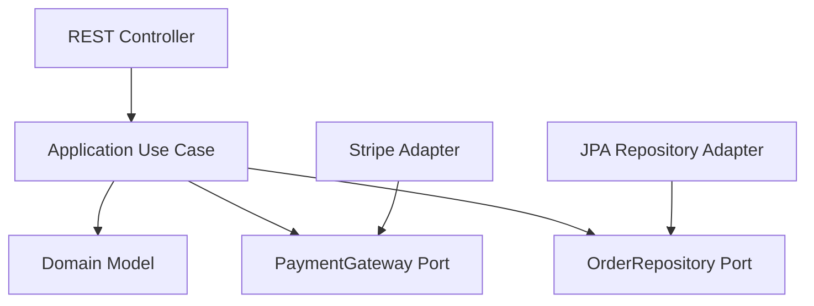
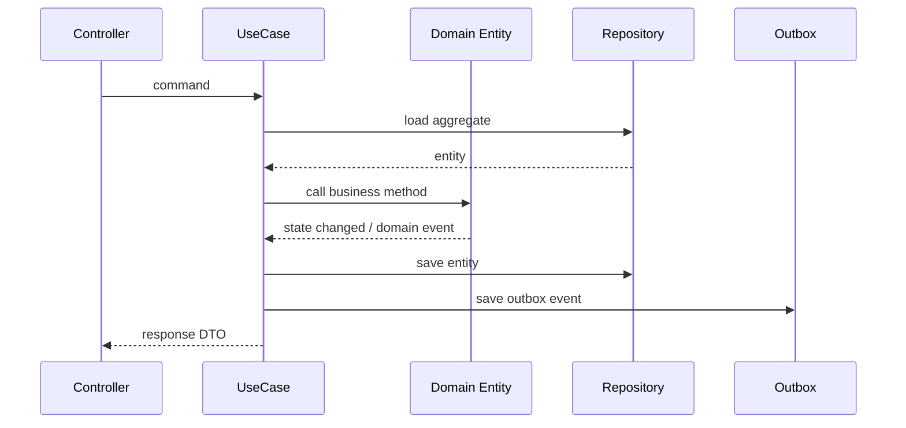
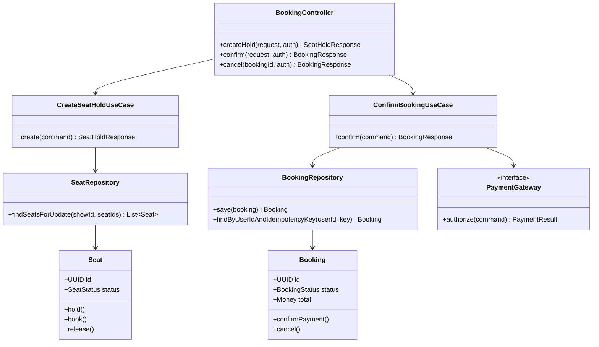

# Chapter 21 — Spring Boot Project Architecture and Code Structure

### _How to structure production Kotlin Spring Boot code so it stays clean as the app grows_

---

## 21.1 The Goal

This chapter is about code architecture, not infrastructure architecture.

The question is:

```text
How should I organize files, packages, classes, DTOs, services, repositories, configs, tests and modules in a real Spring Boot backend?
```

A good structure should make these things obvious:

- Where HTTP code lives.
- Where business logic lives.
- Where database access lives.
- Where external provider calls live.
- Where security/config/error handling lives.
- How one feature/module talks to another.
- Where tests should be written.

---

## 21.2 Recommended Structure: Modular Monolith First

For most serious projects, start with a modular monolith.

```text
src/main/kotlin/com/company/app/
    AppApplication.kt

    common/
        config/
        error/
        security/
        observability/
        web/
        time/

    identity/
        api/
        application/
        domain/
        infrastructure/

    catalog/
        api/
        application/
        domain/
        infrastructure/

    order/
        api/
        application/
        domain/
        infrastructure/

    payment/
        api/
        application/
        domain/
        infrastructure/

    notification/
        application/
        infrastructure/

    search/
        application/
        infrastructure/
```

Why modular monolith:

- One deployable app.
- Easier local development.
- Easier transactions.
- Clear domain boundaries.
- Can extract modules to microservices later if needed.

Do not start with 15 microservices as a solo developer. Start with boundaries inside one codebase.

---

## 21.3 Package Meaning

Inside each feature module:

```text
order/
    api/              HTTP controllers and request/response DTOs
    application/      use cases, commands, service orchestration
    domain/           entities, value objects, domain rules, events
    infrastructure/   database repositories, external adapters, messaging
```

### api

Contains:

- Controllers.
- Request DTOs.
- Response DTOs.
- API mappers if needed.

Does not contain:

- Business rules.
- JPA queries.
- Payment provider code.

### application

Contains:

- Use case services.
- Command/query handlers.
- Transaction boundaries.
- Event publishing.

### domain

Contains:

- Entities.
- Value objects.
- Domain events.
- Domain exceptions.
- Pure business rules.

### infrastructure

Contains:

- Spring Data repositories.
- JPA entities if you separate persistence model from domain model.
- Kafka/RabbitMQ adapters.
- Redis adapters.
- Elasticsearch indexers.
- Payment/email/provider clients.

---

## 21.4 Controller Pattern

```kotlin
@RestController
@RequestMapping("/api/v1/orders")
class OrderController(
    private val createOrderUseCase: CreateOrderUseCase,
    private val getOrderQuery: GetOrderQuery
) {
    @PostMapping
    fun create(
        @RequestHeader("Idempotency-Key") idempotencyKey: String,
        @Valid @RequestBody request: CreateOrderRequest,
        authentication: JwtAuthenticationToken
    ): ResponseEntity<OrderResponse> {
        val response = createOrderUseCase.create(
            request.toCommand(
                userId = authentication.userId(),
                idempotencyKey = idempotencyKey
            )
        )

        return ResponseEntity.status(HttpStatus.CREATED).body(response)
    }

    @GetMapping("/{orderId}")
    fun get(@PathVariable orderId: UUID): OrderResponse {
        return getOrderQuery.get(orderId)
    }
}
```

Annotation explanation:

- `@RestController`: combines `@Controller` and `@ResponseBody`; return values become JSON.
- `@RequestMapping`: base path for all methods in this controller.
- `@PostMapping`: handles HTTP POST.
- `@RequestHeader`: reads a header.
- `@Valid`: runs Bean Validation on the request DTO.
- `@RequestBody`: maps JSON request body to Kotlin object.
- `@PathVariable`: reads path segment from URL.

Controller rule: map HTTP to use-case command, call application service, return response.

---

## 21.5 DTO Pattern

Never expose JPA entities directly from controllers.

```kotlin
data class CreateOrderRequest(
    @field:NotEmpty
    val items: List<CreateOrderItemRequest>,

    @field:NotNull
    val deliveryAddressId: UUID,

    @field:Size(max = 500)
    val note: String?
) {
    fun toCommand(userId: UUID, idempotencyKey: String): CreateOrderCommand {
        return CreateOrderCommand(
            userId = userId,
            items = items.map { it.toCommand() },
            deliveryAddressId = deliveryAddressId,
            note = note,
            idempotencyKey = idempotencyKey
        )
    }
}

data class OrderResponse(
    val id: UUID,
    val status: String,
    val totalAmountCents: Long,
    val currency: String,
    val createdAt: Instant
)
```

Good practice:

- Request DTOs represent API input.
- Response DTOs represent API output.
- Commands represent application use-case input.
- Entities represent domain/persistence state.

---

## 21.6 Application Service Pattern

```kotlin
@Service
class CreateOrderUseCase(
    private val orderRepository: OrderRepository,
    private val restaurantRepository: RestaurantRepository,
    private val outboxPublisher: OutboxPublisher
) {
    @Transactional
    fun create(command: CreateOrderCommand): OrderResponse {
        orderRepository.findByUserIdAndIdempotencyKey(command.userId, command.idempotencyKey)
            ?.let { return OrderResponse.from(it) }

        val restaurant = restaurantRepository.getRequired(command.restaurantId)
        val order = Order.create(command, restaurant)

        val saved = orderRepository.save(order)

        outboxPublisher.publish(
            aggregateType = "ORDER",
            aggregateId = saved.id,
            event = OrderCreatedEvent(saved.id, saved.userId)
        )

        return OrderResponse.from(saved)
    }
}
```

Annotation explanation:

- `@Service`: application/business service bean.
- `@Transactional`: transaction boundary for this use case.

Good practice:

- Keep transactions at application service level.
- Do not put `@Transactional` on controllers.
- Do not publish external messages directly inside the transaction unless using outbox.
- Do not let services return JPA entities to controllers.

---

## 21.7 Domain Model Pattern

```kotlin
@Entity
@Table(name = "orders")
class Order(
    @Id
    val id: UUID,

    @Column(name = "user_id", nullable = false)
    val userId: UUID,

    @Enumerated(EnumType.STRING)
    @Column(nullable = false)
    var status: OrderStatus,

    @Embedded
    val total: Money,

    @Version
    var version: Long? = null
) {
    fun markPaid() {
        require(status == OrderStatus.PAYMENT_PENDING) {
            "Only payment-pending orders can be marked paid"
        }
        status = OrderStatus.PAID
    }

    fun cancel() {
        require(status.canCancel()) {
            "Order cannot be cancelled from status $status"
        }
        status = OrderStatus.CANCELLED
    }
}
```

Good practice:

- Domain methods protect valid transitions.
- Avoid public random mutation from services.
- Use value objects like `Money`, `Address`, `GeoPoint`, `DateRange`.
- Use `@Version` for optimistic locking on important aggregates.

---

## 21.8 Repository Pattern

```kotlin
interface OrderRepository : JpaRepository<Order, UUID> {
    fun findByUserIdAndIdempotencyKey(userId: UUID, idempotencyKey: String): Order?

    @Query("""
        select o from Order o
        where o.userId = :userId
        order by o.createdAt desc
    """)
    fun findRecentForUser(userId: UUID, pageable: Pageable): Page<Order>
}
```

Good practice:

- Repositories should not contain business rules.
- Use derived queries for simple lookups.
- Use `@Query` for explicit important queries.
- Use projections for list pages when full entity is not needed.
- Avoid loading huge object graphs accidentally.

---

## 21.9 Gateway/Adapter Pattern for External Services

Do not scatter payment provider calls everywhere.

```text
payment/
    application/
        PaymentGateway.kt
    infrastructure/
        StripePaymentGateway.kt
```

Interface:

```kotlin
interface PaymentGateway {
    fun createPaymentIntent(command: CreatePaymentIntentCommand): PaymentIntentResult
    fun verifyWebhook(payload: String, signature: String): PaymentWebhookEvent
}
```

Implementation:

```kotlin
@Component
class StripePaymentGateway(
    private val stripeClient: StripeClient
) : PaymentGateway {
    override fun createPaymentIntent(command: CreatePaymentIntentCommand): PaymentIntentResult {
        // provider-specific code here
    }

    override fun verifyWebhook(payload: String, signature: String): PaymentWebhookEvent {
        // provider-specific code here
    }
}
```

Benefit: application code depends on your interface, not the provider SDK.

---

## 21.10 Configuration Structure

```text
common/config/
    JacksonConfig.kt
    SecurityConfig.kt
    RedisConfig.kt
    OpenApiConfig.kt
    ClockConfig.kt
    WebClientConfig.kt
```

Use `@ConfigurationProperties` for typed config:

```kotlin
@ConfigurationProperties(prefix = "app.payment")
data class PaymentProperties(
    val provider: String,
    val webhookSecret: String,
    val timeout: Duration
)
```

Enable scanning:

```kotlin
@SpringBootApplication
@ConfigurationPropertiesScan
class AppApplication
```

Good practice:

- Prefer typed properties over scattered `@Value`.
- Keep secrets in environment/secret manager.
- Validate required properties.

---

## 21.11 Error Handling Structure

```text
common/error/
    ApiError.kt
    GlobalExceptionHandler.kt
    NotFoundException.kt
    ConflictException.kt
    ForbiddenException.kt
```

```kotlin
@RestControllerAdvice
class GlobalExceptionHandler {
    @ExceptionHandler(NotFoundException::class)
    fun notFound(ex: NotFoundException): ResponseEntity<ApiError> {
        return ResponseEntity.status(HttpStatus.NOT_FOUND)
            .body(ApiError(code = "NOT_FOUND", message = ex.message))
    }

    @ExceptionHandler(ConflictException::class)
    fun conflict(ex: ConflictException): ResponseEntity<ApiError> {
        return ResponseEntity.status(HttpStatus.CONFLICT)
            .body(ApiError(code = "CONFLICT", message = ex.message))
    }
}
```

Annotation explanation:

- `@RestControllerAdvice`: global controller error handler returning JSON.
- `@ExceptionHandler`: maps exception type to response method.

---

## 21.12 Events Structure

```text
order/domain/event/
    OrderCreatedEvent.kt
    OrderPaidEvent.kt

common/outbox/
    OutboxEvent.kt
    OutboxRepository.kt
    OutboxPublisher.kt
    OutboxRelayJob.kt
```

Use events for cross-module communication:

```text
Order module publishes OrderCreatedEvent.
Payment module reacts by creating payment intent.
Notification module reacts by sending confirmation.
Search module reacts by updating read index.
```

Do not make every module directly call every other module's repository.

---

## 21.13 Test Structure

```text
src/test/kotlin/com/company/app/
    common/
    order/
        api/
            OrderControllerTest.kt
        application/
            CreateOrderUseCaseTest.kt
        infrastructure/
            OrderRepositoryTest.kt
        OrderIntegrationTest.kt
```

Test types:

- Unit test: one class, no Spring context.
- Web slice test: controller and MVC behavior.
- Data test: repository with database.
- Integration test: full Spring context with Testcontainers.

Example:

```kotlin
@DataJpaTest
class OrderRepositoryTest(
    @Autowired private val orderRepository: OrderRepository
) {
    @Test
    fun `finds order by idempotency key`() {
        // arrange, act, assert
    }
}
```

Good practice:

- Most domain logic should be unit-testable without Spring.
- Use Testcontainers for PostgreSQL/Redis/Elasticsearch behavior.
- Do not mock the database in repository tests.

---

## 21.14 Naming Conventions

Use names that explain role:

```text
CreateOrderRequest
CreateOrderCommand
CreateOrderUseCase
OrderResponse
OrderRepository
OrderSearchDocument
OrderCreatedEvent
StripePaymentGateway
OutboxPublisher
```

Avoid vague names:

```text
OrderManager
OrderHelper
OrderUtil
CommonService
DataHandler
```

`Manager`, `Helper` and `Util` often mean the class has unclear responsibility.

---

## 21.15 What Not To Do

Avoid:

- One giant `service/` folder for the whole app.
- Returning entities from controllers.
- Calling repositories from controllers.
- Putting business rules in controllers.
- Putting HTTP concepts in domain classes.
- Making every class depend on every other module.
- Keeping provider SDK code in application services.
- Using `@Transactional` everywhere randomly.
- Storing all shared code in `utils`.
- Creating microservices before module boundaries are clear.

---

## 21.16 Final Reference Structure

```text
com.company.app
    AppApplication

    common
        config
        error
        security
        observability
        outbox
        web

    identity
        api
        application
        domain
        infrastructure

    catalog
        api
        application
        domain
        infrastructure

    order
        api
        application
        domain
        infrastructure

    payment
        api
        application
        domain
        infrastructure

    notification
        application
        infrastructure

    search
        api
        application
        infrastructure
```

This structure lets you build one clean app today and still gives you a path to split services later if the product and team become large enough.

---

## 21.17 Architecture Types in Spring Boot

Spring Boot does not force one architecture. You choose based on product size, team size and complexity.

### 1. Layered architecture

```text
controller -> service -> repository -> database
```

Good for:

- CRUD apps.
- Admin panels.
- Early prototypes.
- Small APIs.

Typical structure:

```text
controller/
service/
repository/
entity/
dto/
config/
exception/
```

Weakness: as the app grows, all features mix together in giant folders.

### 2. Package by feature

```text
order/
    OrderController
    OrderService
    OrderRepository
    Order
    OrderRequest
    OrderResponse

payment/
    PaymentController
    PaymentService
    PaymentRepository
```

Good for:

- Medium apps.
- Faster navigation.
- Product features with clear ownership.

Weakness: without discipline, each feature still mixes API, domain and infrastructure code.

### 3. Modular monolith

```text
order/
    api/
    application/
    domain/
    infrastructure/
```

Good for:

- Serious production apps.
- Teams that want microservice-like boundaries without distributed complexity.
- Apps that may split into services later.

This is the recommended default for delivery, booking, marketplace and AI products.

### 4. Hexagonal / ports and adapters

Core idea:

```text
Application core defines interfaces.
Infrastructure implements them.
```



Good for:

- Payment systems.
- External provider-heavy apps.
- Domain logic that should be testable without Spring.

Weakness: more files and interfaces. Do not overuse it for tiny CRUD features.

### 5. CQRS-style split

Separate write use cases from read queries:

```text
order/application/command/
    CreateOrderUseCase
    CancelOrderUseCase

order/application/query/
    GetOrderQuery
    ListUserOrdersQuery
```

Good for:

- Booking systems.
- Search-heavy apps.
- Complex read models.
- Event-driven systems.

Weakness: more structure, but very clean at scale.

---

## 21.18 Recommended Production Structure With CQRS

```text
src/main/kotlin/com/company/app/
    common/
        config/
        error/
        security/
        observability/
        outbox/
        web/

    booking/
        api/
            BookingController.kt
            request/
                CreateSeatHoldRequest.kt
                ConfirmBookingRequest.kt
            response/
                BookingResponse.kt
                SeatMapResponse.kt

        application/
            command/
                CreateSeatHoldUseCase.kt
                ConfirmBookingUseCase.kt
                CancelBookingUseCase.kt
            query/
                GetSeatMapQuery.kt
                GetBookingQuery.kt
            dto/
                CreateSeatHoldCommand.kt
                ConfirmBookingCommand.kt

        domain/
            model/
                Booking.kt
                Seat.kt
                SeatHold.kt
                Show.kt
                Money.kt
            event/
                BookingConfirmedEvent.kt
                BookingCancelledEvent.kt
            exception/
                SeatAlreadyBookedException.kt

        infrastructure/
            persistence/
                BookingRepository.kt
                SeatRepository.kt
                ShowRepository.kt
            messaging/
                BookingEventPublisher.kt
            payment/
                PaymentGateway.kt
                StripePaymentGateway.kt
            search/
                BookingSearchIndexer.kt
```

Why this is better:

- API models do not leak into domain.
- Domain rules stay near domain objects.
- Commands and queries are easy to test.
- Infrastructure can change without rewriting business logic.
- It is clear where every new file belongs.

---

## 21.19 Code Flow Diagram



The controller does not know how the entity changes. The repository does not know why the entity changes. The use case coordinates the work.

---

## 21.20 LLD Class Diagram Example for Booking Module



This is LLD because it shows classes, methods, dependencies and responsibilities.

---

## 21.21 Design Pattern Mapping in Spring Boot

| Pattern | Spring Boot example | When to use |
|---|---|---|
| Strategy | `PricingStrategy`, `PaymentStrategy` | many interchangeable algorithms |
| Factory | `NotificationChannelFactory` | create correct implementation based on type |
| Observer | Spring events, Kafka consumers | react to domain events |
| Adapter | `StripePaymentGateway` implements `PaymentGateway` | wrap external provider SDK |
| Repository | `JpaRepository` | persistence abstraction |
| Facade | `CheckoutFacade` | simplify a complex workflow |
| Template Method | base importer/parser flow | shared algorithm with variable steps |
| Decorator | caching/rate-limiting wrappers | add behavior around service |

Example Strategy:

```kotlin
interface PricingStrategy {
    fun supports(type: RideType): Boolean
    fun calculate(command: PricingCommand): Money
}

@Component
class EconomyPricingStrategy : PricingStrategy {
    override fun supports(type: RideType) = type == RideType.ECONOMY

    override fun calculate(command: PricingCommand): Money {
        return Money.ofCents(command.distanceKm * 120)
    }
}

@Service
class PricingService(
    private val strategies: List<PricingStrategy>
) {
    fun quote(command: PricingCommand): Money {
        val strategy = strategies.firstOrNull { it.supports(command.rideType) }
            ?: throw IllegalArgumentException("No pricing strategy")

        return strategy.calculate(command)
    }
}
```

Spring injects all `PricingStrategy` beans automatically. This is clean, testable and avoids giant `when` blocks.
