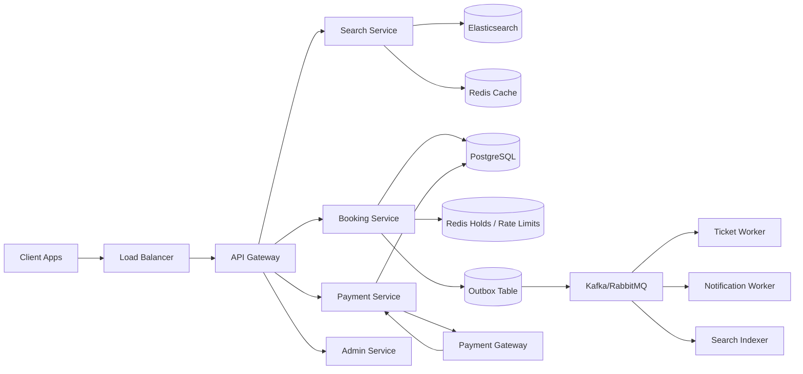
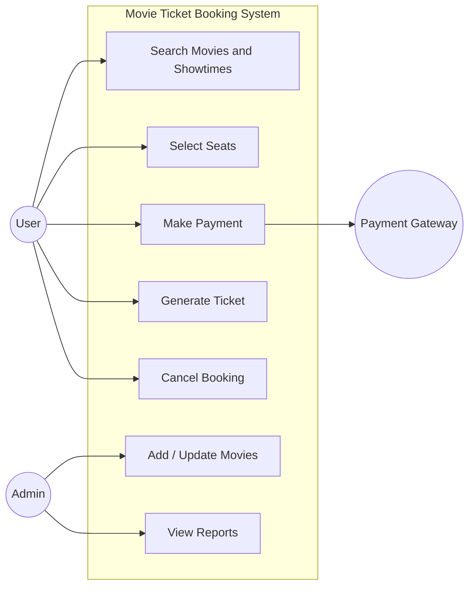
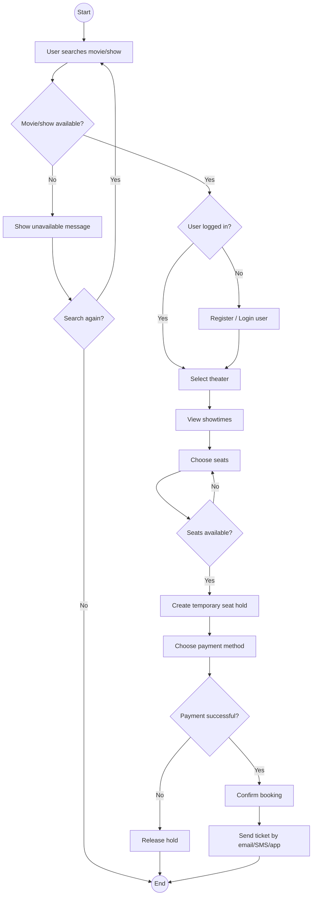
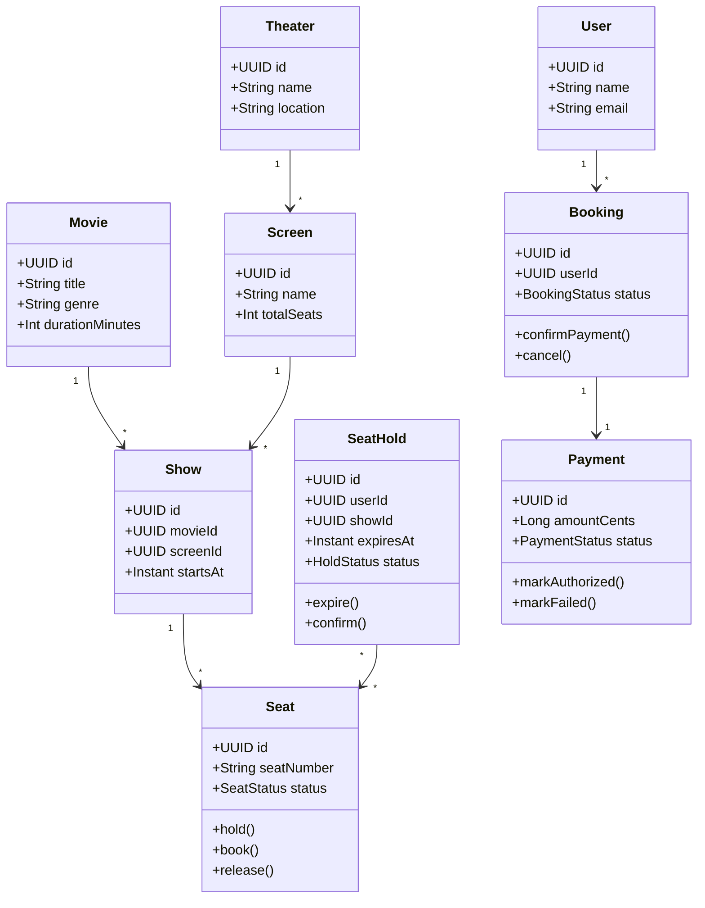
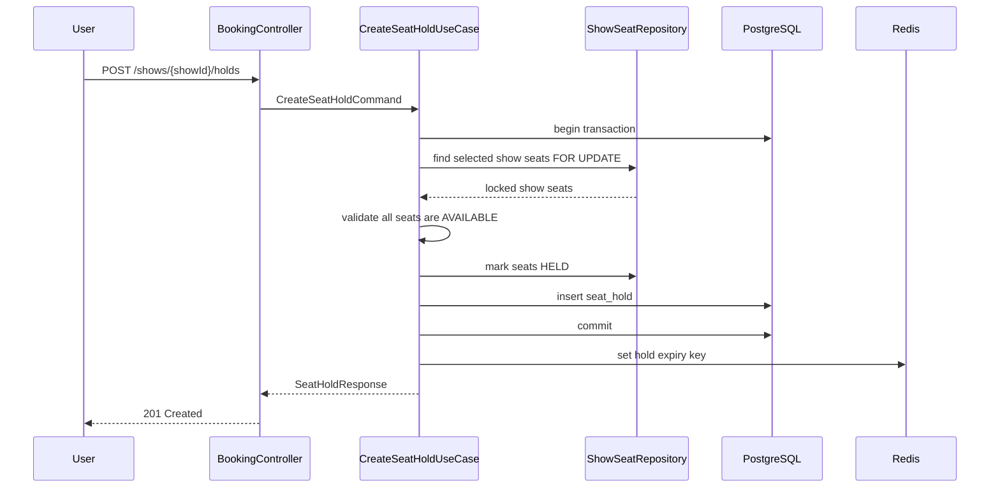
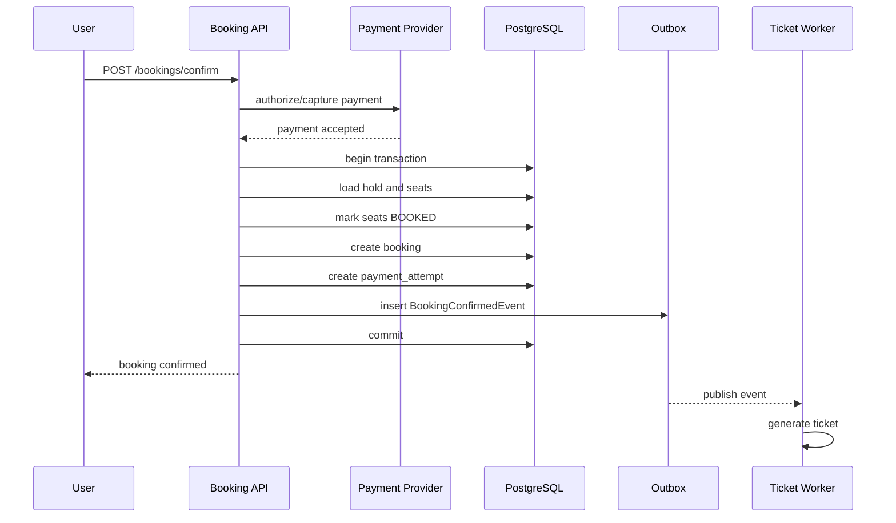
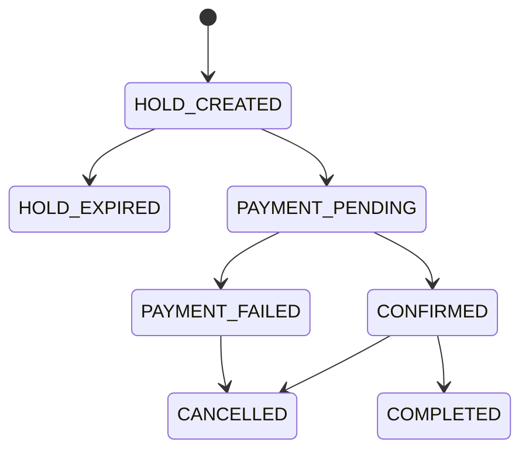

# Chapter 22 — HLD and LLD Design Playbook

### _A deep practical reference for diagrams, requirements, flows, classes, schemas, APIs, locking and design patterns_

---

## 22.1 What HLD and LLD Mean

High-Level Design (HLD) explains the system from the outside:

- Major services/components.
- Databases and storage.
- APIs and external integrations.
- Data flow between components.
- Scaling approach.
- Fault tolerance.
- Consistency trade-offs.
- Security boundaries.
- Observability.

Low-Level Design (LLD) explains how a feature is implemented inside the system:

- Classes.
- Interfaces.
- Methods.
- Database tables.
- State transitions.
- Algorithms.
- Validation rules.
- Sequence diagrams.
- Activity diagrams.
- Design patterns.
- Edge cases.

Short version:

```text
HLD = what big components exist and how they talk.
LLD = how one component/feature works internally.
```

---

## 22.2 HLD vs LLD

| Area | HLD | LLD |
|---|---|---|
| Focus | overall architecture | implementation design |
| Audience | architects, senior engineers, interviewers, product/infra teams | developers implementing feature |
| Shows | services, databases, queues, cache, external systems | classes, methods, tables, sequence flow |
| Example question | How does booking system scale? | How do we prevent double booking seats? |
| Diagram types | component, deployment, data flow | class, sequence, activity, state machine |
| Output | architecture plan | implementation blueprint |

---

## 22.3 HLD Process

Use this process in interviews and real projects.

### 1. Requirements

Functional:

- User can search.
- User can book.
- User can pay.
- User receives confirmation.
- Admin can manage inventory.

Non-functional:

- No double booking.
- Search under 300 ms.
- Payment idempotent.
- Booking data durable.
- System survives worker/payment/search failures.

### 2. Capacity assumptions

Example:

```text
10 million users
1 million daily active users
5,000 search requests per second at peak
500 booking attempts per second at peak
50 payment confirmations per second
Seat inventory must be strongly consistent
Search can be eventually consistent
```

### 3. Component design



### 4. Storage design

```text
PostgreSQL: source of truth
Redis: temporary fast state
Elasticsearch: search/read model
Kafka/RabbitMQ: async event movement
Object storage: files/tickets/images
```

### 5. Critical flow design

Always deep dive into the riskiest flow:

- Booking: seat locking.
- Delivery: driver assignment.
- Uber: live location and matching.
- Payment: idempotency and webhook.
- Chat: message delivery and ordering.
- AI: permission-safe retrieval.

---

## 22.4 LLD Process

LLD starts from one use case.

Example use case:

```text
User books two seats for a movie show.
```

LLD should answer:

- Which classes are involved?
- Which API endpoint is called?
- What request/response shape?
- What validation happens?
- What database rows are locked?
- What transaction boundary is used?
- What state transitions happen?
- What events are emitted?
- What can fail?
- How do we test it?

---

## 22.5 Use Case Diagram

Use-case diagrams show actors and what they can do.



How to read it:

- User interacts with search, seat selection, payment, ticket generation and cancellation.
- Admin manages movies and reports.
- Payment gateway is an external actor.

Use this early to define scope.

---

## 22.6 Activity Diagram

Activity diagrams show workflow and decisions.



Use this to find edge cases:

- User not logged in.
- Show unavailable.
- Seat unavailable.
- Payment failed.
- Hold expired.

---

## 22.7 Class Diagram

Class diagrams show LLD structure.



LLD question to ask: should `Seat` status be global or per show?

Correct answer: physical seat is not globally booked. Seat availability is per show. So a production schema usually has `show_seats` or `seat_inventory`:

```text
Seat = physical seat in screen
ShowSeat = seat state for one show
```

This is the kind of detail LLD catches.

---

## 22.8 Sequence Diagram: Seat Hold



Why `FOR UPDATE` matters:

- Two users may select the same seat at the same time.
- The database lock serializes the decision.
- Only one transaction can mark the seat as held/booked.

---

## 22.9 Sequence Diagram: Payment Confirmation



Payment improvement:

- Prefer provider webhooks as final truth.
- Make webhook handler idempotent.
- Store processed webhook IDs.

---

## 22.10 State Machine

Booking status:



State machines prevent invalid transitions.

Kotlin:

```kotlin
enum class BookingStatus {
    HOLD_CREATED,
    HOLD_EXPIRED,
    PAYMENT_PENDING,
    PAYMENT_FAILED,
    CONFIRMED,
    CANCELLED,
    COMPLETED
}

fun Booking.confirmPayment() {
    require(status == BookingStatus.PAYMENT_PENDING) {
        "Booking can only be confirmed from PAYMENT_PENDING"
    }
    status = BookingStatus.CONFIRMED
}
```

---

## 22.11 Database Schema LLD

```sql
CREATE TABLE shows (
    id UUID PRIMARY KEY,
    movie_id UUID NOT NULL,
    screen_id UUID NOT NULL,
    starts_at TIMESTAMPTZ NOT NULL,
    ends_at TIMESTAMPTZ NOT NULL
);

CREATE TABLE seats (
    id UUID PRIMARY KEY,
    screen_id UUID NOT NULL,
    seat_number VARCHAR(20) NOT NULL,
    row_label VARCHAR(10) NOT NULL,
    seat_type VARCHAR(30) NOT NULL,
    CONSTRAINT uk_seat_screen_number UNIQUE (screen_id, seat_number)
);

CREATE TABLE show_seats (
    id UUID PRIMARY KEY,
    show_id UUID NOT NULL REFERENCES shows(id),
    seat_id UUID NOT NULL REFERENCES seats(id),
    status VARCHAR(30) NOT NULL,
    hold_id UUID,
    version BIGINT,
    CONSTRAINT uk_show_seat UNIQUE (show_id, seat_id)
);

CREATE TABLE seat_holds (
    id UUID PRIMARY KEY,
    user_id UUID NOT NULL,
    show_id UUID NOT NULL REFERENCES shows(id),
    status VARCHAR(30) NOT NULL,
    expires_at TIMESTAMPTZ NOT NULL,
    created_at TIMESTAMPTZ NOT NULL DEFAULT now()
);

CREATE TABLE bookings (
    id UUID PRIMARY KEY,
    user_id UUID NOT NULL,
    show_id UUID NOT NULL REFERENCES shows(id),
    hold_id UUID NOT NULL REFERENCES seat_holds(id),
    status VARCHAR(30) NOT NULL,
    amount_cents BIGINT NOT NULL,
    currency CHAR(3) NOT NULL,
    idempotency_key VARCHAR(100) NOT NULL,
    created_at TIMESTAMPTZ NOT NULL DEFAULT now(),
    CONSTRAINT uk_booking_idempotency UNIQUE (user_id, idempotency_key)
);
```

Why this schema is production-minded:

- `seats` are physical seats.
- `show_seats` are per-show availability rows.
- Unique constraint prevents duplicate show-seat rows.
- `version` supports optimistic locking.
- Idempotency key prevents duplicate bookings.
- Holds have expiry.

---

## 22.12 Spring Boot LLD Implementation Sketch

Controller:

```kotlin
@RestController
@RequestMapping("/api/v1/shows/{showId}/holds")
class SeatHoldController(
    private val createSeatHoldUseCase: CreateSeatHoldUseCase
) {
    @PostMapping
    fun create(
        @PathVariable showId: UUID,
        @Valid @RequestBody request: CreateSeatHoldRequest,
        authentication: JwtAuthenticationToken
    ): ResponseEntity<SeatHoldResponse> {
        val response = createSeatHoldUseCase.create(
            request.toCommand(showId, authentication.userId())
        )

        return ResponseEntity.status(HttpStatus.CREATED).body(response)
    }
}
```

Use case:

```kotlin
@Service
class CreateSeatHoldUseCase(
    private val showSeatRepository: ShowSeatRepository,
    private val seatHoldRepository: SeatHoldRepository,
    private val clock: Clock
) {
    @Transactional
    fun create(command: CreateSeatHoldCommand): SeatHoldResponse {
        val seats = showSeatRepository.findAllForUpdate(command.showId, command.seatIds)

        if (seats.size != command.seatIds.size) {
            throw NotFoundException("One or more seats do not exist")
        }

        seats.forEach { it.hold() }

        val hold = SeatHold.create(
            userId = command.userId,
            showId = command.showId,
            seats = seats,
            expiresAt = Instant.now(clock).plus(Duration.ofMinutes(5))
        )

        val saved = seatHoldRepository.save(hold)
        return SeatHoldResponse.from(saved)
    }
}
```

Repository:

```kotlin
interface ShowSeatRepository : JpaRepository<ShowSeat, UUID> {
    @Lock(LockModeType.PESSIMISTIC_WRITE)
    @Query("""
        select ss from ShowSeat ss
        where ss.showId = :showId
        and ss.seatId in :seatIds
    """)
    fun findAllForUpdate(showId: UUID, seatIds: Set<UUID>): List<ShowSeat>
}
```

Domain:

```kotlin
@Entity
@Table(name = "show_seats")
class ShowSeat(
    @Id val id: UUID,
    val showId: UUID,
    val seatId: UUID,

    @Enumerated(EnumType.STRING)
    var status: ShowSeatStatus,

    var holdId: UUID? = null,

    @Version
    var version: Long? = null
) {
    fun hold() {
        require(status == ShowSeatStatus.AVAILABLE) {
            "Seat is not available"
        }
        status = ShowSeatStatus.HELD
    }

    fun book() {
        require(status == ShowSeatStatus.HELD) {
            "Only held seats can be booked"
        }
        status = ShowSeatStatus.BOOKED
    }

    fun release() {
        require(status == ShowSeatStatus.HELD) {
            "Only held seats can be released"
        }
        status = ShowSeatStatus.AVAILABLE
        holdId = null
    }
}
```

This is real LLD: it defines APIs, transaction, locking, repository, domain behavior and schema.

---

## 22.13 SOLID in This Design

Single Responsibility:

- Controller handles HTTP.
- Use case handles workflow.
- Entity handles state rules.
- Repository handles persistence.

Open/Closed:

- Add new payment provider by implementing `PaymentGateway`, not rewriting booking use case.

Liskov Substitution:

- Any `PaymentGateway` implementation should behave consistently.

Interface Segregation:

- `PaymentGateway` should not include unrelated refund/reporting/admin methods unless needed.

Dependency Inversion:

- Application service depends on `PaymentGateway` interface, not Stripe/Razorpay SDK directly.

---

## 22.14 Design Patterns Used

Strategy:

- Pricing strategy.
- Cancellation policy.
- Payment method handling.

Factory:

- Notification factory creates SMS/email/push sender.

Observer:

- Booking confirmed event triggers ticket generation and notifications.

Adapter:

- Stripe/Razorpay gateway adapter wraps provider SDK.

Repository:

- Database access abstraction.

Facade:

- Checkout facade can coordinate booking + payment + confirmation for simpler API code.

---

## 22.15 Edge Cases Checklist

Seat booking:

- Two users select same seat.
- Hold expires while user is paying.
- Payment succeeds but API times out.
- Payment webhook arrives twice.
- User refreshes confirm button.
- User tries to cancel after show starts.
- Admin cancels show after bookings exist.
- Search index shows stale seat availability.

Delivery:

- Driver accepts two orders at once.
- Restaurant rejects after payment.
- Payment succeeds but order creation fails.
- Driver location stops updating.
- User cancels during preparation.

AI/RAG:

- Retrieved document belongs to different tenant.
- Prompt injection inside document.
- Model returns unsupported JSON.
- Provider timeout.
- Token cost spike.

---

## 22.16 HLD/LLD Documentation Template

Copy this for every serious feature:

```text
# Feature Name

## Requirements
Functional:
Non-functional:

## HLD
Components:
Storage:
External systems:
Async workflows:
Failure behavior:

## APIs
Endpoint:
Request:
Response:
Errors:

## LLD
Classes:
Interfaces:
Methods:
State transitions:
Validation:
Transactions:
Locks:
Events:

## Database
Tables:
Indexes:
Constraints:
Migrations:

## Diagrams
Use-case:
Activity:
Sequence:
Class:
State:

## Edge Cases

## Tests
Unit:
Repository:
Integration:
Concurrency:
```

---

## 22.17 Final Mental Model

HLD should convince someone the system can scale and survive failure.

LLD should convince someone the feature can be implemented without ambiguity.

For production Spring Boot work:

```text
HLD chooses the components.
LLD defines the code.
Database constraints protect correctness.
Transactions protect critical writes.
Events decouple side effects.
Tests prove the design works under real edge cases.
```
