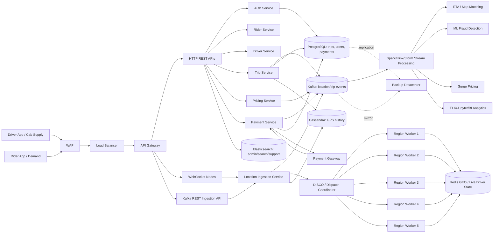
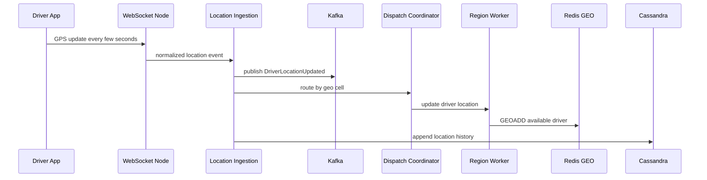
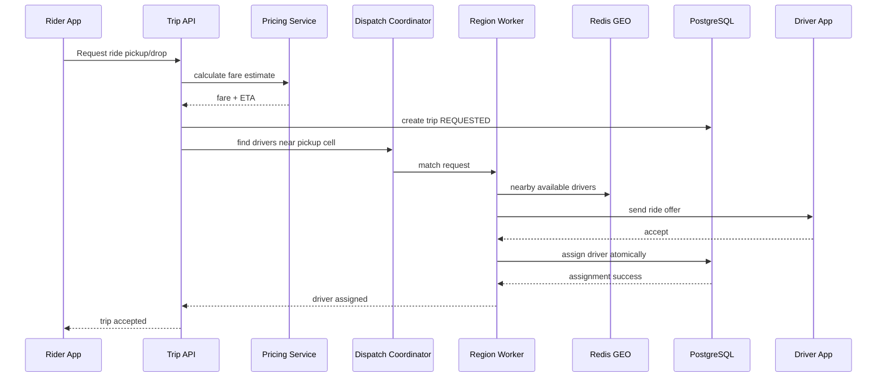
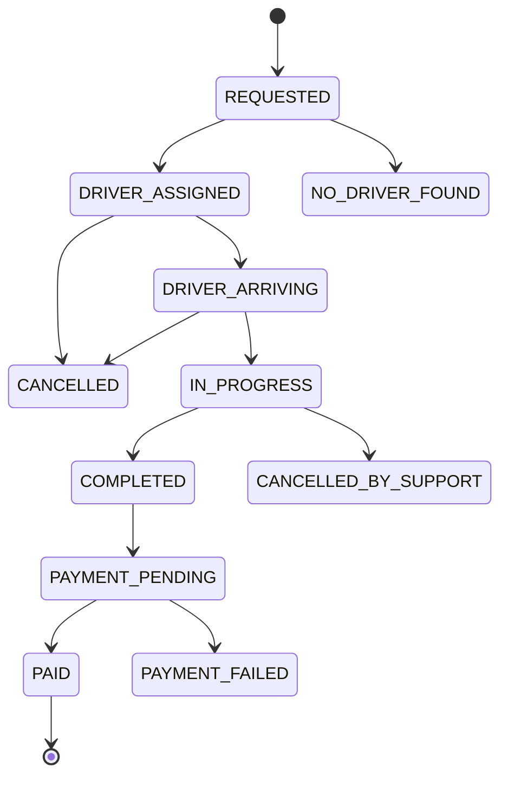

# Chapter 23 — Taxi Aggregator Uber Scale HLD

### _Uber/Ola-style system design with live location, region/cell matching, Kafka, pricing, maps, analytics, ML and production failure handling_

---

## 23.1 What This System Must Do

A taxi aggregator has two moving sides:

- Supply: drivers/cabs sending live location and availability.
- Demand: riders searching, requesting rides and tracking trips.

The hardest parts are:

- Matching rider to nearby driver quickly.
- Handling millions of GPS updates.
- Keeping trip state correct.
- Pricing dynamically.
- Handling payment safely.
- Showing live tracking.
- Running analytics, fraud detection and ETA prediction.
- Surviving partial failures.

This is not a normal CRUD app. It is a realtime, geo-distributed, event-heavy system.

---

## 23.2 Functional Requirements

Rider:

- Register/login.
- Set pickup/drop location.
- See nearby drivers.
- Get fare estimate and ETA.
- Request ride.
- Track driver.
- Pay.
- Rate driver.

Driver:

- Register/login.
- Go online/offline.
- Send GPS updates.
- Accept/reject ride.
- Navigate to pickup/drop.
- Complete ride.
- See earnings.

Admin/ops:

- View trips.
- Detect fraud.
- Monitor regions.
- Manage pricing/surge.
- Handle support and refunds.

---

## 23.3 Non-Functional Requirements

| Requirement | Target thinking |
|---|---|
| Low latency matching | nearby driver match under 1-3 seconds |
| High write throughput | GPS updates can be millions/minute |
| High availability | ride request and trip tracking should remain available |
| Strong trip correctness | one driver cannot be assigned to two active trips |
| Eventual analytics | pricing/ML/analytics can lag by seconds/minutes |
| Realtime updates | WebSocket/SSE for location/trip status |
| Disaster recovery | backup datacenter and replicated critical data |
| Security | auth, WAF, rate limits, device trust, fraud signals |

---

## 23.4 HLD Architecture



How to explain it:

- WAF blocks attacks before traffic enters the app.
- Load balancer spreads traffic across API nodes.
- API gateway applies auth, rate limits, routing and versioning.
- REST APIs handle normal request/response flows.
- WebSocket nodes handle continuous driver/rider realtime communication.
- Kafka absorbs huge event streams like GPS, trip events and payment events.
- DISCO/dispatch coordinator chooses the right region worker for a GPS cell.
- Region workers hold local live state and perform fast matching.
- Redis GEO stores current available driver positions.
- Cassandra stores historical GPS/location events.
- PostgreSQL stores durable business truth.
- Stream processing powers ETA, fraud, surge, analytics and maps.

---

## 23.5 Why DISCO / Region / Cell Exists

If all driver updates go to one matching service, it becomes a bottleneck.

So the map is partitioned:

```text
World -> country -> city -> region -> cell
```

Example:

```text
Mumbai
    Region 1
        Cell 57
        Cell 58
    Region 2
        Cell 2089
    Region 3
        Cell 187
```

The dispatch coordinator chooses a region worker using consistent hashing:

```text
hash(geoCellId) % numberOfRegionWorkers
```

Why consistent hashing:

- Same cell usually goes to same worker.
- Adding/removing workers moves fewer cells.
- Region-local matching is faster.

---

## 23.6 Location Update Flow



Important decisions:

- Current location goes to Redis/region worker.
- Historical location goes to Cassandra.
- Kafka keeps event stream for analytics/ML.
- Do not write every raw GPS update to PostgreSQL.

---

## 23.7 Ride Request Matching Flow



Critical race condition:

```text
Driver can receive multiple offers.
Only one trip assignment must win.
```

Protection options:

- PostgreSQL transaction with driver active-trip constraint.
- Redis lock with short TTL plus PostgreSQL final truth.
- Compare-and-set on driver availability state.

PostgreSQL final correctness:

```sql
CREATE UNIQUE INDEX uk_driver_one_active_trip
ON trips(driver_id)
WHERE status IN ('DRIVER_ASSIGNED', 'ARRIVING', 'IN_PROGRESS');
```

This prevents one driver from having two active trips even if app logic has a bug.

---

## 23.8 Trip State Machine



State rules belong in the domain model:

```kotlin
fun Trip.assignDriver(driverId: UUID) {
    require(status == TripStatus.REQUESTED) {
        "Driver can only be assigned to requested trip"
    }
    this.driverId = driverId
    status = TripStatus.DRIVER_ASSIGNED
}
```

---

## 23.9 Data Store Choices

| Data | Store | Why |
|---|---|---|
| Users, drivers, trips, payments | PostgreSQL | strong business truth |
| Current driver location | Redis GEO / region memory | low-latency matching |
| GPS history | Cassandra | high write volume, time-series reads |
| Trip/search/admin lookup | Elasticsearch | support/admin search |
| Location/trip/payment events | Kafka | event stream and replay |
| Driver documents/images | Object storage | files |
| Analytics | lake/warehouse/ELK/Jupyter | batch/BI |

---

## 23.10 Kafka Topics

```text
driver.location.updated
driver.availability.changed
ride.requested
ride.driver_assigned
ride.started
ride.completed
ride.cancelled
payment.authorized
payment.failed
pricing.surge.updated
fraud.signal.detected
notification.requested
```

Partitioning:

- Location events: key by `geoCellId` or `driverId`.
- Trip events: key by `tripId`.
- Driver assignment events: key by `driverId` when ordering per driver matters.

---

## 23.11 Pricing and Surge

Pricing inputs:

- Base fare.
- Distance.
- Duration.
- City.
- Vehicle type.
- Demand in cell.
- Supply in cell.
- Time of day.
- Weather/events.
- Promotions.

Surge calculation:

```text
supplyDemandRatio = activeRideRequestsInCell / availableDriversInCell
surgeMultiplier = clamp(1.0 + ratioFactor, 1.0, maxSurge)
```

Implementation:

- Redis counters for live supply/demand per cell.
- Kafka stream to aggregate demand.
- Pricing service reads current multiplier.
- Store final quoted fare in PostgreSQL when trip is created.

Do not recalculate final fare randomly after user accepts unless your product explicitly allows it.

---

## 23.12 ETA and Maps

ETA needs:

- Current driver location.
- Pickup/drop coordinates.
- Road network/map provider.
- Traffic.
- Historical trip time.
- Weather/events.

Architecture:

```text
GPS events -> Kafka -> stream processor -> ETA model/cache -> API response
```

For early version:

- Use Google Maps/Mapbox/OSRM APIs.
- Cache route estimates briefly.
- Move to internal ETA ML later.

---

## 23.13 Fraud Detection

Fraud signals:

- Fake GPS movement.
- Driver/rider collusion.
- Repeated cancellations.
- Payment chargebacks.
- Same device with many accounts.
- Impossible travel speed.
- Suspicious promo abuse.

Pipeline:

```text
Trip/location/payment events -> Kafka -> ML/Fraud service -> fraud signals -> risk score
```

Actions:

- Soft block.
- Require verification.
- Flag for review.
- Disable promotions.
- Suspend account.

---

## 23.14 Spring Boot Service Modules

```text
taxi-app/
    common/
        security/
        error/
        observability/
        outbox/
        geo/

    identity/
    rider/
    driver/
    trip/
    dispatch/
    location/
    pricing/
    payment/
    notification/
    analytics/
```

Dispatch module:

```text
dispatch/
    api/
        DispatchController.kt
    application/
        MatchRideUseCase.kt
        AssignDriverUseCase.kt
    domain/
        DriverCandidate.kt
        DispatchRegion.kt
        GeoCell.kt
    infrastructure/
        RedisDriverLocationIndex.kt
        KafkaDispatchEventPublisher.kt
```

Location module:

```text
location/
    api/
        DriverLocationWebSocketHandler.kt
    application/
        IngestDriverLocationUseCase.kt
    domain/
        DriverLocation.kt
    infrastructure/
        CassandraDriverLocationRepository.kt
        KafkaLocationPublisher.kt
```

---

## 23.15 APIs

```http
POST /api/v1/drivers/me/availability
POST /api/v1/drivers/me/location
POST /api/v1/rides/estimate
POST /api/v1/rides
POST /api/v1/rides/{rideId}/accept
POST /api/v1/rides/{rideId}/start
POST /api/v1/rides/{rideId}/complete
POST /api/v1/rides/{rideId}/cancel
GET  /api/v1/rides/{rideId}
```

Location update request:

```kotlin
data class DriverLocationRequest(
    @field:DecimalMin("-90.0")
    @field:DecimalMax("90.0")
    val latitude: Double,

    @field:DecimalMin("-180.0")
    @field:DecimalMax("180.0")
    val longitude: Double,

    @field:PositiveOrZero
    val speedMetersPerSecond: Double?,

    val recordedAt: Instant
)
```

Ride request:

```kotlin
data class RequestRideRequest(
    @field:Valid val pickup: GeoPointRequest,
    @field:Valid val drop: GeoPointRequest,
    @field:NotNull val vehicleType: VehicleType,
    @field:NotBlank val idempotencyKey: String
)
```

---

## 23.16 PostgreSQL Core Schema

```sql
CREATE TABLE drivers (
    id UUID PRIMARY KEY,
    user_id UUID NOT NULL UNIQUE,
    status VARCHAR(30) NOT NULL,
    vehicle_type VARCHAR(40) NOT NULL,
    rating NUMERIC(3,2),
    created_at TIMESTAMPTZ NOT NULL DEFAULT now()
);

CREATE TABLE trips (
    id UUID PRIMARY KEY,
    rider_id UUID NOT NULL,
    driver_id UUID,
    status VARCHAR(40) NOT NULL,
    pickup_lat DOUBLE PRECISION NOT NULL,
    pickup_lng DOUBLE PRECISION NOT NULL,
    drop_lat DOUBLE PRECISION NOT NULL,
    drop_lng DOUBLE PRECISION NOT NULL,
    quoted_amount_cents BIGINT NOT NULL,
    currency CHAR(3) NOT NULL,
    idempotency_key VARCHAR(100) NOT NULL,
    requested_at TIMESTAMPTZ NOT NULL DEFAULT now(),
    started_at TIMESTAMPTZ,
    completed_at TIMESTAMPTZ,
    version BIGINT,
    CONSTRAINT uk_trip_request_idempotency UNIQUE (rider_id, idempotency_key)
);

CREATE UNIQUE INDEX uk_driver_one_active_trip
ON trips(driver_id)
WHERE status IN ('DRIVER_ASSIGNED', 'DRIVER_ARRIVING', 'IN_PROGRESS');
```

---

## 23.17 Cassandra Location Schema

```sql
CREATE TABLE driver_location_by_day (
    driver_id uuid,
    day date,
    recorded_at timestamp,
    latitude double,
    longitude double,
    speed_mps double,
    trip_id uuid,
    geo_cell text,
    PRIMARY KEY ((driver_id, day), recorded_at)
) WITH CLUSTERING ORDER BY (recorded_at DESC);
```

Query supported:

```text
Get latest locations for driver D on day X.
```

For region analytics:

```sql
CREATE TABLE location_events_by_cell_minute (
    geo_cell text,
    bucket_minute timestamp,
    event_id uuid,
    driver_id uuid,
    latitude double,
    longitude double,
    PRIMARY KEY ((geo_cell, bucket_minute), event_id)
);
```

---

## 23.18 Failure Handling

| Failure | Behavior |
|---|---|
| Redis down | matching degraded; fall back to region memory or fail ride matching gracefully |
| Cassandra down | current matching continues; GPS history temporarily buffered |
| Kafka down | outbox/local buffer; analytics delayed |
| Payment provider down | trip can complete with payment pending based on business policy |
| Region worker down | consistent hashing remaps cells to other workers |
| WebSocket node down | clients reconnect to another node |
| PostgreSQL down | trip creation/assignment unavailable; alert immediately |

---

## 23.19 Interview Summary

For taxi aggregator HLD, always mention:

- Separate supply and demand.
- GPS update ingestion is high-write and should not go directly to PostgreSQL.
- Redis GEO/region memory for current location.
- Cassandra for location history.
- Kafka for event stream.
- Region/cell partitioning for matching.
- PostgreSQL for trip/payment correctness.
- Unique constraints to prevent double assignment.
- Stream processing for ETA, pricing, fraud and analytics.
- WebSocket for realtime tracking.
- Backup datacenter and observability.

