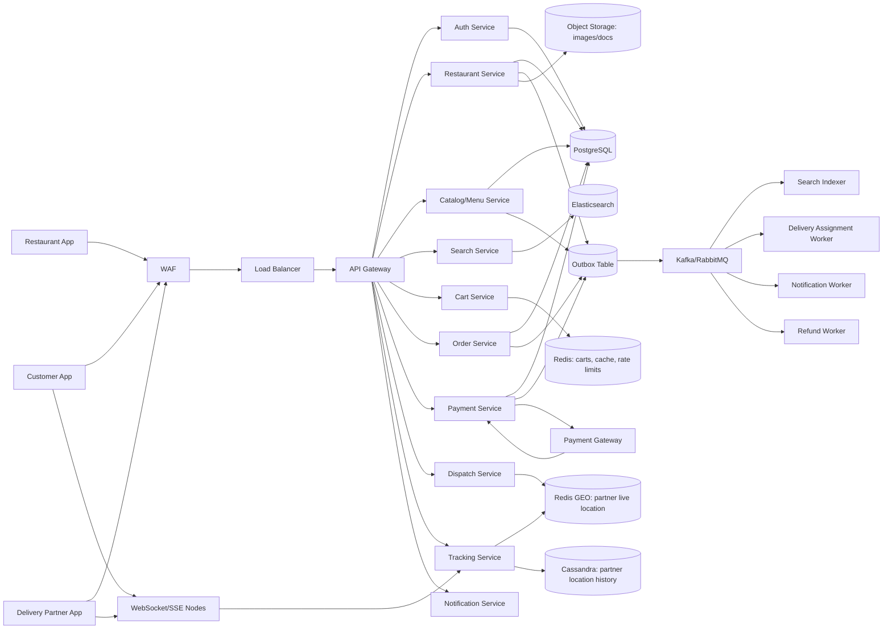
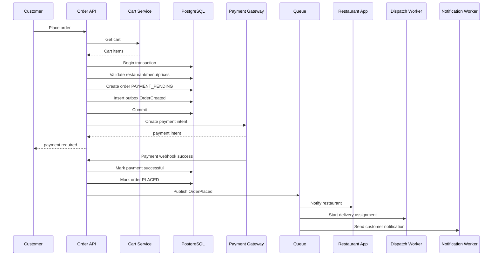
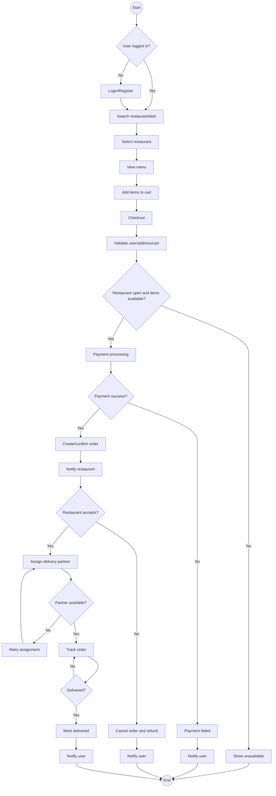
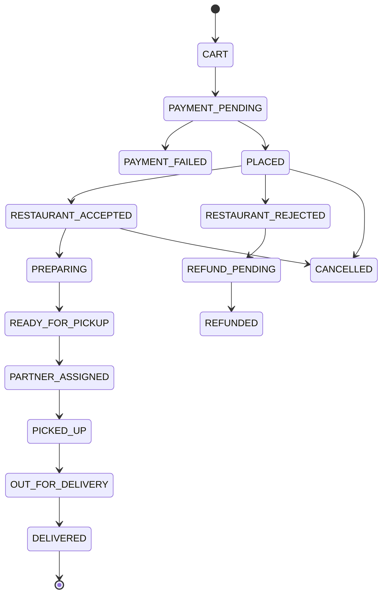
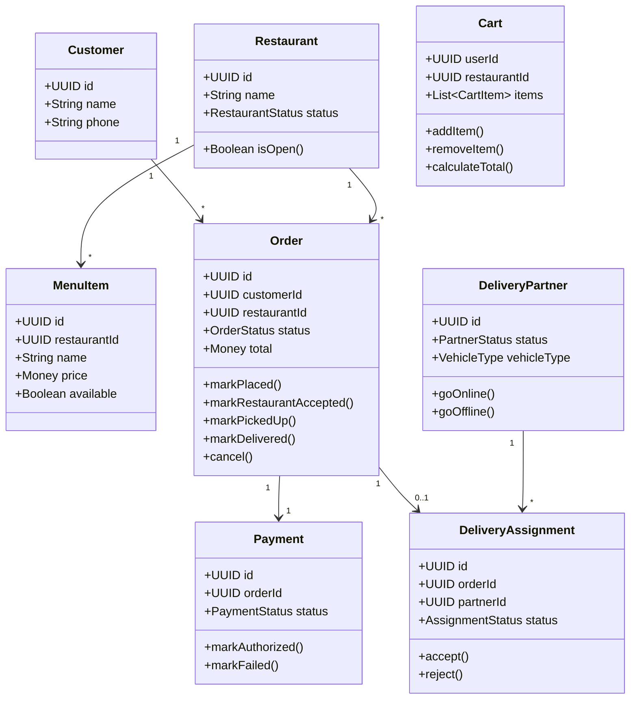
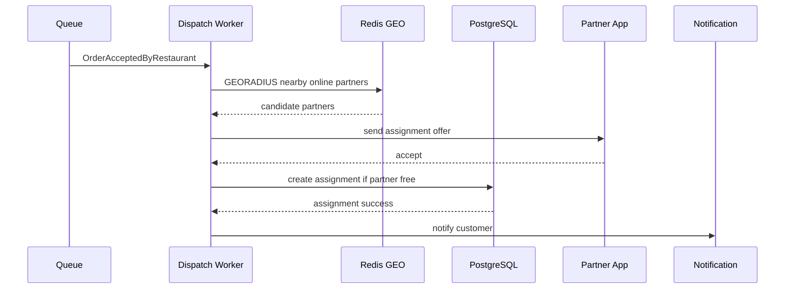

# Chapter 24 — Food Delivery App HLD and LLD Case Study

Book alignment: [[Book Alignment — Pro Spring Boot 3 with Kotlin]]

### _A complete Swiggy/Zomato/DoorDash-style design with HLD, LLD, flows, classes, APIs, schemas and Spring Boot architecture_

---

## 24.1 What This System Must Do

Food delivery has three main actors:

- Customer: searches restaurants, places order, pays, tracks delivery.
- Restaurant: manages menu, accepts/rejects order, prepares food.
- Delivery partner: accepts delivery, picks up food, delivers order.

The critical flows:

- Restaurant discovery.
- Cart and checkout.
- Payment.
- Restaurant order acceptance.
- Delivery partner assignment.
- Order tracking.
- Notifications.
- Refund/cancellation.

---

## 24.2 Functional Requirements

Customer:

- Register/login.
- Search restaurants and dishes.
- View menu.
- Add items to cart.
- Apply coupon.
- Place order.
- Pay online/COD if supported.
- Track order.
- Cancel before policy cutoff.
- Rate restaurant/delivery.

Restaurant:

- Manage profile.
- Manage menu and availability.
- Accept/reject order.
- Update preparation status.

Delivery partner:

- Go online/offline.
- Receive delivery assignment.
- Accept/reject assignment.
- Update pickup/delivery status.
- Send location updates.

Admin:

- Manage restaurants.
- View orders.
- Resolve refunds.
- View analytics.

---

## 24.3 Non-Functional Requirements

| Requirement | Design implication |
|---|---|
| Search fast | Elasticsearch + cache |
| Checkout correct | PostgreSQL transaction |
| Payment safe | idempotency + webhook verification |
| Delivery assignment fast | Redis GEO + dispatch worker |
| Tracking realtime | WebSocket/SSE + Redis pub/sub |
| Notifications reliable | Queue + retry + dead-letter |
| Menu changes visible | event-driven Elasticsearch reindex |
| High availability | stateless APIs + graceful degradation |

---

## 24.4 HLD Architecture



How to explain:

- PostgreSQL is source of truth for users, restaurants, menus, orders and payments.
- Redis stores carts, cache, rate limits and temporary state.
- Redis GEO stores current delivery partner locations.
- Elasticsearch powers restaurant/dish search.
- Queue decouples notifications, dispatch, search indexing and refunds.
- Cassandra stores location history if scale requires it.
- WebSocket/SSE gives realtime order tracking.

---

## 24.5 Main Order Flow



Important:

- Order creation and payment confirmation may be separate steps.
- Webhook can arrive late or multiple times.
- Use idempotency on order placement and payment webhook processing.

---

## 24.6 Low-Level Activity Diagram



---

## 24.7 Order State Machine



Domain method example:

```kotlin
fun Order.markRestaurantAccepted() {
    require(status == OrderStatus.PLACED) {
        "Restaurant can accept only placed orders"
    }
    status = OrderStatus.RESTAURANT_ACCEPTED
}
```

---

## 24.8 LLD Class Diagram



LLD lesson:

- `Order` owns order status transitions.
- `Payment` owns payment state.
- `DeliveryAssignment` owns assignment state.
- Do not put every state transition in one giant service method.

---

## 24.9 Spring Boot Module Structure

```text
food-delivery/
    common/
        config/
        error/
        security/
        observability/
        outbox/
        money/
        geo/

    identity/
    restaurant/
    catalog/
    search/
    cart/
    order/
    payment/
    dispatch/
    tracking/
    notification/
    review/
```

Order module:

```text
order/
    api/
        OrderController.kt
        request/
            PlaceOrderRequest.kt
            CancelOrderRequest.kt
        response/
            OrderResponse.kt

    application/
        command/
            PlaceOrderUseCase.kt
            ConfirmPaymentUseCase.kt
            AcceptRestaurantOrderUseCase.kt
            MarkOrderDeliveredUseCase.kt
        query/
            GetOrderQuery.kt
            ListUserOrdersQuery.kt
        dto/
            PlaceOrderCommand.kt

    domain/
        model/
            Order.kt
            OrderItem.kt
            OrderStatus.kt
        event/
            OrderPlacedEvent.kt
            OrderCancelledEvent.kt
            OrderDeliveredEvent.kt
        exception/
            OrderCannotBeCancelledException.kt

    infrastructure/
        persistence/
            OrderRepository.kt
        messaging/
            OrderEventPublisher.kt
```

Dispatch module:

```text
dispatch/
    application/
        AssignDeliveryPartnerUseCase.kt
        PartnerLocationIngestUseCase.kt
    domain/
        DeliveryAssignment.kt
        DeliveryPartner.kt
        PartnerLocation.kt
    infrastructure/
        redis/
            RedisPartnerLocationIndex.kt
        cassandra/
            PartnerLocationHistoryRepository.kt
        messaging/
            DispatchConsumer.kt
```

---

## 24.10 APIs

Customer:

```http
GET  /api/v1/restaurants?lat=...&lng=...&q=...
GET  /api/v1/restaurants/{restaurantId}/menu
POST /api/v1/cart/items
GET  /api/v1/cart
POST /api/v1/orders
GET  /api/v1/orders/{orderId}
POST /api/v1/orders/{orderId}/cancel
```

Restaurant:

```http
POST /api/v1/restaurants/{restaurantId}/orders/{orderId}/accept
POST /api/v1/restaurants/{restaurantId}/orders/{orderId}/reject
POST /api/v1/restaurants/{restaurantId}/orders/{orderId}/ready
PATCH /api/v1/restaurants/{restaurantId}/menu-items/{itemId}
```

Delivery partner:

```http
POST /api/v1/partners/me/availability
POST /api/v1/partners/me/location
POST /api/v1/delivery-assignments/{assignmentId}/accept
POST /api/v1/delivery-assignments/{assignmentId}/reject
POST /api/v1/delivery-assignments/{assignmentId}/picked-up
POST /api/v1/delivery-assignments/{assignmentId}/delivered
```

Payment webhook:

```http
POST /api/v1/payments/webhooks/provider-name
```

---

## 24.11 DTOs and Commands

```kotlin
data class PlaceOrderRequest(
    @field:NotNull
    val restaurantId: UUID,

    @field:NotNull
    val deliveryAddressId: UUID,

    @field:Size(max = 80)
    val couponCode: String?,

    @field:NotBlank
    val idempotencyKey: String
) {
    fun toCommand(userId: UUID): PlaceOrderCommand {
        return PlaceOrderCommand(
            userId = userId,
            restaurantId = restaurantId,
            deliveryAddressId = deliveryAddressId,
            couponCode = couponCode,
            idempotencyKey = idempotencyKey
        )
    }
}
```

```kotlin
data class PlaceOrderCommand(
    val userId: UUID,
    val restaurantId: UUID,
    val deliveryAddressId: UUID,
    val couponCode: String?,
    val idempotencyKey: String
)
```

Why request and command are separate:

- Request is HTTP shape.
- Command is application use-case input.
- Command can include authenticated user id, tenant id and idempotency key.

---

## 24.12 Place Order Use Case

```kotlin
@Service
class PlaceOrderUseCase(
    private val cartService: CartService,
    private val restaurantRepository: RestaurantRepository,
    private val menuItemRepository: MenuItemRepository,
    private val orderRepository: OrderRepository,
    private val outboxPublisher: OutboxPublisher
) {
    @Transactional
    fun place(command: PlaceOrderCommand): OrderResponse {
        orderRepository.findByUserIdAndIdempotencyKey(command.userId, command.idempotencyKey)
            ?.let { return OrderResponse.from(it) }

        val restaurant = restaurantRepository.getRequired(command.restaurantId)
        if (!restaurant.isOpen()) {
            throw ConflictException("Restaurant is closed")
        }

        val cart = cartService.getCart(command.userId)
        require(cart.restaurantId == command.restaurantId) {
            "Cart restaurant mismatch"
        }

        val menuItems = menuItemRepository.findAllById(cart.itemIds())
        val order = Order.place(
            userId = command.userId,
            restaurant = restaurant,
            cart = cart,
            menuItems = menuItems,
            idempotencyKey = command.idempotencyKey
        )

        val saved = orderRepository.save(order)

        outboxPublisher.publish(
            aggregateType = "ORDER",
            aggregateId = saved.id,
            event = OrderCreatedEvent(orderId = saved.id, restaurantId = saved.restaurantId)
        )

        return OrderResponse.from(saved)
    }
}
```

Good practice:

- Validate prices from database, not from client.
- Use idempotency key.
- Store order before payment confirmation if payment flow requires it.
- Publish through outbox, not direct queue call inside transaction.

---

## 24.13 PostgreSQL Schema

```sql
CREATE TABLE restaurants (
    id UUID PRIMARY KEY,
    name VARCHAR(160) NOT NULL,
    status VARCHAR(40) NOT NULL,
    latitude DOUBLE PRECISION NOT NULL,
    longitude DOUBLE PRECISION NOT NULL,
    created_at TIMESTAMPTZ NOT NULL DEFAULT now()
);

CREATE TABLE menu_items (
    id UUID PRIMARY KEY,
    restaurant_id UUID NOT NULL REFERENCES restaurants(id),
    name VARCHAR(160) NOT NULL,
    description TEXT,
    price_cents BIGINT NOT NULL CHECK (price_cents >= 0),
    currency CHAR(3) NOT NULL,
    available BOOLEAN NOT NULL DEFAULT true,
    version BIGINT
);

CREATE TABLE orders (
    id UUID PRIMARY KEY,
    user_id UUID NOT NULL,
    restaurant_id UUID NOT NULL REFERENCES restaurants(id),
    status VARCHAR(50) NOT NULL,
    total_amount_cents BIGINT NOT NULL,
    currency CHAR(3) NOT NULL,
    delivery_address_id UUID NOT NULL,
    idempotency_key VARCHAR(100) NOT NULL,
    created_at TIMESTAMPTZ NOT NULL DEFAULT now(),
    version BIGINT,
    CONSTRAINT uk_order_idempotency UNIQUE (user_id, idempotency_key)
);

CREATE TABLE order_items (
    id UUID PRIMARY KEY,
    order_id UUID NOT NULL REFERENCES orders(id),
    menu_item_id UUID NOT NULL REFERENCES menu_items(id),
    item_name_snapshot VARCHAR(160) NOT NULL,
    unit_price_cents BIGINT NOT NULL,
    quantity INT NOT NULL CHECK (quantity > 0)
);

CREATE TABLE payment_attempts (
    id UUID PRIMARY KEY,
    order_id UUID NOT NULL REFERENCES orders(id),
    provider VARCHAR(60) NOT NULL,
    provider_payment_id VARCHAR(160),
    status VARCHAR(50) NOT NULL,
    amount_cents BIGINT NOT NULL,
    currency CHAR(3) NOT NULL,
    created_at TIMESTAMPTZ NOT NULL DEFAULT now()
);

CREATE TABLE delivery_assignments (
    id UUID PRIMARY KEY,
    order_id UUID NOT NULL REFERENCES orders(id),
    partner_id UUID,
    status VARCHAR(50) NOT NULL,
    assigned_at TIMESTAMPTZ,
    picked_up_at TIMESTAMPTZ,
    delivered_at TIMESTAMPTZ
);
```

Snapshot fields:

- `item_name_snapshot`
- `unit_price_cents`

Why: if restaurant later changes menu name/price, the old order must still show what user bought.

---

## 24.14 Dispatch Assignment Flow



Correctness:

```sql
CREATE UNIQUE INDEX uk_partner_one_active_assignment
ON delivery_assignments(partner_id)
WHERE status IN ('ASSIGNED', 'ACCEPTED', 'PICKED_UP', 'OUT_FOR_DELIVERY');
```

This prevents a delivery partner from being assigned to two active orders.

---

## 24.15 Search Index Document

```kotlin
@Document(indexName = "restaurants")
data class RestaurantSearchDocument(
    @Id val id: String,
    @Field(type = FieldType.Text) val name: String,
    @Field(type = FieldType.Keyword) val cuisines: List<String>,
    @Field(type = FieldType.Double) val rating: Double,
    @Field(type = FieldType.Boolean) val openNow: Boolean,
    @GeoPointField val location: GeoPoint,
    @Field(type = FieldType.Text) val popularItems: List<String>
)
```

Search query examples:

- Nearby restaurants.
- Pizza restaurants open now.
- Dish search: "paneer biryani".
- Filters: rating, delivery time, cuisine, price.

Source of truth remains PostgreSQL. Elasticsearch is rebuilt from events.

---

## 24.16 Redis Usage

Keys:

```text
cart:{userId}
rate:otp:{phone}
rate:checkout:{userId}
restaurant:{restaurantId}:menu
geo:partners:available:{cityId}
order-tracking:{orderId}
lock:order:{orderId}
```

Rules:

- Cart TTL depends on product requirement.
- Rate limits always have TTL.
- Menu cache evicted on menu update event.
- Partner live location expires quickly.
- PostgreSQL remains final truth.

---

## 24.17 Kafka/RabbitMQ Events

```text
RestaurantMenuUpdated
OrderCreated
PaymentAuthorized
PaymentFailed
OrderPlaced
RestaurantAcceptedOrder
RestaurantRejectedOrder
DeliveryPartnerAssigned
OrderPickedUp
OrderDelivered
RefundRequested
NotificationRequested
```

Consumers:

- Search indexer.
- Notification worker.
- Dispatch worker.
- Refund worker.
- Analytics worker.

---

## 24.18 Edge Cases

Checkout:

- Item became unavailable after user added to cart.
- Restaurant closed during checkout.
- Price changed.
- Coupon expired.
- Payment success but API timed out.
- Payment webhook duplicate.

Restaurant:

- Restaurant rejects order after payment.
- Restaurant does not respond.
- Restaurant marks ready too early.

Dispatch:

- No partner available.
- Partner accepts then goes offline.
- Partner assigned to two orders race.
- Location updates stop.

Delivery:

- Customer unreachable.
- Wrong address.
- Order damaged.
- Refund required.

---

## 24.19 Tests You Need

Unit:

- `Order.place()` calculates total correctly.
- Invalid status transitions fail.
- Coupon rules.

Repository:

- Idempotency key uniqueness.
- Active partner assignment unique index.

Integration:

- Place order with PostgreSQL + Redis.
- Payment webhook idempotency.
- Outbox event creation.
- Dispatch assignment with Redis GEO.

Concurrency:

- Two checkout attempts with same idempotency key.
- Two assignments for same partner.
- Menu item changed while placing order.

---

## 24.20 Interview Summary

For food delivery HLD/LLD, always mention:

- Search/read path is different from checkout/write path.
- PostgreSQL stores orders/payments/menu source of truth.
- Redis stores cart/cache/rate limits/live partner locations.
- Elasticsearch powers restaurant/dish discovery.
- Queue handles dispatch, notification, indexing and refunds.
- Payment uses idempotency and webhooks.
- Delivery partner assignment needs race-condition protection.
- Order state machine prevents invalid transitions.
- Snapshot menu item price/name into order items.
- Use outbox for reliable event publishing.

