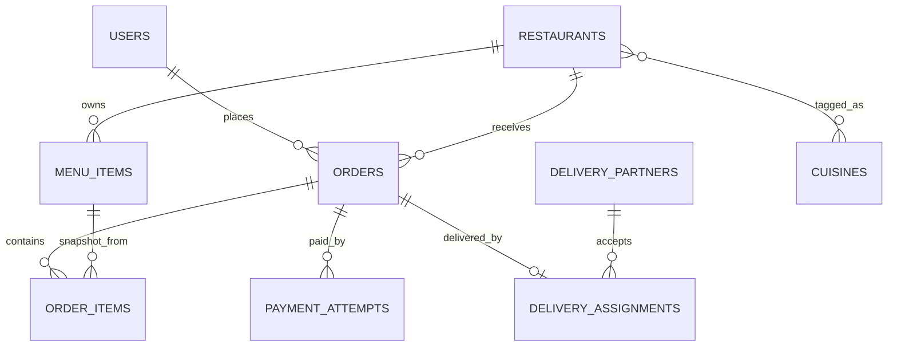
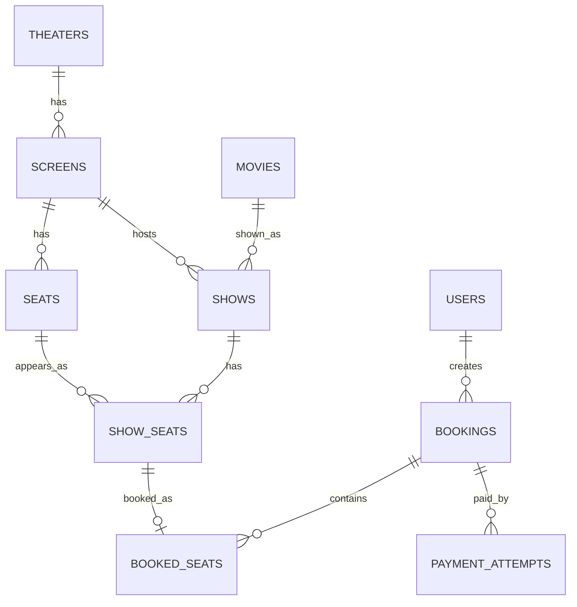

# Chapter 25 — Relationship Modeling for System Design and JPA

Book alignment: [[Book Alignment — Pro Spring Boot 3 with Kotlin]]

### _One-to-one, one-to-many, many-to-many, join tables, ownership, aggregate boundaries and real backend examples_

---

## 25.1 Why Relationships Matter in System Design

System design is not only services, Kafka and cache. A lot of production correctness comes from simple questions:

- Can one user have many orders?
- Can one order have many items?
- Can one driver have only one active trip?
- Can one restaurant have many menus?
- Can one product belong to many categories?
- Should this be a foreign key, join table, event, or duplicated read model?

If relationships are modeled badly, the app becomes hard to query, hard to scale and easy to corrupt.

---

## 25.2 Relationship Types

| Relationship | Meaning | Example |
|---|---|---|
| One-to-one | one row relates to exactly one row | user -> user_profile |
| One-to-many | one parent has many children | restaurant -> menu_items |
| Many-to-one | many children belong to one parent | orders -> user |
| Many-to-many | many rows relate to many rows | products <-> categories |
| Self-reference | row relates to same table | category -> parent_category |
| Polymorphic relation | row can relate to different entity types | review for restaurant or delivery |
| Derived/read-model relation | copied relationship for search/read speed | restaurant search document with menu item names |

---

## 25.3 One-to-One

Use one-to-one when one entity has exactly one related detail record.

Examples:

- User -> UserProfile.
- Driver -> DriverKyc.
- Restaurant -> RestaurantBankAccount.
- Order -> PaymentSummary.

Database:

```sql
CREATE TABLE users (
    id UUID PRIMARY KEY,
    email VARCHAR(180) NOT NULL UNIQUE
);

CREATE TABLE user_profiles (
    id UUID PRIMARY KEY,
    user_id UUID NOT NULL UNIQUE REFERENCES users(id),
    full_name VARCHAR(180) NOT NULL,
    avatar_url TEXT
);
```

JPA:

```kotlin
@Entity
@Table(name = "users")
class User(
    @Id val id: UUID,
    val email: String
)

@Entity
@Table(name = "user_profiles")
class UserProfile(
    @Id val id: UUID,

    @OneToOne(fetch = FetchType.LAZY)
    @JoinColumn(name = "user_id", nullable = false, unique = true)
    val user: User,

    val fullName: String,
    val avatarUrl: String?
)
```

Annotation explanation:

- `@OneToOne`: one profile points to one user.
- `@JoinColumn`: foreign key column lives on `user_profiles`.
- `unique = true`: enforces one profile per user.
- `FetchType.LAZY`: do not load profile/user until needed.

Good practice: avoid bidirectional one-to-one unless you truly need navigation from both sides.

---

## 25.4 One-to-Many / Many-to-One

This is the most common relationship.

Examples:

- User -> Orders.
- Restaurant -> MenuItems.
- Order -> OrderItems.
- Trip -> LocationEvents.
- BlogPost -> Comments.

Database:

```sql
CREATE TABLE restaurants (
    id UUID PRIMARY KEY,
    name VARCHAR(160) NOT NULL
);

CREATE TABLE menu_items (
    id UUID PRIMARY KEY,
    restaurant_id UUID NOT NULL REFERENCES restaurants(id),
    name VARCHAR(160) NOT NULL,
    price_cents BIGINT NOT NULL
);

CREATE INDEX idx_menu_items_restaurant ON menu_items(restaurant_id);
```

JPA recommended side:

```kotlin
@Entity
@Table(name = "menu_items")
class MenuItem(
    @Id val id: UUID,

    @ManyToOne(fetch = FetchType.LAZY)
    @JoinColumn(name = "restaurant_id", nullable = false)
    val restaurant: Restaurant,

    val name: String,
    val priceCents: Long
)
```

You can query children by parent id:

```kotlin
interface MenuItemRepository : JpaRepository<MenuItem, UUID> {
    fun findByRestaurantId(restaurantId: UUID): List<MenuItem>
}
```

Good practice: in many production apps, you do not need `restaurant.menuItems` as a JPA collection. Query menu items explicitly. This avoids accidental huge loads and N+1 problems.

---

## 25.5 Bidirectional One-to-Many

Use only when the parent aggregate truly owns children and you commonly modify them together.

```kotlin
@Entity
@Table(name = "orders")
class Order(
    @Id val id: UUID,

    @OneToMany(
        mappedBy = "order",
        cascade = [CascadeType.ALL],
        orphanRemoval = true
    )
    private val items: MutableList<OrderItem> = mutableListOf()
) {
    fun addItem(menuItemId: UUID, name: String, priceCents: Long, quantity: Int) {
        items.add(
            OrderItem(
                id = UUID.randomUUID(),
                order = this,
                menuItemId = menuItemId,
                itemNameSnapshot = name,
                unitPriceCents = priceCents,
                quantity = quantity
            )
        )
    }
}

@Entity
@Table(name = "order_items")
class OrderItem(
    @Id val id: UUID,

    @ManyToOne(fetch = FetchType.LAZY)
    @JoinColumn(name = "order_id", nullable = false)
    val order: Order,

    val menuItemId: UUID,
    val itemNameSnapshot: String,
    val unitPriceCents: Long,
    val quantity: Int
)
```

Annotation explanation:

- `mappedBy = "order"`: child owns the foreign key.
- `cascade = ALL`: saving order saves items.
- `orphanRemoval = true`: removing item from collection deletes it.

Use cascade carefully. It is good for `Order -> OrderItem`, dangerous for `User -> Order` because deleting a user should not casually delete financial history.

---

## 25.6 Many-to-Many

Conceptually:

```text
Product <-> Category
Student <-> Course
User <-> Role
Restaurant <-> Cuisine
```

Database requires a join table:

```sql
CREATE TABLE products (
    id UUID PRIMARY KEY,
    name VARCHAR(160) NOT NULL
);

CREATE TABLE categories (
    id UUID PRIMARY KEY,
    name VARCHAR(160) NOT NULL
);

CREATE TABLE product_categories (
    product_id UUID NOT NULL REFERENCES products(id),
    category_id UUID NOT NULL REFERENCES categories(id),
    PRIMARY KEY (product_id, category_id)
);
```

Simple JPA:

```kotlin
@Entity
class Product(
    @Id val id: UUID,

    @ManyToMany
    @JoinTable(
        name = "product_categories",
        joinColumns = [JoinColumn(name = "product_id")],
        inverseJoinColumns = [JoinColumn(name = "category_id")]
    )
    val categories: MutableSet<Category> = mutableSetOf()
)
```

Production warning: avoid direct `@ManyToMany` when the relationship has its own data.

Example: user role assignment needs metadata:

- assignedBy
- assignedAt
- expiresAt

Use explicit join entity.

```sql
CREATE TABLE user_roles (
    id UUID PRIMARY KEY,
    user_id UUID NOT NULL REFERENCES users(id),
    role_id UUID NOT NULL REFERENCES roles(id),
    assigned_by UUID,
    assigned_at TIMESTAMPTZ NOT NULL,
    expires_at TIMESTAMPTZ,
    CONSTRAINT uk_user_role UNIQUE (user_id, role_id)
);
```

JPA:

```kotlin
@Entity
@Table(name = "user_roles")
class UserRole(
    @Id val id: UUID,

    @ManyToOne(fetch = FetchType.LAZY)
    @JoinColumn(name = "user_id", nullable = false)
    val user: User,

    @ManyToOne(fetch = FetchType.LAZY)
    @JoinColumn(name = "role_id", nullable = false)
    val role: Role,

    val assignedBy: UUID?,
    val assignedAt: Instant,
    val expiresAt: Instant?
)
```

Good rule:

```text
If the relationship has attributes, model the relationship as an entity.
```

---

## 25.7 Relationship Ownership

Ownership answers:

```text
Which table has the foreign key?
Which object controls lifecycle?
Which aggregate enforces rules?
```

Examples:

| Relationship | Owner |
|---|---|
| Order -> OrderItem | Order aggregate owns items |
| Restaurant -> MenuItem | Restaurant/catalog owns menu items |
| User -> Order | Order references user; user does not own order lifecycle |
| Driver -> Trip | Trip references driver; driver does not own trip history |
| Product <-> Category | Join table owns relation |

JPA ownership:

- `@ManyToOne` side owns the foreign key.
- `mappedBy` side is inverse/read side.

Database ownership:

- Child table usually holds parent id.

Domain ownership:

- Aggregate root controls valid changes.

These are related, but not always identical.

---

## 25.8 Aggregate Boundaries

An aggregate is a cluster of objects that should change together inside one transaction.

Good aggregate:

```text
Order
    OrderItems
    DeliveryAddressSnapshot
    PriceSnapshot
```

Bad giant aggregate:

```text
User
    Orders
        Payments
        Deliveries
    Reviews
    Wallet
    Notifications
```

Why bad: loading/changing `User` should not load the user's entire business history.

Production rule:

```text
Use IDs between aggregates.
Use object references inside aggregates.
```

Example:

```kotlin
class Order(
    val userId: UUID,
    val restaurantId: UUID,
    val items: MutableList<OrderItem>
)
```

Here `userId` and `restaurantId` are references to other aggregates. `items` are inside the order aggregate.

---

## 25.9 Relationship Examples by App

### Food Delivery

```text
User 1 -> many Orders
Restaurant 1 -> many MenuItems
Order 1 -> many OrderItems
Order 1 -> one PaymentAttempt? many PaymentAttempts if retries
Order 1 -> one DeliveryAssignment
DeliveryPartner 1 -> many DeliveryAssignments
Restaurant many -> many Cuisines
```

Important design:

- `OrderItem` should store price/name snapshot.
- `PaymentAttempt` is one-to-many because payment can retry.
- `Restaurant <-> Cuisine` can use join table.

### Taxi Aggregator

```text
Rider 1 -> many Trips
Driver 1 -> many Trips
Driver 1 -> one active Trip only
Trip 1 -> many TripEvents
Trip 1 -> many LocationSnapshots
Trip 1 -> one Payment
```

Important design:

- Historical trips are many.
- Active trip uniqueness is partial unique index.
- Raw locations probably belong in Cassandra, not JPA relationship.

### Booking App

```text
Theater 1 -> many Screens
Screen 1 -> many Seats
Movie 1 -> many Shows
Show 1 -> many ShowSeats
Booking 1 -> many BookedSeats
User 1 -> many Bookings
Booking 1 -> many PaymentAttempts
```

Important design:

- Physical `Seat` is not globally available/unavailable.
- `ShowSeat` models availability per show.
- Booking references show seats through booked seat rows.

### Marketplace

```text
Seller 1 -> many Products
Product many -> many Categories
Product 1 -> many ProductImages
Order 1 -> many OrderItems
OrderItem many -> one Product
User 1 -> many Addresses
Product 1 -> many Reviews
```

Important design:

- Product category should usually be explicit join table.
- Order item stores product price snapshot.
- Product image order can be stored as `sort_order`.

---

## 25.10 ERD Example: Food Delivery



Read symbols:

- `||` means exactly one.
- `o{` means zero or many.
- `o|` means zero or one.
- `}o--o{` means many-to-many.

---

## 25.11 ERD Example: Booking



Key lesson: `SHOW_SEATS` is the relationship between `SHOWS` and `SEATS`, with status. It is not just a join table; it is a real entity because it has state.

---

## 25.12 Common Mistakes

### Mistake 1: Using many-to-many directly for everything

If relationship has metadata, create join entity.

### Mistake 2: Bidirectional relationships everywhere

This causes:

- recursion in JSON serialization,
- accidental huge loading,
- difficult debugging,
- N+1 queries.

Prefer unidirectional `@ManyToOne` plus repository query.

### Mistake 3: Cascading deletes on business history

Do not delete orders/payments when deleting user profile.

Use soft delete or anonymization for compliance.

### Mistake 4: Modeling read needs as normalized domain only

Search pages often need denormalized documents:

```text
RestaurantSearchDocument
    restaurantName
    cuisines
    popularItemNames
    rating
    openNow
    location
```

This does not replace relational source of truth.

### Mistake 5: Foreign keys across microservice databases

If services have separate databases, do not use database foreign keys across them. Store IDs and enforce consistency through APIs/events.

---

## 25.13 Fetching and N+1

Problem:

```kotlin
val orders = orderRepository.findAll()
orders.forEach { println(it.items.size) }
```

If `items` are lazy, this can run one query for orders plus one query per order.

Fix options:

Fetch join:

```kotlin
@Query("""
    select distinct o from Order o
    left join fetch o.items
    where o.id = :orderId
""")
fun findByIdWithItems(orderId: UUID): Order?
```

Projection:

```kotlin
interface OrderSummaryProjection {
    val id: UUID
    val status: String
    val totalAmountCents: Long
}
```

DTO query:

```kotlin
@Query("""
    select new com.example.OrderSummaryDto(o.id, o.status, o.total.amountCents)
    from Order o
    where o.userId = :userId
""")
fun findSummaries(userId: UUID): List<OrderSummaryDto>
```

Good practice:

- Use entities for writes.
- Use projections/DTOs for read-heavy list pages.

---

## 25.14 Relationship Decision Checklist

Ask:

1. Can one A have many B?
2. Can one B belong to many A?
3. Does the relationship have its own attributes?
4. Who owns lifecycle?
5. Should deleting parent delete child?
6. Is this inside one aggregate?
7. Do I need strong consistency?
8. Is this query-heavy and better as a read model?
9. Will this relationship cross microservice boundaries?
10. Do I need a unique constraint to enforce business rules?

Examples:

```text
One driver can have many trips historically.
One driver can have only one active trip.
```

This needs:

- normal `trips.driver_id` for history,
- partial unique index for active trip.

```sql
CREATE UNIQUE INDEX uk_driver_one_active_trip
ON trips(driver_id)
WHERE status IN ('DRIVER_ASSIGNED', 'ARRIVING', 'IN_PROGRESS');
```

---

## 25.15 Quick Rules

- Start with database truth, not only object diagrams.
- Prefer `@ManyToOne(fetch = LAZY)` over large bidirectional collections.
- Use join entity when the relationship has metadata/state.
- Use database constraints for business invariants.
- Use IDs between aggregates.
- Use snapshots for historical records like order item price.
- Use denormalized read models for search and fast screens.
- Avoid cascading deletes for financial/business history.
- Model "active only one" rules with unique/partial indexes.
- In system design, explain both cardinality and consistency.

