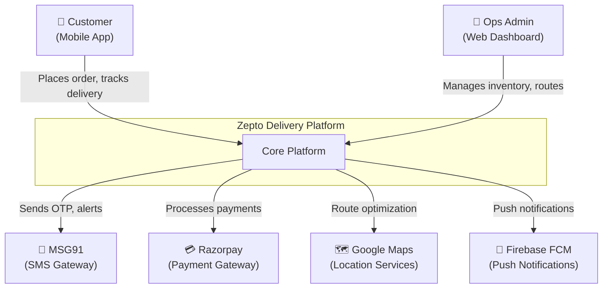
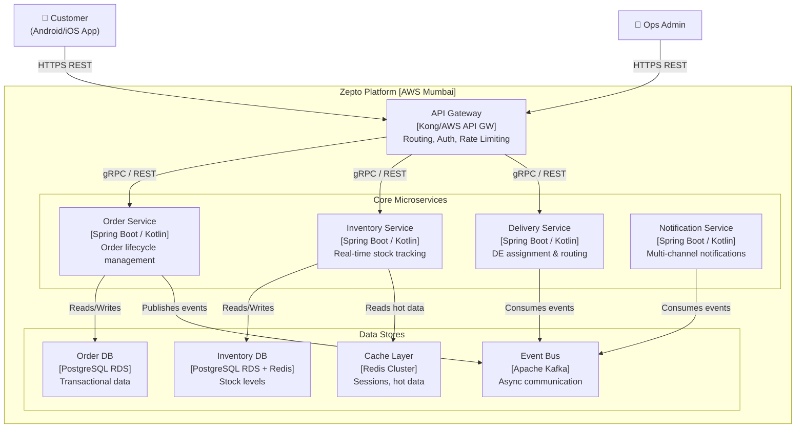
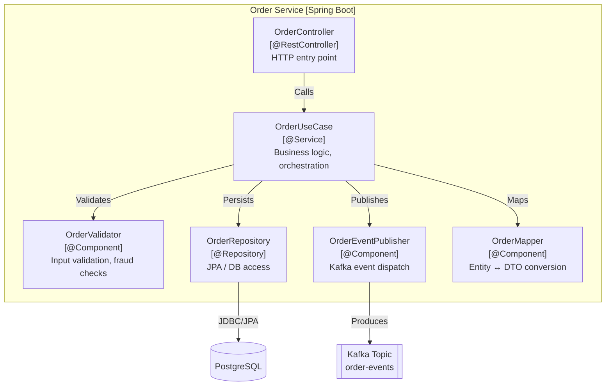
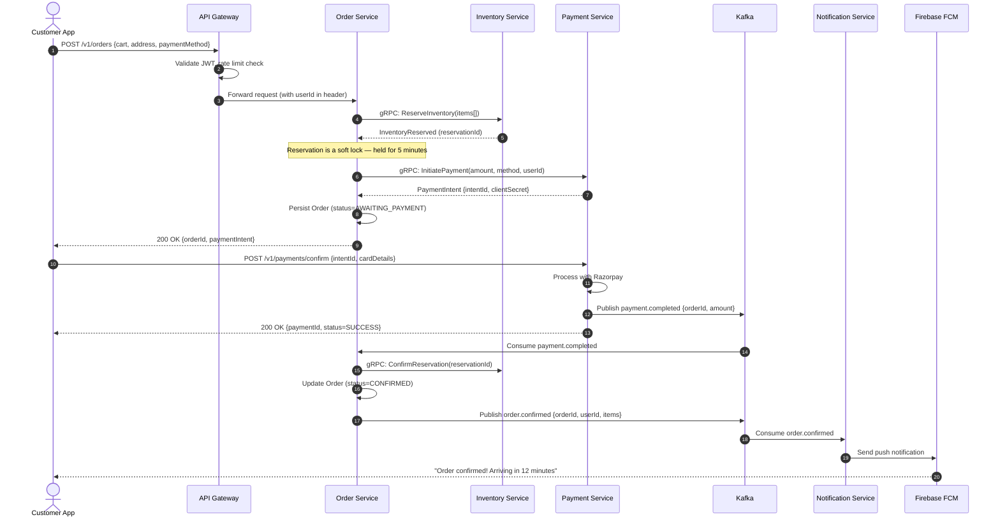
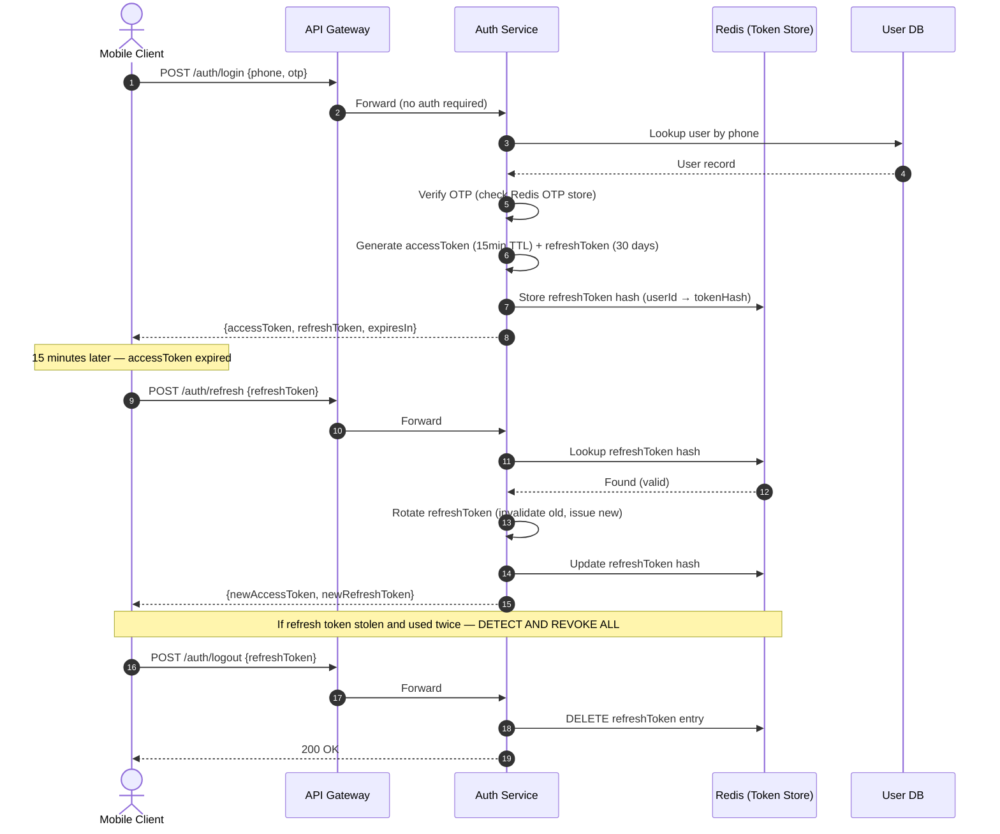
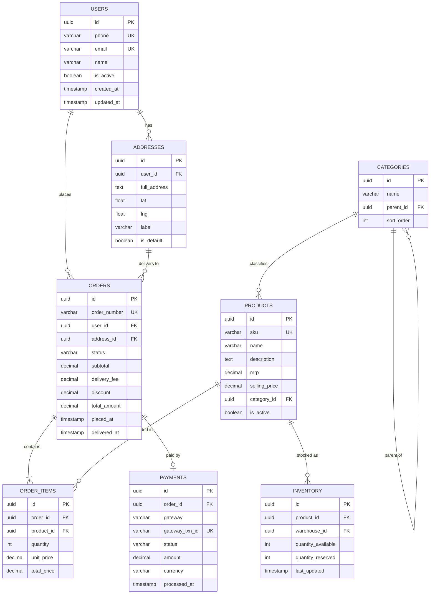
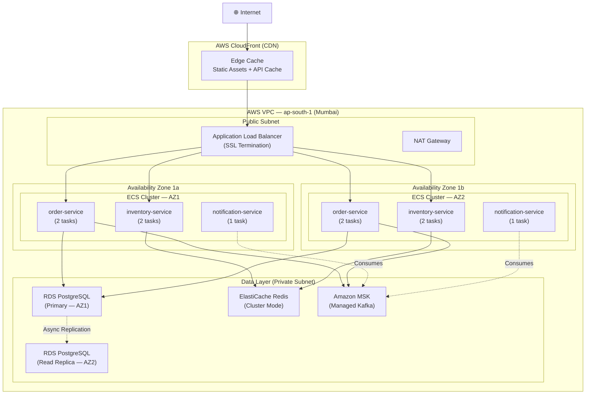
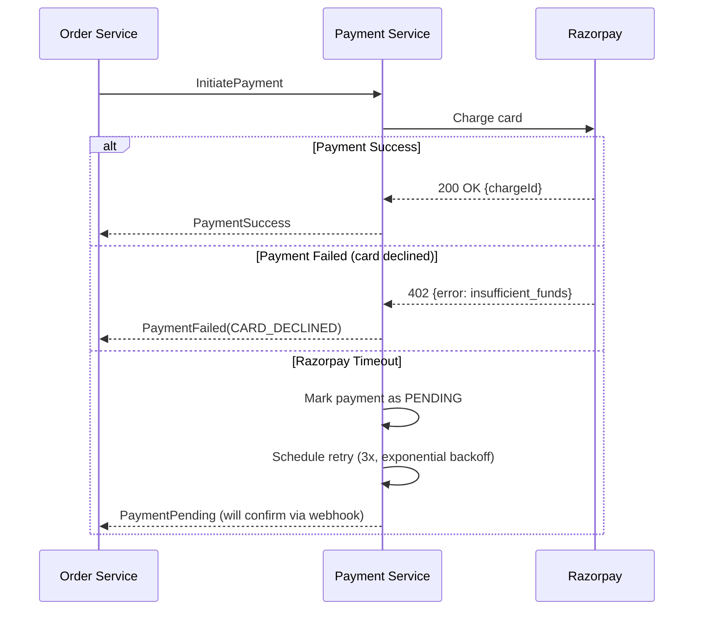

# SD-1 — System Design: Creating Architecture Diagrams

Book alignment: [[Book Alignment — Pro Spring Boot 3 with Kotlin]]

> **Reference Guide** — Production engineering reference for a technical founder. This is not interview prep. This is how you communicate systems to your team, investors, and future engineers.

---

## Why Architecture Diagrams Matter in Production

At Uber, every service owns a **service catalog entry** — a living document with diagrams that describe context, dependencies, data flows, and deployment topology. When an incident happens at 2 AM, engineers don't read code first — they read diagrams.

Architecture diagrams serve three critical purposes:
1. **Onboarding** — A new engineer understands the system in 10 minutes instead of 10 days
2. **Incident Response** — Blast radius analysis: what breaks when service X goes down?
3. **Design Review** — Force clarity before writing code. If you can't draw it, you can't build it.

> [!WARNING]
> The most dangerous state a system can be in is one where the architecture only exists in one person's head. That person is a single point of failure. Document everything.

---

## The C4 Model — The Industry Standard for Software Architecture

The C4 model (by Simon Brown) gives you a **hierarchy of diagrams** at four zoom levels. Each level answers a different question. Used by teams at ThoughtWorks, Monzo, and most serious engineering orgs.

### Level 1: System Context Diagram

**Question it answers:** What does this system do, and who/what interacts with it?

This is the 30,000-foot view. No internal details. Just: your system, users, and external systems.

**When to use it:**
- Presenting to non-technical stakeholders (CEO, investors)
- Onboarding new team members
- Documentation root



> [!NOTE]
> At this level, you are NOT showing databases, microservices, or internal APIs. One box. That's the whole system.

---

### Level 2: Container Diagram

**Question it answers:** What are the high-level technical building blocks? How do they communicate?

A "container" in C4 is NOT Docker — it's any runnable/deployable unit: a web app, API, database, mobile app, message queue.

**When to use it:**
- Technical design reviews
- Defining service boundaries
- Infrastructure planning



---

### Level 3: Component Diagram

**Question it answers:** What are the major components *inside* a specific container?

You only draw this for complex services. Don't do this for every service — only the ones where internal structure is unclear or contentious.



> [!IMPORTANT]
> Component diagrams should follow your actual package/class structure. If the diagram doesn't match the code, the diagram is useless — it becomes misleading. Make it autogenerable if possible (tools like Structurizr can parse code).

---

### Level 4: Code Diagram

The C4 model allows a Code level, but **Simon Brown himself recommends skipping this** unless you have a very complex algorithm. Modern IDEs generate UML from code. Don't manually maintain code-level diagrams.

**Exception:** Use a sequence diagram instead (see below) — it's more useful for showing runtime behavior.

---

## Sequence Diagrams — API Flow Documentation

Sequence diagrams are the most useful diagrams for day-to-day engineering. They show:
- The exact order of calls
- Who calls whom
- What data is passed
- Where errors can occur
- Synchronous vs async boundaries

> [!IMPORTANT]
> Every API you expose externally should have a sequence diagram. When you onboard a payments partner, they will ask for this. When you integrate with Twilio or Razorpay, draw the webhook flow first.

### Example: Zepto-Style Order Placement Flow



> [!NOTE]
> The `autonumber` keyword in Mermaid adds step numbers automatically — essential for referencing specific steps in incident postmortems or design reviews.

### Example: Authentication Flow (JWT + Refresh Token)



---

## ER Diagrams — Database Schema Communication

Entity-Relationship diagrams are how you communicate your data model to:
- Backend engineers implementing new features
- DBAs reviewing schema design
- Anyone doing a data migration

> [!WARNING]
> Do NOT use your ORM entity classes as a substitute for an ER diagram. ORM code hides the actual schema — foreign keys, constraints, indexes. Draw the real SQL schema.

### Example: E-commerce Core Schema



> [!CAUTION]
> A common schema design mistake: storing `address` as a plain text field in the orders table. This makes analytics and re-order impossible. Always snapshot the address at order time as a separate FK or JSON blob with all fields.

---

## Deployment Architecture Diagrams

Deployment diagrams show WHERE things run — which cloud, which region, which availability zone, how traffic flows from the internet to your services.

This is what your DevOps/SRE team needs. This is also what you review during disaster recovery planning.

### Example: AWS Multi-AZ Deployment



> [!WARNING]
> If your deployment diagram shows all services running in ONE availability zone, that is a single point of failure. AWS SLA for single-AZ is meaningless. You need at minimum 2 AZs for any production workload.

---

## Diagram Tools — When to Use What

| Tool | Best For | Drawbacks |
|------|----------|-----------|
| **Mermaid in Obsidian** | Living docs, version-controlled diagrams, ADRs | Limited styling, no drag-drop |
| **draw.io (diagrams.net)** | Complex deployment diagrams, formal docs | Not version-control friendly without XML |
| **Excalidraw** | Whiteboard sessions, rough ideation, team meetings | Too informal for formal docs |
| **Structurizr** | Auto-generating C4 diagrams from code | Requires learning DSL |
| **Lucidchart** | Enterprise presentations | Expensive, closed format |
| **PlantUML** | UML purists, CI-generated diagrams | Ugly by default |

> [!TIP]
> **The golden rule for production teams:** All architecture diagrams must be committed to the repository as code (Mermaid/PlantUML), not as image files. Images become stale; code can be reviewed and diffed.

---

## When to Draw Which Diagram

```
PLANNING PHASE:
  → C4 Context       (week 1 of any project)
  → C4 Container     (before writing any code)
  → ER Diagram       (before creating any migrations)

DESIGN REVIEW:
  → Sequence Diagram (before implementing any API endpoint)
  → C4 Component     (before splitting a monolith)

PRODUCTION:
  → Deployment Diagram (before going live, then keep updated)
  → Runbook Diagrams   (for incident response)

SCALING DECISIONS:
  → Updated Container Diagram showing new services
  → Updated Deployment Diagram showing new regions
```

---

## Common Mistakes in Architecture Diagrams

### Mistake 1: Showing "the database" as one box

Wrong:
```
OrderService → [Database]
```

Right:
```
OrderService → [PostgreSQL RDS - orders_db]
             → [Redis - session cache]
             → [S3 - order attachments]
```

Different databases have different failure modes, SLAs, and ownership. Lumping them together hides operational complexity.

---

### Mistake 2: Not showing data flow direction

Arrows without labels are noise. Always label:
- What data flows? (`orderId`, `userId`, `events`)
- What protocol? (`gRPC`, `HTTPS`, `Kafka`)
- Sync or async? (solid arrow = sync, dashed = async)

---

### Mistake 3: Mixing abstraction levels

Don't show both "API Gateway" and "OrderController" on the same Container diagram. Those are at different C4 levels. Pick a level and stay there.

---

### Mistake 4: Stale diagrams

A diagram that doesn't match reality is worse than no diagram. It actively misleads engineers during incidents. Solutions:
- **Treat diagrams as code** (Mermaid in Git)
- **Add diagram update as part of PR checklist**
- **Monthly architecture review** to sync diagrams with reality

> [!CAUTION]
> At Blinkit scale (15-minute delivery), the architecture changes weekly. If your diagrams aren't owned, they rot within a month. Assign a diagram owner for each domain.

---

### Mistake 5: No actor perspective

Every diagram should answer: **"Who is the human using this system?"**

Add the end user/actor to every Context and Sequence diagram. Engineers forget systems exist to serve humans, not just to be technically elegant.

---

### Mistake 6: Happy path only

Your sequence diagram should always show:
- What happens when the external service (Razorpay) is down?
- What happens when the DB query times out?
- What's the retry strategy?



---

## Architecture Decision Records (ADRs)

Always pair your diagrams with ADRs. An ADR is a short document that explains:
1. **Context** — What problem were we solving?
2. **Decision** — What did we decide?
3. **Consequences** — What are the tradeoffs?

Template:

```markdown
# ADR-001: Use Kafka for async order events

## Status: Accepted

## Context
Order service needs to notify inventory, delivery, and notification services 
when an order is placed. Direct HTTP calls create tight coupling and 
cascading failures.

## Decision
Use Apache Kafka (MSK) as the event bus. Order service publishes to 
`order-events` topic. Each downstream service is an independent consumer group.

## Consequences
- (+) Services are decoupled; downstream outage doesn't affect order placement
- (+) Event replay possible for debugging and new service onboarding
- (-) Added operational complexity (Kafka cluster management)
- (-) Eventual consistency: notification may arrive 1-2 seconds after order
- (-) Debugging requires Kafka tooling knowledge
```

> [!IMPORTANT]
> ADRs + diagrams together are the foundation of institutional knowledge. When your company scales from 5 to 50 engineers, this is what preserves architecture integrity. Companies like Spotify and Netflix have hundreds of ADRs.

---

## Diagram Checklist Before Any System Goes Live

- [ ] C4 Context diagram exists and is accurate
- [ ] C4 Container diagram shows all services and data stores
- [ ] Deployment diagram shows AZs, load balancers, and data replication
- [ ] ER diagram matches current migration scripts
- [ ] Sequence diagrams exist for all external-facing APIs
- [ ] All diagrams are committed to the repository (not just in Confluence)
- [ ] Failure scenarios are shown in critical sequence diagrams
- [ ] Diagrams were reviewed by at least 2 engineers in the last sprint
- [ ] An ADR exists for every major architectural decision

---

## Summary

| Diagram Type | Level | Primary Audience | Frequency of Update |
|---|---|---|---|
| C4 Context | High | CTO, investors, new hires | Quarterly |
| C4 Container | Mid | All engineers | Per major feature |
| C4 Component | Low | Service owners | Per service refactor |
| Sequence | Runtime | Backend engineers | Per API change |
| ER Diagram | Data | Backend + DBA | Per migration |
| Deployment | Infra | DevOps + SRE | Per infra change |
| ADR | Decision | All | Per major decision |

The best diagram is the one that is **correct, committed, and reviewed**. One accurate diagram is worth more than ten beautiful but stale ones.
