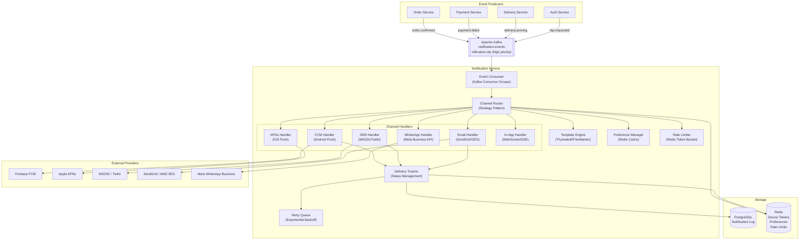

# SD-6 — System Design: Notification System

Book alignment: [[Book Alignment — Pro Spring Boot 3 with Kotlin]]

> **Production Engineering Reference** — A notification system is one of the most deceptively complex services you will build. When it works, nobody notices. When it fails (missed OTPs, duplicate notifications, marketing spam during midnight), your users churn. This chapter covers every layer of a production notification system.

---

## Why Notifications Are Hard

Zepto sends ~10 million notifications per day. They include:
- Order confirmed (push + SMS)
- OTP for login (SMS — CRITICAL, < 10 second SLA)
- Delivery partner arriving (push)
- Payment failed (push + SMS + email)
- Weekly offers (push + email — LOW priority)

The complexity comes from:
1. **Multiple channels** — FCM, APNs, SMS, Email, WhatsApp, In-App
2. **Priority variance** — OTP cannot wait behind marketing
3. **User preferences** — opt-out of specific channels or categories
4. **Rate limiting** — don't spam users
5. **Delivery tracking** — did the user actually receive it?
6. **Retry logic** — what if FCM is down for 30 seconds?
7. **Template management** — localization, variable substitution
8. **Device management** — users have multiple devices, tokens expire

---

## High-Level Architecture



---

## Notification Types and Channels

### Channel Characteristics

| Channel | Latency | Cost | Reliability | Best For |
|---|---|---|---|---|
| **FCM (Android Push)** | 100ms-5s | Very Low | ~95% delivery | Order updates, offers |
| **APNs (iOS Push)** | 100ms-5s | Very Low | ~95% delivery | Same as FCM |
| **SMS** | 3-30s | High (₹0.12/msg) | ~99% delivery | OTP, critical alerts |
| **Email** | 1s-5min | Low | ~85% open rate | Receipts, reports |
| **WhatsApp Business** | 1-3s | Medium | ~95% open rate | Rich notifications |
| **In-App** | <100ms | Free | 100% (if online) | Real-time updates |

> [!WARNING]
> Never use FCM/push for OTPs as the primary delivery channel. Push notifications can be delayed by hours if the device is in Doze mode (Android) or background app refresh is off (iOS). OTP **must** go via SMS as primary, push as supplementary.

---

## Domain Model

### Notification Entity

```kotlin
package com.yourcompany.notification.domain

import jakarta.persistence.*
import java.time.Instant
import java.util.UUID

@Entity
@Table(
    name = "notifications",
    indexes = [
        Index(name = "idx_notifications_user_id", columnList = "user_id"),
        Index(name = "idx_notifications_status", columnList = "status"),
        Index(name = "idx_notifications_created_at", columnList = "created_at"),
    ]
)
data class NotificationEntity(
    @Id
    val id: UUID = UUID.randomUUID(),

    @Column(name = "user_id", nullable = false)
    val userId: Long,

    @Enumerated(EnumType.STRING)
    @Column(nullable = false, length = 30)
    val type: NotificationType,

    @Enumerated(EnumType.STRING)
    @Column(nullable = false, length = 20)
    val channel: NotificationChannel,

    @Enumerated(EnumType.STRING)
    @Column(nullable = false, length = 20)
    var status: NotificationStatus = NotificationStatus.PENDING,

    @Column(name = "template_id", nullable = false)
    val templateId: String,

    @Column(name = "template_variables", columnDefinition = "jsonb")
    val templateVariables: String, // JSON string of variable map

    @Column(name = "recipient", nullable = false)
    val recipient: String, // phone/email/deviceToken

    @Column(name = "rendered_title")
    var renderedTitle: String? = null,

    @Column(name = "rendered_body")
    var renderedBody: String? = null,

    @Column(name = "provider_message_id")
    var providerMessageId: String? = null, // FCM message ID, SMS message SID

    @Column(name = "failure_reason")
    var failureReason: String? = null,

    @Column(name = "retry_count")
    var retryCount: Int = 0,

    @Column(name = "next_retry_at")
    var nextRetryAt: Instant? = null,

    @Column(name = "created_at", nullable = false)
    val createdAt: Instant = Instant.now(),

    @Column(name = "sent_at")
    var sentAt: Instant? = null,

    @Column(name = "delivered_at")
    var deliveredAt: Instant? = null,
)

enum class NotificationType {
    ORDER_CONFIRMED, ORDER_CANCELLED, ORDER_DELIVERED,
    PAYMENT_SUCCESS, PAYMENT_FAILED,
    DELIVERY_ARRIVING, DELIVERY_PARTNER_ASSIGNED,
    OTP, PASSWORD_RESET,
    PROMOTIONAL, SYSTEM_ALERT
}

enum class NotificationChannel { FCM, APNS, SMS, EMAIL, WHATSAPP, IN_APP }

enum class NotificationStatus { PENDING, SENT, DELIVERED, FAILED, CANCELLED }
```

### Device Token Entity

```kotlin
@Entity
@Table(
    name = "device_tokens",
    uniqueConstraints = [UniqueConstraint(columnNames = ["user_id", "device_id"])],
    indexes = [Index(name = "idx_device_tokens_user_id", columnList = "user_id")]
)
data class DeviceToken(
    @Id
    val id: UUID = UUID.randomUUID(),

    @Column(name = "user_id", nullable = false)
    val userId: Long,

    @Column(name = "device_id", nullable = false) // Unique per physical device
    val deviceId: String,

    @Column(name = "token", nullable = false, length = 512)
    var token: String, // FCM registration token (can change)

    @Enumerated(EnumType.STRING)
    @Column(nullable = false, length = 10)
    val platform: Platform,

    @Column(name = "is_active")
    var isActive: Boolean = true,

    @Column(name = "app_version")
    val appVersion: String,

    @Column(name = "last_seen_at")
    var lastSeenAt: Instant = Instant.now(),

    @Column(name = "created_at")
    val createdAt: Instant = Instant.now(),
)

enum class Platform { ANDROID, IOS }
```

### User Notification Preferences

```kotlin
@Entity
@Table(name = "notification_preferences")
data class NotificationPreference(
    @Id
    val id: UUID = UUID.randomUUID(),

    @Column(name = "user_id", nullable = false, unique = true)
    val userId: Long,

    // Per-channel opt-in/out
    @Column(name = "push_enabled")
    var pushEnabled: Boolean = true,

    @Column(name = "sms_enabled")
    var smsEnabled: Boolean = true,

    @Column(name = "email_enabled")
    var emailEnabled: Boolean = true,

    @Column(name = "whatsapp_enabled")
    var whatsappEnabled: Boolean = false,

    // Per-category opt-in/out
    @Column(name = "promotional_enabled")
    var promotionalEnabled: Boolean = true,

    @Column(name = "order_updates_enabled")
    var orderUpdatesEnabled: Boolean = true,  // Critical — cannot disable in most jurisdictions

    // Quiet hours (don't send marketing during these hours)
    @Column(name = "quiet_hours_start")
    var quietHoursStart: Int? = 22, // 10 PM

    @Column(name = "quiet_hours_end")
    var quietHoursEnd: Int? = 8,    // 8 AM

    @Column(name = "timezone")
    var timezone: String = "Asia/Kolkata",
)
```

---

## Kafka Event Structure

```kotlin
// Notification event published by any service
data class NotificationEvent(
    val eventId: String = UUID.randomUUID().toString(),
    val userId: Long,
    val type: NotificationType,
    val priority: NotificationPriority,
    val channels: List<NotificationChannel>, // preferred channels
    val templateId: String,
    val templateVariables: Map<String, String>,
    val idempotencyKey: String, // Prevent duplicate notifications
    val scheduledAt: Instant? = null, // null = send now
    val expiresAt: Instant? = null, // don't send if expired
    val metadata: Map<String, String> = emptyMap(),
)

enum class NotificationPriority { CRITICAL, HIGH, NORMAL, LOW }
```

### Kafka Topic Strategy

```yaml
# Priority queues via separate Kafka topics
notification-otp:
  partitions: 12
  replication-factor: 3
  config:
    retention.ms: 300000  # 5 minutes — OTP events expire fast
    min.insync.replicas: 2

notification-transactional:  # Order updates, payment confirmations
  partitions: 24
  replication-factor: 3
  config:
    retention.ms: 86400000  # 24 hours

notification-promotional:  # Marketing, offers
  partitions: 12
  replication-factor: 2
  config:
    retention.ms: 3600000   # 1 hour — stale promos not worth retrying
```

> [!IMPORTANT]
> **Separate Kafka topics for different priorities.** If OTP events share a topic with promotional events, a promotional batch can flood the consumer lag and delay OTPs. In production, an OTP delayed by 30 seconds means users call support and abandon login.

---

## Kafka Consumer Configuration

```kotlin
package com.yourcompany.notification.consumer

import org.apache.kafka.clients.consumer.ConsumerConfig
import org.springframework.context.annotation.Bean
import org.springframework.context.annotation.Configuration
import org.springframework.kafka.config.ConcurrentKafkaListenerContainerFactory
import org.springframework.kafka.core.ConsumerFactory
import org.springframework.kafka.core.DefaultKafkaConsumerFactory
import org.springframework.kafka.listener.DefaultErrorHandler
import org.springframework.util.backoff.ExponentialBackOff

@Configuration
class KafkaConsumerConfig {

    @Bean("otpKafkaListenerFactory")
    fun otpConsumerFactory(): ConcurrentKafkaListenerContainerFactory<String, NotificationEvent> {
        val factory = ConcurrentKafkaListenerContainerFactory<String, NotificationEvent>()
        factory.consumerFactory = DefaultKafkaConsumerFactory(
            mapOf(
                ConsumerConfig.BOOTSTRAP_SERVERS_CONFIG to "kafka:9092",
                ConsumerConfig.GROUP_ID_CONFIG to "notification-service-otp",
                ConsumerConfig.AUTO_OFFSET_RESET_CONFIG to "earliest",
                ConsumerConfig.MAX_POLL_RECORDS_CONFIG to "10", // Low for OTP — process fast
                ConsumerConfig.FETCH_MAX_WAIT_MS_CONFIG to "100", // Don't batch wait
            )
        )
        factory.setConcurrency(4) // 4 threads for OTP consumer
        factory.setCommonErrorHandler(
            DefaultErrorHandler(ExponentialBackOff(100L, 2.0).apply { maxElapsedTime = 5000L })
        )
        return factory
    }

    @Bean("promotionalKafkaListenerFactory")
    fun promotionalConsumerFactory(): ConcurrentKafkaListenerContainerFactory<String, NotificationEvent> {
        val factory = ConcurrentKafkaListenerContainerFactory<String, NotificationEvent>()
        factory.consumerFactory = DefaultKafkaConsumerFactory(
            mapOf(
                ConsumerConfig.BOOTSTRAP_SERVERS_CONFIG to "kafka:9092",
                ConsumerConfig.GROUP_ID_CONFIG to "notification-service-promotional",
                ConsumerConfig.AUTO_OFFSET_RESET_CONFIG to "earliest",
                ConsumerConfig.MAX_POLL_RECORDS_CONFIG to "100", // Batch promotional
                ConsumerConfig.FETCH_MAX_WAIT_MS_CONFIG to "500",
            )
        )
        factory.setConcurrency(2) // Fewer threads for promotional
        return factory
    }
}
```

```kotlin
@Component
class NotificationEventConsumer(
    private val notificationRouter: NotificationRouter,
) {
    private val log = LoggerFactory.getLogger(NotificationEventConsumer::class.java)

    // High priority — OTP consumer
    @KafkaListener(
        topics = ["notification-otp"],
        groupId = "notification-service-otp",
        containerFactory = "otpKafkaListenerFactory"
    )
    fun consumeOtpEvent(event: NotificationEvent, ack: Acknowledgment) {
        try {
            // Check if OTP is still valid (not expired)
            if (event.expiresAt != null && event.expiresAt.isBefore(Instant.now())) {
                log.warn("OTP event expired, discarding: eventId=${event.eventId}")
                ack.acknowledge()
                return
            }
            notificationRouter.route(event)
            ack.acknowledge()
        } catch (e: Exception) {
            log.error("Failed to process OTP event: ${event.eventId}", e)
            // Do NOT acknowledge — Kafka will redeliver
            throw e
        }
    }

    // Normal priority — transactional notifications
    @KafkaListener(
        topics = ["notification-transactional"],
        groupId = "notification-service-transactional"
    )
    fun consumeTransactionalEvent(
        events: List<ConsumerRecord<String, NotificationEvent>>,
        ack: Acknowledgment
    ) {
        events.forEach { record ->
            try {
                notificationRouter.route(record.value())
            } catch (e: Exception) {
                log.error("Failed to process notification: eventId=${record.value().eventId}", e)
            }
        }
        ack.acknowledge() // Batch ack
    }
}
```

---

## Channel Router

```kotlin
@Service
class NotificationRouter(
    private val preferenceService: UserPreferenceService,
    private val rateLimiter: NotificationRateLimiter,
    private val templateEngine: NotificationTemplateEngine,
    private val handlers: Map<NotificationChannel, NotificationChannelHandler>,
    private val notificationRepository: NotificationRepository,
    private val idempotencyChecker: IdempotencyChecker,
) {
    private val log = LoggerFactory.getLogger(NotificationRouter::class.java)

    fun route(event: NotificationEvent) {
        // 1. Idempotency check — don't send the same notification twice
        if (idempotencyChecker.isDuplicate(event.idempotencyKey)) {
            log.info("Duplicate notification event, skipping: ${event.idempotencyKey}")
            return
        }

        // 2. Get user preferences
        val prefs = preferenceService.getPreferences(event.userId)

        // 3. Filter channels based on preferences and notification type
        val allowedChannels = filterChannels(event, prefs)
        if (allowedChannels.isEmpty()) {
            log.info("All channels blocked for userId=${event.userId}, type=${event.type}")
            return
        }

        // 4. Render template once (shared across channels)
        val rendered = templateEngine.render(
            templateId = event.templateId,
            variables = event.templateVariables,
        )

        // 5. Send to each channel
        allowedChannels.forEach { channel ->
            // Rate limit check per channel
            if (!rateLimiter.allowSend(event.userId, channel, event.priority)) {
                log.warn("Rate limit hit for userId=${event.userId} channel=$channel")
                return@forEach
            }

            val notification = NotificationEntity(
                userId = event.userId,
                type = event.type,
                channel = channel,
                templateId = event.templateId,
                templateVariables = jacksonObjectMapper().writeValueAsString(event.templateVariables),
                recipient = resolveRecipient(event.userId, channel),
                renderedTitle = rendered.title,
                renderedBody = rendered.body,
            )
            notificationRepository.save(notification)

            // Async send to avoid one channel blocking another
            handlers[channel]?.send(notification)
                ?: log.warn("No handler for channel: $channel")
        }

        idempotencyChecker.markProcessed(event.idempotencyKey)
    }

    private fun filterChannels(
        event: NotificationEvent,
        prefs: NotificationPreference,
    ): List<NotificationChannel> {
        // CRITICAL notifications bypass all preferences
        if (event.priority == NotificationPriority.CRITICAL) {
            return event.channels // OTP, security alerts — always send
        }

        return event.channels.filter { channel ->
            when (channel) {
                NotificationChannel.FCM, NotificationChannel.APNS -> prefs.pushEnabled
                NotificationChannel.SMS -> prefs.smsEnabled
                NotificationChannel.EMAIL -> prefs.emailEnabled
                NotificationChannel.WHATSAPP -> prefs.whatsappEnabled
                NotificationChannel.IN_APP -> true // Always allowed
            } && checkQuietHours(prefs, event.priority)
        }
    }

    private fun checkQuietHours(prefs: NotificationPreference, priority: NotificationPriority): Boolean {
        if (priority == NotificationPriority.HIGH) return true // High priority ignores quiet hours
        val quietStart = prefs.quietHoursStart ?: return true
        val quietEnd = prefs.quietHoursEnd ?: return true
        val tz = ZoneId.of(prefs.timezone)
        val currentHour = ZonedDateTime.now(tz).hour
        return if (quietStart > quietEnd) { // e.g., 22 to 8 wraps midnight
            currentHour < quietStart && currentHour >= quietEnd
        } else {
            currentHour < quietStart || currentHour >= quietEnd
        }
    }
}
```

---

## Template Engine

```kotlin
@Service
class NotificationTemplateEngine(
    private val templateRepository: NotificationTemplateRepository,
    private val redisTemplate: RedisTemplate<String, NotificationTemplate>,
) {
    // Templates are cached in Redis with 1-hour TTL
    // Template updates are pushed via admin API which clears cache

    fun render(templateId: String, variables: Map<String, String>): RenderedNotification {
        val template = getTemplate(templateId)
        val title = substituteVariables(template.titleTemplate, variables)
        val body = substituteVariables(template.bodyTemplate, variables)
        return RenderedNotification(title = title, body = body)
    }

    private fun getTemplate(templateId: String): NotificationTemplate {
        val cacheKey = "notif_template:$templateId"
        return redisTemplate.opsForValue().get(cacheKey)
            ?: templateRepository.findById(templateId).orElseThrow {
                IllegalArgumentException("Template not found: $templateId")
            }.also { template ->
                redisTemplate.opsForValue().set(cacheKey, template, Duration.ofHours(1))
            }
    }

    private fun substituteVariables(template: String, vars: Map<String, String>): String {
        var result = template
        vars.forEach { (key, value) -> result = result.replace("{{$key}}", value) }
        return result
    }
}

// Example templates stored in DB:
// templateId: "order.confirmed"
// titleTemplate: "Order Confirmed! 🎉"
// bodyTemplate: "Hi {{userName}}, your order #{{orderNumber}} of ₹{{amount}} is confirmed. Arriving in {{eta}} mins."
```

---

## FCM Integration: Android Push Notifications

```kotlin
package com.yourcompany.notification.handler

import com.google.auth.oauth2.GoogleCredentials
import com.google.firebase.FirebaseApp
import com.google.firebase.FirebaseOptions
import com.google.firebase.messaging.*
import org.springframework.stereotype.Component
import java.io.FileInputStream

@Component
class FcmNotificationHandler(
    private val deviceTokenRepository: DeviceTokenRepository,
    private val notificationRepository: NotificationRepository,
) : NotificationChannelHandler {

    private val firebaseMessaging: FirebaseMessaging

    init {
        val serviceAccount = FileInputStream(System.getenv("GOOGLE_APPLICATION_CREDENTIALS"))
        val options = FirebaseOptions.builder()
            .setCredentials(GoogleCredentials.fromStream(serviceAccount))
            .build()
        FirebaseApp.initializeApp(options)
        firebaseMessaging = FirebaseMessaging.getInstance()
    }

    override fun send(notification: NotificationEntity) {
        // Get all active device tokens for this user
        val tokens = deviceTokenRepository.findByUserIdAndPlatformAndIsActive(
            userId = notification.userId,
            platform = Platform.ANDROID,
            isActive = true
        )

        if (tokens.isEmpty()) {
            notification.status = NotificationStatus.FAILED
            notification.failureReason = "No active device tokens"
            notificationRepository.save(notification)
            return
        }

        tokens.forEach { deviceToken ->
            sendToToken(notification, deviceToken)
        }
    }

    private fun sendToToken(notification: NotificationEntity, deviceToken: DeviceToken) {
        val message = Message.builder()
            .setToken(deviceToken.token)
            .setNotification(
                Notification.builder()
                    .setTitle(notification.renderedTitle)
                    .setBody(notification.renderedBody)
                    .build()
            )
            // Android-specific configuration
            .setAndroidConfig(
                AndroidConfig.builder()
                    .setPriority(
                        if (notification.type == NotificationType.OTP)
                            AndroidConfig.Priority.HIGH
                        else
                            AndroidConfig.Priority.NORMAL
                    )
                    .setTtl(Duration.ofHours(24).toMillis()) // Message TTL
                    .setNotification(
                        AndroidNotification.builder()
                            .setChannelId(resolveAndroidChannel(notification.type))
                            .setSound("default")
                            .setClickAction("OPEN_ORDER_DETAIL") // Deep link action
                            .build()
                    )
                    .build()
            )
            // Data payload (always delivered, even in background)
            .putAllData(
                mapOf(
                    "notificationId" to notification.id.toString(),
                    "type" to notification.type.name,
                    "orderId" to (notification.metadata["orderId"] ?: ""),
                )
            )
            .build()

        try {
            val messageId = firebaseMessaging.send(message)
            notification.status = NotificationStatus.SENT
            notification.providerMessageId = messageId
            notification.sentAt = Instant.now()
        } catch (e: FirebaseMessagingException) {
            handleFcmError(e, notification, deviceToken)
        } finally {
            notificationRepository.save(notification)
        }
    }

    private fun handleFcmError(
        e: FirebaseMessagingException,
        notification: NotificationEntity,
        deviceToken: DeviceToken,
    ) {
        when (e.messagingErrorCode) {
            MessagingErrorCode.UNREGISTERED, MessagingErrorCode.INVALID_ARGUMENT -> {
                // Token is invalid — deactivate it
                deviceToken.isActive = false
                deviceTokenRepository.save(deviceToken)
                notification.status = NotificationStatus.FAILED
                notification.failureReason = "Invalid/expired device token"
            }
            MessagingErrorCode.QUOTA_EXCEEDED -> {
                notification.status = NotificationStatus.PENDING
                notification.retryCount++
                notification.nextRetryAt = Instant.now().plus(Duration.ofMinutes(5))
            }
            else -> {
                notification.status = NotificationStatus.FAILED
                notification.failureReason = e.message
                notification.retryCount++
                notification.nextRetryAt = calculateNextRetry(notification.retryCount)
            }
        }
    }

    private fun resolveAndroidChannel(type: NotificationType): String = when (type) {
        NotificationType.OTP, NotificationType.PASSWORD_RESET -> "auth"
        NotificationType.ORDER_CONFIRMED, NotificationType.ORDER_DELIVERED -> "orders"
        NotificationType.PAYMENT_FAILED -> "payments_critical"
        NotificationType.PROMOTIONAL -> "promotions"
        else -> "general"
    }

    private fun calculateNextRetry(retryCount: Int): Instant {
        val delaySeconds = minOf(30L * (1L shl retryCount), 3600L) // Cap at 1 hour
        return Instant.now().plus(Duration.ofSeconds(delaySeconds))
    }
}
```

### Silent Push vs Notification Push

```kotlin
// Silent push: delivers data but shows NO notification to user
// Used for: syncing data, updating badge counts, refresh triggers
val silentMessage = Message.builder()
    .setToken(deviceToken)
    .setAndroidConfig(
        AndroidConfig.builder()
            .setPriority(AndroidConfig.Priority.HIGH)
            // NO .setNotification() block = silent push
            .build()
    )
    .putData("action", "REFRESH_ORDER_STATUS")
    .putData("orderId", orderId)
    .build()

// Notification push: shows in notification tray
// When app is in foreground, onMessageReceived is called
// When app is in background, system shows the notification automatically
val visibleMessage = Message.builder()
    .setToken(deviceToken)
    .setNotification(Notification.builder()
        .setTitle("Order delivered!")
        .setBody("Your order has been delivered. Rate your experience.")
        .build()
    )
    .putData("action", "OPEN_REVIEW_SCREEN")
    .build()
```

> [!IMPORTANT]
> Always include both a **notification payload** (for when the app is in background) AND a **data payload** (for when app is in foreground). If you only use notification payload, your app can't handle the notification programmatically when it's open.

---

## SMS Handler (MSG91 / Twilio)

```kotlin
@Component
class SmsNotificationHandler(
    private val webClient: WebClient,
    private val notificationRepository: NotificationRepository,
    @Value("\${sms.msg91.auth-key}") private val authKey: String,
    @Value("\${sms.msg91.sender-id}") private val senderId: String,
) : NotificationChannelHandler {

    override fun send(notification: NotificationEntity) {
        // MSG91 API call
        val request = Msg91SmsRequest(
            authkey = authKey,
            mobiles = notification.recipient, // phone number
            message = notification.renderedBody ?: "",
            sender = senderId,
            route = if (notification.type == NotificationType.OTP) "4" else "1", // 4=Transactional, 1=Promotional
        )

        webClient.post()
            .uri("https://api.msg91.com/api/sendotp.php")
            .bodyValue(request)
            .retrieve()
            .bodyToMono(Msg91Response::class.java)
            .timeout(Duration.ofSeconds(10))
            .subscribe(
                { response ->
                    if (response.type == "success") {
                        notification.status = NotificationStatus.SENT
                        notification.providerMessageId = response.requestId
                        notification.sentAt = Instant.now()
                    } else {
                        notification.status = NotificationStatus.FAILED
                        notification.failureReason = response.message
                        scheduleRetry(notification)
                    }
                    notificationRepository.save(notification)
                },
                { error ->
                    notification.status = NotificationStatus.FAILED
                    notification.failureReason = error.message
                    notification.retryCount++
                    notification.nextRetryAt = calculateNextRetry(notification.retryCount)
                    notificationRepository.save(notification)
                }
            )
    }
}
```

---

## Rate Limiting

```kotlin
@Component
class NotificationRateLimiter(
    private val redisTemplate: RedisTemplate<String, String>,
) {
    // Rate limits per user per channel per time window
    private val limits = mapOf(
        NotificationChannel.FCM to mapOf(
            NotificationPriority.NORMAL to RateLimit(maxRequests = 20, windowSeconds = 3600),      // 20/hour
            NotificationPriority.LOW to RateLimit(maxRequests = 5, windowSeconds = 86400),          // 5/day (promotional)
        ),
        NotificationChannel.SMS to mapOf(
            NotificationPriority.CRITICAL to RateLimit(maxRequests = 10, windowSeconds = 300),      // 10 OTPs per 5 min
            NotificationPriority.NORMAL to RateLimit(maxRequests = 5, windowSeconds = 86400),        // 5 SMS/day
        ),
        NotificationChannel.EMAIL to mapOf(
            NotificationPriority.NORMAL to RateLimit(maxRequests = 10, windowSeconds = 86400),       // 10 emails/day
            NotificationPriority.LOW to RateLimit(maxRequests = 2, windowSeconds = 604800),          // 2 promo emails/week
        ),
    )

    fun allowSend(userId: Long, channel: NotificationChannel, priority: NotificationPriority): Boolean {
        val limit = limits[channel]?.get(priority) ?: return true // No limit defined = allow

        val key = "notif_rate:$userId:${channel.name}:${priority.name}"
        val lua = """
            local current = redis.call('INCR', KEYS[1])
            if current == 1 then
                redis.call('EXPIRE', KEYS[1], ARGV[1])
            end
            return current
        """.trimIndent()

        val count = redisTemplate.execute(
            RedisScript.of(lua, Long::class.java),
            listOf(key),
            limit.windowSeconds.toString()
        ) ?: 0L

        return count <= limit.maxRequests
    }
}

data class RateLimit(val maxRequests: Int, val windowSeconds: Int)
```

---

## Retry System

```kotlin
@Component
@EnableScheduling
class NotificationRetryScheduler(
    private val notificationRepository: NotificationRepository,
    private val handlers: Map<NotificationChannel, NotificationChannelHandler>,
) {
    private val log = LoggerFactory.getLogger(NotificationRetryScheduler::class.java)

    // Runs every 30 seconds — pick up failed notifications due for retry
    @Scheduled(fixedDelay = 30_000)
    fun retryFailedNotifications() {
        val now = Instant.now()
        val dueForRetry = notificationRepository.findRetryable(
            status = NotificationStatus.PENDING,
            nextRetryAtBefore = now,
            maxRetryCount = 5, // Give up after 5 attempts
        )

        log.info("Found ${dueForRetry.size} notifications due for retry")

        dueForRetry.forEach { notification ->
            try {
                handlers[notification.channel]?.send(notification)
            } catch (e: Exception) {
                log.error("Retry failed for notification ${notification.id}", e)
                if (notification.retryCount >= 5) {
                    notification.status = NotificationStatus.FAILED
                    notification.failureReason = "Max retries exceeded"
                    notificationRepository.save(notification)
                    // Alert via PagerDuty/Opsgenie for critical failures
                    alertOps(notification)
                }
            }
        }
    }
}
```

---

## Device Token Registration API

```kotlin
@RestController
@RequestMapping("/v1/devices")
class DeviceTokenController(
    private val deviceTokenService: DeviceTokenService,
) {
    @PostMapping("/register")
    fun registerToken(
        @RequestHeader("X-User-Id") userId: Long,
        @RequestBody request: DeviceRegistrationRequest,
    ): ResponseEntity<Unit> {
        deviceTokenService.registerOrUpdateToken(
            userId = userId,
            deviceId = request.deviceId,
            token = request.fcmToken,
            platform = request.platform,
            appVersion = request.appVersion,
        )
        return ResponseEntity.ok().build()
    }

    @DeleteMapping("/unregister")
    fun unregisterToken(
        @RequestHeader("X-User-Id") userId: Long,
        @RequestBody request: DeviceUnregisterRequest,
    ): ResponseEntity<Unit> {
        deviceTokenService.deactivateToken(userId, request.deviceId)
        return ResponseEntity.ok().build()
    }
}

data class DeviceRegistrationRequest(
    val deviceId: String,      // Unique hardware/installation ID
    val fcmToken: String,      // Firebase registration token
    val platform: Platform,
    val appVersion: String,
)
```

> [!WARNING]
> FCM tokens **change** when the user reinstalls the app, clears app data, or the token is rotated by Firebase. Always call the register endpoint at app launch to update the token. Use `deviceId` (a stable installation UUID) as the key, not the FCM token itself.

---

## Idempotency

```kotlin
@Component
class IdempotencyChecker(private val redisTemplate: StringRedisTemplate) {

    fun isDuplicate(idempotencyKey: String): Boolean {
        val redisKey = "notif_idempotency:$idempotencyKey"
        return !redisTemplate.opsForValue().setIfAbsent(redisKey, "1", Duration.ofHours(24))!!
    }

    fun markProcessed(idempotencyKey: String) {
        // Already marked by setIfAbsent — this is a no-op
        // But if you used a two-step approach, mark here
    }
}
```

> [!CAUTION]
> **Without idempotency, Kafka at-least-once delivery WILL send duplicate notifications.** If your consumer crashes after sending but before committing the offset, the event is redelivered. The idempotency key (based on `eventId` or `userId + type + orderId + timestamp`) prevents double-sends. Store this in Redis with a 24-hour TTL.

---

## Delivery Status Webhooks

Many providers deliver status callbacks:

```kotlin
@RestController
@RequestMapping("/webhooks/notifications")
class NotificationWebhookController(
    private val notificationRepository: NotificationRepository,
) {
    // FCM delivery report (via Firebase Cloud Messaging Data API)
    @PostMapping("/fcm/status")
    fun handleFcmStatus(@RequestBody payload: FcmStatusPayload): ResponseEntity<Unit> {
        val notification = notificationRepository.findByProviderMessageId(payload.messageId)
        notification?.let {
            it.status = if (payload.delivered) NotificationStatus.DELIVERED else NotificationStatus.FAILED
            it.deliveredAt = if (payload.delivered) Instant.now() else null
            notificationRepository.save(it)
        }
        return ResponseEntity.ok().build()
    }

    // MSG91 SMS delivery report
    @PostMapping("/sms/status")
    fun handleSmsStatus(@RequestBody payload: SmsStatusPayload): ResponseEntity<Unit> {
        val notification = notificationRepository.findByProviderMessageId(payload.requestId)
        notification?.let {
            it.status = when (payload.status) {
                "DELIVRD" -> NotificationStatus.DELIVERED
                "FAILED" -> NotificationStatus.FAILED
                else -> NotificationStatus.SENT
            }
            if (it.status == NotificationStatus.DELIVERED) it.deliveredAt = Instant.now()
            notificationRepository.save(it)
        }
        return ResponseEntity.ok().build()
    }
}
```

---

## Monitoring and Alerting

Key metrics to emit (Micrometer/Prometheus):

```kotlin
@Component
class NotificationMetrics(private val meterRegistry: MeterRegistry) {

    fun recordSent(channel: NotificationChannel, type: NotificationType) {
        meterRegistry.counter("notifications.sent",
            "channel", channel.name, "type", type.name
        ).increment()
    }

    fun recordFailed(channel: NotificationChannel, reason: String) {
        meterRegistry.counter("notifications.failed",
            "channel", channel.name, "reason", reason
        ).increment()
    }

    fun recordLatency(channel: NotificationChannel, duration: Duration) {
        meterRegistry.timer("notifications.latency",
            "channel", channel.name
        ).record(duration)
    }

    fun recordQueueDepth(topic: String, depth: Long) {
        meterRegistry.gauge("notifications.queue.depth", Tags.of("topic", topic), depth)
    }
}
```

**Alert thresholds:**

| Alert | Threshold | Severity |
|---|---|---|
| OTP topic lag > 100 | `notification-otp` partition lag | CRITICAL |
| SMS failure rate > 5% | 5-minute window | HIGH |
| FCM token invalid rate > 20% | Daily | MEDIUM |
| Retry queue depth > 1000 | notifications in PENDING status | HIGH |
| Promotional email bounce rate > 2% | Daily | MEDIUM |

---

## Architecture Summary

```
OTP flow (< 10s SLA):
  Auth Service → Kafka(notification-otp) → OTP Consumer (HIGH priority, 4 threads)
  → Skip preference check → Skip rate limit (except abuse) → Send SMS immediately

Order notification flow:
  Order Service → Kafka(notification-transactional) → Transactional Consumer
  → Check preferences → Check quiet hours → Render template
  → Send FCM + Email → Track delivery → Retry on failure

Promotional flow:
  Marketing Service → Kafka(notification-promotional) → Promotional Consumer
  → Check opt-in → Check quiet hours → Rate limit (5/day max)
  → Send FCM (push) → Low priority → No retry on failure (stale promotions worthless)
```

> [!NOTE]
> The notification service should have **zero shared state** beyond Redis and the DB. Each channel handler is independently deployable. When FCM has an outage, SMS still works. When SMS is expensive, you fall back to push. Design for graceful degradation, not perfect reliability.
