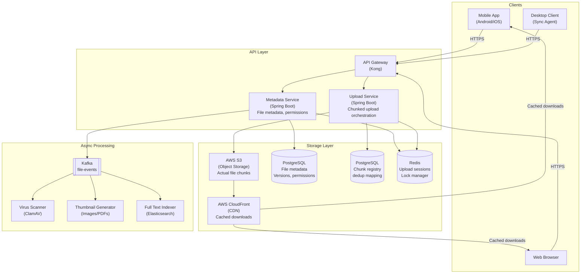
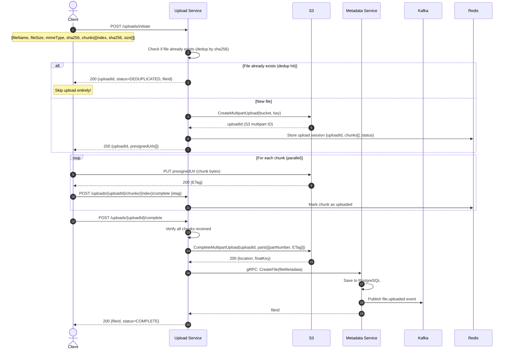

# SD-7 — System Design: Cloud Storage (Dropbox)

Book alignment: [[Book Alignment — Pro Spring Boot 3 with Kotlin]]

> **Production Engineering Reference** — Building cloud storage at scale requires solving chunked uploads, deduplication, conflict resolution, and distribution all at once. This chapter covers every layer, from the byte on disk to the signed URL in the browser.

---

## Why Cloud Storage Is Hard

Dropbox stores 500 billion files. Google Drive handles 3.4 billion uploads daily. The challenges are not just storage — they're:

1. **Large file upload reliability** — A 5GB file upload that fails at 99% must not restart from 0
2. **Deduplication** — Two users uploading the same file must not store it twice
3. **Delta sync** — When a 100MB file changes by 1 byte, don't re-upload 100MB
4. **Conflict resolution** — Two devices edit the same file simultaneously
5. **Consistency** — File metadata (name, size, version) must be consistent across devices
6. **Performance** — Downloads must be fast globally (CDN)
7. **Access control** — Share a specific file with specific users with expiring URLs

---

## Architecture Overview



---

## Chunked Upload: The Foundation

### Why Chunked Upload?

| Problem | Without Chunking | With Chunking |
|---|---|---|
| 1GB upload, 80% complete, connection drops | Start over from 0 | Resume from chunk 80 |
| Slow mobile connection | Single thread, full upload | Parallel chunk upload |
| Server memory | Load entire file | Process chunk by chunk |
| Deduplication | Compare entire file | Compare chunk hashes |

### Chunk Size Selection

```
Typical chunk sizes:
  - 5MB: Good balance — minimum S3 multipart size, low overhead
  - 10MB: Better for large files on fast connections
  - 1MB: Better for mobile (handles reconnects better)

Recommendation: 5MB chunks for desktop/web, 1MB for mobile
```

### Upload Flow: Three-Phase Protocol



---

## Content-Addressable Storage (CAS) with SHA-256

**Core idea:** Store files by their content hash, not by name.

```
file.sha256 = SHA256(file_bytes) = "a4c8e3f1..."
S3 key = "chunks/a4/c8/e3f1..." (hierarchical to avoid S3 prefix limits)

Two users upload identical files:
  User A uploads "report.pdf" → sha256="a4c8e3..." → S3 key "chunks/a4/c8/e3..."
  User B uploads "report_copy.pdf" → sha256="a4c8e3..." → SAME S3 key
  
Result: S3 stores it ONCE. MetadataDB has two file records pointing to same S3 key.
Storage savings on Dropbox: estimated 30-50% deduplication rate
```

### Chunk-Level Deduplication (Block-Level Dedup)

Even more powerful — deduplicate at the chunk level. If two different files share a common section (e.g., a 10MB PowerPoint template embedded in multiple presentations), those blocks are stored once.

```
File A (100MB):
  Chunk 0: sha256="aaa..." (5MB) — slides 1-3
  Chunk 1: sha256="bbb..." (5MB) — slides 4-6 (same template as File B)
  Chunk 2: sha256="ccc..." (5MB) — slides 7-10

File B (80MB):
  Chunk 0: sha256="ddd..." (5MB) — different slides
  Chunk 1: sha256="bbb..." (5MB) — same template! DEDUP HIT
  Chunk 2: sha256="eee..." (5MB) — different content

Storage saved: 5MB (one duplicate chunk)
```

### Dedup Check Implementation

```kotlin
@Service
class DeduplicationService(
    private val chunkRepository: ChunkRepository,
    private val fileRepository: FileRepository,
) {
    /**
     * Check if a file already exists in storage.
     * Returns existing fileId if found, null if new upload needed.
     */
    fun checkFileDedup(userId: Long, sha256: String, size: Long): String? {
        return fileRepository.findByContentHashAndIsActive(sha256, true)?.id
    }

    /**
     * Check which chunks need uploading vs already exist.
     * Returns map of chunkIndex -> needsUpload
     */
    fun checkChunksDedup(chunks: List<ChunkInfo>): Map<Int, Boolean> {
        val existingHashes = chunkRepository.findExistingHashes(
            chunks.map { it.sha256 }
        ).toSet()

        return chunks.associate { chunk ->
            chunk.index to !existingHashes.contains(chunk.sha256)
        }
    }
}

data class ChunkInfo(val index: Int, val sha256: String, val size: Long)
```

---

## S3 Multipart Upload Implementation

```kotlin
package com.yourcompany.storage.service

import aws.sdk.kotlin.services.s3.S3Client
import aws.sdk.kotlin.services.s3.model.*
import aws.sdk.kotlin.services.s3.presigners.presignGetObject
import aws.sdk.kotlin.services.s3.presigners.presignPutObject
import org.springframework.beans.factory.annotation.Value
import org.springframework.stereotype.Service
import kotlin.time.Duration.Companion.hours

@Service
class S3StorageService(
    private val s3Client: S3Client,
    @Value("\${aws.s3.bucket}") private val bucket: String,
    @Value("\${aws.s3.region}") private val region: String,
) {
    /**
     * Initiate a multipart upload and return presigned URLs for each chunk.
     */
    suspend fun initiateMultipartUpload(
        fileKey: String,
        chunks: List<ChunkInfo>,
    ): MultipartUploadSession {
        // Create multipart upload
        val createResponse = s3Client.createMultipartUpload {
            this.bucket = this@S3StorageService.bucket
            this.key = fileKey
            serverSideEncryption = ServerSideEncryption.Aws256  // Encrypt at rest
        }
        val uploadId = createResponse.uploadId!!

        // Generate presigned URL for each chunk
        val presignedUrls = chunks.mapIndexed { index, chunk ->
            val partNumber = index + 1
            val presignRequest = UploadPartRequest {
                this.bucket = this@S3StorageService.bucket
                this.key = fileKey
                this.uploadId = uploadId
                this.partNumber = partNumber
                contentLength = chunk.size
            }
            val presignedUrl = s3Client.presignUploadPart(presignRequest, 1.hours)
            ChunkUploadUrl(
                chunkIndex = index,
                partNumber = partNumber,
                presignedUrl = presignedUrl.url.toString(),
                expiresAt = Instant.now().plus(Duration.ofHours(1))
            )
        }

        return MultipartUploadSession(
            s3UploadId = uploadId,
            fileKey = fileKey,
            presignedUrls = presignedUrls,
        )
    }

    /**
     * Complete the multipart upload after all chunks are uploaded.
     */
    suspend fun completeMultipartUpload(
        fileKey: String,
        s3UploadId: String,
        parts: List<CompletedPartInfo>,
    ) {
        s3Client.completeMultipartUpload {
            this.bucket = this@S3StorageService.bucket
            this.key = fileKey
            this.uploadId = s3UploadId
            multipartUpload = CompletedMultipartUpload {
                this.parts = parts.map { part ->
                    CompletedPart {
                        partNumber = part.partNumber
                        eTag = part.etag
                    }
                }
            }
        }
    }

    /**
     * Generate a presigned download URL (valid for 1 hour).
     * Use this instead of making files publicly readable.
     */
    suspend fun generateDownloadUrl(
        fileKey: String,
        fileName: String,
        expiryHours: Int = 1
    ): String {
        val request = GetObjectRequest {
            this.bucket = this@S3StorageService.bucket
            this.key = fileKey
            responseContentDisposition = "attachment; filename=\"$fileName\""
        }
        return s3Client.presignGetObject(request, expiryHours.hours).url.toString()
    }

    /**
     * Abort a failed multipart upload to avoid S3 storage charges for incomplete parts.
     */
    suspend fun abortMultipartUpload(fileKey: String, s3UploadId: String) {
        s3Client.abortMultipartUpload {
            this.bucket = this@S3StorageService.bucket
            this.key = fileKey
            this.uploadId = s3UploadId
        }
    }
}
```

> [!WARNING]
> **Always set a lifecycle rule on your S3 bucket to abort incomplete multipart uploads after 7 days.** Failed uploads leave incomplete parts in S3, and you are charged for them. A single user uploading a 10GB file and retrying 10 times = 100GB of phantom charges.

```json
{
  "Rules": [{
    "ID": "abort-incomplete-multipart",
    "Status": "Enabled",
    "Filter": {},
    "AbortIncompleteMultipartUpload": {
      "DaysAfterInitiation": 7
    }
  }]
}
```

---

## Database Schema

```sql
-- Files table (metadata)
CREATE TABLE files (
    id UUID PRIMARY KEY DEFAULT gen_random_uuid(),
    owner_id BIGINT NOT NULL REFERENCES users(id),
    parent_folder_id UUID REFERENCES files(id),  -- NULL = root
    name VARCHAR(1024) NOT NULL,
    content_hash VARCHAR(64),  -- SHA-256 of full file
    size_bytes BIGINT,
    mime_type VARCHAR(255),
    s3_key VARCHAR(1024),  -- Points to object in S3
    version INTEGER DEFAULT 1,
    is_directory BOOLEAN DEFAULT FALSE,
    is_deleted BOOLEAN DEFAULT FALSE,
    is_active BOOLEAN DEFAULT TRUE,
    created_at TIMESTAMP NOT NULL DEFAULT NOW(),
    updated_at TIMESTAMP NOT NULL DEFAULT NOW(),
    deleted_at TIMESTAMP
);

-- Chunks table (dedup registry)
CREATE TABLE chunks (
    id UUID PRIMARY KEY DEFAULT gen_random_uuid(),
    content_hash VARCHAR(64) UNIQUE NOT NULL,  -- SHA-256 of chunk
    s3_key VARCHAR(1024) NOT NULL,
    size_bytes BIGINT NOT NULL,
    reference_count INT DEFAULT 1,  -- How many files reference this chunk
    created_at TIMESTAMP NOT NULL DEFAULT NOW()
);

-- File-chunk mapping
CREATE TABLE file_chunks (
    file_id UUID REFERENCES files(id),
    chunk_id UUID REFERENCES chunks(id),
    chunk_index INT NOT NULL,
    PRIMARY KEY (file_id, chunk_index)
);

-- File versions (for conflict resolution)
CREATE TABLE file_versions (
    id UUID PRIMARY KEY DEFAULT gen_random_uuid(),
    file_id UUID NOT NULL REFERENCES files(id),
    version INTEGER NOT NULL,
    content_hash VARCHAR(64) NOT NULL,
    s3_key VARCHAR(1024) NOT NULL,
    size_bytes BIGINT NOT NULL,
    created_by_device_id VARCHAR(255),
    created_at TIMESTAMP NOT NULL DEFAULT NOW(),
    UNIQUE(file_id, version)
);

-- Share links
CREATE TABLE file_shares (
    id UUID PRIMARY KEY DEFAULT gen_random_uuid(),
    file_id UUID NOT NULL REFERENCES files(id),
    shared_by UUID NOT NULL REFERENCES users(id),
    share_token VARCHAR(64) UNIQUE NOT NULL,  -- Random token in URL
    permission VARCHAR(20) NOT NULL,  -- VIEW, COMMENT, EDIT
    shared_with_email VARCHAR(255),  -- NULL = public link
    expires_at TIMESTAMP,
    max_downloads INT,  -- NULL = unlimited
    download_count INT DEFAULT 0,
    is_active BOOLEAN DEFAULT TRUE,
    created_at TIMESTAMP NOT NULL DEFAULT NOW()
);

-- Indexes
CREATE INDEX idx_files_owner_parent ON files(owner_id, parent_folder_id) WHERE NOT is_deleted;
CREATE INDEX idx_files_content_hash ON files(content_hash) WHERE is_active;
CREATE INDEX idx_chunks_content_hash ON chunks(content_hash);
```

---

## Delta Sync

Delta sync means only uploading the **changed portions** of a file.

**How Dropbox does it (rsync algorithm):**
1. File is divided into chunks using **rolling hash** (Rabin fingerprinting)
2. Client sends hash of each chunk to server
3. Server identifies which chunks changed
4. Client only uploads changed chunks

```kotlin
@Service
class DeltaSyncService(
    private val fileChunkRepository: FileChunkRepository,
    private val chunkRepository: ChunkRepository,
) {
    /**
     * Given a list of chunks the client has computed,
     * return which ones need to be uploaded vs already exist.
     */
    fun computeDelta(
        fileId: String,
        clientChunks: List<ClientChunkInfo>,
    ): DeltaSyncResult {
        // Get server's current chunk hashes for this file
        val serverChunks = fileChunkRepository.findByFileIdOrderByChunkIndex(fileId)
        val serverHashMap = serverChunks.associate { it.chunkIndex to it.chunk.contentHash }

        val chunksToUpload = mutableListOf<Int>()
        val chunksToReuse = mutableListOf<Pair<Int, String>>()  // index, existing chunkId

        clientChunks.forEach { clientChunk ->
            val serverHash = serverHashMap[clientChunk.index]
            if (serverHash == clientChunk.sha256) {
                // Chunk unchanged — reuse
                chunksToReuse.add(clientChunk.index to serverChunks[clientChunk.index].chunkId)
            } else {
                // Check global dedup (maybe another file has this chunk)
                val existingChunk = chunkRepository.findByContentHash(clientChunk.sha256)
                if (existingChunk != null) {
                    chunksToReuse.add(clientChunk.index to existingChunk.id)
                } else {
                    chunksToUpload.add(clientChunk.index)
                }
            }
        }

        return DeltaSyncResult(
            chunksToUpload = chunksToUpload,
            chunksToReuse = chunksToReuse,
        )
    }
}

data class ClientChunkInfo(val index: Int, val sha256: String, val size: Long)
data class DeltaSyncResult(
    val chunksToUpload: List<Int>,
    val chunksToReuse: List<Pair<Int, String>>,
)
```

**Real-world example:**
```
Original file: 100MB PDF (20 chunks × 5MB)
User edits page 1 only → chunk[0] changes

Without delta sync: Upload 100MB
With delta sync:    Upload 5MB (chunk[0] only) — 95% bandwidth savings
```

---

## Conflict Resolution

Conflicts occur when two clients modify the same file simultaneously (offline edits).

### Dropbox Strategy: "Conflicted Copy"

Dropbox doesn't merge — it creates a conflict copy:
```
original.docx → modified on Device A while Device B was offline
Device B comes online with its own version

Resolution:
  - Server keeps the version that arrived first → "original.docx"
  - Renames the conflicting version → "original (User's conflicted copy 2024-01-15).docx"
  - User decides which version to keep
```

### Implementation

```kotlin
@Service
class ConflictResolver(
    private val fileRepository: FileRepository,
    private val fileVersionRepository: FileVersionRepository,
) {
    @Transactional
    fun resolveConflict(
        fileId: String,
        incomingVersion: FileVersion,
        deviceId: String,
    ): ConflictResolutionResult {
        val currentFile = fileRepository.findById(fileId).orElseThrow()

        // If content is identical (same hash) → no conflict
        if (currentFile.contentHash == incomingVersion.contentHash) {
            return ConflictResolutionResult.NoConflict(currentFile)
        }

        // Check if versions are sequential (no true conflict — just out of order)
        if (incomingVersion.baseVersion == currentFile.version) {
            // Clean update — apply it
            currentFile.version++
            currentFile.contentHash = incomingVersion.contentHash
            currentFile.s3Key = incomingVersion.s3Key
            fileRepository.save(currentFile)
            return ConflictResolutionResult.Updated(currentFile)
        }

        // True conflict — create conflicted copy
        val conflictedName = generateConflictedName(currentFile.name, deviceId)
        val conflictedFile = FileEntity(
            ownerId = currentFile.ownerId,
            parentFolderId = currentFile.parentFolderId,
            name = conflictedName,
            contentHash = incomingVersion.contentHash,
            s3Key = incomingVersion.s3Key,
            sizeBytes = incomingVersion.sizeBytes,
        )
        fileRepository.save(conflictedFile)

        return ConflictResolutionResult.Conflicted(
            original = currentFile,
            conflictedCopy = conflictedFile,
        )
    }

    private fun generateConflictedName(originalName: String, deviceId: String): String {
        val date = LocalDate.now().toString()
        val parts = originalName.substringBeforeLast(".")
        val ext = originalName.substringAfterLast(".", "")
        return if (ext.isNotEmpty()) "$parts (conflicted copy $date).$ext"
               else "$originalName (conflicted copy $date)"
    }
}

sealed class ConflictResolutionResult {
    data class NoConflict(val file: FileEntity) : ConflictResolutionResult()
    data class Updated(val file: FileEntity) : ConflictResolutionResult()
    data class Conflicted(val original: FileEntity, val conflictedCopy: FileEntity) : ConflictResolutionResult()
}
```

---

## Share Links

```kotlin
@RestController
@RequestMapping("/v1/files/{fileId}/share")
class FileShareController(
    private val fileShareService: FileShareService,
) {
    @PostMapping
    fun createShareLink(
        @PathVariable fileId: String,
        @RequestHeader("X-User-Id") userId: Long,
        @RequestBody request: CreateShareRequest,
    ): ResponseEntity<ShareLinkResponse> {
        val share = fileShareService.createShare(
            fileId = fileId,
            sharedBy = userId,
            permission = request.permission,
            expiresAt = request.expiresAt,
            maxDownloads = request.maxDownloads,
        )
        return ResponseEntity.ok(ShareLinkResponse(
            shareUrl = "https://yourapp.com/s/${share.shareToken}",
            token = share.shareToken,
            expiresAt = share.expiresAt,
        ))
    }

    @GetMapping("/s/{token}", host = "yourapp.com")
    fun resolveShare(@PathVariable token: String): ResponseEntity<FileDownloadResponse> {
        val share = fileShareService.validateAndIncrementShare(token)
            ?: return ResponseEntity.notFound().build()

        val downloadUrl = s3StorageService.generateDownloadUrl(
            fileKey = share.file.s3Key!!,
            fileName = share.file.name,
            expiryHours = 1,
        )

        return ResponseEntity.ok(FileDownloadResponse(
            fileName = share.file.name,
            size = share.file.sizeBytes,
            downloadUrl = downloadUrl,
        ))
    }
}
```

---

## CDN Integration for Downloads

```kotlin
@Service
class FileDownloadService(
    private val s3StorageService: S3StorageService,
    @Value("\${cdn.base-url}") private val cdnBaseUrl: String,
    @Value("\${cdn.enabled}") private val cdnEnabled: Boolean,
) {
    /**
     * For public/shared files: use CDN URL (cached at edge)
     * For private files: use presigned S3 URL (authenticated, not cached)
     */
    fun generateDownloadUrl(file: FileEntity, isPublic: Boolean): String {
        return if (isPublic && cdnEnabled) {
            // CloudFront serves the file from edge cache
            // Cache-Control header on S3 object controls CDN TTL
            "$cdnBaseUrl/${file.s3Key}"
        } else {
            // Presigned URL bypasses CDN — direct S3 access with auth
            s3StorageService.generateDownloadUrl(
                fileKey = file.s3Key!!,
                fileName = file.name,
                expiryHours = 1,
            )
        }
    }
}
```

**CloudFront + S3 cache-control strategy:**

```kotlin
// When uploading public assets (avatars, document thumbnails)
s3Client.putObject {
    bucket = this.bucket
    key = s3Key
    metadata = mapOf(
        "Cache-Control" to "public, max-age=86400",  // CDN caches for 24 hours
        "Content-Type" to mimeType,
    )
}

// When uploading private user files
s3Client.putObject {
    bucket = this.bucket
    key = s3Key
    metadata = mapOf(
        "Cache-Control" to "private, no-store",  // Don't cache at CDN
        "Content-Type" to mimeType,
    )
}
```

> [!CAUTION]
> **Never serve private files through CDN without signed URLs.** If you put a private file behind CloudFront and someone gets the CDN URL, it will be cached and accessible without authentication — even after you revoke access. Use CloudFront signed URLs for private content.

---

## Summary Architecture Decisions

| Decision | Choice | Why |
|---|---|---|
| Object storage | AWS S3 | Infinitely scalable, 99.999999999% durability |
| Dedup strategy | SHA-256 content-addressable, chunk-level | 30-50% storage savings |
| Upload protocol | S3 multipart + presigned URLs | Resumable, parallel, no server bandwidth cost |
| Metadata storage | PostgreSQL | ACID, complex queries, version history |
| Delta sync | Rolling hash (Rabin) | 80-95% bandwidth savings on modified files |
| Conflict resolution | "Conflicted copy" pattern | Simple, no data loss, user decides |
| Downloads | CloudFront CDN | Low latency globally, reduces S3 egress costs |
| Auth for downloads | Presigned URLs (private), Signed CDN URLs (shared) | No public S3 exposure |
