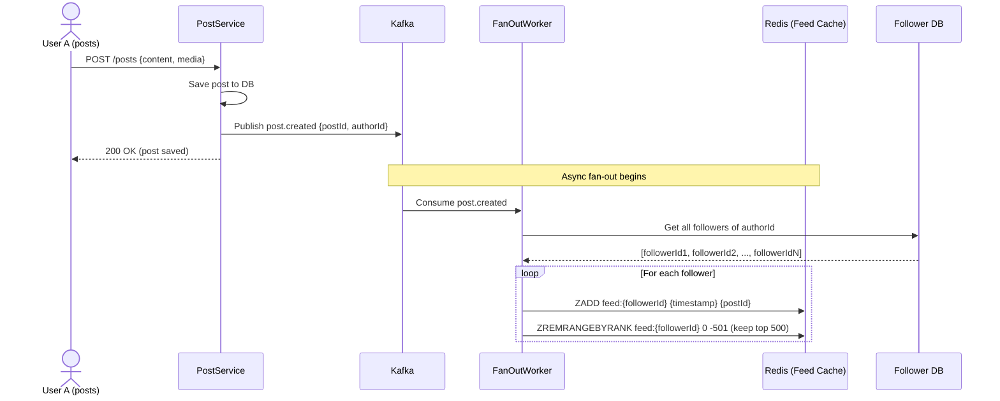
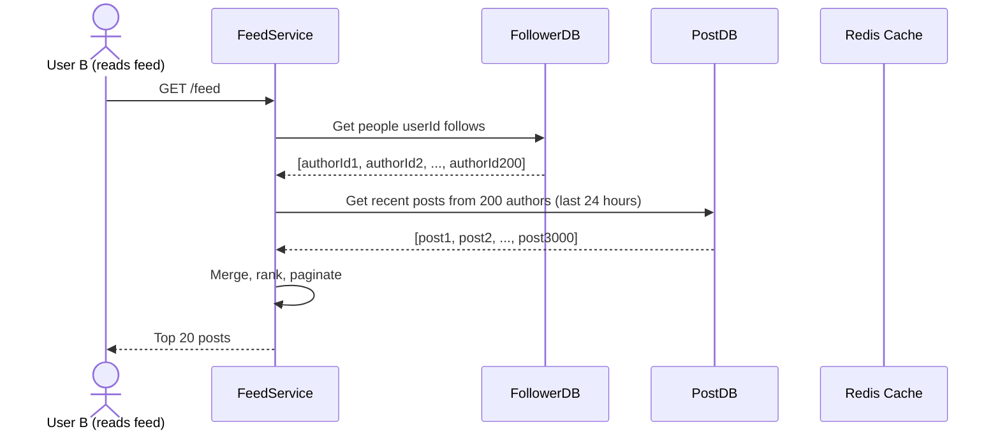
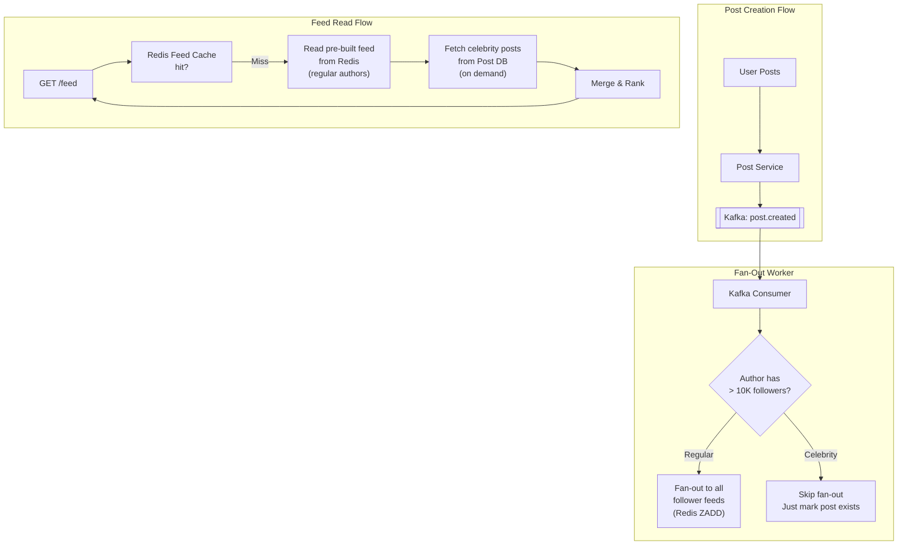

# SD-8 — System Design: Newsfeed

Book alignment: [[Book Alignment — Pro Spring Boot 3 with Kotlin]]

> **Production Engineering Reference** — The newsfeed is the most traffic-intensive feature in social applications. Instagram, Twitter/X, and LinkedIn each process hundreds of millions of feed requests per day. The architecture decision that determines everything else: fan-out on write vs fan-out on read.

---

## The Core Problem

When User A (who follows 200 people) opens their feed:
- Fetch the 200 people they follow
- Get each person's recent posts
- Merge, rank, deduplicate, and return the top 20

If 10 million users do this simultaneously, the naive approach collapses under query load. The newsfeed problem is fundamentally about **pre-computation vs real-time computation** and **who bears the cost** (writer or reader).

---

## Fan-Out On Write (Push Model)

**When a user posts, immediately push that post to all followers' feeds.**



**Reading the feed (trivial):**

```
GET /feed → ZREVRANGE feed:{userId} 0 19 → returns 20 postIds → hydrate from cache
```

### Pros and Cons

| Aspect | Fan-Out on Write |
|---|---|
| **Read complexity** | O(1) — just read pre-built feed |
| **Write complexity** | O(N) — N = follower count |
| **Read latency** | < 10ms (Redis ZREVRANGE) |
| **Write latency** | Async (post appears in feeds 1-5 seconds later) |
| **Storage** | High — same postId stored in N feeds |
| **Celebrity problem** | ❌ 10M followers = 10M Redis writes per post |

### The Celebrity Problem

> [!WARNING]
> Fan-out on write breaks for accounts with millions of followers. Cristiano Ronaldo has 600M Instagram followers. If he posts, fan-out would require 600M Redis writes synchronously. Even async, this flood can delay feeds for millions of users by minutes.

---

## Fan-Out On Read (Pull Model)

**When a user opens their feed, compute it in real-time.**



### Pros and Cons

| Aspect | Fan-Out on Read |
|---|---|
| **Read complexity** | O(N × M) — N following, M posts each |
| **Write complexity** | O(1) — just save the post |
| **Read latency** | 100-500ms (N DB queries) |
| **Write latency** | Instant |
| **Storage** | Low — post stored once |
| **Celebrity problem** | ✅ No special case needed |

---

## Hybrid Approach (What Instagram, Twitter Use)

The production solution combines both:

```
Regular users (< 10K followers): FAN-OUT ON WRITE
  → Post is pushed to followers' feeds immediately
  → Cheap enough: 10K Redis writes per post

Celebrity users (> 10K followers): FAN-OUT ON READ
  → Post is NOT pushed anywhere
  → When you read your feed, regular posts come from pre-built feed
  → Celebrity posts are fetched on-demand and merged in

Threshold detection: Mark accounts as "celebrity" when follower count crosses threshold
```

### Architecture



---

## Redis Sorted Set: Feed Storage

Redis Sorted Set is perfect for feeds. Each user has a sorted set where:
- **Key:** `feed:{userId}`
- **Score:** post creation timestamp (Unix ms)
- **Member:** postId

```
ZADD feed:12345 1704067200000 "post:abc"
ZADD feed:12345 1704067260000 "post:def"
ZADD feed:12345 1704067320000 "post:ghi"

ZREVRANGE feed:12345 0 19              → top 20 most recent posts
ZREVRANGEBYSCORE feed:12345 +inf 0 LIMIT 0 20  → same with score filter

# Remove oldest posts (keep only last 500)
ZREMRANGEBYRANK feed:12345 0 -501
```

### Kotlin Implementation: Feed Service

```kotlin
package com.yourcompany.feed.service

import org.springframework.data.redis.core.RedisTemplate
import org.springframework.stereotype.Service

@Service
class FeedService(
    private val redisTemplate: RedisTemplate<String, String>,
    private val postRepository: PostRepository,
    private val followRepository: FollowRepository,
    private val feedRanker: FeedRanker,
) {
    companion object {
        private const val FEED_KEY_PREFIX = "feed:"
        private const val MAX_FEED_SIZE = 500L
        private const val CELEBRITY_THRESHOLD = 10_000
    }

    /**
     * Get paginated feed for a user.
     * Hybrid: pre-built feed (regular users) + on-demand (celebrities)
     */
    fun getFeed(userId: Long, page: Int, pageSize: Int = 20): FeedPage {
        val offset = (page * pageSize).toLong()
        val feedKey = "$FEED_KEY_PREFIX$userId"

        // Step 1: Get postIds from pre-built feed (regular authors only)
        val prebuiltPostIds = redisTemplate.opsForZSet()
            .reverseRange(feedKey, offset, offset + pageSize - 1)
            ?: emptySet()

        // Step 2: Fetch celebrity posts on-demand
        val celebrityIds = followRepository.findCelebrityAuthors(userId, CELEBRITY_THRESHOLD)
        val celebrityPosts = if (celebrityIds.isNotEmpty()) {
            postRepository.findRecentPostsByAuthors(
                authorIds = celebrityIds,
                limit = pageSize,
                offset = offset,
            )
        } else emptyList()

        // Step 3: Hydrate prebuilt posts
        val prebuiltPosts = if (prebuiltPostIds.isNotEmpty()) {
            postRepository.findAllByIds(prebuiltPostIds.map { it.toLong() })
        } else emptyList()

        // Step 4: Merge and rank
        val allPosts = (prebuiltPosts + celebrityPosts).distinctBy { it.id }
        val rankedPosts = feedRanker.rank(userId, allPosts)

        return FeedPage(
            posts = rankedPosts.take(pageSize),
            hasMore = rankedPosts.size >= pageSize,
            nextPage = page + 1,
        )
    }

    /**
     * Fan-out a new post to all regular followers.
     * Called by Kafka consumer when post.created event received.
     */
    fun fanOutPost(postId: Long, authorId: Long, timestamp: Long) {
        val followerCount = followRepository.countFollowers(authorId)

        if (followerCount >= CELEBRITY_THRESHOLD) {
            // Celebrity — skip fan-out, feed reads will fetch on demand
            return
        }

        val batchSize = 1000
        var cursor = 0L

        do {
            val followerBatch = followRepository.findFollowerIds(
                authorId = authorId,
                limit = batchSize,
                cursor = cursor,
            )

            if (followerBatch.isEmpty()) break

            // Batch write to Redis using pipelining
            redisTemplate.executePipelined { connection ->
                followerBatch.forEach { followerId ->
                    val feedKey = "$FEED_KEY_PREFIX$followerId"
                    connection.zSetCommands().zAdd(
                        feedKey.toByteArray(),
                        setOf(DefaultTypedTuple(postId.toString().toByteArray(), timestamp.toDouble()))
                    )
                    // Trim to max size
                    connection.zSetCommands().zRemRangeByRank(
                        feedKey.toByteArray(), 0, -(MAX_FEED_SIZE + 1)
                    )
                }
                null
            }

            cursor = followerBatch.last()
        } while (followerBatch.size == batchSize)
    }

    /**
     * Remove a deleted post from all affected feeds.
     * This is expensive — only practical for non-celebrity users.
     */
    fun removePostFromFeeds(postId: Long, authorId: Long) {
        val followerCount = followRepository.countFollowers(authorId)
        if (followerCount >= CELEBRITY_THRESHOLD) return // Celebrity feeds don't pre-store this post

        val followers = followRepository.findAllFollowerIds(authorId)
        redisTemplate.executePipelined { connection ->
            followers.forEach { followerId ->
                connection.zSetCommands().zRem(
                    "$FEED_KEY_PREFIX$followerId".toByteArray(),
                    postId.toString().toByteArray()
                )
            }
            null
        }
    }
}
```

---

## Feed Ranking

A chronological feed is simple but not optimal. Instagram, TikTok, and LinkedIn all rank feeds by predicted engagement.

```kotlin
@Component
class FeedRanker {
    /**
     * Rank posts by a weighted score combining recency and predicted engagement.
     * This is a simplified version — production systems use ML models.
     */
    fun rank(userId: Long, posts: List<PostEntity>): List<PostEntity> {
        val now = Instant.now().epochSecond.toDouble()

        return posts.sortedByDescending { post ->
            calculateScore(post, now)
        }
    }

    private fun calculateScore(post: PostEntity, nowEpoch: Double): Double {
        val ageHours = (nowEpoch - post.createdAt.epochSecond) / 3600.0
        
        // Recency score: decays exponentially, half-life = 6 hours
        val recencyScore = Math.exp(-0.115 * ageHours) // ln(2)/6 ≈ 0.115
        
        // Engagement score: normalized by follower count of author
        val engagementScore = (post.likeCount * 1.0 + post.commentCount * 2.0 + post.shareCount * 3.0) /
                              maxOf(post.author.followerCount.toDouble(), 1.0)
        
        // Relationship score: boost posts from close friends (future: use interaction history)
        val relationshipBoost = 1.0 // 1.0 = neutral, 1.5 = close friend
        
        // Final score: weighted combination
        return (recencyScore * 0.5 + engagementScore * 0.3) * relationshipBoost
    }
}
```

> [!NOTE]
> Production feed ranking at Instagram uses a two-pass approach: a **candidate generation** model (which 500 posts to consider from thousands) and a **ranking model** (which 20 to show from those 500). This requires ML infrastructure — TensorFlow Serving or Vertex AI. Start simple (recency + engagement) and add ML when you have enough data.

---

## Kafka Consumer for Fan-Out

```kotlin
@Component
class PostFanOutConsumer(
    private val feedService: FeedService,
) {
    private val log = LoggerFactory.getLogger(PostFanOutConsumer::class.java)

    @KafkaListener(topics = ["post-events"], groupId = "feed-fan-out-worker")
    fun onPostEvent(event: PostEvent, ack: Acknowledgment) {
        try {
            when (event.type) {
                PostEventType.CREATED -> {
                    feedService.fanOutPost(
                        postId = event.postId,
                        authorId = event.authorId,
                        timestamp = event.createdAt.toEpochMilli(),
                    )
                }
                PostEventType.DELETED -> {
                    feedService.removePostFromFeeds(event.postId, event.authorId)
                }
                PostEventType.HIDDEN -> {
                    feedService.removePostFromFeeds(event.postId, event.authorId)
                }
            }
            ack.acknowledge()
        } catch (e: Exception) {
            log.error("Fan-out failed for post ${event.postId}", e)
            // Don't ACK — let Kafka redeliver
            throw e
        }
    }
}
```

---

## Feed Cache Warm-Up (New Follow)

When User A follows User B, User A's feed should immediately include B's recent posts:

```kotlin
@Service
class FollowService(
    private val followRepository: FollowRepository,
    private val postRepository: PostRepository,
    private val redisTemplate: RedisTemplate<String, String>,
) {
    @Transactional
    fun follow(followerId: Long, authorId: Long) {
        followRepository.save(Follow(followerId = followerId, authorId = authorId))

        // Backfill recent posts from newly followed author into follower's feed
        val recentPosts = postRepository.findRecentByAuthor(
            authorId = authorId,
            limit = 20,
            since = Instant.now().minus(Duration.ofDays(7))
        )

        if (recentPosts.isNotEmpty()) {
            val feedKey = "feed:$followerId"
            redisTemplate.executePipelined { connection ->
                recentPosts.forEach { post ->
                    connection.zSetCommands().zAdd(
                        feedKey.toByteArray(),
                        setOf(DefaultTypedTuple(
                            post.id.toString().toByteArray(),
                            post.createdAt.toEpochMilli().toDouble()
                        ))
                    )
                }
                connection.zSetCommands().zRemRangeByRank(feedKey.toByteArray(), 0, -501L)
                null
            }
        }
    }

    fun unfollow(followerId: Long, authorId: Long) {
        followRepository.deleteByFollowerIdAndAuthorId(followerId, authorId)

        // Optionally remove that author's posts from the feed
        // (expensive, often done lazily — filter during read instead)
    }
}
```

---

## Database Schema

```sql
-- Posts
CREATE TABLE posts (
    id BIGINT PRIMARY KEY,  -- Snowflake ID
    author_id BIGINT NOT NULL REFERENCES users(id),
    content TEXT,
    media_urls JSONB,
    like_count INT DEFAULT 0,
    comment_count INT DEFAULT 0,
    share_count INT DEFAULT 0,
    is_deleted BOOLEAN DEFAULT FALSE,
    is_hidden BOOLEAN DEFAULT FALSE,
    created_at TIMESTAMP NOT NULL,
    updated_at TIMESTAMP NOT NULL
);

CREATE INDEX idx_posts_author_created ON posts(author_id, created_at DESC) WHERE NOT is_deleted;

-- Follows graph (for large scale: use a dedicated graph DB or denormalize)
CREATE TABLE follows (
    follower_id BIGINT NOT NULL REFERENCES users(id),
    author_id BIGINT NOT NULL REFERENCES users(id),
    created_at TIMESTAMP NOT NULL DEFAULT NOW(),
    PRIMARY KEY (follower_id, author_id)
);

CREATE INDEX idx_follows_author_id ON follows(author_id);
CREATE INDEX idx_follows_follower_id ON follows(follower_id);
```

> [!IMPORTANT]
> The `follows` table becomes a massive join target at scale (Instagram has 500B follow edges). At that scale, move the social graph to a dedicated service using **Neo4j** or **Amazon Neptune**, or denormalize into Cassandra. For < 100M users, PostgreSQL with proper indexes is sufficient.

---

## Monitoring Feed Health

```kotlin
// Key metrics to track:
// - Feed generation latency p50/p95/p99
// - Fan-out lag: time between post creation and appearance in feeds
// - Celebrity post merge latency
// - Redis feed cache hit rate
// - Feed Redis memory usage

// Alert thresholds:
// - Fan-out lag > 30 seconds → Page on-call
// - Feed latency p99 > 500ms → Investigate
// - Redis memory > 80% → Scale up
// - Celebrity post merge > 200ms → Optimize
```

---

## Summary

| Metric | Fan-Out on Write | Fan-Out on Read | Hybrid |
|---|---|---|---|
| Feed read latency | < 10ms | 100-500ms | < 50ms |
| Write fan-out latency | 1-5s async | Instant | 1-5s async (regular) |
| Celebrity handling | ❌ Breaks | ✅ Works | ✅ Smart threshold |
| Storage overhead | High (N feeds × M posts) | Low | Medium |
| Used by | Early Twitter | Early Instagram | Instagram, Twitter (now) |

**Recommendation for a startup:**
1. Start with **fan-out on write** — simple, fast reads
2. Set celebrity threshold at 10K followers
3. Add feed ranking when you have engagement data
4. Move to hybrid only when you have celebrity-scale users
