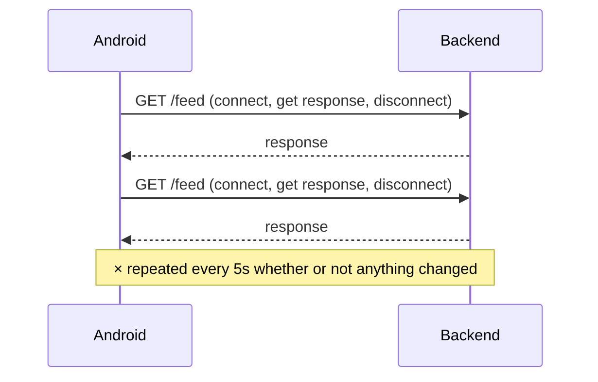
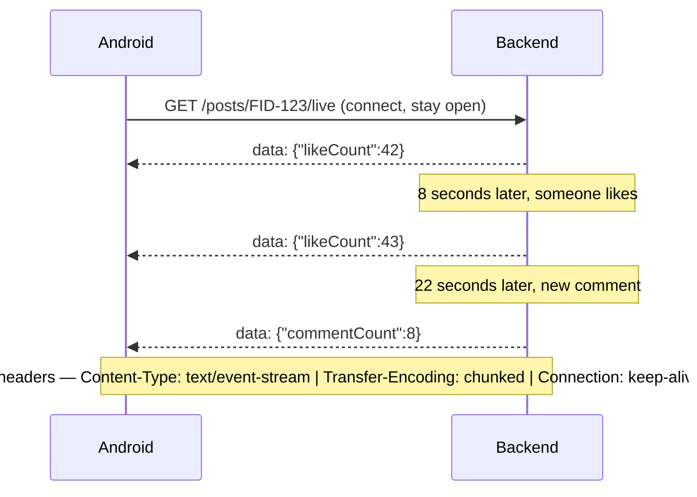
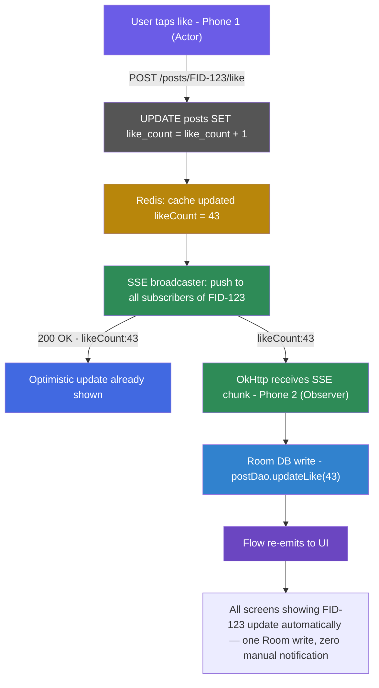
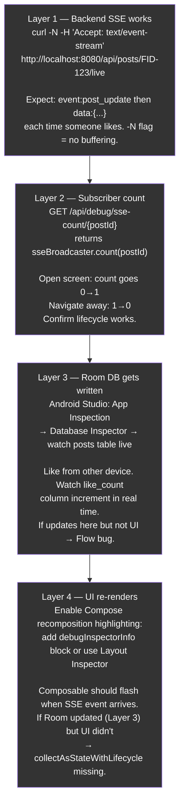

# Complete Observable SSE System — Backend + Android

## Part 1 — What SSE Actually Is at the Wire Level

SSE is not a special protocol. It is a normal HTTP GET that never closes. The server sends chunks. Android reads them as they arrive.

**Polling — client knocks every 5s**



**SSE — one connection, server pushes when ready**



---

## Part 2 — The Complete Data Flow



The full code for every layer follows below.

---

## Part 3 — Backend: Spring Boot SSE Endpoint

```kotlin
// content/src/main/kotlin/com/yourapp/content/sse/SseController.kt

@RestController
@RequestMapping("/api/posts")
class SseController(private val sseBroadcaster: SseBroadcaster) {

    @GetMapping("/{postId}/live", produces = [MediaType.TEXT_EVENT_STREAM_VALUE])
    fun subscribeToPost(
        @PathVariable postId: String,
        response: HttpServletResponse
    ): SseEmitter {
        // SseEmitter timeout = how long to keep connection alive if no events
        // -1L = infinite. Use 60_000L (60s) in production so idle connections clean up.
        val emitter = SseEmitter(60_000L)
        sseBroadcaster.register(postId, emitter)
        return emitter
    }
}
```

```kotlin
// content/src/main/kotlin/com/yourapp/content/sse/SseBroadcaster.kt

@Component
class SseBroadcaster {

    // postId → list of active SSE connections watching that post
    // CopyOnWriteArrayList = thread-safe for concurrent add/remove
    private val subscribers: ConcurrentHashMap<String, CopyOnWriteArrayList<SseEmitter>> =
        ConcurrentHashMap()

    fun register(postId: String, emitter: SseEmitter) {
        subscribers.getOrPut(postId) { CopyOnWriteArrayList() }.add(emitter)

        // Clean up this emitter when connection closes (user navigates away)
        emitter.onCompletion { remove(postId, emitter) }
        emitter.onTimeout    { remove(postId, emitter) }
        emitter.onError      { remove(postId, emitter) }
    }

    fun broadcast(postId: String, event: PostUpdateEvent) {
        val list = subscribers[postId] ?: return
        val dead = mutableListOf<SseEmitter>()

        list.forEach { emitter ->
            try {
                emitter.send(
                    SseEmitter.event()
                        .name("post_update")       // event type — Android filters on this
                        .data(event)               // Spring serializes to JSON automatically
                )
            } catch (e: Exception) {
                dead.add(emitter)                  // connection died mid-send
            }
        }

        dead.forEach { remove(postId, it) }
    }

    private fun remove(postId: String, emitter: SseEmitter) {
        subscribers[postId]?.remove(emitter)
    }
}
```

```kotlin
// The event data class — this is what gets serialized to JSON and sent over SSE
data class PostUpdateEvent(
    val postId: String,
    val likeCount: Int? = null,        // null = not changed, don't overwrite
    val commentCount: Int? = null,
    val bookmarkCount: Int? = null,
    val newComment: CommentPayload? = null
)

data class CommentPayload(
    val id: String,
    val authorName: String,
    val content: String,
    val createdAt: String
)
```

```kotlin
// In your LikeService — after writing to DB, broadcast the change
@Service
class LikeService(
    private val likeRepository: LikeRepository,
    private val postRepository: PostRepository,
    private val sseBroadcaster: SseBroadcaster
) {
    @Transactional
    fun likePost(postId: String, userId: String) {
        likeRepository.save(Like(postId = postId, userId = userId))

        // Atomic increment — no race condition
        postRepository.incrementLikeCount(postId)
        val newCount = postRepository.getLikeCount(postId)

        // Broadcast to all SSE subscribers watching this post
        sseBroadcaster.broadcast(
            postId,
            PostUpdateEvent(postId = postId, likeCount = newCount)
        )
    }
}
```

---

## Part 4 — Android: OkHttp SSE Client

Android has no built-in SSE client. You use OkHttp's `EventSource`. Add this dependency:

```kotlin
// build.gradle.kts (app)
implementation("com.squareup.okhttp3:okhttp-sse:4.12.0")
```

```kotlin
// SseClient.kt — one instance, manages one SSE connection per post

class SseClient(
    private val okHttpClient: OkHttpClient,
    private val baseUrl: String
) {
    private var eventSource: EventSource? = null

    fun connect(
        postId: String,
        onEvent: (PostUpdateEvent) -> Unit,
        onClosed: () -> Unit
    ) {
        disconnect() // close any existing connection first

        val request = Request.Builder()
            .url("$baseUrl/api/posts/$postId/live")
            .header("Authorization", "Bearer ${TokenManager.getToken()}")
            .header("Accept", "text/event-stream")   // tells server: I want SSE
            .build()

        eventSource = EventSources.createFactory(okHttpClient)
            .newEventSource(request, object : EventSourceListener() {

                override fun onEvent(
                    eventSource: EventSource,
                    id: String?,
                    type: String?,        // matches .name() set on backend
                    data: String
                ) {
                    // Parse JSON → PostUpdateEvent
                    val event = Json.decodeFromString<PostUpdateEvent>(data)
                    onEvent(event)        // caller decides what to do with it
                }

                override fun onClosed(eventSource: EventSource) {
                    onClosed()
                }

                override fun onFailure(
                    eventSource: EventSource,
                    t: Throwable?,
                    response: Response?
                ) {
                    // Handle reconnect here (see Part 8)
                }
            })
    }

    fun disconnect() {
        eventSource?.cancel()
        eventSource = null
    }
}
```

---

## Part 5 — ViewModel: Connecting SSE → Room → UI

This is the most important part. The ViewModel opens SSE, writes events into Room, and the UI collects from Room. **The UI never knows SSE exists.**

```kotlin
@HiltViewModel
class PostDetailViewModel @Inject constructor(
    private val postDao: PostDao,
    private val commentDao: CommentDao,
    private val sseClient: SseClient,
    private val postRepository: PostRepository,
    savedStateHandle: SavedStateHandle
) : ViewModel() {

    private val postId: String = savedStateHandle["postId"]!!

    // UI collects this — Room emits whenever the row changes
    val post: StateFlow<PostEntity?> = postDao
        .observePost(postId)
        .stateIn(viewModelScope, SharingStarted.WhileSubscribed(5000), null)

    val comments: StateFlow<List<CommentEntity>> = commentDao
        .observeComments(postId)
        .stateIn(viewModelScope, SharingStarted.WhileSubscribed(5000), emptyList())

    init {
        openSseConnection()
    }

    private fun openSseConnection() {
        sseClient.connect(
            postId = postId,
            onEvent = { event ->
                // This callback comes on OkHttp's background thread
                // Write to Room — Room will notify all collectors automatically
                viewModelScope.launch(Dispatchers.IO) {
                    handleSseEvent(event)
                }
            },
            onClosed = {
                // Connection closed cleanly (user navigated away server-side)
            }
        )
    }

    private suspend fun handleSseEvent(event: PostUpdateEvent) {
        // Only update fields that actually changed (non-null fields in event)
        event.likeCount?.let     { postDao.updateLikeCount(postId, it) }
        event.commentCount?.let  { postDao.updateCommentCount(postId, it) }
        event.bookmarkCount?.let { postDao.updateBookmarkCount(postId, it) }
        event.newComment?.let    {
            commentDao.insert(it.toEntity(postId))
        }
    }

    // Called when user taps Like — optimistic update + API call
    fun toggleLike() {
        viewModelScope.launch {
            val current = post.value ?: return@launch

            // 1. Optimistic: update Room immediately, UI responds instantly
            postDao.updateLikeCount(postId, current.likeCount + 1)
            postDao.updateIsLikedByMe(postId, true)

            // 2. API call in background
            try {
                postRepository.likePost(postId)
                // Backend will broadcast SSE to observers — not to you (actor)
                // Your count is already correct from the optimistic update
            } catch (e: Exception) {
                // Rollback optimistic update on failure
                postDao.updateLikeCount(postId, current.likeCount)
                postDao.updateIsLikedByMe(postId, false)
            }
        }
    }

    override fun onCleared() {
        super.onCleared()
        sseClient.disconnect()     // connection closes when ViewModel dies
    }
}
```

---

## Part 6 — Room DAO (The Observable Queries)

```kotlin
@Dao
interface PostDao {

    // Flow — Room re-emits every time this row changes
    @Query("SELECT * FROM posts WHERE id = :postId")
    fun observePost(postId: String): Flow<PostEntity?>

    @Query("UPDATE posts SET like_count = :count WHERE id = :postId")
    suspend fun updateLikeCount(postId: String, count: Int)

    @Query("UPDATE posts SET comment_count = :count WHERE id = :postId")
    suspend fun updateCommentCount(postId: String, count: Int)

    @Query("UPDATE posts SET is_liked_by_me = :liked WHERE id = :postId")
    suspend fun updateIsLikedByMe(postId: String, liked: Boolean)

    @Upsert
    suspend fun upsertAll(posts: List<PostEntity>)
}

@Dao
interface CommentDao {

    @Query("SELECT * FROM comments WHERE post_id = :postId ORDER BY created_at ASC")
    fun observeComments(postId: String): Flow<List<CommentEntity>>

    @Insert(onConflict = OnConflictStrategy.IGNORE)
    suspend fun insert(comment: CommentEntity)
}
```

---

## Part 7 — Lifecycle Management (When to Open/Close SSE)

This is the part most implementations get wrong. The SSE connection should only be open when the user is actively on that screen.

```kotlin
// In your Composable or Fragment

@Composable
fun PostDetailScreen(postId: String, viewModel: PostDetailViewModel = hiltViewModel()) {

    val post by viewModel.post.collectAsStateWithLifecycle()
    val comments by viewModel.comments.collectAsStateWithLifecycle()

    // DisposableEffect runs on enter, cleanup runs on exit
    // This handles: back navigation, screen rotation, app backgrounded
    DisposableEffect(postId) {
        viewModel.onScreenVisible()     // open SSE
        onDispose {
            viewModel.onScreenHidden()  // close SSE
        }
    }

    // UI renders from Room state — doesn't know SSE exists
    post?.let { p ->
        PostCard(
            likeCount = p.likeCount,
            commentCount = p.commentCount,
            isLikedByMe = p.isLikedByMe,
            onLike = { viewModel.toggleLike() }
        )
    }

    LazyColumn {
        items(comments) { comment ->
            CommentItem(comment)
        }
    }
}
```

```kotlin
// In ViewModel — expose these for the screen to call
fun onScreenVisible() {
    openSseConnection()
}

fun onScreenHidden() {
    sseClient.disconnect()
}
```

---

## Part 8 — Reconnect Strategy

SSE connections drop. Mobile networks are unreliable. You need auto-reconnect.

```kotlin
private var reconnectJob: Job? = null
private var retryCount = 0

private fun openSseConnection() {
    sseClient.connect(
        postId = postId,
        onEvent = { event ->
            retryCount = 0   // reset on successful event
            viewModelScope.launch(Dispatchers.IO) { handleSseEvent(event) }
        },
        onClosed = { /* clean close, no reconnect */ },
        onFailure = { scheduleReconnect() }
    )
}

private fun scheduleReconnect() {
    reconnectJob?.cancel()
    reconnectJob = viewModelScope.launch {
        if (retryCount > 5) return@launch   // give up after 5 attempts
        val backoffMs = (2.0.pow(retryCount) * 1000L).toLong()  // 1s, 2s, 4s, 8s...
        delay(backoffMs)
        retryCount++
        openSseConnection()
    }
}
```

---

## Part 9 — Observability: How to Verify the Whole System Is Working

**Verify each layer independently:**



Add this debug endpoint to your backend during development:

```kotlin
@GetMapping("/api/debug/sse-subscribers/{postId}")
fun debugSubscribers(@PathVariable postId: String): Map<String, Any> {
    return mapOf(
        "postId" to postId,
        "activeConnections" to sseBroadcaster.getCount(postId),
        "timestamp" to System.currentTimeMillis()
    )
}

// In SseBroadcaster, add:
fun getCount(postId: String): Int = subscribers[postId]?.size ?: 0
```

---

## Part 10 — What the Full System Looks Like End to End

The home feed screen and club feed screen both have Room queries. Neither knows about SSE. When SSE writes to Room, both update simultaneously — because they're both collecting from the same `PostEntity` table:

```kotlin
// HomeFeedViewModel
val feed = postDao.getHomeFeed()
    .stateIn(viewModelScope, SharingStarted.WhileSubscribed(5000), emptyList())

// ClubFeedViewModel  
val feed = postDao.getClubFeed(clubId)
    .stateIn(viewModelScope, SharingStarted.WhileSubscribed(5000), emptyList())

// Both DAOs query the same PostEntity table.
// SSE updates postDao.updateLikeCount("FID-123", 43)
// BOTH flows re-emit because both include FID-123 in their results.
// Zero extra coordination needed.
```

---

## Summary

SSE is only open on the detail screen where real-time matters most. The feed screens stay fresh because Room propagates the write to every active collector automatically.


