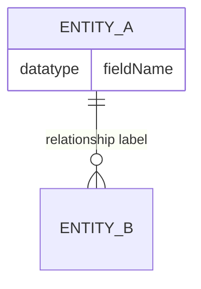
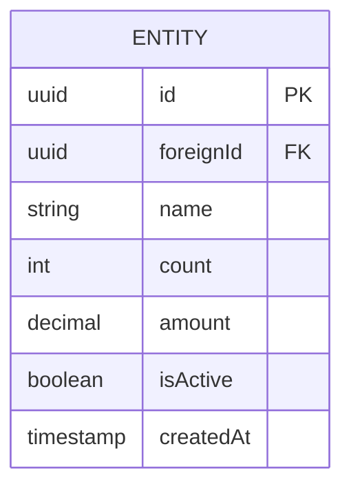
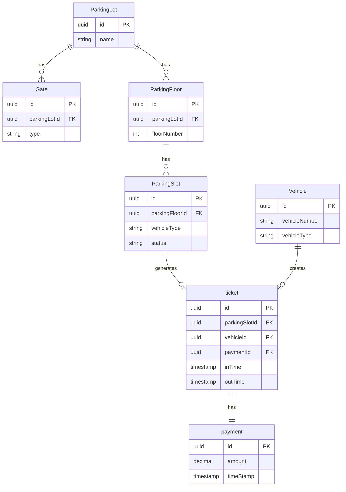

# Mermaid ER Diagram — Complete Notes

## Basic Structure



---

## Cardinality Symbols

Each side of the relationship has **two characters** — one for the outer marker, one for the inner marker.

### Outer Markers (how many at minimum)

| Symbol | Meaning                 |
| ------ | ----------------------- |
| \|     | Exactly one (mandatory) |
| o      | Zero (optional)         |

### Inner Markers (how many at maximum)

| Symbol | Meaning            |
| ------ | ------------------ |
| \|     | One and only one   |
| {      | Many (one or more) |

---

## All Relationship Types

| Notation       | Reads As                                 | Example                                  |
| -------------- | ---------------------------------------- | ---------------------------------------- |
| A \|\|--\|\| B | A has exactly one B, B has exactly one A | ticket — payment                         |
| A \|\|--o\| B  | A has zero or one B                      | ParkingSlot — ticket (slot may be empty) |
| A \|\|--\|{ B  | A has one or more B (mandatory many)     | Order — LineItem                         |
| A \|\|--o{ B   | A has zero or more B (optional many)     | ParkingLot — Gate                        |
| A }\|--\|\| B  | Many A must have exactly one B           | many Gates belong to one Lot             |
| A }o--\|\| B   | Many (optional) A belong to one B        | —                                        |
| A }\|--\|{ B   | Many A, many B (both mandatory)          | Student — Course                         |
| A }o--o{ B     | Many A, many B (both optional)           | —                                        |

### Simple Memory Trick

```
Left side = "how many A per B"
Right side = "how many B per A"

| = exactly one
o = zero (optional)
{ = many
```

---

## Line Style

| Style       | Symbol | Meaning                                             |
| ----------- | ------ | --------------------------------------------------- |
| Solid line  | `--`   | Identifying relationship (FK is part of PK)         |
| Dashed line | `..`   | Non-identifying relationship (FK is not part of PK) |

> Most of the time you will use `--` (solid line)

---

## Field Types



|Suffix|Meaning|
|---|---|
|`PK`|Primary Key|
|`FK`|Foreign Key|
|(none)|Regular field|

---

## Full Parking Lot Example



---

## Quick Reference Card

```
ONE mandatory   →  ||
ONE optional    →  o|
MANY mandatory  →  |{
MANY optional   →  o{

Full pattern:
LEFT_OUTER LEFT_INNER -- RIGHT_INNER RIGHT_OUTER

Example: ParkingLot ||--o{ ParkingFloor
= ParkingLot: exactly one (||)
= ParkingFloor: zero or many (o{)
= "One lot has zero or many floors"
```

---

## Common Mistakes

| Mistake                      | Fix                                           |     |
| ---------------------------- | --------------------------------------------- | --- |
| A --\| B                     | Wrong — always need both sides:  A \|--\| B   |     |
| Forgetting PK/FK labels      | Add `PK` and `FK` suffixes for clarity        |     |
| Using spaces in entity names | Use CamelCase: `ParkingLot` not `Parking Lot` |     |
| Wrong direction of FK        | FK always lives on the **many** side          |     |
