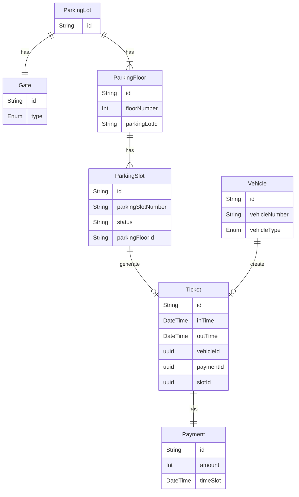

```mermaid
erDiagram
ParkingLot{
String id}

Gate{
String id
Enum type}

ParkingFloor{
String id
Int floorNumber
String parkingLotId
}

ParkingSlot{
String id
String parkingSlotNumber
String status
String parkingFloorId
}
Vehicle{
String id
String vehicleNumber
Enum vehicleType
}
Payment{
String id 
Int amount
DateTime timeSlot}

Ticket{
String id 
DateTime inTime
DateTime outTime
uuid vehicleId
uuid paymentId
uuid slotId
}

ParkingLot ||--|| Gate : has
ParkingLot ||--|{ ParkingFloor : has 
ParkingFloor ||--|{ ParkingSlot : has
ParkingSlot ||--o| Ticket : generate
Vehicle ||--o| Ticket:create
Ticket ||--||Payment :has
```