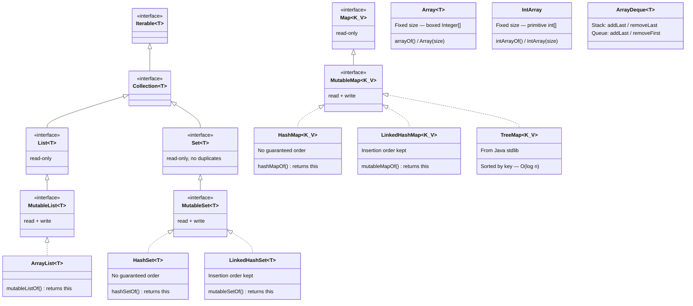

# Kotlin Collections — Mastery Notes


# Kotlin Collections Hierarchy

> **Legend:**  
> `<<interface>>` = interface (read-only or read-write)  
> No tag = concrete class  
> Dashed arrow (`..>`) = implements  
> Solid arrow (`-->`) = extends

---



---

## Key Points

- `Iterable → Collection → List / Set → MutableList / MutableSet` is the main chain.
- `Map` is **completely separate** — it does **not** extend `Collection`.
- `ArrayList`, `HashSet`, `LinkedHashSet` implement the mutable List/Set interfaces.
- `HashMap`, `LinkedHashMap`, `TreeMap` implement `MutableMap`.
- `Array<T>`, `IntArray`, and `ArrayDeque` stand **alone** — outside the Collection hierarchy.
- `mutableListOf()` returns `ArrayList`, `mutableSetOf()` returns `LinkedHashSet`, `mutableMapOf()` returns `LinkedHashMap`.

### 13 Chapters | Full Theory + All Patterns + DSA Mindset + What NOT to Do + 195 Exercises

---

## ⚡ THE ARRAY CONFUSION — Cleared Once and For All

This section comes FIRST because it is the most common source of confusion. Understand this properly and you will never mix them up again.

### The One Question to Ask Before Writing Any Array

> **"Do I already have the values, OR do I need to generate them?"**

```
I have values ready      → arrayOf() / intArrayOf()
I know size, not values  → IntArray(size) / Array(size) { }
```

---

### `arrayOf()` vs `Array()` — Both boxed, different purpose

```kotlin
// arrayOf() — you HAVE the values already
val a = arrayOf(1, 2, 3)           // Array<Int> — boxed Integer[]

// Array(size) { } — you know SIZE and a RULE to generate values
val b = Array(5) { it }            // [0,1,2,3,4] — boxed Integer[]
val c = Array(5) { it + 1 }        // [1,2,3,4,5] — boxed Integer[]
val d = Array(5) { 0 }             // [0,0,0,0,0] — boxed Integer[]

// ❌ INVALID — Array always needs an initializer lambda
// val e = Array(5)  → won't compile
```

**Both produce `Array<T>` → boxed on JVM (Integer[], not int[]).**

---

### `intArrayOf()` vs `IntArray()` — Both primitive, different purpose

```kotlin
// intArrayOf() — you HAVE the values already
val a = intArrayOf(1, 2, 3)        // IntArray — primitive int[]

// IntArray(size) — fixed size, all zeros by default
val b = IntArray(5)                // [0,0,0,0,0] — primitive int[]

// IntArray(size) { } — fixed size with generated values
val c = IntArray(5) { it }         // [0,1,2,3,4] — primitive int[]
val d = IntArray(5) { it * 2 }     // [0,2,4,6,8] — primitive int[]

// ❌ INVALID — must give a size
// val e = IntArray()  → won't compile
```

*Both produce `IntArray` → primitive on JVM (int[], NOT Integer[]).*

---

### The Master Comparison Table — All 5 Array Expressions

|Expression|Type|JVM Level|Use when|
|---|---|---|---|
|`arrayOf(1,2,3)`|`Array<Int>`|`Integer[]`|Know values, general use|
|`Array(5) { it }`|`Array<Int>`|`Integer[]`|Know size, generate values|
|`intArrayOf(1,2,3)`|`IntArray`|`int[]`|Know values, want performance ✅|
|`IntArray(5)`|`IntArray`|`int[]`|Know size, want zeros ✅|
|`IntArray(5) { it }`|`IntArray`|`int[]`|Know size, generate + performance ✅|

*DSA Rule: Always use `IntArray` over `Array<Int>` for integers. Faster, less memory.*

---

### Why Type Inference Hides the Type

```kotlin
val a = arrayOf(1, 2, 3)       // Kotlin infers: Array<Int>
// Exactly same as:
val a: Array<Int> = arrayOf(1, 2, 3)

// You MUST specify when types are mixed:
val b: Array<Any> = arrayOf(1, 2, "three")  // Mixed types — must declare
```

---

### `Array<Int>` vs `IntArray` — The JVM Reality

```kotlin
Array<Int>  // → compiled to Integer[] on JVM (object, boxed, heap allocated)
IntArray    // → compiled to int[] on JVM (primitive, faster, less memory)
```

This is NOT a naming convention. It is a fundamental JVM-level difference.

```kotlin
// These are DIFFERENT types — not interchangeable
val a: Array<Int> = arrayOf(1, 2, 3)    // Integer[] — slower
val b: IntArray   = intArrayOf(1, 2, 3) // int[] — faster ✅

// Use IntArray for:
// - All loops in DSA
// - Frequency arrays: val freq = IntArray(26)
// - DP tables: val dp = IntArray(n)
// - Large datasets where memory matters
```

---


# 🔹 IntArray (primitive → `int[]`)

```
HEAP
┌──────────────────────────────┐
│        int[] object          │
│ ┌────┬────┬────┬────┐        │
│ │  1 │  2 │  3 │  4 │        │
│ └────┴────┴────┴────┘        │
└──────────────────────────────┘
```

### Key points

- Single object
    
- Values stored **directly**
    
- Continuous memory
    
- Fast access, low memory
    

---

# 🔹 Array (boxed → `Integer[]`)

```
HEAP
┌──────────────────────────────┐
│     Integer[] (array)        │
│ ┌────┬────┬────┬────┐        │
│ │ *  │ *  │ *  │ *  │        │
│ └─┬──┴─┬──┴─┬──┴─┬──┘        │
└───│────│────│────│────────── ┘
    │    │    │    │
    ▼    ▼    ▼    ▼

 ┌──────────┐  ┌──────────┐
 │ Integer  │  │ Integer  │   ... (separate objects)
 │   value 1│  │   value 2│
 └──────────┘  └──────────┘
```

### Key points

- One array + multiple objects
    
- Stores **references (pointers)**
    
- Scattered memory
    
- Slower, more GC
    

---

# 🔥 One-line summary (put this in bold in your notes)

```
IntArray  = [values stored directly in one block]
Array<Int> = [array of references → each value is separate object]
```

---


## "What Should I Use?" — Decision Guide

```
Need integers for DSA loops or DP?
→ IntArray (fastest, primitive)

Need to grow/shrink dynamically?
→ MutableList

Need O(1) membership check ("have I seen this?")?
→ HashSet (order irrelevant) or LinkedHashSet (insertion order needed)

Need key-value pairs?
→ HashMap (order irrelevant) or LinkedHashMap (insertion order needed)

Need LIFO (stack behavior)?
→ ArrayDeque — use addLast() / removeLast()

Need FIFO (queue / BFS)?
→ ArrayDeque — use addLast() / removeFirst()

Need frequency counting?
→ HashMap<Char/Int, Int> with getOrDefault()

Need to eliminate duplicates fast?
→ toHashSet() or toSet()

Need sorted iteration by key?
→ TreeMap (from Java, O(log n))
```

---

# Chapter 1 — Array

## What is an Array?

An Array in Kotlin is a **fixed-size, ordered collection** of elements of the same type.

- Fixed size means once you create it with size 5, it will always be size 5. You cannot add or remove elements.
- It is not an interface. It is not a concrete class from a library. `Array<T>` is a **built-in Kotlin class**.
- Under the hood, on JVM it compiles to a Java array `[]`.
- Because it is fixed size, it is the **fastest** collection for index-based access.

## When to use Array in DSA?

- When you know the size upfront and it will not change
- When performance matters — Array is faster than List
- When the problem gives you a fixed-size grid or matrix
- When the problem explicitly says "array of integers"
- Frequency counting: `val freq = IntArray(26)` for lowercase characters
- DP tables: `val dp = IntArray(n) { 0 }`

## Types of Arrays in Kotlin

```kotlin
// Generic array — stores any type, uses Integer objects on JVM (boxed)
val arr: Array<Int> = arrayOf(1, 2, 3, 4, 5)

// Primitive arrays — stores raw int/byte/etc, NO boxing, faster for DSA
val intArr: IntArray       = intArrayOf(1, 2, 3)
val byteArr: ByteArray     = byteArrayOf(1, 2, 3)
val longArr: LongArray     = longArrayOf(1L, 2L, 3L)
val charArr: CharArray     = charArrayOf('a', 'b', 'c')
val boolArr: BooleanArray  = booleanArrayOf(true, false)
val doubleArr: DoubleArray = doubleArrayOf(1.0, 2.0)
```

**Why does IntArray exist separately from Array<Int>?**

`Array<Int>` stores boxed `Integer` objects on JVM. `IntArray` stores raw `int` primitives. For DSA, always prefer `IntArray` over `Array<Int>` when working with integers — it is faster and uses less memory.

## Creating Arrays — All Patterns

```kotlin
// Pattern 1 — direct values
val a = arrayOf(1, 2, 3, 4, 5)       // Array<Int> — I provide values
val b = intArrayOf(1, 2, 3, 4, 5)    // IntArray ✅ preferred for DSA

// Pattern 2 — fixed size with default value
val c = IntArray(5)                   // [0, 0, 0, 0, 0] — all zeros by default
val d = Array<String>(3) { "" }       // ["", "", ""] — empty strings

// Pattern 3 — fixed size with computed values using lambda
val e = IntArray(5) { it }            // [0, 1, 2, 3, 4] — index becomes value
val f = IntArray(5) { it * 2 }        // [0, 2, 4, 6, 8]
val g = Array(5) { it + 1 }           // [1, 2, 3, 4, 5] — I define how to create values

// Pattern 4 — 2D array (matrix)
val matrix  = Array(3) { IntArray(3) }          // 3x3 grid of zeros
val matrix2 = Array(3) { IntArray(3) { 0 } }    // same, explicit
```

## Accessing Elements — All Patterns

```kotlin
val arr = intArrayOf(10, 20, 30, 40, 50)

// Pattern 1 — index with square bracket (most common)
val first = arr[0]       // 10
val last  = arr[4]       // 50

// Pattern 2 — get() function (same as square bracket)
val x = arr.get(0)       // 10

// Pattern 3 — first() and last()
arr.first()              // 10
arr.last()               // 50

// Pattern 4 — safe access — returns null instead of crash
val arr2: Array<Int> = arrayOf(1, 2, 3)
val safe  = arr2.getOrNull(10)          // null, does not crash
val safe2 = arr2.getOrElse(10) { -1 }  // -1 as fallback
```

## What NOT to Do While Accessing

```kotlin
val arr = intArrayOf(1, 2, 3)

// ❌ WRONG — crashes with ArrayIndexOutOfBoundsException
val x = arr[5]

// ❌ WRONG — negative index also crashes
val y = arr[-1]

// ✅ RIGHT — always check size or use safe access
if (arr.size > 5) val x = arr[5]
val x = arr.getOrNull(5) ?: -1
```

## Modifying Elements

```kotlin
val arr = intArrayOf(10, 20, 30, 40, 50)

// Update by index — only way to modify
arr[0] = 99              // arr is now [99, 20, 30, 40, 50]
arr[arr.size - 1] = 0   // update last element

// You CANNOT add or remove from an array
// arr.add(60)    → does not exist, compile error
// arr.remove(10) → does not exist, compile error
```

## Iteration — All Patterns

## ✅ `..` → **inclusive**

for (i in 0..5)

👉 Iterates:

0, 1, 2, 3, 4, 5

✔️ includes **5**

---

## ✅ `until` → **exclusive**

for (i in 0 until 5)

👉 Iterates:

0, 1, 2, 3, 4

❌ excludes **5**

---

# ⚔️ Side-by-side

|Expression|Range|Includes end?|
|---|---|---|
|`0..5`|0 → 5|✅ Yes|
|`0 until 5`|0 → 4|❌ No|


```kotlin
val arr = intArrayOf(10, 20, 30, 40, 50)

// Pattern 1 — simple for-in
for (item in arr) { println(item) }

// Pattern 2 — index based
for (i in arr.indices) { println("index $i → ${arr[i]}") }

// Pattern 3 — manual range
for (i in 0 until arr.size) { println(arr[i]) }

// Pattern 4 — forEach
arr.forEach { println(it) }

// Pattern 5 — forEachIndexed
arr.forEachIndexed { index, value -> println("$index → $value") }

// Pattern 6 — withIndex
for ((index, value) in arr.withIndex()) { println("$index → $value") }

// Pattern 7 — reverse iteration
for (i in arr.indices.reversed()) { println(arr[i]) }

// Pattern 8 — step iteration
for (i in 0 until arr.size step 2) { println(arr[i]) }  // only even indices
```

## Useful Properties and Functions

```kotlin
val arr = intArrayOf(10, 20, 30, 40, 50)

arr.size             // 5 — property, no ()
arr.isEmpty()        // false
arr.isNotEmpty()     // true
arr.contains(20)     // true
arr.indexOf(30)      // 2 — index of first match, -1 if not found
arr.sum()            // 150
arr.max()            // 50
arr.min()            // 10
arr.average()        // 30.0
arr.sorted()         // returns new sorted List (not Array)
arr.sortedArray()    // returns new sorted IntArray
arr.sort()           // sorts in-place, no return value
arr.reverse()        // reverses in-place (IntArray only)
arr.toList()         // converts to List<Int>
arr.toMutableList()  // converts to MutableList<Int>
```

## 2D Array — Matrix Patterns

```kotlin
val matrix = Array(3) { IntArray(3) }

// Set values
matrix[0][0] = 1
matrix[1][2] = 5

// Iterate all elements
for (row in matrix) {
    for (col in row) { print("$col ") }
    println()
}

// Iterate with indices
for (i in matrix.indices) {
    for (j in matrix[i].indices) {
        print("${matrix[i][j]} ")
    }
}
```

---

## Chapter 1 Exercises

**Exercise 1** — Declare an IntArray of 5 elements. Print each using indices iteration.

**Exercise 2** — Create an IntArray of size 10 where each element equals its index multiplied by 3.

**Exercise 3** — Given an IntArray, find the sum of all elements without using sum().

**Exercise 4** — Given an IntArray, reverse it in-place without using reverse().

**Exercise 5** — Given an IntArray, find the maximum element without using max().

**Exercise 6** — Given an IntArray, count how many elements are greater than a given value n.

**Exercise 7** — Given an IntArray, swap the first and last element.

**Exercise 8** — Given an IntArray, check if it is sorted in ascending order.

**Exercise 9** — Given an IntArray, rotate it to the right by k positions.

**Exercise 10** — Given an IntArray, find the second largest element.

**Exercise 11** — Given an IntArray, move all negative numbers to the left and positive numbers to the right.

**Exercise 12** — Create a 3x3 IntArray matrix. Fill it with values 1 to 9. Print it in matrix format.

**Exercise 13** — Given a 2D IntArray matrix, find the sum of each row.

**Exercise 14** — Given an IntArray, find all pairs whose sum equals a target value.

**Exercise 15** — Given two IntArrays of the same size, create a third IntArray where each element is the sum of the corresponding elements.

---

# Chapter 2 — List (Read Only)

## What is List?

`List<T>` in Kotlin is a **read-only interface**. It means:

- You **cannot** add, remove, or update elements once created
- It is an **interface** — not a class, you cannot do `List()` directly
- It is part of the `kotlin.collections` package
- It extends `Collection<T>` which extends `Iterable<T>`
- Under the hood, `listOf()` returns a `java.util.Arrays$ArrayList` — a fixed Java list

## Why does read-only List exist?

Kotlin believes in **immutability by default**. If you have data that should not change after creation — use `List`. It prevents accidental modification. You pass a `List` to a function and you know that function cannot modify your data.

## When to use List in DSA?

- When you have input data that you only need to read, not modify
- When returning results from a function that should not be changed
- When you want to make your intent clear — "this data is fixed"

- `listOf(...)`
    Creates a **read-only list with given elements** (values are provided directly).
- `List(size) {}`
    Creates a **read-only list of a fixed size using a lambda to generate each element**.

---

## Comparison Table

|Feature|`listOf(...)`|`List(size) {}`|
|---|---|---|
|Input|Direct values|Size + generator (lambda)|
|Use case|Known/static data|Generated/dynamic data|
|Syntax|`listOf(1,2,3)`|`List(5) { it }`|
|Requires lambda|❌ No|✅ Yes|
|Mutability|Read-only|Read-only|
|Type|`List<T>`|`List<T>`|
|Initialization|Immediate values|Computed per index|
|Example output|`[1,2,3]`|`[0,1,2,3,4]`|

---

## Creating a List — All Patterns

```kotlin
// Pattern 1 — listOf() factory function
val list: List<Int> = listOf(1, 2, 3, 4, 5)

// Pattern 2 — type inferred
val list2 = listOf("apple", "banana", "cherry")

// Pattern 3 — empty list
val empty: List<Int> = emptyList()
val empty2 = listOf<Int>()   // same

// Pattern 4 — single element
val single = listOf(42)

// Pattern 5 — from array
val arr = intArrayOf(1, 2, 3)
val fromArr = arr.toList()

// Pattern 6 — list of pairs
val pairs = listOf(1 to "one", 2 to "two")
```

## Accessing Elements — All Patterns

```kotlin
val list = listOf(10, 20, 30, 40, 50)

// Pattern 1 — square bracket
val x = list[0]           // 10

// Pattern 2 — get()
val y = list.get(2)       // 30

// Pattern 3 — first and last
list.first()              // 10 // unsafe
list.firstOrNull() // null safety 
list.last()               // 50
list.lastOrNull() //return null if doesn't match any

// Pattern 4 — safe access — never crashes
list.getOrNull(10)        // null
list.getOrElse(10) { -1 } // -1

// Pattern 5 — find by condition
list.find { it > 25 }         // 30 — first match
list.findLast { it > 25 }     // 50 — last match

// Pattern 6 — index of element
list.indexOf(30)              // 2
list.lastIndexOf(30)          // 2
list.indexOfFirst { it > 25 } // 2
list.indexOfLast { it > 25 }  // 4
```

## What NOT to Do

```kotlin
val list = listOf(1, 2, 3)

// ❌ WRONG — List is read-only, these do not compile
// list.add(4)
// list.remove(1)
// list[0] = 99

// ❌ WRONG — out of bounds crashes
// list[10]

// ✅ RIGHT — use getOrNull for safe access
val x = list.getOrNull(10)  // null, no crash

// ❌ WRONG — do not use List when you need to modify
// ✅ RIGHT — use mutableListOf() when you need to modify
val mlist = mutableListOf(1, 2, 3)
mlist.add(4)  // works
```

## Iteration — All Patterns

```kotlin
val list = listOf(10, 20, 30, 40, 50)

// Pattern 1 — for-in
for (item in list) { println(item) }

// Pattern 2 — indices
for (i in list.indices) { println("$i → ${list[i]}") }

// Pattern 3 — forEach
list.forEach { println(it) }

// Pattern 4 — forEachIndexed
list.forEachIndexed { index, value -> println("$index → $value") }

// Pattern 5 — withIndex
for ((index, value) in list.withIndex()) { println("$index → $value") }

// Pattern 6 — iterator
val iter = list.iterator()
while (iter.hasNext()) { println(iter.next()) }

// Pattern 7 — reversed
for (item in list.reversed()) { println(item) }

// Pattern 8 — chunked iteration
for (chunk in list.chunked(2)) { println(chunk) }  // [10,20], [30,40], [50]
```

## Useful Functions

```kotlin
val list = listOf(10, 20, 30, 40, 50)

list.size                              // 5
list.isEmpty()                         // false
list.isNotEmpty()                      // true
list.contains(20)                      // true
list.containsAll(listOf(10, 20))       // true
list.sum()                             // 150
list.max()                             // 50
list.min()                             // 10
list.average()                         // 30.0
list.count { it > 20 }                 // 3
list.sorted()                          // [10, 20, 30, 40, 50] — new list
list.sortedDescending()                // [50, 40, 30, 20, 10]
list.sortedBy { it }                   // sort by custom key
list.reversed()                        // [50, 40, 30, 20, 10] — new list
list.filter { it > 20 }               // [30, 40, 50]
list.map { it * 2 }                    // [20, 40, 60, 80, 100]
list.any { it > 40 }                   // true
list.all { it > 5 }                    // true
list.none { it > 100 }                 // true
list.distinct()                        // removes duplicates
list.take(3)                           // [10, 20, 30]
list.drop(3)                           // [40, 50]
list.subList(1, 3)                     // [20, 30] — index 1 to 3 (exclusive)
list.zip(listOf('a','b','c','d','e'))  // [(10,a),(20,b)...]
list.toMutableList()                   // converts to MutableList
list.toSet()                           // converts to Set
```

---

## Chapter 2 Exercises

**Exercise 1** — Create a List of 5 integers. Print using forEach and forEachIndexed both.

**Exercise 2** — Given a List of strings, print only strings with length greater than 4.

**Exercise 3** — Given a List of integers, find the sum without using sum().

**Exercise 4** — Given a List, find the first element greater than a given value using find().

**Exercise 5** — Given a List, print elements in reverse without using reversed().

**Exercise 6** — Given two Lists, create a third List containing elements common to both.

**Exercise 7** — Given a List of integers, return a new List with each element doubled using map().

**Exercise 8** — Given a List, find how many elements are even.

**Exercise 9** — Given a List of strings, return a new List with only strings starting with the letter 'a'.

**Exercise 10** — Given a List, check if it contains all elements of another List.

**Exercise 11** — Given a List, return the subList from index 2 to index 5.

**Exercise 12** — Given a List of integers, find if any two adjacent elements have a difference greater than 10.

**Exercise 13** — Given a List, use zip() to pair it with another List and print each pair.

**Exercise 14** — Given a List of integers, return a new List with duplicates removed using distinct().

**Exercise 15** — Given a List, split it into chunks of size 3 using chunked() and print each chunk.

---

# Chapter 3 — MutableList

## What is MutableList?

`MutableList<T>` is a **read-write interface** that extends `List<T>`.

- It adds add, remove, update operations on top of everything List provides
- It is still an **interface** — you cannot do `MutableList()` directly
- `mutableListOf()` returns an `ArrayList` under the hood
- `ArrayList<T>` is the **concrete class** that implements `MutableList<T>`

## Difference Between List and MutableList

||List|MutableList|
|---|---|---|
|Type|Interface|Interface|
|Read|Yes|Yes|
|Write|No|Yes|
|Factory function|`listOf()`|`mutableListOf()`|
|Concrete class|—|`ArrayList`|

## When to use MutableList in DSA?

- When you need to build a result dynamically
- When you need to add, remove or update elements
- When implementing sliding window, two pointer, or stack-like behavior with a list
- Most DSA problems that output a list use MutableList to build the result

## Creating MutableList — All Patterns

```kotlin
// Pattern 1 — empty mutableList
val list: MutableList<Int> = mutableListOf()

// Pattern 2 — with initial values
val list2 = mutableListOf(1, 2, 3, 4, 5)

// Pattern 3 — using ArrayList directly (concrete class)
val list3 = ArrayList<Int>()
val list4: ArrayList<String> = ArrayList()

// Pattern 4 — from read-only list
val readOnly = listOf(1, 2, 3)
val mutable = readOnly.toMutableList()

// Pattern 5 — from array
val arr = intArrayOf(1, 2, 3)
val fromArr = arr.toMutableList()

// Pattern 6 — pre-filled with same value
val filled  = MutableList(5) { 0 }   // [0, 0, 0, 0, 0]
val filled2 = MutableList(5) { it }  // [0, 1, 2, 3, 4]
```

- `MutableList(size) {}` 
    Creates a **mutable list of fixed size**, where each element is generated using a **lambda (initializer)**.
- `mutableListOf(...)`  
    Creates a **mutable list with given elements directly**.

---

## Comparison Table

|Feature|`MutableList(size) {}`|`mutableListOf(...)`|
|---|---|---|
|Input|Size + generator (lambda)|Direct values|
|Use case|Generated / computed data|Known / static data|
|Syntax|`MutableList(2) { 0 }`|`mutableListOf(0, 0)`|
|Requires lambda|✅ Yes|❌ No|
|Size|Fixed at creation|Based on provided elements|
|Mutability|Mutable|Mutable|
|Type|`MutableList<T>`|`MutableList<T>`|
|Example output|`[0, 0]`|`[0, 0]`|


## Adding Elements — All Patterns

```kotlin
val list = mutableListOf(10, 20, 30)

list.add(40)                       // add at end → [10, 20, 30, 40]
list.add(0, 5)                     // add at index 0 → [5, 10, 20, 30, 40]
list.add(2, 15)                    // add at index 2
list.addAll(listOf(50, 60))        // add multiple at end
list.addAll(0, listOf(1, 2))       // add multiple at index 0
list += 70                         // same as list.add(70)
list += listOf(80, 90)             // same as list.addAll(...)
```

## Removing Elements — All Patterns

```kotlin
val list = mutableListOf(10, 20, 30, 40, 50, 20)

list.remove(20)                    // removes FIRST 20 → returns Boolean
list.removeAt(0)                   // remove by index → returns removed element
list.removeAll { it > 30 }         // remove by condition
list.removeAll(listOf(10, 20))     // remove matching items
list -= 30                         // same as list.remove(30)
list.clear()                       // list is now []
```

## Updating Elements

```kotlin
val list = mutableListOf(10, 20, 30, 40, 50)

list[0] = 99                       // [99, 20, 30, 40, 50]
list[list.size - 1] = 0            // update last
list.set(1, 88)                    // same as list[1] = 88
list.replaceAll { it * 2 }         // doubles every element in-place
```

## What NOT to Do

```kotlin
val list = mutableListOf(1, 2, 3, 4, 5)

// ❌ WRONG — modifying while iterating causes ConcurrentModificationException
for (item in list) {
    if (item == 3) list.remove(item)  // CRASH
}

// ✅ RIGHT — use removeAll with condition
list.removeAll { it == 3 }

// ✅ RIGHT — or iterate over a copy
for (item in list.toList()) {
    if (item == 3) list.remove(item)
}

// ❌ WRONG — accessing out of bounds crashes
val x = list[10]

// ✅ RIGHT — check size first
if (list.size > 10) val x = list[10]
```

## Iteration — All Patterns

```kotlin
val list = mutableListOf(10, 20, 30, 40, 50)

// Pattern 1 — for-in
for (item in list) { println(item) }

// Pattern 2 — indices
for (i in list.indices) { println("$i → ${list[i]}") }

// Pattern 3 — forEach
list.forEach { println(it) }

// Pattern 4 — forEachIndexed
list.forEachIndexed { index, value -> println("$index → $value") }

// Pattern 5 — withIndex
for ((index, value) in list.withIndex()) { println("$index → $value") }

// Pattern 6 — MutableIterator — can remove during iteration safely
val iter = list.iterator() as MutableIterator
while (iter.hasNext()) {
    val item = iter.next()
    if (item == 30) iter.remove()  // safe removal during iteration
}
```

## Sorting a MutableList

```kotlin
val list = mutableListOf(30, 10, 50, 20, 40)

list.sort()                        // sorts in-place ascending ✅
list.sortDescending()              // sorts in-place descending ✅
list.sortBy { it }                 // sort in-place by custom key
list.sortByDescending { it }

// These return NEW list, do NOT modify original
val sorted     = list.sorted()
val sortedDesc = list.sortedDescending()
```

---

## Chapter 3 Exercises

**Exercise 1** — Create an empty MutableList. Add numbers 1 to 10 using a loop. Print the result.

**Exercise 2** — Create a MutableList of strings. Add 5 names. Remove the name at index 2. Print result.

**Exercise 3** — Given a MutableList of integers, remove all even numbers using removeAll.

**Exercise 4** — Given a MutableList, replace every element with its square using replaceAll.

**Exercise 5** — Given a MutableList of integers, insert 0 before every negative number.

**Exercise 6** — Given a MutableList, sort it in-place in descending order.

**Exercise 7** — Given a MutableList of strings, remove all strings that contain the letter 'e'.

**Exercise 8** — Given two MutableLists, merge them into one and remove duplicates.

**Exercise 9** — Given a MutableList, rotate it to the left by k positions in-place.

**Exercise 10** — Given a MutableList of integers, move all zeros to the end maintaining the order of non-zero elements.

**Exercise 11** — Given a MutableList, find all pairs whose sum equals a target. Return as a MutableList of Pairs.

**Exercise 12** — Given a MutableList of integers, remove the minimum element every time until the list is empty. Print each state.

**Exercise 13** — Given a MutableList, split it into two MutableLists — odd-indexed elements and even-indexed elements.

**Exercise 14** — Given a MutableList of strings, sort it by string length in ascending order.

**Exercise 15** — Implement a function that takes a MutableList and a value, and removes all occurrences of that value.

---

# Chapter 4 — Set (Read Only)

## What is Set?

`Set<T>` is a **read-only interface** that represents a collection with **no duplicate elements**.

- No duplicates — if you add the same element twice, only one is stored
- It is an **interface** — cannot instantiate directly
- Order depends on the implementation — `setOf()` in Kotlin uses `LinkedHashSet` under the hood, so it maintains insertion order
- `Set` extends `Collection<T>` which extends `Iterable<T>`
- There is **no index** in a Set — you cannot access element by position

## Why does Set exist?

The fundamental use of a Set is **membership testing** — "does this element exist?" — and this is O(1) for HashSet. This is the key advantage over List where contains() is O(n).

## When to use Set in DSA?

- When you need to check if an element was already seen — O(1) lookup
- When you need to eliminate duplicates from a collection
- When you need to perform union, intersection, or difference operations
- Checking if a string has all unique characters
- Finding elements that appear in multiple arrays

## Creating a Set — All Patterns

```kotlin
// Pattern 1 — setOf() factory function (read-only)
val set: Set<Int> = setOf(1, 2, 3, 4, 5)

// Pattern 2 — duplicates are silently ignored
val set2 = setOf(1, 2, 2, 3, 3, 3)   // stores {1, 2, 3}

// Pattern 3 — empty set
val empty: Set<Int> = emptySet()
val empty2 = setOf<Int>()

// Pattern 4 — from list (removes duplicates)
val list = listOf(1, 2, 2, 3, 3)
val set3 = list.toSet()              // {1, 2, 3}

// Pattern 5 — from array
val arr  = intArrayOf(1, 2, 2, 3)
val set4 = arr.toSet()
```

## Accessing Elements — All Patterns

```kotlin
val set = setOf(10, 20, 30, 40, 50)

// ❌ There is NO index access in Set — set[0] does NOT compile

// Pattern 1 — check if element exists (most common in DSA)
set.contains(20)           // true
20 in set                  // true — cleaner syntax

// Pattern 2 — first and last (order depends on set type)
set.first()                // 10
set.last()                 // 50

// Pattern 3 — find by condition
set.find { it > 25 }       // 30

// Pattern 4 — convert to list then access by index
val list = set.toList()
list[0]                    // 10
```

## What NOT to Do

```kotlin
val set = setOf(1, 2, 3)

// ❌ No index access — set[0] does not compile
// ❌ Read-only — set.add(4) does not compile
// ❌ Read-only — set.remove(1) does not compile

// ❌ Never assume order in HashSet
val hSet = hashSetOf(3, 1, 2)
// hSet.first() can return anything — order NOT guaranteed
```

## Set Math Operations — Important for DSA

```kotlin
val a = setOf(1, 2, 3, 4, 5)
val b = setOf(3, 4, 5, 6, 7)

val union     = a union b          // {1, 2, 3, 4, 5, 6, 7}
val union2    = a + b              // same
val intersect = a intersect b     // {3, 4, 5}
val diff      = a subtract b      // {1, 2}
val diff2     = a - b             // same
val symDiff   = (a - b) union (b - a)  // {1, 2, 6, 7}

val c = setOf(3, 4)
c.all { it in a }                  // true — c is subset of a
a.containsAll(c)                   // true — same check
```

## Iteration — All Patterns

```kotlin
val set = setOf(10, 20, 30, 40, 50)

for (item in set) { println(item) }                               // for-in
set.forEach { println(it) }                                       // forEach
val iter = set.iterator()
while (iter.hasNext()) { println(iter.next()) }                   // iterator
for ((index, value) in set.withIndex()) { println("$index → $value") }  // withIndex
```

## Useful Functions

```kotlin
val set = setOf(10, 20, 30, 40, 50)

set.size                          // 5
set.isEmpty()                     // false
set.isNotEmpty()                  // true
set.contains(20)                  // true
set.containsAll(setOf(10, 20))    // true
set.count { it > 20 }             // 3
set.filter { it > 20 }            // returns List [30, 40, 50]
set.map { it * 2 }                // returns List [20, 40, 60, 80, 100]
set.sum()                         // 150
set.max()                         // 50
set.min()                         // 10
set.sorted()                      // returns sorted List
set.toList()                      // converts to List
set.toMutableSet()                // converts to MutableSet
```

---

## Chapter 4 Exercises

**Exercise 1** — Create a Set from a list that has duplicates. Print the Set and verify size.

**Exercise 2** — Given two Sets of integers, find their union and intersection.

**Exercise 3** — Given a list of integers, use a Set to check how many distinct values exist.

**Exercise 4** — Given a string, check if all characters are unique using a Set.

**Exercise 5** — Given two Sets, find elements that are in the first but not in the second.

**Exercise 6** — Given a Set of integers, find the sum of all elements.

**Exercise 7** — Given a list and a Set of banned numbers, return a new list with banned numbers removed.

**Exercise 8** — Given two Sets, check if one is a subset of the other.

**Exercise 9** — Given a Set of strings, find all strings with length greater than 4.

**Exercise 10** — Given a list of integers, use a Set to remove duplicates and return sorted result.

**Exercise 11** — Given three Sets, find elements common to all three.

**Exercise 12** — Given two Sets, find symmetric difference — elements in exactly one of the two sets.

**Exercise 13** — Given a sentence, find the set of unique words.

**Exercise 14** — Given a Set and a List, check if every element of the List exists in the Set.

**Exercise 15** — Given a list of integers, find all elements that appear exactly once by using Set operations.

---

# Chapter 5 — MutableSet

## What is MutableSet?

`MutableSet<T>` is a **read-write interface** that extends `Set<T>`.

- All properties of Set — no duplicates, no index access
- Adds add() and remove() operations
- `mutableSetOf()` returns a `LinkedHashSet` under the hood — maintains insertion order
- `hashSetOf()` returns a `HashSet` — no guaranteed order

## Difference Between Set and MutableSet

||Set|MutableSet|
|---|---|---|
|Type|Interface|Interface|
|Read|Yes|Yes|
|Write|No|Yes|
|Duplicates|Not allowed|Not allowed|
|Factory function|`setOf()`|`mutableSetOf()`|
|Concrete class|—|`LinkedHashSet` or `HashSet`|

## When to use MutableSet in DSA?

- Track "seen" elements and need to add/remove dynamically
- Build up a unique set incrementally during a loop
- Filter already-processed items

## Creating MutableSet — All Patterns

```kotlin
val set: MutableSet<Int> = mutableSetOf()         // empty LinkedHashSet
val set2 = mutableSetOf(1, 2, 3, 4, 5)
val set3 = readOnly.toMutableSet()
val set4 = listOf(1, 2, 2, 3).toMutableSet()      // {1, 2, 3}
```

## Adding Elements

```kotlin
val set = mutableSetOf(10, 20, 30)

val added  = set.add(40)   // true — added
val added2 = set.add(10)   // false — already exists, set unchanged

set.addAll(listOf(50, 60))
set.addAll(setOf(70, 80))
set += 90
set += setOf(100, 110)
```

## Removing Elements

```kotlin
val set = mutableSetOf(10, 20, 30, 40, 50)

set.remove(20)              // true if removed, false if not found — no crash
set.remove(99)              // false — not found, no crash
set.removeAll(setOf(10, 30))
set.removeAll { it > 40 }
set -= 50
set.clear()
```

## What NOT to Do

```kotlin
val set = mutableSetOf(1, 2, 3, 4, 5)

// ❌ No index access even in MutableSet
// set[0]          → does not compile
// set.removeAt(0) → does not exist in Set

// ❌ Modifying while iterating — ConcurrentModificationException
for (item in set) {
    if (item == 3) set.remove(item)  // CRASH
}

// ✅ Use removeAll
set.removeAll { it == 3 }

// ✅ Or iterate over a copy
for (item in set.toSet()) {
    if (item == 3) set.remove(item)
}
```

## Iteration — All Patterns

```kotlin
val set = mutableSetOf(10, 20, 30, 40, 50)

for (item in set) { println(item) }
set.forEach { println(it) }

// MutableIterator — safe removal during iteration
val iter = set.iterator() as MutableIterator
while (iter.hasNext()) {
    val item = iter.next()
    if (item == 30) iter.remove()
}

for ((index, value) in set.withIndex()) { println("$index → $value") }
```

---

## Chapter 5 Exercises

**Exercise 1** — Create an empty MutableSet. Add numbers 1 to 10 using a loop. Try adding 5 again. Print size.

**Exercise 2** — Create a MutableSet from a list with duplicates. Print the result.

**Exercise 3** — Given a MutableSet, remove all elements greater than a given value.

**Exercise 4** — Given two MutableSets, add all elements of the second into the first using addAll.

**Exercise 5** — Given a MutableSet of integers, keep only elements that are divisible by 3.

**Exercise 6** — Given a list of words, use a MutableSet to collect only unique words, then print them sorted.

**Exercise 7** — Write a function that takes a MutableSet and removes all even numbers.

**Exercise 8** — Given a MutableSet, check if adding a duplicate returns false.

**Exercise 9** — Given two MutableSets, find their intersection and store in a third MutableSet.

**Exercise 10** — Given a string, use a MutableSet to find and print all duplicate characters.

**Exercise 11** — Given a MutableSet of strings, remove all strings that start with a vowel.

**Exercise 12** — Given a list of integers, use a MutableSet to find elements that appear more than once.

**Exercise 13** — Convert a MutableSet to a sorted MutableList.

**Exercise 14** — Given a MutableSet, use MutableIterator to safely remove all odd numbers while iterating.

**Exercise 15** — Given two lists, use MutableSets to find elements present in both lists.

---

# Chapter 6 — HashSet

## What is HashSet?

`HashSet<T>` is a **concrete class** that implements `MutableSet<T>`.

- Uses a **hash table** internally
- Lookup, add, and remove are all **O(1)** — constant time
- **No guaranteed order** — elements may print in any order
- Allows one `null` element
- It is a concrete class — you CAN create an object directly with `HashSet()`
- This is the most commonly used Set in DSA because of O(1) performance

## HashSet vs LinkedHashSet vs TreeSet

||HashSet|LinkedHashSet|TreeSet|
|---|---|---|---|
|Order|None|Insertion order|Sorted order|
|Performance|O(1)|O(1)|O(log n)|
|Use in DSA|Most common|When order matters|When sorted needed|

## When to use HashSet in DSA?

- When you only care about membership — "have I seen this before?"
- Finding duplicates in O(n)
- Two-sum type problems
- Visited tracking in graph problems
- Removing duplicates when order does not matter


## Creating HashSet — All Patterns

```kotlin
val set: HashSet<Int> = HashSet()
val set2 = HashSet<Int>(16)          // with initial capacity
val set3 = hashSetOf(1, 2, 3, 4, 5)
val set4 = listOf(1, 2, 2, 3).toHashSet()
val copy = HashSet(existing)
```

## Definitions

- **`hashSetOf(...)`**  
    Creates a **mutable `HashSet<T>` with given elements** (values provided directly).
- **`HashSet()`**  
    Creates an **empty mutable `HashSet<T>`**, optionally with initial capacity.

---

## Comparison Table

|Feature|`hashSetOf(...)`|`HashSet()`|
|---|---|---|
|Type|`HashSet<T>`|`HashSet<T>`|
|Input|Direct values|Empty / capacity|
|Syntax|`hashSetOf(1,2,3)`|`HashSet<Int>()`|
|Initialization|Immediate elements|Empty (add later)|
|Capacity control|❌ No|✅ Yes (`HashSet(10)`)|
|Mutability|Mutable|Mutable|
|Order|Not guaranteed|Not guaranteed|
|Idiomatic Kotlin|✅ Preferred|⚠️ Less preferred|

---

## 🎯 Final line

> `hashSetOf()` = create with values  
> `HashSet()` = create empty (optionally with capacity)


## Operations — All Patterns

```kotlin
val set = hashSetOf(10, 20, 30, 40, 50)

set.add(60)                   // true if added, false if duplicate
set.addAll(listOf(70, 80))
set.remove(10)                // true if removed, false if not found
set.removeAll(setOf(20, 30))
set.removeAll { it > 40 }
set.contains(20)              // true — O(1)
20 in set                     // same — cleaner syntax
set.size
set.isEmpty()
set.clear()
```

## The Key DSA Pattern with HashSet

```kotlin
// Pattern 1 — seen tracking (O(n) instead of O(n²))
val nums = listOf(1, 2, 3, 4, 2, 5, 3)
val seen = HashSet<Int>()
val duplicates = HashSet<Int>()
for (num in nums) {
    if (num in seen) duplicates.add(num)
    else seen.add(num)
}
// duplicates = {2, 3}

// Pattern 2 — two sum using HashSet
fun twoSum(nums: IntArray, target: Int): Boolean {
    val seen = HashSet<Int>()
    for (num in nums) {
        if (target - num in seen) return true
        seen.add(num)
    }
    return false
}
```

## Iteration

```kotlin
val set = hashSetOf(10, 20, 30, 40, 50)

// NOTE — do not assume any specific order when iterating HashSet
for (item in set) { println(item) }    // order not guaranteed
set.forEach { println(it) }
for ((index, value) in set.withIndex()) { println("$index → $value") }
```

---

## Chapter 6 Exercises

**Exercise 1** — Create a HashSet. Add elements 1 to 5. Try adding 3 again. Verify size is still 5.

**Exercise 2** — Given a list of integers, use HashSet to find all duplicate elements in O(n).

**Exercise 3** — Given a list, use HashSet to check if any two elements sum to a given target.

**Exercise 4** — Given a string, use HashSet to check if all characters are unique.

**Exercise 5** — Given two lists, use HashSets to find common elements.

**Exercise 6** — Given a list, use HashSet to remove duplicates. Compare with using distinct().

**Exercise 7** — Given a list of integers, find the first element that has already appeared before.

**Exercise 8** — Given a graph as adjacency list, use HashSet to track visited nodes in DFS.

**Exercise 9** — Given a list of integers from 1 to n with one missing, use HashSet to find the missing number.

**Exercise 10** — Given a string, find the length of the longest substring without repeating characters using HashSet.

**Exercise 11** — Given two HashSets, check if they are disjoint — no common elements.

**Exercise 12** — Given a list of words, use HashSet to find words that appear more than once.

**Exercise 13** — Given a HashSet of integers, find the maximum element.

**Exercise 14** — Given a list of integers, check if there exists a duplicate within k distance using HashSet.

**Exercise 15** — Given a list of integers, find all elements that appear exactly once using two HashSets — one for seen, one for duplicates.

---

# Chapter 7 — LinkedHashSet

## What is LinkedHashSet?

`LinkedHashSet<T>` is a **concrete class** that implements `MutableSet<T>`.

- Extends `HashSet` internally and adds a **doubly linked list** to maintain insertion order
- All operations remain **O(1)** — same as HashSet
- **Maintains insertion order** — unlike HashSet
- This is what `mutableSetOf()` and `linkedSetOf()` return under the hood

## LinkedHashSet vs HashSet — When to Choose

||HashSet|LinkedHashSet|
|---|---|---|
|Order|Not guaranteed|Insertion order maintained|
|Performance|O(1)|O(1) — slightly more memory|
|Use case|Order not important|Order matters|
|`mutableSetOf()`|No|Yes — this is the default|

## When to use LinkedHashSet in DSA?

- When you need O(1) uniqueness check AND need to maintain the order elements were first seen
- Finding first non-repeating element
- Returning unique elements in the same order as input

## Creating LinkedHashSet — All Patterns

```kotlin
val set: LinkedHashSet<Int> = LinkedHashSet()
val set2 = linkedSetOf(1, 2, 3, 4, 5)
val set3: MutableSet<Int> = mutableSetOf(1, 2, 3)  // actually LinkedHashSet
val set4 = listOf(3, 1, 2, 1, 3).toCollection(LinkedHashSet())  // {3, 1, 2}
```

## The Key DSA Pattern with LinkedHashSet

```kotlin
// Pattern — unique elements in original order
val input  = listOf(3, 1, 4, 1, 5, 9, 2, 6, 5, 3)
val unique = LinkedHashSet(input)
// unique = {3, 1, 4, 5, 9, 2, 6} — no duplicates, original order kept

// Pattern — first non-repeating character
fun firstNonRepeating(s: String): Char? {
    val seen       = HashSet<Char>()
    val candidates = LinkedHashSet<Char>()  // maintains order
    for (c in s) {
        if (c in seen) candidates.remove(c)
        else { seen.add(c); candidates.add(c) }
    }
    return candidates.firstOrNull()
}
```

---

## Chapter 7 Exercises

**Exercise 1** — Create a LinkedHashSet by adding elements in a specific order. Verify that iteration prints them in insertion order.

**Exercise 2** — Given a list with duplicates, use LinkedHashSet to get unique elements in their original order.

**Exercise 3** — Given a string, use LinkedHashSet to find the first non-repeating character.

**Exercise 4** — Compare the output order of the same elements in HashSet vs LinkedHashSet.

**Exercise 5** — Given a list of words, use LinkedHashSet to return unique words in first-seen order.

**Exercise 6** — Given a stream of characters, maintain a LinkedHashSet of the last 5 unique characters seen.

**Exercise 7** — Given a list of integers, use LinkedHashSet to remove duplicates and return in original order as a List.

**Exercise 8** — Given a sentence, find all unique words in the order they first appear.

**Exercise 9** — Verify that mutableSetOf() returns a LinkedHashSet by checking the class name at runtime.

**Exercise 10** — Given a list of integers, use LinkedHashSet to find which elements were seen first when duplicates exist.

**Exercise 11** — Given two lists, find common elements in the order they appear in the first list using LinkedHashSet.

**Exercise 12** — Given a LinkedHashSet of strings, remove all strings added after a specific string.

**Exercise 13** — Implement a simple "recently seen" tracker using LinkedHashSet that keeps only the last 5 unique items.

**Exercise 14** — Given a list with duplicates, use LinkedHashSet to build a deduplicated result, then reverse it.

**Exercise 15** — Given a list of characters, use LinkedHashSet to find all characters that appear exactly once in first-seen order.

---

# Chapter 8 — Map (Read Only)

## What is Map?

`Map<K, V>` is a **read-only interface** representing a collection of **key-value pairs**.

- Keys are **unique** — one key maps to exactly one value
- Values can be duplicated — multiple keys can have the same value
- It is an **interface** — cannot instantiate directly
- It does NOT extend `Collection` — Map is a separate hierarchy
- `mapOf()` returns a `LinkedHashMap` under the hood — maintains insertion order

## Map Hierarchy

```
Map<K,V> (interface) — read only
  └── MutableMap<K,V> (interface) — read+write
        ├── HashMap<K,V> (concrete class) — no order
        └── LinkedHashMap<K,V> (concrete class) — insertion order
              └── Also: TreeMap<K,V> (from Java) — sorted order
```

## When to use Map in DSA?

- Frequency counting — character count, word count
- Caching computed values — memoization
- Mapping one value to another — character mapping, index mapping
- Two-sum, anagram, and group-by problems
- Graph adjacency representation

## Creating Map — All Patterns

```kotlin
val map: Map<String, Int> = mapOf("apple" to 1, "banana" to 2)
val map2 = mapOf(1 to "one", 2 to "two", 3 to "three")
val empty: Map<String, Int> = emptyMap()
val map3 = mapOf(Pair("a", 1), Pair("b", 2))

val pairs = listOf("a" to 1, "b" to 2, "c" to 3)
val map4 = pairs.toMap()

val words = listOf("apple", "banana", "cherry")
val map5 = words.associateWith { it.length }  // {apple=5, banana=6, cherry=6}
val map6 = words.associateBy { it.first() }   // {a=apple, b=banana, c=cherry}
```

## Accessing Elements — All 5 Patterns (Critical)

```kotlin
val map = mapOf("apple" to 1, "banana" to 2, "cherry" to 3)

// Pattern 1 — square bracket — returns null if key not found (does NOT crash)
val x = map["apple"]              // 1
val y = map["mango"]              // null — key not found

// Pattern 2 — get() — same as square bracket
val z = map.get("apple")          // 1. if not found null

// . attern 3 — getOrDefault — safe, returns fallback if key missing ✅ DSA favorite
val a = map.getOrDefault("mango", 0)   // 0

// Pattern 4 — getOrElse — safe, with lambda fallback
val b = map.getOrElse("mango") { 0 }   // 0

// Pattern 5 — getValue — CRASHES if key not found ⚠️ use only when certain key exists
val c = map.getValue("apple")          // 1.  //error no such element exception
// map.getValue("mango")  → throws NoSuchElementException
```

## What NOT to Do

```kotlin
val map = mapOf("a" to 1, "b" to 2)

// ❌ WRONG — getValue when key might not exist
val x = map.getValue("z")         // NoSuchElementException — CRASH

// ✅ RIGHT
val x = map.getOrDefault("z", 0)

// ❌ WRONG — read-only map cannot be modified
// map["c"] = 3     → does not compile
// map.put("c", 3)  → does not compile

// ❌ WRONG — null dereference
val v = map["mango"]
val doubled = v * 2               // compile error — v could be null

// ✅ RIGHT — Elvis operator
val v = map["mango"] ?: 0
val doubled = v * 2
```

## Checking and Querying

```kotlin
val map = mapOf("apple" to 1, "banana" to 2, "cherry" to 3)

map.containsKey("apple")          // true
map.containsValue(2)              // true
"apple" in map                    // true — same as containsKey
map.size                          // 3
map.isEmpty()                     // false
map.isNotEmpty()                  // true
map.keys                          // Set<String>
map.values                        // Collection<Int>
map.entries                       // Set<Map.Entry<String,Int>>
```

## Iteration — All Patterns

```kotlin
val map = mapOf("apple" to 1, "banana" to 2, "cherry" to 3)

// Pattern 1 — destructuring — most common in DSA ✅
for ((key, value) in map) { println("$key → $value") }

// Pattern 2 — entries
for (entry in map.entries) { println("${entry.key} → ${entry.value}") }

// Pattern 3 — keys only
for (key in map.keys) { println(key) }

// Pattern 4 — values only
for (value in map.values) { println(value) }

// Pattern 5 — forEach
map.forEach { key, value -> println("$key → $value") }

// Pattern 6 — forEach on entries
map.entries.forEach { println("${it.key} → ${it.value}") }
```

## Useful Functions

```kotlin
val map = mapOf("apple" to 1, "banana" to 2, "cherry" to 3)

map.toList()                               // List<Pair<String,Int>>
map.toMutableMap()                         // MutableMap copy
map.toSortedMap()                          // sorted by key
map.entries.sortedBy { it.value }          // sorted by value → List
map.entries.sortedByDescending { it.value }
map.filter { (k, v) -> v > 1 }            // returns new Map
map.map { (k, v) -> k to v * 2 }.toMap()  // transform values
map.any { (k, v) -> v > 2 }               // true
map.all { (k, v) -> v > 0 }               // true
map.count { (k, v) -> v > 1 }             // 2
map.maxByOrNull { it.value }               // entry with max value
map.minByOrNull { it.value }               // entry with min value
```

---

## Chapter 8 Exercises

**Exercise 1** — Create a Map of country to capital. Access 3 values using all different access patterns.

**Exercise 2** — Given a Map of word to frequency, iterate using all 5 iteration patterns.

**Exercise 3** — Given a Map, find the key with the maximum value.

**Exercise 4** — Given a Map of string to int, filter entries where value is greater than 3.

**Exercise 5** — Given a list of words, use associateWith to build a Map of word to its length.

**Exercise 6** — Given a Map, sort entries by value in descending order and print.

**Exercise 7** — Given two Maps, check if they have any common keys.

**Exercise 8** — Given a Map of student to score, find all students with score above 80.

**Exercise 9** — Given a Map, invert it — swap keys and values. Return as a new Map.

**Exercise 10** — Given a Map, use getOrDefault for 5 keys, some of which do not exist.

**Exercise 11** — Given a list of pairs, convert to a Map and then back to a list.

**Exercise 12** — Given a Map of city to population, find all cities with population between 1M and 5M.

**Exercise 13** — Given a Map, count how many entries have a value greater than a threshold.

**Exercise 14** — Given two Maps, find all keys that exist in the first but not the second.

**Exercise 15** — Given a Map of word to list of synonyms, find all words that have more than 2 synonyms.

---

# Chapter 9 — MutableMap

## What is MutableMap?

`MutableMap<K, V>` is a **read-write interface** that extends `Map<K, V>`.

- Adds put, remove, update operations on top of everything Map provides
- It is still an **interface** — cannot instantiate directly
- `mutableMapOf()` returns a `LinkedHashMap` under the hood
- `HashMap` and `LinkedHashMap` both implement `MutableMap`

## When to use MutableMap in DSA?

- Building frequency maps during algorithm execution
- Dynamic key-value storage where entries are added/updated/removed
- Grouping, memoization, graph adjacency

## Creating MutableMap — All Patterns

```kotlin
val map: MutableMap<String, Int> = mutableMapOf()
val map2 = mutableMapOf("a" to 1, "b" to 2)
val map3 = readOnly.toMutableMap()
val map4 = listOf("a" to 1, "b" to 2).toMap().toMutableMap()
```

## Adding and Updating — All Patterns

```kotlin
val map = mutableMapOf("apple" to 1, "banana" to 2)

map["cherry"] = 3                  // add new key
map["apple"]  = 10                 // update existing key
val old = map.put("apple", 99)     // returns old value (10)
map.putIfAbsent("apple", 0)        // does nothing — apple exists
map.putIfAbsent("mango", 5)        // adds mango → 5
val v = map.getOrPut("grape") { 7 } // adds grape → 7, returns 7
map.putAll(mapOf("date" to 4, "elderberry" to 5))

// ✅ The essential DSA frequency count pattern
val freq = mutableMapOf<Char, Int>()
for (c in "hello") {
    freq[c] = freq.getOrDefault(c, 0) + 1
}
// {h=1, e=1, l=2, o=1}
```

## Removing Elements

```kotlin
val map = mutableMapOf("a" to 1, "b" to 2, "c" to 3, "d" to 4)

val v = map.remove("a")            // returns 1
map.remove("b", 2)                 // removes — value matches
map.remove("c", 99)                // does NOT remove — value mismatch
map.entries.removeAll { it.value > 3 }
map.clear()
```

## What NOT to Do

```kotlin
val map = mutableMapOf("a" to 1, "b" to 2)

// ❌ WRONG — modifying while iterating — ConcurrentModificationException
for ((k, v) in map) {
    if (v == 1) map.remove(k)     // CRASH
}

// ✅ RIGHT — collect keys first, then remove
val toRemove = map.filter { it.value == 1 }.keys
toRemove.forEach { map.remove(it) }

// ❌ WRONG — null dereference
val x = map["z"]
val doubled = x!! * 2             // crashes if key not found

// ✅ RIGHT
val x = map.getOrDefault("z", 0)
val doubled = x * 2
```

## Iteration — All Patterns

```kotlin
val map = mutableMapOf("apple" to 1, "banana" to 2, "cherry" to 3)

for ((key, value) in map)    { println("$key → $value") }
for (entry in map.entries)   { println("${entry.key} → ${entry.value}") }
for (key in map.keys)        { println("$key → ${map[key]}") }
for (value in map.values)    { println(value) }
map.forEach { key, value ->    println("$key → $value") }
```

---

## Chapter 9 Exercises

**Exercise 1** — Create an empty MutableMap. Add 5 entries. Update 2 of them. Remove 1. Print all.

**Exercise 2** — Given a string, count the frequency of each character using a MutableMap.

**Exercise 3** — Given a sentence, count the frequency of each word.

**Exercise 4** — Given a MutableMap, remove all entries where value is less than 3.

**Exercise 5** — Given a list of strings, use a MutableMap to group them by their first character.

**Exercise 6** — Given a MutableMap of student to score, add 10 bonus points to every student whose score is below 50.

**Exercise 7** — Use getOrPut to build a Map of character to list of positions in a string.

**Exercise 8** — Given a MutableMap, find and print the entry with the highest value.

**Exercise 9** — Merge two MutableMaps. If a key exists in both, keep the higher value.

**Exercise 10** — Given a MutableMap of item to quantity, remove all items with quantity zero.

**Exercise 11** — Given a list of integers, use a MutableMap to count how many times each number appears, then print only numbers with count > 1.

**Exercise 12** — Given a MutableMap, swap all keys and values.

**Exercise 13** — Given a string, use a MutableMap to find the first character that appears exactly once.

**Exercise 14** — Given a MutableMap, sort entries by value and return as a List of Pairs.

**Exercise 15** — Given a list of words, group anagrams together using a MutableMap where key is sorted characters and value is a MutableList of words.

---

# Chapter 10 — HashMap

## What is HashMap?

`HashMap<K, V>` is a **concrete class** that implements `MutableMap<K, V>`.

- Uses a **hash table** internally
- All operations — get, put, remove — are **O(1)** average
- **No guaranteed order** — iteration order can change
- Allows one `null` key and multiple `null` values
- This is the most commonly used Map in DSA because of O(1) performance

## HashMap vs LinkedHashMap vs TreeMap

||HashMap|LinkedHashMap|TreeMap|
|---|---|---|---|
|Order|None|Insertion order|Sorted by key|
|Performance|O(1)|O(1)|O(log n)|
|Null key|Yes|Yes|No|
|DSA use|Most common|Order needed|Sorted iteration|

## When to use HashMap in DSA?

- Maximum performance for key-value lookup
- Frequency counting — the most common DSA use case
- Two-sum, anagram checking, group-by
- When you don't care about iteration order

## Creating HashMap — All Patterns

```kotlin
val map: HashMap<String, Int> = HashMap()
val map2 = HashMap<String, Int>(16)    // with initial capacity
val map3 = hashMapOf("a" to 1, "b" to 2)
val map4 = HashMap(existingMap)
```

## All Operations

```kotlin
val map = hashMapOf("apple" to 1, "banana" to 2, "cherry" to 3)

map["orange"] = 4
map.put("grape", 5)
map.putIfAbsent("apple", 0)        // does nothing — exists
map.getOrPut("mango") { 6 }        // adds and returns 6

map.remove("banana")
map.remove("apple", 1)             // removes only if value matches

map["apple"]                       // Int? — nullable
map.get("apple")                   // same
map.getOrDefault("mango", 0)       // safe ✅
map.getOrElse("mango") { 0 }       // safe with lambda
map.getValue("apple")              // crashes if missing ⚠️

map.containsKey("apple")
map.containsValue(3)
"apple" in map
map.size
map.isEmpty()
```

## The Core DSA Patterns with HashMap

```kotlin
// Pattern 1 — frequency count (most common)
val freq = HashMap<Int, Int>()
for (n in nums) {
    freq[n] = freq.getOrDefault(n, 0) + 1
}

// Pattern 2 — two sum
fun twoSum(nums: IntArray, target: Int): IntArray {
    val map = HashMap<Int, Int>()   // value → index
    for ((i, n) in nums.withIndex()) {
        val complement = target - n
        if (complement in map) return intArrayOf(map[complement]!!, i)
        map[n] = i
    }
    return intArrayOf()
}

// Pattern 3 — group by key (anagrams)
val words = listOf("eat", "tea", "tan", "ate", "nat", "bat")
val groups = HashMap<String, MutableList<String>>()
for (word in words) {
    val key = word.toCharArray().sorted().joinToString("")
    groups.getOrPut(key) { mutableListOf() }.add(word)
}
// {aet=[eat, tea, ate], ant=[tan, nat], abt=[bat]}

// Pattern 4 — index mapping
val s = "abcabc"
val lastSeen = HashMap<Char, Int>()
for ((i, c) in s.withIndex()) {
    lastSeen[c] = i
}
// {a=3, b=4, c=5}
```

## Iteration

```kotlin
val map = hashMapOf("a" to 1, "b" to 2, "c" to 3)

// NOTE — do not assume order in HashMap iteration
for ((key, value) in map) { println("$key → $value") }
map.forEach { key, value -> println("$key → $value") }
for (key in map.keys) { println("$key → ${map[key]}") }
for (value in map.values) { println(value) }
```

---

## Chapter 10 Exercises

**Exercise 1** — Create a HashMap. Add 5 entries. Iterate using all 4 patterns.

**Exercise 2** — Given a string, count frequency of each character using HashMap.

**Exercise 3** — Given two strings, check if they are anagrams using HashMap.

**Exercise 4** — Given a list of integers, find two numbers that sum to a target using HashMap.

**Exercise 5** — Given a list, find the element that appears the most times.

**Exercise 6** — Given a list, group elements by their remainder when divided by 3.

**Exercise 7** — Given a HashMap of student to score, find the average score.

**Exercise 8** — Given a string, find the first non-repeating character using HashMap and maintain order with a LinkedHashMap.

**Exercise 9** — Given a list of strings, group all anagrams together using HashMap.

**Exercise 10** — Given a HashMap of word to count, return all words with count equal to 1.

**Exercise 11** — Given two HashMaps, merge them. If key exists in both, add the values.

**Exercise 12** — Given a list of integers, use HashMap to check if there are two elements with difference equal to k.

**Exercise 13** — Given a paragraph, find the top 3 most frequent words using HashMap.

**Exercise 14** — Given a list of integers, use HashMap to find if there is a subarray with sum equal to zero.

**Exercise 15** — Given a string, find the length of the longest substring where each character appears at most twice using HashMap.

---

# Chapter 11 — LinkedHashMap

## What is LinkedHashMap?

`LinkedHashMap<K, V>` is a **concrete class** that extends `HashMap` and implements `MutableMap<K, V>`.

- Maintains **insertion order** — entries iterate in the order they were added
- Same O(1) performance as HashMap
- Uses slightly more memory than HashMap due to the linked list
- This is what `mutableMapOf()` returns under the hood
- Also available as `linkedMapOf()` factory function

## When to use LinkedHashMap in DSA?

- When you need HashMap performance AND need to preserve insertion order
- Finding first non-repeating element while maintaining order
- LRU cache implementation (access order mode)
- When you want to iterate a Map in a predictable, insertion-ordered way

## Creating LinkedHashMap — All Patterns

```kotlin
val map: LinkedHashMap<String, Int> = LinkedHashMap()
val map2 = linkedMapOf("a" to 1, "b" to 2, "c" to 3)
val map3: MutableMap<String, Int> = mutableMapOf("a" to 1)  // actually LinkedHashMap

// Access order mode — reorders on access (for LRU cache)
val lruMap = LinkedHashMap<String, Int>(16, 0.75f, true)
// true = access order, false (default) = insertion order
```
### 🔹 `linkedMapOf()`

- A **Kotlin standard library function**
- Creates a `LinkedHashMap` (mutable map)
- **Maintains insertion order**
- Idiomatic and preferred in Kotlin

---

### 🔹 `LinkedHashMap()`

- A **class constructor** from Java/Kotlin collections
- Creates a **mutable map with insertion order preserved**
- Gives **more control** (capacity, load factor, etc.)
- we can also add LinkedHashMap(2) with initial capacity which help to save rehash coast it also grow beyond also means we can also add more than 2 element in it (*capacity* (bucket array size) *load factor* (default = `0.75`))

---

## 📊 Comparison Table

|Feature|`linkedMapOf()`|`LinkedHashMap()`|
|---|---|---|
|Type|Function|Class constructor|
|Returns|`LinkedHashMap`|`LinkedHashMap`|
|Language style|Kotlin idiomatic|Java-style / low-level|
|Initialization|Direct with values|Empty or from existing map|
|Order maintained|✅ Yes|✅ Yes|
|Custom capacity|❌ No|✅ Yes|
|Readability|✅ High|⚠️ Medium|
|Use case|Default choice|Performance tuning / control|

---

## 🎯 Bottom line

- Use *`linkedMapOf()` → clean, fast, idiomatic
- Use *`LinkedHashMap()` → when you need control (capacity, optimization)


### 🔹 Initial Capacity

- Number of **buckets (internal array slots)** at start
- ❌ Not number of elements
- Helps **avoid frequent rehashing**
- initial capacity :16 buckets
- initial load factor:0.75

---

### 🔹 Load Factor

- Threshold ratio (default = **0.75**)
- Decides **when to resize**

threshold = capacity × loadFactor

👉 When:

size > threshold → rehash

---

### 🔹 Rehashing

- Create *new larger array*
- Recalculate hash positions*
- Move all entries

new capacity ≈ 2 × old capacity

---

## 📊 Table (with example)

|Concept|Meaning|Example|
|---|---|---|
|Initial Capacity|Buckets count|4|
|Load Factor|Resize ratio|0.75|
|Threshold|Trigger point|3|
|Rehash Trigger|When resize happens|Insert 4th element|
|New Capacity|After resize|8|

---

## 🔥 Flow Example

|Step|Capacity|Size|Action|
|---|---|---|---|
|Start|4|0|Empty|
|Add 1|4|1|No rehash|
|Add 2|4|2|No rehash|
|Add 3|4|3|Safe|
|Add 4|4 → 8|4|⚡ Rehash|

---

## 🎯 Final Takeaway

- Capacity = *internal buckets*
- Load factor = resize limit*
- Rehash = *resize + redistribute*
- Growth = *usually doubles*

## Insertion Order vs Access Order

```kotlin
// Insertion order (default)
val insertionOrder = linkedMapOf("c" to 3, "a" to 1, "b" to 2)
for ((k, v) in insertionOrder) print("$k ")
// prints: c a b — insertion order

// Access order mode
val accessOrder = LinkedHashMap<String, Int>(16, 0.75f, true)
accessOrder["c"] = 3; accessOrder["a"] = 1; accessOrder["b"] = 2
accessOrder["a"]   // access "a" — moves to end
for ((k, v) in accessOrder) print("$k ")
// prints: c b a — "a" moved to end because it was accessed last


```
## What counts as "access"?

These operations:

- `map[key]`
- `get(key)`
- `put(key, value)` (update)

existing key *will shift (when `accessOrder = true`)
All will **move that key to the end**
## The LRU Cache DSA Pattern

```kotlin
class LRUCache(private val capacity: Int) {
    private val cache = LinkedHashMap<Int, Int>(capacity, 0.75f, true)

    fun get(key: Int): Int {
        return cache.getOrDefault(key, -1)
    }

    fun put(key: Int, value: Int) {
        cache[key] = value
        if (cache.size > capacity) {
            val oldest = cache.keys.first()
            cache.remove(oldest)
        }
    }
}
```

## HashMap vs LinkedHashMap — When to Choose

|Situation|Use|
|---|---|
|Only need fast lookup, order irrelevant|`HashMap`|
|Need fast lookup AND preserve insertion order|`LinkedHashMap`|
|`mutableMapOf()` default|`LinkedHashMap`|
|LRU cache|`LinkedHashMap` with access order mode|

---

## Chapter 11 Exercises

**Exercise 1** — Create a LinkedHashMap with 5 entries. Iterate and verify they print in insertion order.

**Exercise 2** — Compare iteration order of the same entries in HashMap vs LinkedHashMap.

**Exercise 3** — Given a string, use LinkedHashMap to count character frequency and print in first-seen order.

**Exercise 4** — Given a string, find the first non-repeating character using LinkedHashMap to maintain order.

**Exercise 5** — Build a word frequency counter using LinkedHashMap. Print words in the order they first appeared.

**Exercise 6** — Create a LinkedHashMap and add entries. Remove the first inserted entry. Verify order.

**Exercise 7** — Implement a simple cache with capacity 3 using LinkedHashMap — when full, remove the oldest entry.

**Exercise 8** — Given a list of operations (add key-value, get key), simulate them on a LinkedHashMap and print state after each.

**Exercise 9** — Given a LinkedHashMap of product to price, find the first product with price over 100.

**Exercise 10** — Verify that mutableMapOf() returns a LinkedHashMap using the class name at runtime.

**Exercise 11** — Given a LinkedHashMap, reverse its entry order and return as a new LinkedHashMap.

**Exercise 12** — Given a string, use LinkedHashMap to build a map of each character to all its positions, maintaining character first-seen order.

**Exercise 13** — Given a LinkedHashMap, update all values by doubling them. Verify order is preserved.

**Exercise 14** — Implement a history tracker using LinkedHashMap — stores last 5 unique search queries in order.

**Exercise 15** — Given two LinkedHashMaps, merge them maintaining the insertion order of the first map, then appending new keys from the second.

---

# Chapter 12 — ArrayDeque as Stack

## What is a Stack?

A **Stack** is a data structure that follows **LIFO — Last In, First Out**.

- The last element added is the first one removed
- Think of a stack of plates — you add to top, remove from top
- In Kotlin, `ArrayDeque` is the recommended way to implement a Stack
- Do NOT use `java.util.Stack` in Kotlin — it is legacy and slower

## Why ArrayDeque for Stack?

`ArrayDeque` is a resizable array-based double-ended queue. It supports O(1) add and remove from both ends. As a Stack, we use only the **last end** (addLast / removeLast).

## Stack Operations Using ArrayDeque

```kotlin
val stack: ArrayDeque<Int> = ArrayDeque()

stack.addLast(10)          // push
stack.addLast(20)
stack.addLast(30)          // stack: [10, 20, 30] — top is 30

val top  = stack.removeLast()    // pop → returns 30, stack: [10, 20]
val peek = stack.last()          // peek → returns 20, stack unchanged

stack.lastOrNull()         // safe peek — null if empty
stack.removeLastOrNull()   // safe pop — null if empty

stack.isEmpty()
stack.isNotEmpty()
stack.size
stack.contains(10)
```

## All Stack Patterns

```kotlin
val stack = ArrayDeque<Int>()

stack.addLast(value)                      // push

if (stack.isNotEmpty()) {                 // pop safely
    val top = stack.removeLast()
}

val top = stack.lastOrNull()              // peek safely — null if empty

while (stack.isNotEmpty()) {              // drain the stack
    val item = stack.removeLast()
    println(item)
}

for (item in stack) { println(item) }             // bottom to top
for (item in stack.reversed()) { println(item) }  // top to bottom
```

## What NOT to Do

```kotlin
val stack = ArrayDeque<Int>()

// ❌ removeLast on empty stack — NoSuchElementException
stack.removeLast()

// ✅ Always check or use safe version
if (stack.isNotEmpty()) stack.removeLast()
stack.removeLastOrNull()

// ❌ last() on empty stack — NoSuchElementException
stack.last()

// ✅ Safe version
stack.lastOrNull()
```

## Core DSA Patterns with Stack

```kotlin
// Pattern 1 — balanced brackets
fun isBalanced(s: String): Boolean {
    val stack = ArrayDeque<Char>()
    val open  = setOf('(', '[', '{')
    val match = mapOf(')' to '(', ']' to '[', '}' to '{')
    for (c in s) {
        if (c in open) stack.addLast(c)
        else if (c in match) {
            if (stack.isEmpty() || stack.last() != match[c]) return false
            stack.removeLast()
        }
    }
    return stack.isEmpty()
}

// Pattern 2 — reverse a string using stack
fun reverse(s: String): String {
    val stack = ArrayDeque<Char>()
    for (c in s) stack.addLast(c)
    return buildString { while (stack.isNotEmpty()) append(stack.removeLast()) }
}

// Pattern 3 — next greater element
fun nextGreater(nums: IntArray): IntArray {
    val result = IntArray(nums.size) { -1 }
    val stack  = ArrayDeque<Int>()   // stores indices
    for (i in nums.indices) {
        while (stack.isNotEmpty() && nums[i] > nums[stack.last()]) {
            result[stack.removeLast()] = nums[i]
        }
        stack.addLast(i)
    }
    return result
}
```

---

## Chapter 12 Exercises

**Exercise 1** — Create a Stack using ArrayDeque. Push 5 elements. Pop them all and print in LIFO order.

**Exercise 2** — Use a Stack to check if a string has balanced parentheses `()`.

**Exercise 3** — Use a Stack to check if a string has balanced brackets `()[]{}`.

**Exercise 4** — Use a Stack to reverse a string.

**Exercise 5** — Use a Stack to reverse a MutableList in-place.

**Exercise 6** — Given a list of integers, use a Stack to find the next greater element for each element.

**Exercise 7** — Implement a min-stack — a stack that supports getMin() in O(1).

**Exercise 8** — Use a Stack to evaluate a simple expression with only + and integers like "3 4 + 2 +".

**Exercise 9** — Given a string with nested parentheses, use a Stack to find the depth of maximum nesting.

**Exercise 10** — Use a Stack to convert a decimal number to binary.

**Exercise 11** — Use a Stack to sort another Stack in ascending order using only stack operations.

**Exercise 12** — Given a list of daily temperatures, use a Stack to find for each day how many days until a warmer temperature.

**Exercise 13** — Use a Stack to implement undo functionality — add operations to a list and undo the last 3.

**Exercise 14** — Given a string, use a Stack to remove all adjacent duplicate characters repeatedly.

**Exercise 15** — Use a Stack to validate a sequence of push and pop operations on a stack.

---

# Chapter 13 — ArrayDeque as Queue

## What is a Queue?

A **Queue** is a data structure that follows **FIFO — First In, First Out**.

- The first element added is the first one removed
- Think of a queue at a ticket counter — first person in line is served first
- In Kotlin, `ArrayDeque` is the recommended way to implement a Queue
- Do NOT use `java.util.LinkedList` as a Queue in Kotlin — `ArrayDeque` is cleaner

## Queue vs Stack — The Key Difference is ONE word

||Stack|Queue|
|---|---|---|
|Order|LIFO — Last In First Out|FIFO — First In First Out|
|Add|`addLast()`|`addLast()`|
|Remove|`removeLast()` — from end|`removeFirst()` — from front|
|Peek|`last()`|`first()`|

## Queue Operations Using ArrayDeque

```kotlin
val queue: ArrayDeque<Int> = ArrayDeque()

queue.addLast(10)          // enqueue
queue.addLast(20)
queue.addLast(30)          // queue: [10, 20, 30] — front is 10

val front = queue.removeFirst()   // dequeue → returns 10, queue: [20, 30]
val peek  = queue.first()         // peek front → returns 20, unchanged

queue.firstOrNull()        // safe peek
queue.removeFirstOrNull()  // safe dequeue

queue.isEmpty()
queue.isNotEmpty()
queue.size
queue.contains(20)
```

## All Queue Patterns

```kotlin
val queue = ArrayDeque<Int>()

queue.addLast(value)                         // enqueue

if (queue.isNotEmpty()) {                    // dequeue safely
    val front = queue.removeFirst()
}

val front = queue.firstOrNull()              // peek safely

while (queue.isNotEmpty()) {                 // drain the queue
    val item = queue.removeFirst()
    println(item)
}

for (item in queue) { println(item) }        // iterate front to back
```

## Deque — Using Both Ends

```kotlin
val deque = ArrayDeque<Int>()

deque.addFirst(10)          // add to front
deque.addLast(20)           // add to back
deque.removeFirst()         // remove from front
deque.removeLast()          // remove from back
deque.first()
deque.last()
deque.firstOrNull()
deque.lastOrNull()
deque.removeFirstOrNull()
deque.removeLastOrNull()
```

## What NOT to Do

```kotlin
val queue = ArrayDeque<Int>()

// ❌ removeFirst on empty queue — NoSuchElementException
queue.removeFirst()

// ✅ Safe
queue.removeFirstOrNull()

// ❌ Using removeFirst() as Stack pop — wrong behavior
// Stack wants removeLast(), not removeFirst()
```

## Core DSA Patterns with Queue

```kotlin
// Pattern 1 — BFS (most common queue pattern in DSA)
fun bfs(graph: Map<Int, List<Int>>, start: Int): List<Int> {
    val visited = HashSet<Int>()
    val queue   = ArrayDeque<Int>()
    val result  = mutableListOf<Int>()

    queue.addLast(start); visited.add(start)

    while (queue.isNotEmpty()) {
        val node = queue.removeFirst()
        result.add(node)
        for (neighbor in graph[node] ?: emptyList()) {
            if (neighbor !in visited) {
                visited.add(neighbor)
                queue.addLast(neighbor)
            }
        }
    }
    return result
}

// Pattern 2 — sliding window maximum using Deque
fun maxSlidingWindow(nums: IntArray, k: Int): IntArray {
    val result = mutableListOf<Int>()
    val deque  = ArrayDeque<Int>()   // stores indices

    for (i in nums.indices) {
        while (deque.isNotEmpty() && deque.first() < i - k + 1) deque.removeFirst()
        while (deque.isNotEmpty() && nums[deque.last()] < nums[i]) deque.removeLast()
        deque.addLast(i)
        if (i >= k - 1) result.add(nums[deque.first()])
    }
    return result.toIntArray()
}

// Pattern 3 — task scheduler simulation
fun processQueue(tasks: List<String>) {
    val queue = ArrayDeque<String>()
    tasks.forEach { queue.addLast(it) }
    while (queue.isNotEmpty()) {
        println("Processing: ${queue.removeFirst()}")
    }
}
```

---

## Chapter 13 Exercises

**Exercise 1** — Create a Queue using ArrayDeque. Enqueue 5 elements. Dequeue all and print in FIFO order.

**Exercise 2** — Given a list of tasks, use a Queue to process them one by one in order.

**Exercise 3** — Use a Queue to print all levels of a simple tree represented as a list.

**Exercise 4** — Given a Queue of integers, reverse it using only a Stack.

**Exercise 5** — Implement a circular buffer of size 3 using ArrayDeque — when full, remove oldest before adding.

**Exercise 6** — Use a Queue to simulate a print queue — add 5 jobs, process them, but skip any job named "cancel".

**Exercise 7** — Given a list of integers, use a Deque to find the maximum in every sliding window of size k.

**Exercise 8** — Given a Queue of integers, move all even numbers to the back without using extra collections.

**Exercise 9** — Use a Queue to implement BFS on a simple graph represented as a HashMap of node to list of neighbors.

**Exercise 10** — Given a list of people with their arrival times, use a Queue to simulate who gets served first.

**Exercise 11** — Use a Deque to check if a string is a palindrome without using reversed().

**Exercise 12** — Given a Queue of integers, find the sum of all elements without dequeuing them.

**Exercise 13** — Use a Queue to generate first n binary numbers (1, 10, 11, 100, 101...).

**Exercise 14** — Given a Queue, use a second Queue to sort the first Queue in ascending order.

**Exercise 15** — Simulate a hot potato game — n people in a circle, every kth person is eliminated using Queue.

---

# Final Reference — Everything in One Place

## Interface vs Concrete Class vs Function

|Name|Type|Creates object?|Factory function|Under the hood|
|---|---|---|---|---|
|`List`|Interface|No|`listOf()`|Java ArrayList (fixed)|
|`MutableList`|Interface|No|`mutableListOf()`|`ArrayList`|
|`Set`|Interface|No|`setOf()`|`LinkedHashSet`|
|`MutableSet`|Interface|No|`mutableSetOf()`|`LinkedHashSet`|
|`Map`|Interface|No|`mapOf()`|`LinkedHashMap`|
|`MutableMap`|Interface|No|`mutableMapOf()`|`LinkedHashMap`|
|`Array`|Built-in class|Yes|`arrayOf()`|`Object[]` / `T[]`|
|`IntArray`|Built-in class|Yes|`intArrayOf()`|`int[]` (primitive) ✅|
|`ArrayList`|Concrete class|Yes|`mutableListOf()`|—|
|`HashSet`|Concrete class|Yes|`hashSetOf()`|—|
|`LinkedHashSet`|Concrete class|Yes|`mutableSetOf()`|—|
|`HashMap`|Concrete class|Yes|`hashMapOf()`|—|
|`LinkedHashMap`|Concrete class|Yes|`mutableMapOf()`|—|
|`ArrayDeque`|Concrete class|Yes|`ArrayDeque()`|—|

---

## Operation Cheatsheet

|Operation|Array|MutableList|MutableSet|MutableMap|
|---|---|---|---|---|
|Add|not possible|`add(e)`|`add(e)`|`map[k]=v`|
|Remove|not possible|`remove(e)` / `removeAt(i)`|`remove(e)`|`remove(k)`|
|Get by index|`arr[i]`|`list[i]`|❌ not possible|—|
|Get by key|—|—|—|`map[k]`|
|Safe get|`getOrNull(i)`|`getOrNull(i)`|—|`getOrDefault(k,d)`|
|Update|`arr[i]=v`|`list[i]=v`|not possible|`map[k]=v`|
|Size|`size`|`size`|`size`|`size`|
|Contains|`contains(e)`|`contains(e)`|`contains(e)`|`containsKey(k)`|
|Clear|not possible|`clear()`|`clear()`|`clear()`|
|Iterate|`for(x in arr)`|`for(x in list)`|`for(x in set)`|`for((k,v) in map)`|

---

## ArrayDeque — Stack vs Queue Cheatsheet

|Operation|Stack (LIFO)|Queue (FIFO)|
|---|---|---|
|Add|`addLast(e)`|`addLast(e)`|
|Remove|`removeLast()`|`removeFirst()`|
|Peek|`last()`|`first()`|
|Safe remove|`removeLastOrNull()`|`removeFirstOrNull()`|
|Safe peek|`lastOrNull()`|`firstOrNull()`|

---

## Big O Reference

|Collection|Access|Search|Insert|Delete|
|---|---|---|---|---|
|Array / IntArray|O(1)|O(n)|❌ fixed size|❌ fixed size|
|ArrayList / MutableList|O(1)|O(n)|O(1) amortized|O(n)|
|HashSet / HashMap|—|O(1)|O(1)|O(1)|
|LinkedHashSet / LinkedHashMap|—|O(1)|O(1)|O(1)|
|TreeSet / TreeMap|—|O(log n)|O(log n)|O(log n)|

---

## Common DSA Patterns — Quick Reference

```kotlin
// Frequency map
val freq = HashMap<Int, Int>()
for (n in nums) freq[n] = freq.getOrDefault(n, 0) + 1

// Frequency array for lowercase a-z (faster than HashMap)
val freq = IntArray(26)
for (c in s) freq[c - 'a']++

// Seen set (visited nodes, duplicates)
val seen = HashSet<Int>()
if (x !in seen) { seen.add(x) }

// Stack — balanced brackets / monotonic
val stack = ArrayDeque<Int>()
stack.addLast(x)
stack.removeLast()
stack.lastOrNull()

// Queue — BFS
val queue = ArrayDeque<Int>()
queue.addLast(start)
queue.removeFirst()

// Group by key (anagrams, partitioning)
val groups = HashMap<String, MutableList<Int>>()
groups.getOrPut(key) { mutableListOf() }.add(value)

// 2D DP table
val dp = Array(m) { IntArray(n) }
dp[i][j] = something

// Unique elements in original order
val unique = LinkedHashSet(inputList)
```

---

_Practice at: https://play.kotlinlang.org — no setup, runs in browser, use for all exercises._